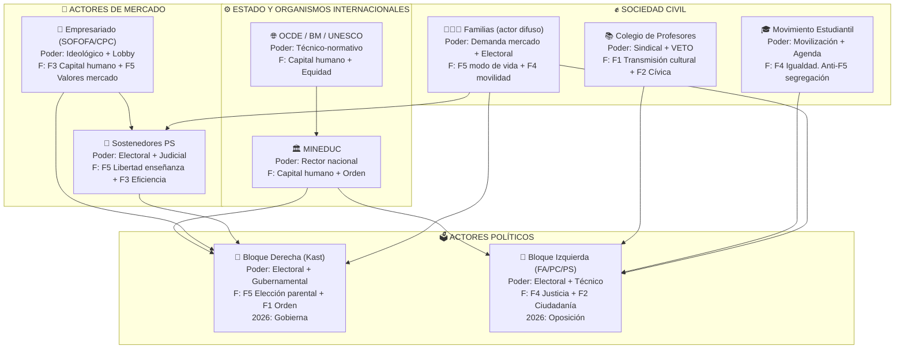
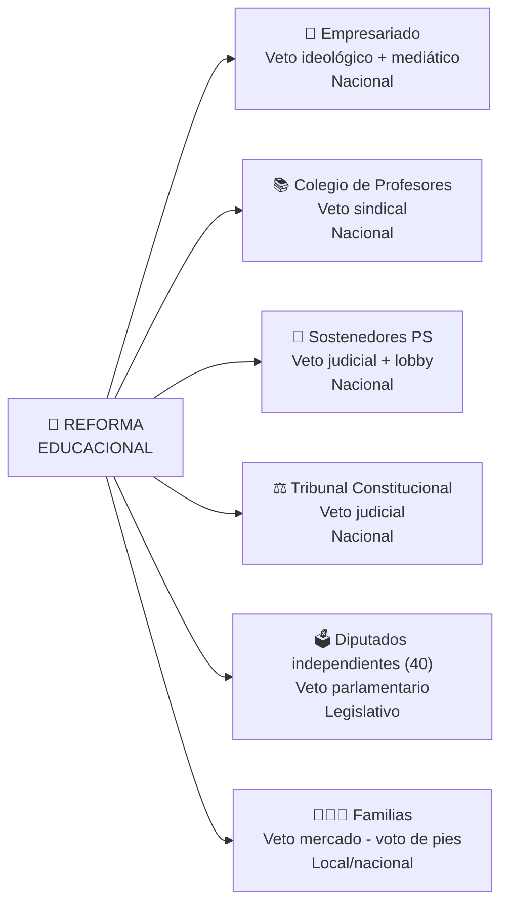
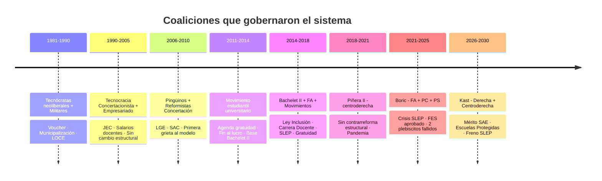

# 🗺️ Mapa de Actores — Sistema Educacional Chileno

> **Fuente:** Documento 5 del Segundo Cerebro de Política Educacional  
> **Tipo:** Diagrama Mermaid · Renderiza nativamente en Obsidian

---

## Diagrama de actores y poder

---

## Actores con poder de VETO

---

## Coaliciones históricas (1981–2026)

---

*Nota: para el diagrama `timeline` necesitas Obsidian v1.4+ con Mermaid 10+*
