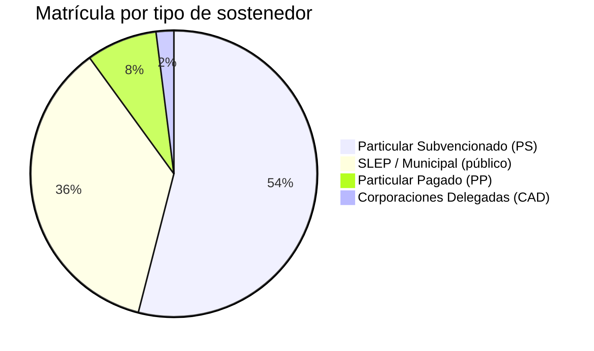
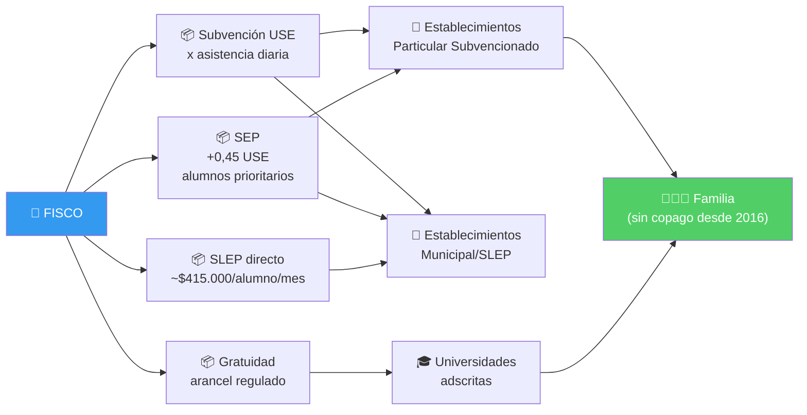

# ⚡ Tensiones Sistémicas — Sistema Educacional Chileno

> **Fuente:** Documento 3 del Segundo Cerebro de Política Educacional  
> **Tipo:** Diagrama Mermaid · Renderiza nativamente en Obsidian

---

## Las 6 tensiones irresueltas

```mermaid
graph LR
    subgraph T1["TENSIÓN 1: Derecho vs Libertad"]
        A1["🏛️ Estado garante\nEducación como bien público"] 
        B1["👨‍👩‍👧 Familias titulares\nElección del proyecto educativo"]
        A1 <-->|"Empate desde 1990\nNinguna reforma resuelve la primacía"| B1
    end

    subgraph T2["TENSIÓN 2: Asistencia vs Gasto fijo"]
        A2["📊 Voucher por asistencia\nEficiencia de mercado"]
        B2["🏗️ SLEP: gastos fijos\nNóminas e infraestructura constantes"]
        A2 <-->|"Crisis SLEP crónica\nParalización 82 días Atacama 2023"| B2
    end

    subgraph T3["TENSIÓN 3: Mérito vs No selección"]
        A3["🏆 Mérito académico\nIdeología del concurso"]
        B3["🤝 Inclusión\nSelección reproduce origen social"]
        A3 <-->|"Debate SAE 2026\nKast restituye mérito"| B3
    end

    subgraph T4["TENSIÓN 4: Accountability vs Autonomía"]
        A4["📋 Evaluación externa\nSIMCE · Portafolio"]
        B4["🎓 Autonomía docente\nModelo finlandés de confianza"]
        A4 <-->|"Docentes rechazan portafolio\nAceptan evaluación local"| B4
    end

    subgraph T5["TENSIÓN 5: Universidad vs EMTP/STEM"]
        A5["🎓 Credencial universitaria\nMoneda de movilidad social"]
        B5["🔧 Formación técnica\nMejor empleabilidad inmediata"]
        A5 <-->|"Sobreoferta universitaria\nDéficit técnico avanzado"| B5
    end

    subgraph T6["TENSIÓN 6: Centralización vs Descentralización"]
        A6["📐 SAE · PAES · MINEDUC\nNormas nacionales rígidas"]
        B6["🗺️ SLEP · Autonomía curricular\nRealidades territoriales diversas"]
        A6 <-->|"Híbrido conflictivo\nNormas nacionales en contextos locales"| B6
    end
```

---

## Leyes clave y su tensión principal

```mermaid
flowchart TD
    L1["📜 Ley Subvenciones 1981\nVoucher por asistencia"] --> TS1["⚡ Volatilidad presupuestaria\nMunicipios sin capacidad técnica"]
    L2["📜 Ley Copago 1993\nFinanciamiento compartido"] --> TS2["⚡ Clausura social\nBarrera de membresía estamental"]
    L3["📜 SEP 2008\nSubvención por vulnerabilidad"] --> TS3["⚡ Ecosistema sancionatorio\nCierre si no mejora en 4 años"]
    L4["📜 LGE 2009\nReemplaza LOCE"] --> TS4["⚡ Reforma ciclo 6+6\nPostergada por déficit docente"]
    L5["📜 Ley Inclusión 2015\nFin lucro · copago · selección"] --> TS5["⚡ SAE resistido\n22% apoderados evalúa negativamente"]
    L6["📜 Carrera Docente 2016\n5 tramos · portafolio"] --> TS6["⚡ Accountability vs autonomía\nDeserción bajó 15,7%"]
    L7["📜 NEP/SLEP 2017\nDesmunicipalización"] --> TS7["⚡ Gasto x alumno $415.000\nTriplica municipal sin mejora proporcional"]
    L8["📜 Ed. Superior 2018\nGratuidad 60% menores ingresos"] --> TS8["⚡ Aranceles no cubren costos\nContracción real 8,2% CRUCH"]

    style TS1 fill:#ff6b6b,color:#fff
    style TS2 fill:#ff6b6b,color:#fff
    style TS3 fill:#ffa94d,color:#fff
    style TS4 fill:#ffa94d,color:#fff
    style TS5 fill:#ff6b6b,color:#fff
    style TS6 fill:#ffa94d,color:#fff
    style TS7 fill:#ff6b6b,color:#fff
    style TS8 fill:#ffa94d,color:#fff
```

---

## Tipos de sostenedor (2026)

---

## Flujo del financiamiento

