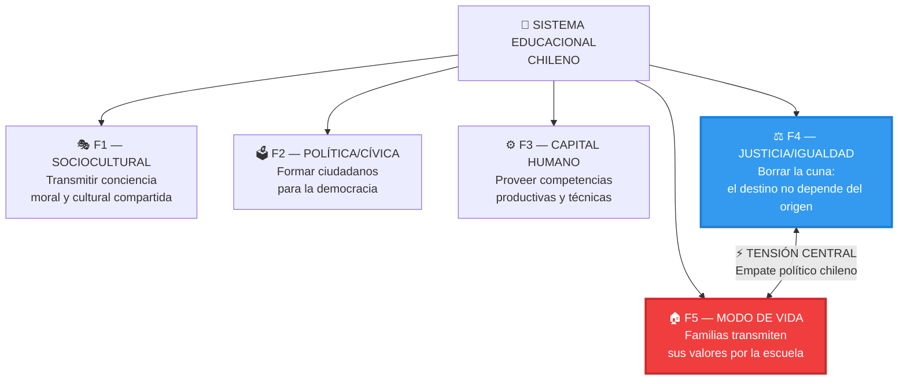
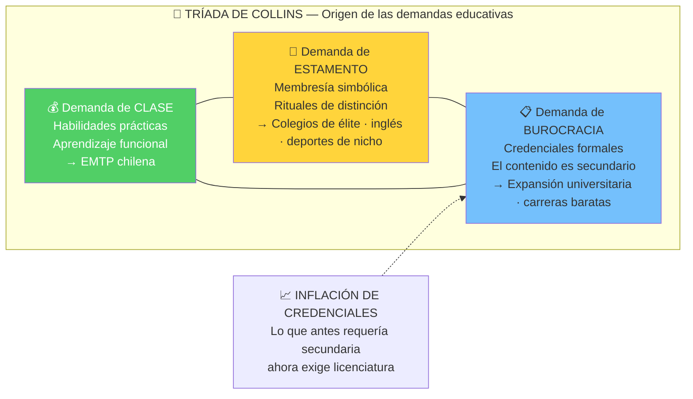
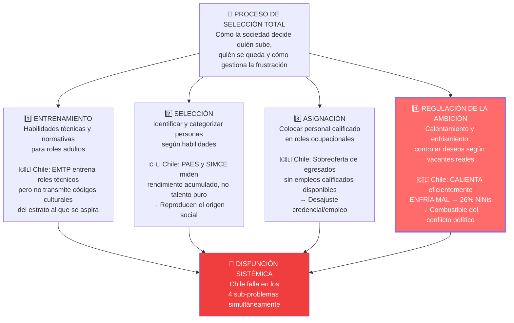
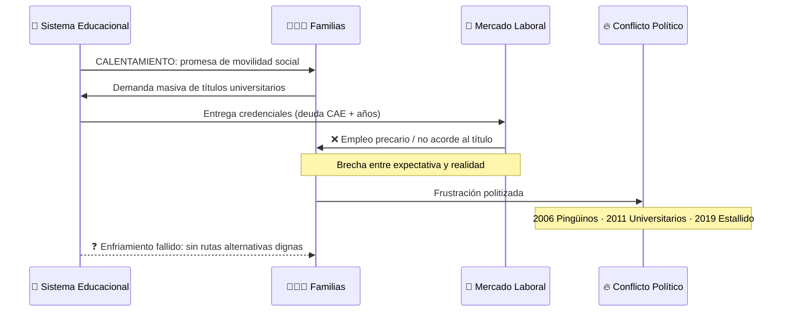
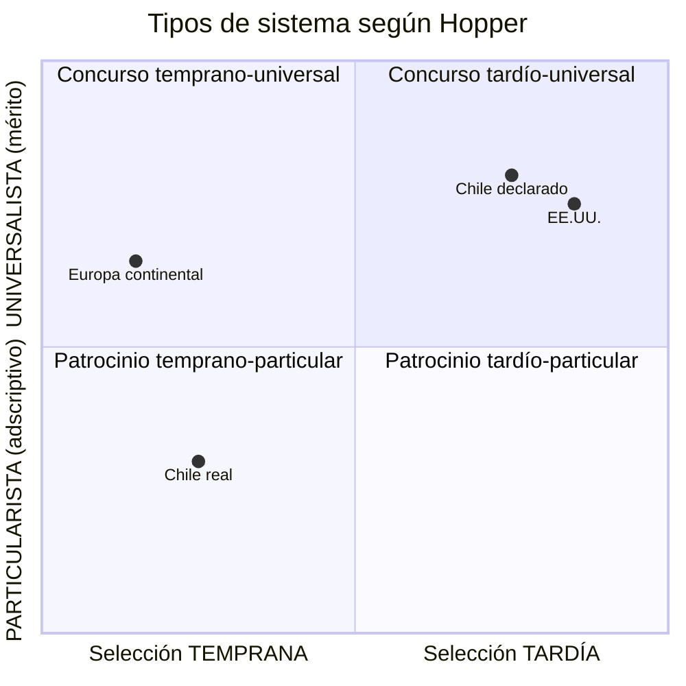

# 🧠 Marco Teórico — Collins · Hopper · Peña

> **Fuente:** Documento 2 del Segundo Cerebro de Política Educacional  
> **Tipo:** Diagrama Mermaid · Renderiza nativamente en Obsidian

---

## Las 5 funciones del sistema educacional (Hopper/Peña)

---

## Tríada de demandas de Collins

---

## El Proceso de Selección Total (Hopper)

---

## Calentamiento y enfriamiento: el ciclo fallido

---

## Ideologías de selección (Hopper expandido de Turner)

> **Chile:** declara movilidad por **concurso** (PAES abierta, mérito individual) pero opera con movilidad **patrocinada encubierta** (preuniversitarios, redes, capital cultural).
