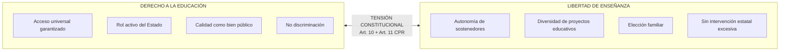
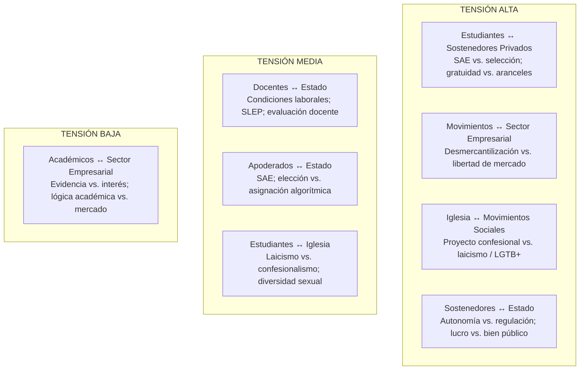
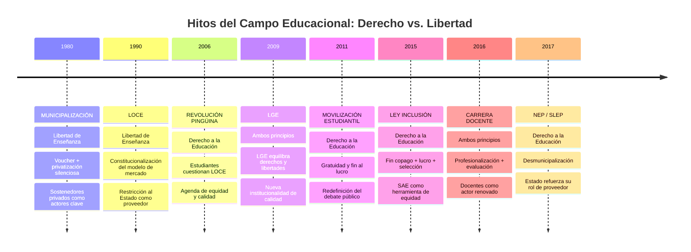

---
name: actores_sociales_educacion_chile
description: "Mapa de actores del sistema educacional chileno — nueve actores con posiciones sobre Derecho a la Educación y Libertad de Enseñanza, tensiones inter-actorales y evolución histórica del campo"
sources: [cowork]
aliases:
  - actores educación Chile
  - actores sistema educativo chileno
  - Derecho a la Educación vs Libertad de Enseñanza
  - tensiones actores educacionales
  - mapa actores política educacional
tags:
  - institucional
  - politica
  - gobernanza
  - sociologia
---

# Actores Sociales en Educación: Derecho a la Educación y Libertad de Enseñanza

> Fuente: *Presentación Actores Sociales: Derecho a la Educación y Libertad de Enseñanza* (html, mapa interactivo con 9 actores, 8 tensiones y 8 hitos históricos).

El sistema educacional chileno no es un espacio técnico neutral: es un **campo en disputa** donde actores con intereses, valores e ideologías distintas negocian el significado de dos principios constitucionales en tensión permanente: el **Derecho a la Educación** (acceso universal, equidad, rol del Estado) y la **Libertad de Enseñanza** (autonomía de los sostenedores, diversidad de proyectos educativos, elección familiar).

---

## 1. Los Dos Principios en Tensión

Ambos principios coexisten en la Constitución chilena y en la LGE (Ley 20.370/2009), pero su peso relativo varía según el actor y el contexto histórico. La pugna entre ellos estructura el campo político educacional.

---

## 2. Los Nueve Actores: Posiciones y Demandas

### 2.1 Matriz de Posiciones

| Actor | Posición Derecho | Posición Libertad | Lógica central |
|-------|-----------------|-------------------|----------------|
| **Estudiantes** | 🔴 Alto | 🟡 Medio | Educación como derecho social; anti-lucro |
| **Apoderados** | 🟡 Medio | 🟡 Medio | Calidad + elección de establecimiento |
| **Docentes** | 🔴 Alto | 🟡 Medio | Profesión como servicio público; autonomía pedagógica |
| **Sostenedores Privados** | 🟡 Medio | 🔴 Alto | Autonomía de proyecto educativo |
| **Instituciones Religiosas** | 🟡 Medio | 🔴 Alto | Libertad de enseñanza confesional |
| **Estado / MINEDUC** | 🔴 Alto | 🟡 Medio | Rector del sistema; garante de derechos |
| **Académicos / Investigadores** | 🔴 Alto | 🟡 Medio | Evidencia; calidad sistémica; equidad |
| **Sector Empresarial** | 🟢 Bajo | 🔴 Alto | Educación para el mercado laboral; libre competencia |
| **Movimientos Sociales** | 🔴 Alto | 🟢 Bajo | Desmercantilización; educación pública |

> 🔴 Alto / 🟡 Medio / 🟢 Bajo — posición relativa del actor en cada principio

### 2.2 Perfil de Cada Actor

#### 🔵 Estudiantes (secundarios y universitarios)

**Descripción**: Principal grupo afectado por el sistema. Han protagonizado las movilizaciones más disruptivas (2006, 2011, 2019).

**Demandas históricas**: fin al lucro en educación, gratuidad universal, calidad con equidad, participación en gobierno escolar.

**Tensión interna**: entre el derecho colectivo a la educación (énfasis en lo público) y la libertad de elegir establecimiento (énfasis individual-familiar).

**Ejemplo histórico**: Revolución Pingüina 2006 — cuestionamiento estructural de la LOCE y el sistema de voucher.

#### 🔴 Apoderados

**Descripción**: Representan el interés familiar directo. Heterogéneos: desde apoderados de colegios municipales a privados de élite.

**Demandas**: calidad del establecimiento, seguridad, comunicación fluida, participación efectiva en comunidad escolar.

**Tensión central**: entre el derecho a una educación de calidad garantizada y la libertad de elegir el proyecto educativo que se adecúe a los valores familiares.

**Ejemplo histórico**: Oposición al SAE 2016 — familias de colegios privados subvencionados resistieron el fin de la selección como mecanismo de elección.

#### 🟡 Docentes

**Descripción**: Ejecutores directos del proceso pedagógico. El Colegio de Profesores es el principal actor gremial.

**Demandas**: reconocimiento profesional, mejora salarial, condiciones laborales, autonomía pedagógica, carrera docente.

**Tensión central**: entre la vocación de servicio público (derecho) y la autonomía profesional sobre el cómo enseñar (libertad).

**Ejemplo histórico**: Huelgas SLEP 2023 — 82 días en Atacama; conflicto sobre condiciones laborales en la nueva institucionalidad.

#### 🟢 Sostenedores Privados

**Descripción**: Propietarios o administradores de establecimientos particulares subvencionados. Altamente organizados (CONACEP, etc.).

**Demandas**: autonomía de proyecto educativo, financiamiento estable, reducción de intervención regulatoria.

**Tensión central**: entre la recepción de recursos públicos (que implica obligaciones de derecho) y la autonomía en selección, gestión y proyecto educativo (libertad).

**Ejemplo histórico**: Judicialización de la Ley de Inclusión 2015 — sostenedores impugnaron la prohibición de selección y lucro.

#### 🟣 Instituciones Religiosas (principalmente Iglesia Católica)

**Descripción**: Históricamente el principal sostenedor no estatal. Red de colegios con fuerte identidad confesional.

**Demandas**: reconocimiento de su proyecto educativo específico, libertad de enseñanza confesional, financiamiento igualitario.

**Tensión central**: entre el servicio a comunidades vulnerables (derecho) y la definición autónoma de valores, currículo y selección de personal (libertad).

**Ejemplo histórico**: Oposición al currículum laico y a la "ideología de género" — debate sobre educación sexual integral.

#### 🟤 Estado / MINEDUC

**Descripción**: Actor rector, regulador y co-financiador. Responsable de garantizar el derecho a la educación.

**Demandas (como actor político)**: implementar mandatos legales, equilibrar calidad con equidad, gestionar la desmunicipalización.

**Tensión interna**: entre su rol de garante del derecho (que implica intervención) y el respeto a la libertad de enseñanza (que implica no interferir en proyectos educativos).

**Ejemplo histórico**: Implementación SAE 2016 — el Estado usó su poder regulatorio para eliminar selección arbitraria, chocando con la libertad de sostenedores.

#### ⬜ Académicos e Investigadores

**Descripción**: Producen conocimiento sobre el sistema. Influyen en políticas vía evidencia, informes y comisiones.

**Demandas**: políticas basadas en evidencia, transparencia de datos, evaluación de impacto de reformas.

**Tensión central**: entre recomendar más intervención estatal (para mejorar equidad) y reconocer los efectos no deseados de la regulación excesiva.

**Ejemplo histórico**: Comisión Brunner 1994, Comisión Asesora Pingüina 2006 — informes técnicos que fundamentaron reformas estructurales.

#### 🟠 Sector Empresarial

**Descripción**: Demanda egresados con competencias para el mercado laboral. Financia educación técnica; apoya privatización y competencia.

**Demandas**: currículum con énfasis en competencias, vínculo empresa-escuela, reducción de intervención regulatoria.

**Tensión central**: ve la educación como inversión en capital humano (lógica de mercado = libertad) pero también demanda estándares básicos garantizados (derecho como piso mínimo).

**Ejemplo histórico**: Apoyo al CAE 2005 — la banca privada participó en el financiamiento de educación superior, articulando lógica de mercado con subsidio estatal.

#### 🩷 Movimientos Sociales

**Descripción**: Actores de base que cuestionan la mercantilización del sistema. Sin representación formal estable; intermitentes pero disruptivos.

**Demandas**: desmercantilización total, fin al lucro, gratuidad universal, educación pública y comunitaria.

**Tensión central**: Máxima valoración del derecho a la educación, mínima tolerancia a la libertad de enseñanza como justificación del lucro.

**Ejemplo histórico**: Movilización estudiantil 2011 — "No al Lucro" como consigna articuladora; demanda de educación gratuita, pública y de calidad.

---

## 3. Las Ocho Tensiones Inter-Actorales

### Tabla de Tensiones

| Tensión | Actores | Intensidad | Punto de conflicto |
|---------|---------|------------|-------------------|
| 1 | Estudiantes ↔ Sostenedores Privados | 🔴 Alta | SAE, gratuidad, lucro, selección |
| 2 | Movimientos ↔ Sector Empresarial | 🔴 Alta | Mercantilización vs. derecho social |
| 3 | Iglesia ↔ Movimientos Sociales | 🔴 Alta | Confesionalismo, diversidad, currículum |
| 4 | Sostenedores ↔ Estado | 🔴 Alta | Autonomía vs. regulación; Ley Inclusión |
| 5 | Docentes ↔ Estado | 🟡 Media | SLEP, condiciones laborales, evaluación |
| 6 | Apoderados ↔ Estado | 🟡 Media | SAE vs. libre elección familiar |
| 7 | Estudiantes ↔ Iglesia | 🟡 Media | Laicismo, ESI, diversidad sexual |
| 8 | Académicos ↔ Empresarios | 🟢 Baja | Evidencia vs. interés de mercado |

---

## 4. Evolución Histórica: Los Hitos del Campo

### Interpretación del Campo Histórico

| Período | Principio dominante | Actor hegemónico | Expresión normativa |
|---------|--------------------|-----------------|--------------------|
| **1980-1989** | Libertad de Enseñanza | Régimen Militar + Chicago Boys | Decreto municipalización + voucher |
| **1990-2005** | Equilibrio tenso | Estado + Sostenedores | LOCE 1990; copago institucionalizado 1993 |
| **2006-2014** | Disputa activa | Estudiantes + Estado vs. Mercado | Comisión Asesora → LGE 2009 |
| **2015-2025** | Derecho a la Educación (mayoritario) | Estado + Movimientos + Docentes | Ley Inclusión, SAE, SLEP, Gratuidad ES |

---

## 5. Análisis Desde Collins/Hopper

| Función | Actores que la priorizan | Expresión en el campo |
|---------|--------------------------|----------------------|
| **F1 Socialización** | Estado, Iglesia, Movimientos | Debate sobre qué ciudadano forma la escuela: patriota, laico, con derechos, confeso |
| **F2 Selección meritocrática** | Sector Empresarial, Sostenedores, Kast | SAE vs. selección por mérito; meritocracia como legitimador de desigualdad |
| **F3 Formación mercado** | Empresarial, Sostenedores Privados | CAE; educación técnica; libertad de enseñanza como lógica de mercado |
| **F4 Democratización** | Estudiantes, Docentes, Movimientos, Académicos | Ley Inclusión; gratuidad; SAE; desmercantilización como expansión de derechos |
| **F5 Reproducción élites** | (cuestionada por) Académicos, Movimientos | Segregación residencial + SIMCE; colegios privados de élite; SLEP en territorios vulnerables |

### Bourdieu: El Campo Educacional como Espacio de Poder

El campo educacional chileno puede leerse como un **campo de fuerzas** (Bourdieu) donde:

- El **capital cultural** (certificados, títulos) es el recurso en disputa
- La **libertad de enseñanza** es la estrategia de los actores con más capital económico para mantener su posición en el campo
- El **derecho a la educación** es la estrategia de los actores con menos capital para ingresar y disputar el campo
- El **Estado** es árbitro inestable: su orientación política define qué principio pondera más en cada período

---

## 6. Preguntas de Discusión

1. ¿Es posible garantizar el Derecho a la Educación sin limitar la Libertad de Enseñanza? ¿O son principios irreconciliables en la práctica?

2. ¿Qué actor tiene mayor poder para definir la agenda educacional en Chile en 2025? ¿Ha cambiado esta hegemonía desde 2011?

3. ¿Cómo la segregación residencial reproduce la tensión entre ambos principios, independientemente de la regulación del sistema escolar?

4. ¿Puede el SAE resolver la tensión entre equidad (derecho) y elección familiar (libertad)? ¿Qué actores se benefician/perjudican con el algoritmo Gale-Shapley?

5. ¿Es la Iglesia Católica un actor de Derecho a la Educación (por su servicio a comunidades vulnerables) o de Libertad de Enseñanza (por su proyecto confesional)? ¿Puede ser ambas?

---

## 7. Conexiones

- [[linea_tiempo_politica_educacional_chile]] — hitos normativos que expresan el dominio de cada principio en cada período
- [[propuestas_educacionales_candidatos_2025]] — posiciones de candidatos como expresión de cada actor en el debate electoral
- [[politicas_educacionales_sistema_chileno]] — políticas actuales que articulan ambos principios
- [[modelos_gobernanza_educacional]] — los cuatro modelos como variantes de la tensión derecho/libertad
- [[marco_teorico_sociologico_educacion]] — Collins/Hopper y Bourdieu como marcos de lectura del campo
- [[sistema_financiamiento_escolar_chile]] — voucher, SEP, CAE como expresiones instrumentales de la tensión
- [[cifras_matricula_sistema_educacional]] — datos empíricos del resultado del campo: quién estudia dónde
- [[MOC_Politica_Educacional]] — mapa central de la investigación
