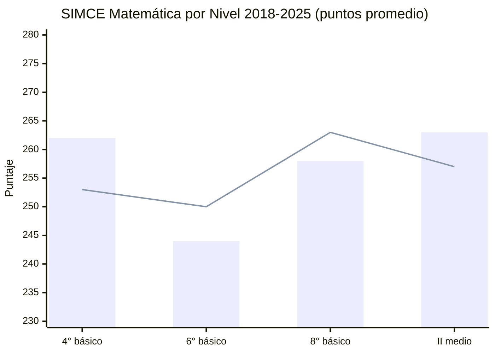

---
name: analisis_ocde_simce_chile
description: "Análisis del sistema educativo chileno bajo la lente OCDE — PISA 2022, SIMCE 2023-2025, brechas de género, resultados SLEP y 4 reformas estructurales"
sources: [cowork]
aliases:
  - OCDE educación Chile
  - PISA Chile
  - SIMCE resultados
  - evaluación sistema educativo
  - brechas aprendizaje Chile
tags:
  - evidencia
  - calidad
  - evaluacion
---

# Sistema Educativo Chileno: Análisis OCDE y SIMCE

> Fuente: *Análisis del Sistema Educativo Chileno bajo la Lente de la OCDE: Desempeño, Financiamiento y Reformas Estructurales* + *Trayectorias del Aprendizaje y Brechas de Equidad: Análisis Longitudinal del SIMCE 2023-2025.

El sistema educativo chileno presenta una paradoja estructural: **es el mejor de América Latina y uno de los más rezagados de la OCDE**. La masificación del acceso, el aumento del gasto público y la sofisticación del marco normativo coexisten con un estancamiento crónico en los niveles de aprendizaje y una desigualdad socioeconómica que persiste como cicatriz del modelo privatizador de 1981.

---

## 1. Resultados PISA 2022: Chile en Perspectiva Comparada

### 1.1 Tabla de Resultados

| Área temática | Puntaje Chile | Puntaje OCDE | Nivel < 2 Chile | Nivel < 2 OCDE | Excelencia Chile | Excelencia OCDE | Posición global |
|--------------|:-------------:|:------------:|:---------------:|:--------------:|:----------------:|:---------------:|:---------------:|
| **Lectura** | 448 | 476 | 34% | 26% | 2% | 7% | 37° de 81 |
| **Ciencias** | 444 | 485 | 36% | 24% | 2% | 7% | 44° de 81 |
| **Matemáticas** | 412 | 472 | 56% | 31% | 1% | 9% | 52° de 81 |

**Interpretación crítica:**
- El 56% de los estudiantes chilenos está **bajo el umbral mínimo funcional** en matemáticas (OCDE: 31%)
- Chile produce solo 1% de estudiantes de excelencia en matemáticas (OCDE: 9%) → 9x menos que el promedio
- El resultado de 2022 en matemáticas (412 pts) es **inferior** al de 2015 (422 pts) → tendencia de retroceso en el largo plazo
- Lectura: se acerca a los niveles de 2006-2012 → pérdida de dos décadas de avance

### 1.2 Resiliencia Post-Pandemia

A nivel global, PISA 2022 documentó una caída sin precedentes: -10 puntos en lectura, -15 en matemáticas (≈ ¾ de un año escolar). Chile mantuvo resultados estadísticamente similares a 2018, **evitando el desplome** observado en Finlandia, Países Bajos y Polonia.

**Factor clave de la resiliencia chilena:** la disponibilidad de apoyo docente continuo durante la pandemia fue el predictor más robusto del rendimiento. Los estudiantes con acceso fluido a ayuda docente obtuvieron en promedio **15 puntos más** en matemáticas.

**Ambivalencia digital:** el uso moderado de tecnología (≤1 hora/día para tareas escolares) suma +14 puntos en matemáticas, pero la distracción digital intra-aula (uso de móviles de compañeros) resta -15 puntos a los afectados.

### 1.3 Equidad Estructural

- La brecha entre el decil más rico y el más pobre en lectura (2018): **37 pp** vs. OCDE 29 pp → Chile más desigual
- La aparente reducción de la brecha en 2022 se debe al **deterioro del decil alto**, no a mejora del bajo
- Estudiantes de PP tienen **7x más probabilidades** de estar en el top 10% del PAES que sus pares públicos

---

## 2. Cobertura y Progresión: Paradojas del Sistema

### 2.1 Educación Parvularia: La Paradoja del Gasto Eficiente Ineficaz

| Indicador | Chile | OCDE |
|-----------|:-----:|:----:|
| Cobertura 3-5 años | 75% | 85% |
| Gasto público (% PIB) | 0,70% | 0,60% |
| Financiamiento privado | 27% | 17% |

**Paradoja:** Chile gasta **más** que el promedio OCDE en parvularia como % del PIB, pero cubre **menos** niños. Entre 2015 y 2022: gasto +9,8%, matrícula -5,5% → gasto por niño +16,1% pero cobertura congelada en 75% desde 2013.

**Explicación OCDE:** ineficiencias de asignación geográfica + barreras de desconfianza familiar hacia el cuidado institucionalizado. El problema no es cuánto se gasta, sino **dónde** y **cómo**.

### 2.2 Educación Secundaria y NiNis

| Indicador | Chile | OCDE |
|-----------|:-----:|:----:|
| Cobertura 15-19 años | 85% | 84% |
| NiNis (18-24 años) | 26,1% | 14,7% |
| Repitencia secundaria inferior | 3,4% | 1,9% |
| Sobreedad secundaria inferior | 7% | 4% |

El **26,1% de NiNis** (jóvenes que no estudian, trabajan ni se capacitan) es casi el doble del promedio OCDE. Este indicador revela el fracaso de la retención y la transición al mundo laboral/formativo.

**Rigidez técnico-profesional:** en Chile, los egresados TP se gradúan casi uniformemente a los 17 años — escasísima flexibilidad para reingresar al sistema o combinar trabajo y estudio, a diferencia del patrón OCDE.

### 2.3 Educación Superior: Masificación con Ineficiencia Terminal

| Parámetro | Chile | OCDE |
|-----------|:-----:|:----:|
| Financiamiento privado (% gasto total) | 59,8% | 30,0% |
| Graduación en duración teórica | 13% | 43% |
| Graduación ampliada (+3 años) | 60% | 70% |
| Egresados con magíster (25-64 años) | 2% | 15% |
| Deserción primer año (universidad) | 14% | 13% |

**Paradoja de la gratuidad:** la política de Gratuidad 2016 cubre el 60% de menor ingreso; entre 2012-2023, la probabilidad de acceso a ES para hijo de padres sin educación básica aumentó +7 pp (OCDE: +3 pp en igual período). Sin embargo, solo el **13% se gradúa en tiempo teórico** (OCDE: 43%) → enorme ineficiencia de recursos públicos.

**Posgrado crítico:** 2% de magísteres vs. 15% OCDE → base científica e investigadora severamente limitada para innovación y productividad.

---

## 3. SIMCE 2023-2025: Recuperación Heterogénea Post-Pandemia

### 3.1 Resultados por Nivel

*Barras = 2025; Línea = 2018/pre-pandemia*

**Síntesis por nivel:**

| Nivel | Tendencia 2022-2025 | Situación 2025 | Alerta |
|-------|---------------------|----------------|--------|
| **4° básico** | ↑ +11 pts Mate, +13 pts Lect. (2020→2024) | Máximos históricos 2024 | Leve retroceso 2 pts en 2025, no significativo |
| **6° básico** | ↓ -6 pts Mate vs 2018 | 37% insuficiente Mate y Lect. | Pandemia golpeó al inicio de alfabetización |
| **8° básico** | ↓ -5 pts Mate, -3 pts Lect. vs 2019 | 41,9% insuficiente Mate | Primer SIMCE post-pandemia 2025 |
| **II medio** | ↑ +11 pts Mate (2022-2025) | 48% insuficiente (Lect. estancada) | Pico histórico 2010-2012 aún no recuperado |

**El diagnóstico estructural:** 4° básico muestra resiliencia pedagógica; la crisis se concentra en el segundo ciclo básico y en enseñanza media, donde el **desenganche emocional** de los adolescentes actúa como barrera invisible.

### 3.2 Brecha de Género en Matemáticas: Retroceso Histórico

La brecha de género en matemáticas a favor de los hombres se ha **triplicado** desde 2018:

| Nivel | Brecha 2018 | Brecha 2025 | Variación |
|-------|:-----------:|:-----------:|:---------:|
| 4° básico | 5 pts | **15 pts** | ×3 |
| 6° básico | ~5 pts | **9 pts** | ×1,8 |
| 8° básico | 5 pts | **11 pts** | ×2,2 |
| II medio | 4 pts | **8 pts** | ×2 |

**Mecanismo explicativo — Ansiedad Matemática:**
- 71% de las estudiantes de II medio declara alta ansiedad ante evaluaciones de matemáticas
- 45% de los hombres reporta lo mismo → **brecha de 27 puntos porcentuales**
- En establecimientos con estrategias activas de mitigación de sesgos de género, las niñas obtienen 18-23 puntos más

> Chile es el país de AL con las **brechas de género en matemáticas más pronunciadas** y el **mayor incremento post-pandemia** según PISA-OCDE. Impacto directo: menor matrícula femenina en STEM → perpetúa brecha salarial de género.

En lectura, la brecha favorece a las mujeres: +5 pts en 4° básico, **+13 pts en II medio**. El dominio lector femenino no compensa el rezago en ciencias exactas.

### 3.3 Segregación Socioeconómica: La Brecha que no Cede

| Nivel | Brecha GSE alto vs bajo 2002 | Brecha GSE alto vs bajo 2025 | Tendencia |
|-------|:----------------------------:|:----------------------------:|:---------:|
| 4° básico Mate | 81 pts | **49 pts** | ↓ Mejora |
| 4° básico Lect | 76 pts | **43 pts** | ↓ Mejora |
| 8° básico Mate | ~70 pts | **71 pts** | → Inercia |

**Tres mundos educativos:**
- **PP** (privado, arancel): mejor infraestructura, ratio 20 alumnos/educadora en kínder
- **PS** (privado subvencionado): heterogéneo, predominio clase media
- **Público/SLEP** (estatal): concentra vulnerabilidad; ratio 40 alumnos/educadora en kínder

La brecha se reduce en 4° básico (políticas SEP, PME funcionando) pero se **petrifica en 8° básico**. La mejora del GSE alto en 2025 también deteriora en 8° básico (-7 pts GSE medio, -10 pts GSE medio-alto), sugiriendo que la crisis del segundo ciclo no es solo de los vulnerables.

### 3.4 Clima Escolar: Violencia y Desconfianza

| Indicador | 4° básico | II medio |
|-----------|:---------:|:--------:|
| Víctimas de burlas/acoso | 64% (6° básico) | — |
| Víctimas de exclusión/aislamiento | 60% | — |
| Confían en compañeros | 62% | 41% |
| Ambiente tranquilo en aula | 43% | 36% |

La caída en confianza interpersonal de 62% a 41% entre 4° básico y II medio refleja el deterioro del vínculo escolar en la adolescencia → factor clave del desenganche y la deserción.

---

## 4. Las Cuatro Reformas Estructurales

| Reforma | Año | Objetivo principal | Mecanismo | Financiamiento |
|---------|:---:|-------------------|-----------|----------------|
| **Ley SEP** | 2008 | Compensar vulnerabilidad | Subsidio diferenciado + PME | Recursos generales |
| **Ley Inclusión** | 2015 | Eliminar segregación/selección | Fin lucro + copago + SAE | Compensación pública |
| **Ley Carrera Docente** | 2016 | Profesionalizar docencia | Escalafón 5 tramos + evaluación portafolio | +27,6% salarial real |
| **Ley NEP** | 2017 | Desmunicipalizar educación pública | Creación SLEP descentralizados | Estatal directo |

**Lógica acumulativa:** las reformas se superponen en su implementación. La SEP hizo atractivo al sector PS para recibir vulnerables; la Ley Inclusión corrigió los efectos segregadores del PS sin regulación; la NEP reconstruye la institucionalidad pública dañada por la municipalización. Son reformas de segunda generación que intentan desmantelar la arquitectura privatizadora de 1981 sin abolirla.

---

## 5. Resultados SLEP: Mejora Promedio, Desigualdad Interna

Los establecimientos adscritos a SLEP (2022-2025):
- Lectura: +13 pts (254 → 267 puntos)
- Matemáticas: +14 pts (236 → 250 puntos)

**Pero la heterogeneidad interna es crítica:**

| Área | % comunas SLEP con mejora | % estancadas | % con retroceso |
|------|:-------------------------:|:------------:|:---------------:|
| Lectura | 70,8% | 16,7% | 12,5% |
| Matemáticas | **52,8%** | 29,2% | **18,1%** |

**SLEP Pioneros 2018** (Barrancas, Costa Araucanía, Huasco, Puerto Cordillera — con mayor tiempo de implementación):
- Lectura: 53,8% mejoró
- Matemáticas: solo **46,2% mejoró** (38,5% estancadas, 15,4% retrocedieron)

> El tiempo de implementación no garantiza calidad pedagógica. Los SLEP requieren ajustes estructurales en gestión pedagógica y financiamiento de soporte antes de completar el despliegue nacional — [[mercado_creacion_establecimientos]].

---

## 6. Las Tres Recomendaciones OCDE

### Rec. 1 — Reorientar el Financiamiento Parvulario

Superar la ineficiencia de asignación geográfica. Combinar financiamiento institucional de base para jardines JUNJI/Integra con eliminación de barreras de acceso para familias vulnerables. Crear oferta flexible articulada con los horarios laborales de las familias.

### Rec. 2 — Fortalecer el Liderazgo Pedagógico en SLEP

Los directivos escolares en sectores vulnerables absorben su tiempo en contingencias sociales y de infraestructura, no en liderazgo pedagógico. La OCDE recomienda equipos de soporte administrativo y psicosocial territoriales que liberen a los equipos directivos para concentrarse en los aprendizajes.

### Rec. 3 — Rediseñar la Educación Superior para la Graduación Oportuna

Solo 13% de los estudiantes termina en tiempo teórico (OCDE: 43%). Se requiere: carreras más cortas y flexibles, articulación automática TP-ES, reformulación de la gratuidad para reconocer costos reales de investigación, y programas de nivelación para vulnerables matriculados.

---

## 7. SIMCE como Predictor de Trayectorias

El rendimiento en SIMCE de 6°/8° básico predice con alta correlación la deserción en I medio (punto de mayor riesgo en la trayectoria escolar: 14,9% deserción total en enseñanza media). Los estudiantes de bajo rendimiento encauzados hacia la EMTP tienen tasas de deserción **3x menores** que sus pares equivalentes en liceos HC.

La calidad del colegio secundario (quintil SIMCE de II medio) es el predictor más robusto de la **retención en primer año universitario**, superando el puntaje individual del estudiante en el PAES. El capital cultural institucionalizado del establecimiento actúa como factor protector.

---

## 8. Lectura Teórica (Collins/Hopper)

**F2 (Selección meritocrática) como reflejo de F5 (Reproducción):** los resultados PISA y SIMCE son profecías autocumplidas. Los colegios PP producen 7x más estudiantes en el top 10% del PAES porque concentran los recursos (ratio alumnos, infraestructura, redes) que el sistema de voucher permite que se acumulen en un polo. La "meritocracia" que el PAES mide está previamente construida por el establecimiento al que se tuvo acceso.

**F4 (Democratización) en tensión:** la Ley de Inclusión y el SAE son los instrumentos de F4 más directos (eliminar selección y copago). Los datos SIMCE sugieren que F4 opera con efectividad creciente en educación básica (reducción de brechas GSE en 4° básico) pero se detiene en educación media, donde los mecanismos de F5 (capital cultural diferenciado, redes, orientación vocacional) retoman el control.

**El hallazgo más perturbador:** la brecha de género en matemáticas se amplía dentro del sistema post-reforma, sugiriendo que las reformas estructurales (SAE, gratuidad, SLEP) no tienen mecanismos para abordar las desigualdades de género que operan dentro del aula. F5 no solo opera por clase social — opera también por género a través de la "ansiedad matemática" como construcción cultural.

---

## 9. Conexiones

- [[arbol_problemas_politica_educacional]] — diagnóstico estructural que estos datos confirman empíricamente
- [[propuestas_partidos_politicos_educacion]] — debate político sobre cómo responder a esta evidencia
- [[impacto_educacion_evidencia_empirica]] — meta-análisis internacional que contextualiza los resultados chilenos
- [[fundamentos_politica_educacional]] — marcos teóricos que interpretan las reformas
- [[mercado_creacion_establecimientos]] — estructura institucional que produce estos resultados
- [[SLEP]] — nueva institucionalidad pública bajo evaluación
- [[sistema_voucher_financiamiento]] — mecanismo de fondo que estructura las brechas
- [[educacion_particular_subvencionada]] — sector dominante del sistema
- [[MOC_Politica_Educacional]] — mapa central de la investigación
