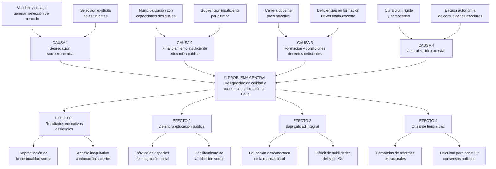

---
name: arbol_problemas_politica_educacional
description: "Árbol de problemas del sistema educacional chileno — causas, efectos y problema central con análisis Collins/Hopper"
sources: [cowork]
aliases:
  - árbol de problemas educación
  - desigualdad educativa Chile
  - causas calidad educación
  - diagnóstico sistema educacional
tags:
  - conceptual
  - diagnostico
  - analisis
---

# Árbol de Problemas: Sistema Educacional Chileno

> Fuente: *Árbol de Problema Sistema Educacional* (HTML, estructura JavaScript con jerarquía de nodos; diagrama interactivo de causas y efectos).

El árbol de problemas es la herramienta diagnóstica central de la política educacional chilena. Organiza la evidencia empírica en una estructura causal que va desde las **raíces estructurales** (causas) hasta las **consecuencias sociales** (efectos), pasando por el **problema central** que articula la intervención pública.

---

## Problema Central

> **"Desigualdad en la calidad y acceso a la educación en Chile"**

Este enunciado condensa la doble dimensión del problema: no solo la *desigualdad de resultados* (calidad diferenciada según origen socioeconómico), sino también la *desigualdad de entrada* (acceso desigual al sistema). La combinación de ambas dimensiones produce un círculo vicioso de **reproducción intergeneracional de la desventaja**.

---

## Estructura del Árbol

---

## Las Cuatro Causas en Profundidad

### Causa 1: Segregación Socioeconómica

El sistema de **voucher con copago** (pre-Ley de Inclusión 2015) creó un cuasimercado educacional donde las familias "votan con los pies" pero con restricciones de información y recursos. Los establecimientos particulares subvencionados podían seleccionar estudiantes y cobrar copago, lo que generó una **estratificación de facto** del sistema.

**Subcausa 1a — Voucher y copago:** el financiamiento per cápita sin restricciones de admisión incentivó la captación de estudiantes con ventajas previas (mayor capital cultural familiar), concentrando a los estudiantes vulnerables en la educación pública.

**Subcausa 1b — Selección explícita:** las entrevistas, rendiciones de cuentas de los apoderados y pruebas de ingreso funcionaban como filtros que reproducían la segregación antes de que el estudiante ingresara al aula.

> Evidencia empírica: los estudiantes de colegios PP tienen 7x más probabilidades de estar en el decil superior del PAES — [[analisis_ocde_simce_chile]].

### Causa 2: Financiamiento Insuficiente de la Educación Pública

**Subcausa 2a — Municipalización con capacidades desiguales:** la transferencia de la gestión educativa a los municipios (1981) sin igualación fiscal produjo una educación pública cuya calidad dependía de la riqueza tributaria local. Un municipio rico como Las Condes ofrecía condiciones radicalmente distintas que uno pobre del Maule.

**Subcausa 2b — Subvención insuficiente:** el valor de la USE (Unidad de Subvención Escolar) históricamente no cubrió el costo real por alumno, obligando a los establecimientos públicos a operar con déficit estructural o a recortar servicios complementarios.

### Causa 3: Formación y Condiciones Docentes Deficientes

**Subcausa 3a — Carrera poco atractiva:** salarios bajos en los tramos iniciales, alta carga burocrática, falta de reconocimiento social y escasas posibilidades de desarrollo profesional redujeron el atractivo de la docencia para los mejores egresados del sistema escolar.

**Subcausa 3b — Deficiencias en formación universitaria:** la expansión desregulada de las carreras de pedagogía post-1990 permitió el ingreso de programas sin acreditación y con bajos estándares de admisión. La Ley de Carrera Docente (2016) intentó revertir esto con requisitos de puntaje mínimo y evaluación docente — [[analisis_ocde_simce_chile]].

### Causa 4: Centralización Excesiva

**Subcausa 4a — Currículum rígido:** un currículum nacional único (con escaso margen de adaptación local) desconecta la enseñanza de las realidades territoriales, culturales y productivas de cada comunidad.

**Subcausa 4b — Escasa autonomía:** las comunidades escolares tienen poder limitado para tomar decisiones pedagógicas, de contratación o de gestión que respondan a sus contextos específicos.

---

## Los Cuatro Efectos y sus Consecuencias

### Efecto 1: Resultados Educativos Desiguales

La desigualdad en calidad y acceso produce **gradientes de aprendizaje** directamente correlacionados con el origen socioeconómico. El sistema no solo no compensa las desventajas de origen sino que las amplifica.

- **Subefecto 1a — Reproducción de la desigualdad:** los estudiantes de menor NSE obtienen peores resultados → acceden a carreras con menor retorno → perpetúan la posición social de sus padres. Confirma la hipótesis MMI (Desigualdad Máximamente Mantenida) — [[impacto_educacion_evidencia_empirica]].
- **Subefecto 1b — Acceso inequitativo a ES:** el PAES (ex-PSU) refleja el acervo cultural acumulado; la brecha entre PS y PP en las pruebas de selección universitaria perpetúa la estratificación en el nivel terciario.

### Efecto 2: Deterioro de la Educación Pública

La educación pública pierde matrícula (Municipal 6.095 → 4.333 establecimientos 2004-2024) y con ella su rol histórico como espacio de **integración social transclasista** — [[mercado_creacion_establecimientos]].

- **Subefecto 2a — Pérdida de espacios de integración:** cuando la clase media abandona la escuela pública, esta concentra exclusión → el establecimiento se convierte en espejo de la desigualdad en lugar de correctivo.
- **Subefecto 2b — Debilitamiento de la cohesión social:** sin experiencias educativas compartidas entre grupos sociales distintos, se erosiona la base de confianza interpersonal y el sentido de proyecto común.

### Efecto 3: Baja Calidad Integral

- **Subefecto 3a — Desconexión de la realidad local:** currículos homogéneos ignoran los contextos rurales, indígenas o TP-pertinentes donde operan los establecimientos.
- **Subefecto 3b — Déficit de habilidades del siglo XXI:** Chile presenta resultados bajos en pensamiento crítico, resolución de problemas complejos y alfabetización digital. El 56% de los estudiantes está bajo el nivel 2 en matemáticas PISA 2022 (OCDE: 31%).

### Efecto 4: Crisis de Legitimidad

- **Subefecto 4a — Demandas de reformas estructurales:** la movilización estudiantil de 2006 y 2011 mostró que la percepción de injusticia del sistema trasciende las élites educativas y llega al sentido común ciudadano. El sistema pierde legitimidad cuando se percibe como reproductor de desigualdad más que como ascensor social.
- **Subefecto 4b — Dificultad para construir consensos:** la polarización entre visiones de mercado (subsidiariedad, libertad de enseñanza) y visiones de Estado (derecho social, provisión pública) bloquea reformas estructurales. El resultado son cambios incrementales que no alteran la arquitectura básica del sistema — [[propuestas_partidos_politicos_educacion]].

---

## Análisis Sistémico: ¿Dónde Intervenir?

| Nivel de intervención | Causas que aborda | Reforma emblemática |
|----------------------|-------------------|---------------------|
| Financiamiento | C2 (financiamiento) | USE ajustada + SEP (2008) |
| Admisión/selección | C1 (segregación) | SAE / Ley Inclusión (2015) |
| Gestión territorial | C2 + C4 | SLEP / NEP (2017) |
| Profesión docente | C3 | Ley Carrera Docente (2016) |
| Currículum | C4 | Actualización bases curriculares |

**Tensión no resuelta:** las reformas de admisión (SAE) abordan la *segregación por selección* (SC1b) pero no la *segregación por composición socioeconómica del entorno* (SC1a), que depende de la distribución residencial y del valor del voucher relativo al copago.

---

## Lectura Teórica (Collins/Hopper)

El árbol de problemas puede reinterpretarse como el mapa de las **disfunciones del sistema** según el marco de Collins y Hopper:

**F2 (Selección meritocrática) encubierta como F5 (Reproducción de élites):** la causa C1 (segregación) muestra que el sistema formal de selección (mérito, notas) opera sobre una base de capital cultural y social diferenciado. El "mérito" que selecciona el PAES está previamente construido por el entorno familiar y el establecimiento al que se tuvo acceso.

**Tensión F3 vs F4:** la causa C3 (docentes) refleja la tensión entre la función de formación para el mercado (F3, que requiere docentes técnicamente actualizados y especializados) y la función democratizadora (F4, que requiere docentes comprometidos con la equidad y presentes en zonas vulnerables). Las condiciones laborales precarias afectan desproporcionadamente a los establecimientos que atienden a la población más vulnerable.

**F4 bloqueada:** los efectos E2 (deterioro educación pública) y E4 (crisis de legitimidad) documentan el fracaso parcial de la función democratizadora. La educación pública debería ser el principal mecanismo de F4, pero la pérdida de matrícula y recursos la debilita como institución de movilidad social.

**F5 estructural:** el efecto E1 (resultados desiguales → reproducción de desigualdad) es la expresión más directa de F5. El árbol de problemas muestra que esta reproducción no es accidental sino estructural: está inscrita en el diseño del sistema de financiamiento (voucher), admisión (antes del SAE), y gestión (municipalización).

> La pregunta política central que emerge del árbol: ¿Es posible eliminar F5 reformando F2 y F3, o se requiere transformar la arquitectura institucional completa del sistema?

---

## Conexiones

- [[fundamentos_politica_educacional]] — marcos teóricos que explican las causas estructurales
- [[impacto_educacion_evidencia_empirica]] — evidencia empírica sobre los efectos (reproducción desigualdad, MMI)
- [[propuestas_partidos_politicos_educacion]] — respuestas políticas al diagnóstico del árbol
- [[analisis_ocde_simce_chile]] — evidencia cuantitativa de los efectos (PISA, SIMCE, NiNis)
- [[mercado_creacion_establecimientos]] — evolución del sistema que materializó las causas estructurales
- [[sistema_voucher_financiamiento]] — mecanismo central de la causa C1 y C2
- [[SLEP]] — respuesta institucional a la causa C2 y C4
- [[MOC_Politica_Educacional]] — mapa central de la investigación
