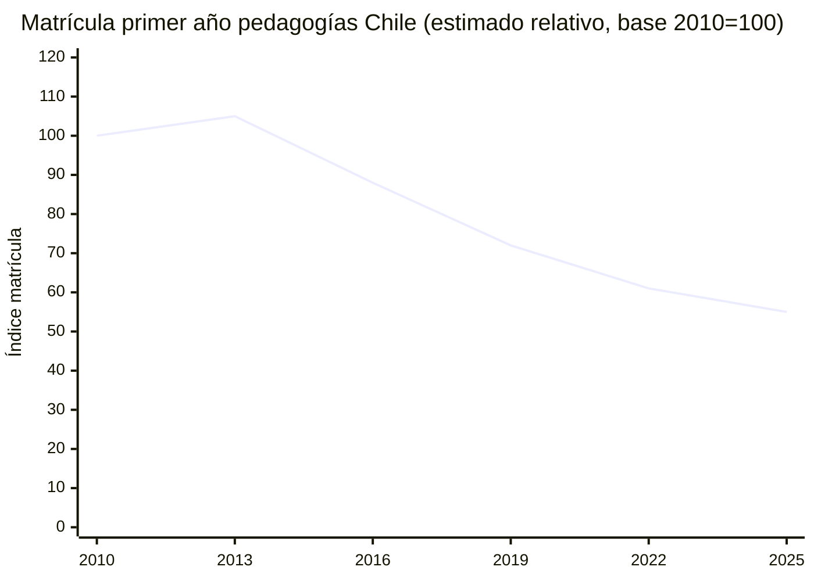
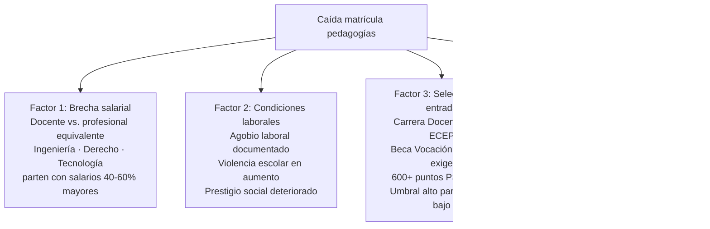
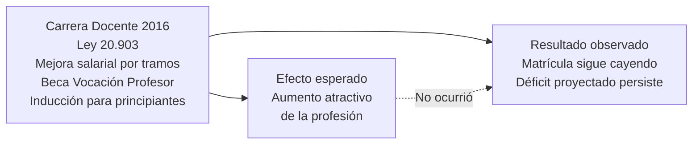
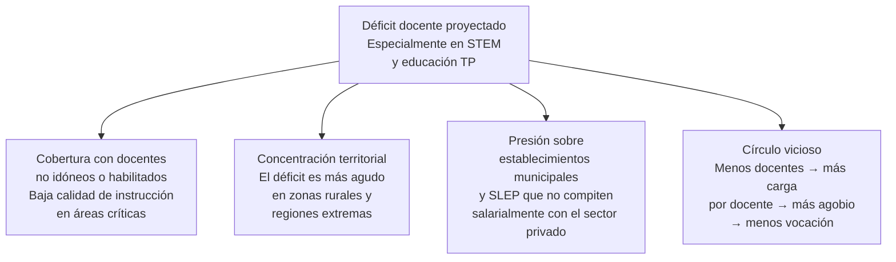

---
name: caida_matricula_pedagogias
description: "Nota de síntesis. Qué explica la caída sostenida de matrícula en carreras de pedagogía y qué consecuencias tiene para el sistema escolar chileno."
sources: [cowork]
aliases:
  - déficit docente Chile
  - crisis pedagogía matrícula
  - formación inicial docente problema
tags: [docentes, matricula, reforma, politica, datos, sistema]
---

# ¿Qué explica la caída de matrícula en pedagogías?

La matrícula en carreras de pedagogía en Chile lleva más de una década en descenso sostenido. El sistema escolar enfrenta un déficit proyectado de docentes idóneos — especialmente en matemáticas, ciencias y educación técnico-profesional — que ninguna política ha logrado revertir. Este nodo busca explicar las causas y proyectar las consecuencias.

---

## I. La magnitud del problema

La caída no es uniforme entre especialidades. Las pedagogías con mayor déficit proyectado son matemáticas, física, química, inglés y educación técnico-profesional — precisamente las áreas donde la alternativa laboral fuera del aula es más competitiva salarialmente.

---

## II. Cuatro factores explicativos

→ Ver [[estatuto_docente_chile]]

---

## III. La paradoja de la Carrera Docente

La Ley 20.903 de 2016 buscó hacer la profesión docente más atractiva mediante los cinco tramos de desarrollo y el incremento salarial asociado. El argumento era correcto: si el problema es el salario, la solución es mejorar la trayectoria económica. Sin embargo, la matrícula siguió cayendo después de 2016.

La paradoja sugiere que el salario es condición necesaria pero no suficiente. Las condiciones de trabajo — agobio, violencia, evaluación continua, burocracia — operan como factores de disuasión independientes del ingreso.

---

## IV. Consecuencias proyectadas

---

## V. Lectura propia

El problema no tiene solución simple porque tiene causas múltiples que se refuerzan. Mejorar el salario sin cambiar las condiciones de trabajo atrae a la profesión pero no retiene. Exigir más a la formación inicial (ECEP, puntajes altos) eleva el estándar pero reduce el flujo de entrada en un mercado donde los mejores puntajes van a carreras mejor pagadas.

Hay una tensión estructural que ninguna política ha resuelto: el sistema escolar necesita más docentes y mejores docentes al mismo tiempo, en un mercado laboral donde ambas cosas apuntan en direcciones opuestas. Más docentes implica ampliar el acceso a la formación; mejores docentes implica restringirlo.

El déficit proyectado no es solo un problema de cobertura — es una señal de que el sistema educacional no puede competir por el talento que necesita dentro de las condiciones que ofrece.

---

## VI. Preguntas abiertas

1. ¿La Beca Vocación Profesor ha producido docentes con mejores resultados en aula o solo ha seleccionado a quienes habrían elegido pedagogía de todas formas?
2. ¿El déficit docente tiene solución dentro del modelo actual o requiere cambios estructurales en las condiciones de trabajo?
3. ¿Cómo se distribuye territorialmente el déficit y qué mecanismos podrían reducir la brecha entre zonas urbanas y rurales?
4. ¿La reducción del agobio laboral — que busca parcialmente la Ley 21.625 — es suficiente para revertir la tendencia de matrícula?

---

## VII. Referencias y vínculos

- [[estatuto_docente_chile]]
- [[cifras_matricula_sistema_educacional]]
- [[linea_tiempo_politica_educacional_chile]]
- [[sistema_financiamiento_escolar_chile]]
- [[opinion_publica_educacion_chile]]
- [[MOC_Politica_Educacional]]
