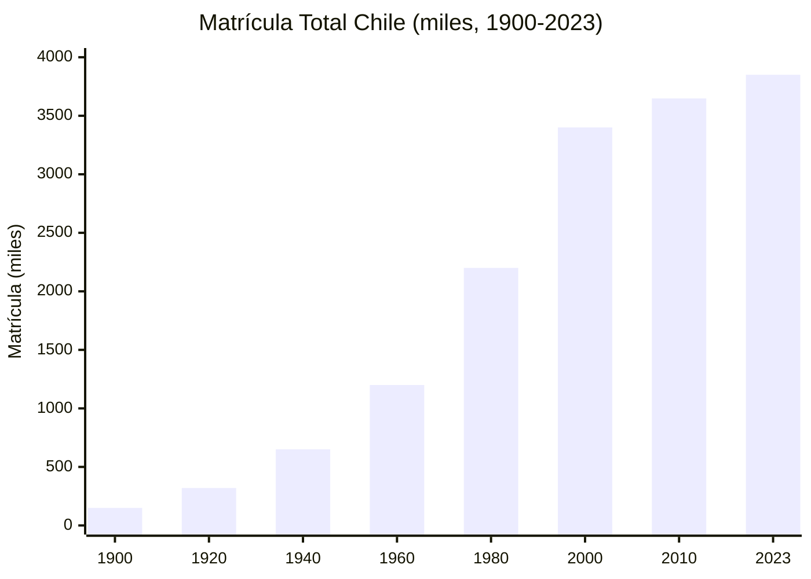
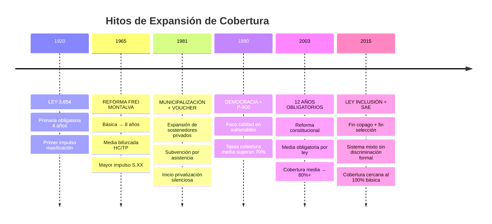
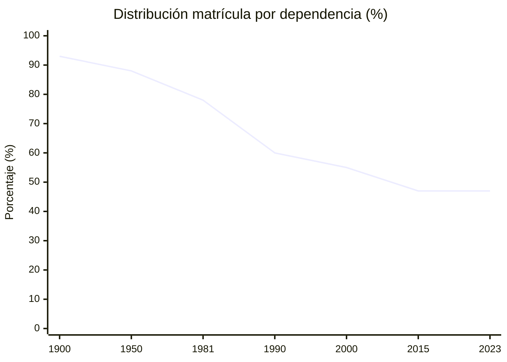
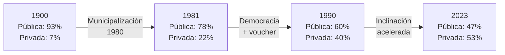
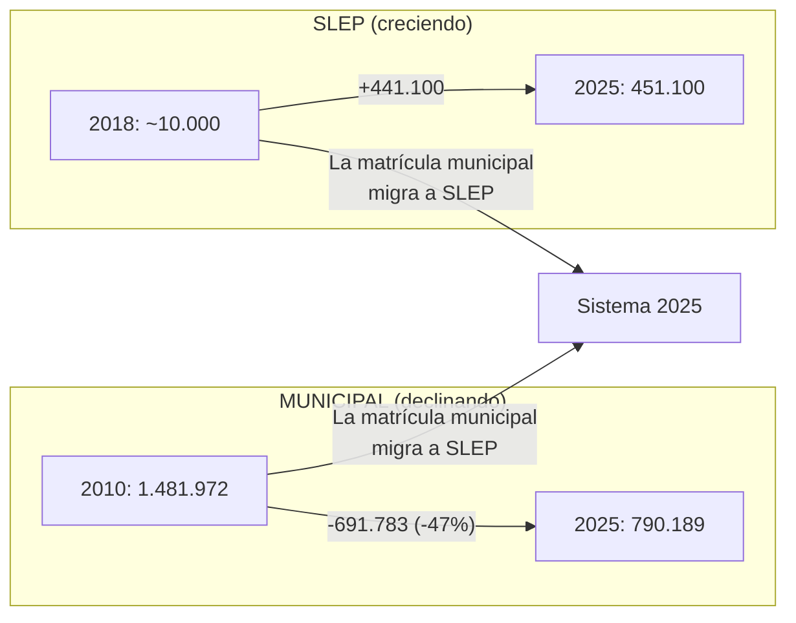
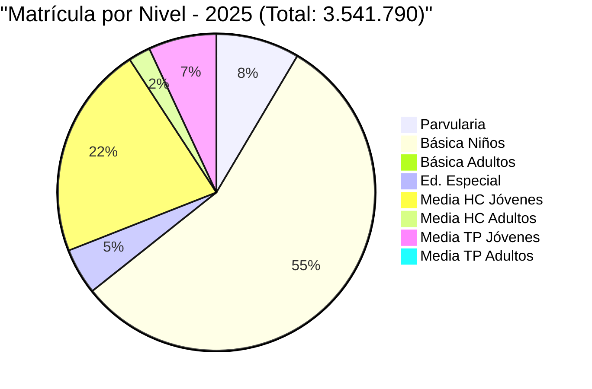

---
name: cifras_matricula_sistema_educacional
description: "Cifras de matrícula del sistema escolar chileno 1900-2025 — evolución histórica, datos MINEDUC por dependencia, nivel, región y zona urbano/rural"
sources: [cowork]
aliases:
  - matrícula Chile
  - cifras educación Chile
  - evolución matrícula escolar Chile
  - datos MINEDUC 2010 2025
  - matrícula dependencia sostenedor
tags:
  - institucional
  - financiamiento
  - historia
  - reforma
---

# Cifras de Matrícula: Sistema Educacional Chileno (1900–2025)

> Fuentes: *Evolución Matrícula Escolar Chile 1900-2023* (html, datos históricos); *Matrícula Chile 2010-2025* (html, datos MINEDUC longitudinales por dependencia, nivel, región y zona).

Los datos de matrícula son la huella empírica de las grandes transformaciones del sistema educacional chileno. Cada quiebre normativo — la municipalización de 1980, la Ley de Inclusión de 2015, la desmunicipalización SLEP — deja una trayectoria visible en las cifras de cobertura y composición del sistema.

---

## 1. Evolución Histórica: Cobertura 1900–2023

### 1.1 Matrícula Total

| Año | Matrícula total | Hito asociado |
|-----|----------------|---------------|
| 1900 | ~150.000 | Pre-Ley de Instrucción Primaria |
| 1920 | ~320.000 | Ley 3.654 — Primaria obligatoria (4 años) |
| 1940 | ~650.000 | Expansión Aguirre Cerda ("Gobernar es educar") |
| 1965 | ~1.400.000 | Reforma Frei Montalva — básica 8 años |
| 1981 | ~2.200.000 | Post-municipalización; voucher activo |
| 1990 | ~2.800.000 | Retorno democracia; inicio legitimización |
| 2003 | ~3.600.000 | 12 años obligatoriedad escolar (reforma constitucional) |
| 2015 | ~3.850.000 | Ley Inclusión; fin copago; SAE |
| 2023 | ~3.850.000 | Plateau: sistema cerca de cobertura total |

### 1.2 Tasas de Cobertura por Nivel

| Nivel | 1900 | 1950 | 1980 | 2000 | 2023 |
|-------|------|------|------|------|------|
| **Primaria / Básica** | 32% | 65% | 88% | 95% | 97% |
| **Secundaria / Media** | 5% | 18% | 48% | 75% | 91% |
| **Brecha género (primaria)** | 18% (hombres > mujeres) | 8% | 2% | 0% | 0% (paridad) |

### 1.3 Los Seis Hitos de Cobertura

---

## 2. La Gran Transformación: Composición del Sistema por Sostenedor

La historia de la matrícula por dependencia es la historia de la privatización progresiva del sistema escolar chileno.

### 2.1 Desplazamiento Público → Privado (1900-2023)

| Año | Pública (Municipal/SLEP) | Part. Subvencionado | Part. Pagado |
|-----|--------------------------|--------------------:|-------------:|
| 1900 | 93% | 0% | 7% |
| 1950 | 88% | 3% | 9% |
| 1981 | 78% | 11% | 11% |
| 1990 | 60% | 32% | 8% |
| 2000 | 55% | 38% | 7% |
| 2015 | 47% | 48% | 5% |
| 2023 | 47% | 49% | 4% |

> **El quiebre decisivo**: de 93% pública en 1900 a 47% en 2023. El Part. Subvencionado pasó de 0% a 49% en el mismo período — el principal cambio estructural del sistema.

### 2.2 Pendiente histórica del modelo subsidiario

---

## 3. Datos MINEDUC 2010–2025: Longitudinal por Dependencia

### 3.1 Series Temporales por Tipo de Sostenedor

| Dependencia | 2010 | 2015 | 2018 | 2020 | 2023 | 2025 | Tendencia |
|-------------|------|------|------|------|------|------|-----------|
| **Municipal** | 1.481.972 | 1.350.000 | 1.150.000 | 1.000.000 | 850.000 | **790.189** | 📉 Caída sostenida |
| **Part. Subvencionado** | 1.852.661 | 1.870.000 | 1.900.000 | 1.890.000 | 1.910.000 | **1.910.052** | ➡ Estable |
| **Part. Pagado** | 258.716 | 280.000 | 295.000 | 310.000 | 330.000 | **345.910** | 📈 Crecimiento moderado |
| **CAD** (Corp. Admin. Delegada) | 54.258 | 52.000 | 50.000 | 48.000 | 46.000 | **44.539** | 📉 Declive lento |
| **SLEP** | 0 | 0 | 10.000 | 200.000 | 380.000 | **451.100** | 📈 Expansión (desde 2018) |
| **TOTAL** | **3.647.607** | **3.552.000** | **3.405.000** | **3.448.000** | **3.516.000** | **3.541.790** | ➡ Plateau |

### 3.2 El Fenómeno SLEP

> La caída municipal no es pérdida al sector privado: es en su mayor parte **transferencia interna** al nuevo modelo SLEP. El Part. Subvencionado se mantiene estable, lo que indica que la Ley de Inclusión (2015) no revirtió la privatización — solo la congeló.

---

## 4. Matrícula por Nivel Educativo (2025)

### 4.1 Distribución por Nivel

| Nivel | Matrícula 2025 | % del total |
|-------|---------------|-------------|
| **Parvularia** | ~299.000 | 8,4% |
| **Básica Niños** | ~1.960.000 | 55,3% |
| **Básica Adultos** | ~16.000 | 0,5% |
| **Educación Especial** | ~166.000 | 4,7% |
| **Media HC Jóvenes** | ~765.000 | 21,6% |
| **Media HC Adultos** | ~79.000 | 2,2% |
| **Media TP Jóvenes** | ~244.000 | 6,9% |
| **Media TP Adultos** | ~7.000 | 0,2% |
| **TOTAL** | **3.541.790** | 100% |

### 4.2 Tensión Media HC vs. Media TP

La proporción Media HC/TP (76%/24% entre jóvenes) refleja la baja valoración relativa de la educación técnico-profesional en el sistema chileno. Esta distribución es objeto de debate: ¿se debe ampliar el TP como salida laboral directa (lógica F3 mercado) o fortalecer el HC como acceso a la universidad (lógica F4 democratización)?

---

## 5. Distribución Regional (2025 vs. 2010)

| Región | Matrícula 2010 | Matrícula 2025 | Variación |
|--------|---------------|---------------|-----------|
| **Metropolitana** | ~1.350.000 | ~1.280.000 | -5% |
| **Valparaíso** | ~340.000 | ~320.000 | -6% |
| **Biobío** | ~310.000 | ~285.000 | -8% |
| **La Araucanía** | ~185.000 | ~175.000 | -5% |
| **Maule** | ~165.000 | ~155.000 | -6% |
| **O'Higgins** | ~155.000 | ~148.000 | -5% |
| **Los Lagos** | ~140.000 | ~132.000 | -6% |
| **Los Ríos** | ~75.000 | ~72.000 | -4% |
| **Atacama** | ~65.000 | ~70.000 | +8% (migración) |
| **Antofagasta** | ~95.000 | ~115.000 | +21% (migración) |
| **Tarapacá** | ~60.000 | ~78.000 | +30% (migración) |
| **Arica y Parinacota** | ~35.000 | ~48.000 | +37% (migración) |
| **Coquimbo** | ~115.000 | ~110.000 | -4% |
| **Ñuble** | — | ~78.000 | nueva región |
| **Magallanes** | ~25.000 | ~24.000 | -4% |
| **Aysén** | ~17.000 | ~17.000 | 0% |

> **Patrón notable**: caída generalizada en regiones del centro-sur (demografía) vs. crecimiento en regiones del norte (migración internacional).

---

## 6. Zona Urbano / Rural (2025)

| Zona | Matrícula 2025 | % del total |
|------|---------------|-------------|
| **Urbano** | 3.267.919 | 92,3% |
| **Rural** | 273.871 | 7,7% |
| **Total** | 3.541.790 | 100% |

### Evolución histórica urbano/rural

| Año | Urbano | Rural |
|-----|--------|-------|
| 1900 | 35% | 65% |
| 1950 | 52% | 48% |
| 2000 | 86% | 14% |
| 2025 | 92% | 8% |

> La concentración urbana de la matrícula refleja tanto la urbanización del país como el cierre de escuelas rurales (muchas por baja matrícula o fusión de establecimientos). Esto genera tensión con la cobertura universal en zonas aisladas.

---

## 7. Interpretación: Las Cifras como Evidencia de Política

### 7.1 Tres Lecturas de la Misma Tendencia

| Tendencia | Lectura mercado (F3) | Lectura derecho (F4) | Lectura reproducción (F5) |
|-----------|---------------------|---------------------|--------------------------|
| Pública 93%→47% | Éxito del voucher: familias eligen privados | Fracaso del Estado: abandono de la educación pública | Reproducción: privados de élite para ricos; subvencionados para clase media |
| SLEP 0→451K | Burocracia reemplaza mercado | Estado recupera la educación pública | Nuevo modelo en territorios vulnerables |
| Part. Subvencionado 0%→49% | Diversidad de proyectos educativos | Privatización con fondos públicos | El mercado se financia con impuestos |
| Part. Pagado 7%→4% (porcentual) | Sector privado puro marginal | Barrera económica alta pero pequeña | Élite mantiene su espacio separado |

### 7.2 Lectura Collins/Hopper

| Función | Evidencia en los datos |
|---------|----------------------|
| **F1 Socialización** | ¿Qué valores transmite un sistema donde 49% estudia en privados subvencionados con proyecto propio? Pluralismo o fragmentación de la identidad nacional |
| **F2 Selección** | El Part. Pagado (4%) concentra a la élite; la segregación socioeconómica se mantiene incluso post-SAE |
| **F3 Mercado** | El Part. Subvencionado estable en 49% muestra la consolidación del cuasi-mercado; el Estado financia pero no provee |
| **F4 Democratización** | Básica 97% y Media 91% son logros históricos; el desafío ya no es acceso sino calidad y equidad dentro del sistema |
| **F5 Reproducción élites** | SIMCE gap GSE persiste: 55 puntos entre GSE alto y bajo; la matrícula universal no elimina la segregación de resultados |

### 7.3 El Plateau de Matrícula y el Nuevo Desafío

El sistema ha alcanzado cobertura casi universal en básica y media. El crecimiento futuro de la matrícula total es mínimo o negativo (por caída demográfica). Esto desplaza el debate: **de cantidad a calidad; de acceso a equidad; de cobertura a aprendizaje**. Las cifras de matrícula dejan de ser el indicador central — el SIMCE, la tasa de titulación, la brecha GSE, y la matrícula en educación superior toman el protagonismo.

---

## 8. Conexiones

- [[linea_tiempo_politica_educacional_chile]] — las reformas normativas que explican cada quiebre en las curvas de matrícula
- [[actores_sociales_educacion_chile]] — quiénes disputan el sistema cuyas cifras se muestran aquí
- [[sistema_financiamiento_escolar_chile]] — voucher, SEP, SLEP como mecanismos que mueven la matrícula entre dependencias
- [[modelos_gobernanza_educacional]] — los cuatro modelos se leen en la evolución pública/privada
- [[politicas_educacionales_sistema_chileno]] — políticas actuales sobre el sistema cuyas cifras están aquí
- [[propuestas_educacionales_candidatos_2025]] — propuestas que afectarán estas cifras en el próximo período
- [[marco_teorico_sociologico_educacion]] — Collins/Hopper para interpretar las tendencias
- [[MOC_Politica_Educacional]] — mapa central de la investigación
