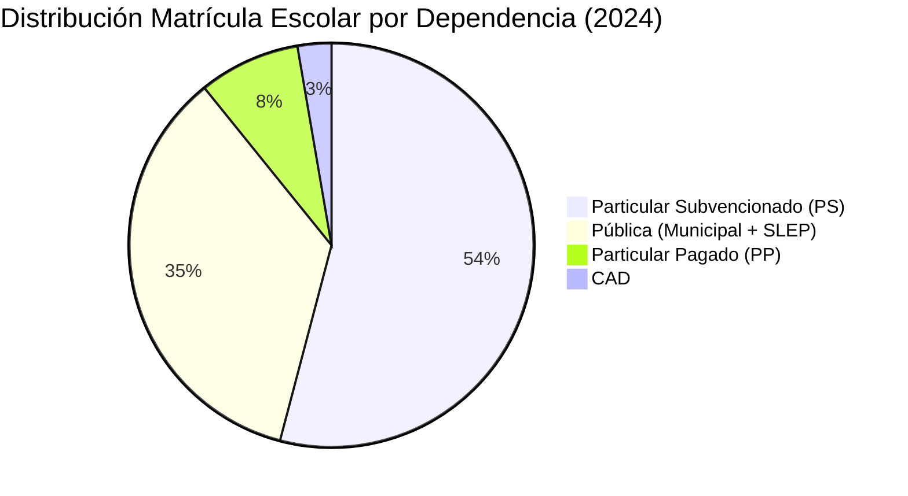
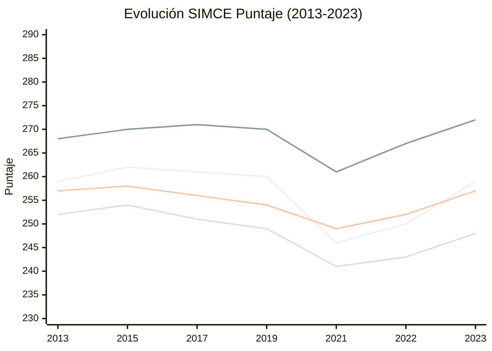
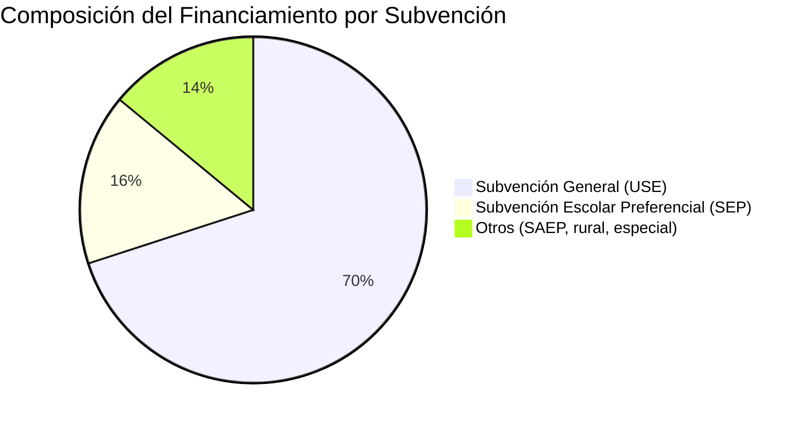

---
name: cifras_sistema_educacional_chile
description: "Cifras clave del sistema educacional chileno — matrícula, distribución por dependencia, niveles, brecha socioeconómica SIMCE, financiamiento vía subvención"
sources: [cowork]
aliases:
  - cifras educación Chile
  - matrícula escolar Chile
  - estadísticas sistema educativo
  - distribución dependencia matrícula
tags:
  - evidencia
  - cifras
  - matricula
---

# Cifras del Sistema Educacional Chileno

> Fuente: *Dashboard: Cifras del Sistema Educacional Chileno* (HTML interactivo, Chart.js; datos MINEDUC 2023-2024).

El sistema educacional chileno es uno de los más grandes de América Latina en términos de cobertura relativa, con **5,22 millones de estudiantes** en todos sus niveles. Comprender su estructura requiere leer simultáneamente los datos de matrícula, distribución por dependencia, brecha socioeconómica en resultados y el mecanismo de financiamiento que los sostiene.

---

## 1. La Arquitectura del Sistema: ¿Quién Educa a Quién?

### 1.1 Matrícula Total y Distribución

| Dependencia | Matrícula aprox. | % del total |
|-------------|:----------------:|:-----------:|
| Particular Subvencionado | ~1.936.000 | **54,1%** |
| Público (Municipal + SLEP) | ~1.257.000 | **35,1%** |
| Particular Pagado | ~290.000 | **8,1%** |
| CAD | ~97.000 | **2,7%** |
| **Total escolar** | **~3.580.000** | 100% |

*El sistema total incluye parvularia, básica, media, especial y adultos: **5,22 millones** de estudiantes.*

### 1.2 Distribución por Nivel Educativo

| Nivel | Matrícula | % del escolar |
|-------|:---------:|:-------------:|
| Parvularia (pre-k + k) | 452.000 | 12,6% |
| Básica | 2.037.000 | **56,9%** |
| Educación especial | 95.000 | 2,7% |
| Media C-H | 650.000 | 18,2% |
| Media T-P | 315.888 | 8,8% |
| Adultos | 33.000 | 0,9% |

### 1.3 Dimensiones de la Diversidad

- **Estudiantes extranjeros:** 275.927 (7,7% de la matrícula total)
  - Distribución: 60,8% en básica; concentrados en norte y RM
  - Preferencia: establecimientos públicos y PS de menor demanda
- **Matrícula rural:** 278.422 estudiantes (7,7%)
  - El **71,6% asiste a establecimientos públicos** (vs. 35,1% en promedio urbano)
  - Alta concentración en escuelas multigrado de baja matrícula

---

## 2. SIMCE: La Brecha que los Datos Revelan

### 2.1 Serie Histórica SIMCE 2013-2023

**Lectura del gráfico:** la pandemia (2021) provocó una caída en todos los niveles de 10-14 puntos. La recuperación 2022-2023 es completa en 4° básico pero incompleta en 2° medio, donde todavía no se alcanza el nivel 2019.

### 2.2 Brecha Socioeconómica SIMCE Matemáticas 4° Básico (2023)

| Grupo Socioeconómico | Puntaje SIMCE Mat | Diferencia con "Bajo" |
|----------------------|:-----------------:|:---------------------:|
| Bajo | 237 | — |
| Medio bajo | 247 | +10 pts |
| Medio | 263 | +26 pts |
| Medio alto | 278 | +41 pts |
| Alto | **292** | **+55 pts** |

**El rango total es de 55 puntos**: un estudiante de GSE alto tiene en promedio una ventaja equivalente a 2-3 años de aprendizaje sobre un estudiante de GSE bajo. Esta brecha es estructural y se mantiene desde 2006 — [[arbol_problemas_politica_educacional]].

---

## 3. Financiamiento: La Arquitectura del Voucher

### 3.1 Composición de la Subvención Escolar

### 3.2 La Fórmula del Voucher

$$\text{Subvención base mensual} = \text{Asistencia media promedio} \times \text{Factor USE} \times \text{Valor USE}$$

**Componentes:**
- **Asistencia media promedio:** promedio de los 3 meses anteriores al pago (incentivo a reducir ausentismo)
- **Factor USE:** coeficiente que varía según nivel (parvularia: 1,37 × básica: 1,0 × media TP: 1,63), zona geográfica y modalidad
- **Valor USE:** monto base por alumno-día que fija el MINEDUC y se reajusta por IPC

**Implicación:** cuando la asistencia cae, el financiamiento cae. Este mecanismo crea una **espiral negativa** en escuelas vulnerables: menor asistencia → menos recursos → peor infraestructura y docentes → menor asistencia → [[sistema_voucher_financiamiento]].

### 3.3 La SEP como Discriminación Positiva

La **Subvención Escolar Preferencial** (16% del total) aporta recursos adicionales por alumno prioritario. Los establecimentos que la reciben deben destinarla íntegramente al Plan de Mejoramiento Educativo (PME). La SEP reconoce que **educar en vulnerabilidad cuesta más**, pero su monto aún es insuficiente para compensar la brecha de capital cultural que los estudiantes traen desde el hogar.

---

## 4. Qué Revelan Estas Cifras

### El Cuasimercado en Números

La distribución 54,1% PS / 35,1% pública / 8,1% PP no es accidental: es el resultado sedimentado de 40 años de diseño de mercado educacional. El sector PS es dominante porque las familias "votaron con los pies" durante el período 1980-2015, cuando podían pagar copago y existía selección. La Ley de Inclusión 2015 prohibió ambos mecanismos, pero el PS sigue siendo mayoritario por **inercia histórica e institucional**.

### La Brecha GSE como Evidencia de Segregación Estructural

Los 55 puntos SIMCE entre GSE alto y bajo no son una coincidencia: son la expresión medida de la causa C1 del árbol de problemas (segregación socioeconómica). Un sistema que concentra al GSE alto en PP y PS de alta demanda, y al GSE bajo en públicos y PS de baja demanda, produce exactamente esta brecha — [[arbol_problemas_politica_educacional]].

### La Vulnerabilidad Rural

El 71,6% de la matrícula rural en establecimientos públicos refleja que el mercado educacional no alcanza zonas de baja densidad. La lógica del voucher (ingresos proporcionales a matrícula) hace que las escuelas rurales pequeñas sean estructuralmente inviables bajo el modelo de financiamiento actual.

---

## 5. Lectura Teórica (Collins/Hopper)

**F2 y F5 en los datos:** los 55 puntos SIMCE entre GSE son la medición directa de la tensión entre F2 (selección meritocrática) y F5 (reproducción de élites). El sistema declara seleccionar por mérito (puntajes, rendimiento), pero el mérito escolar está fuertemente predeterminado por el capital cultural del hogar. La "meritocracia" opera sobre un campo de partida desnivelado.

**La SEP como intento de F4:** la SEP (16% del financiamiento) es el principal instrumento redistributivo del sistema. Su lógica es F4 (democratización): dar más a quienes menos tienen. Pero mientras represente solo el 16% de la subvención y siga atada al PME-per-escuela en lugar de transformar el sistema de segregación territorial, su potencial democratizador está estructuralmente limitado.

**El voucher como F3:** el financiamiento por asistencia es un mecanismo que disciplina a las instituciones según la demanda del mercado (F3), pero en el sector público produce la paradoja de desfinanciar las escuelas que más atienden a los excluidos del mercado — [[fundamentos_politica_educacional]].

---

## 6. Conexiones

- [[sistema_voucher_financiamiento]] — mecanismo detallado de la USE y SEP
- [[arbol_problemas_politica_educacional]] — C1 segregación y C2 financiamiento insuficiente
- [[analisis_ocde_simce_chile]] — PISA 2022 y SIMCE con perspectiva comparada
- [[mercado_creacion_establecimientos]] — estructura del mercado que produce estas cifras
- [[presupuesto_educacional_chile]] — evolución histórica del gasto que financia este sistema
- [[educacion_particular_subvencionada]] — el sector dominante al 54,1%
- [[SLEP]] — la nueva forma de la educación pública (35,1%)
- [[MOC_Politica_Educacional]] — mapa central de la investigación
