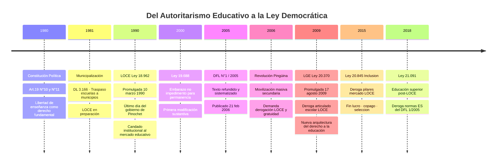
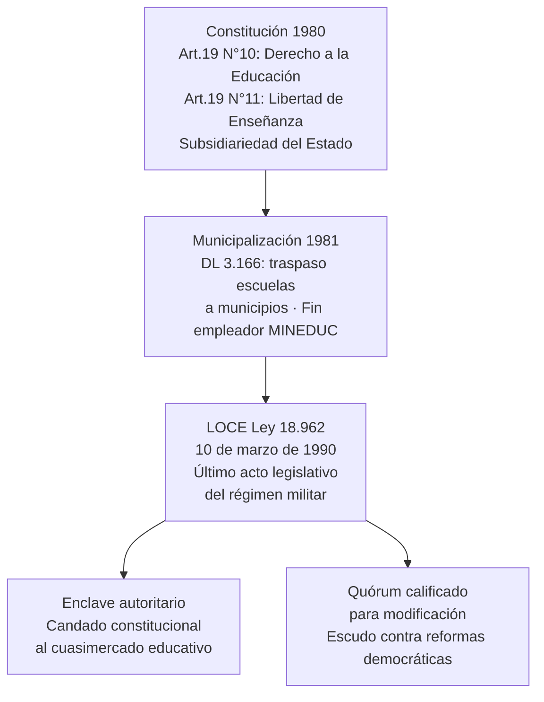
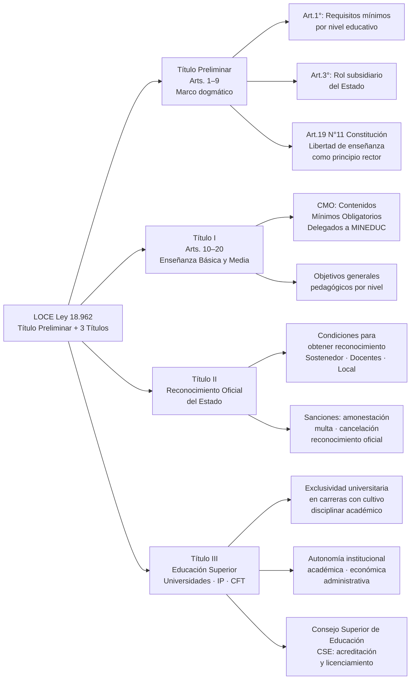
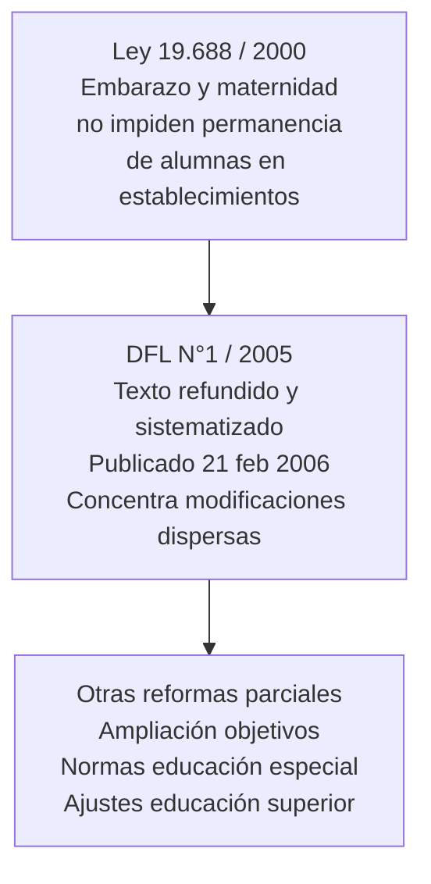
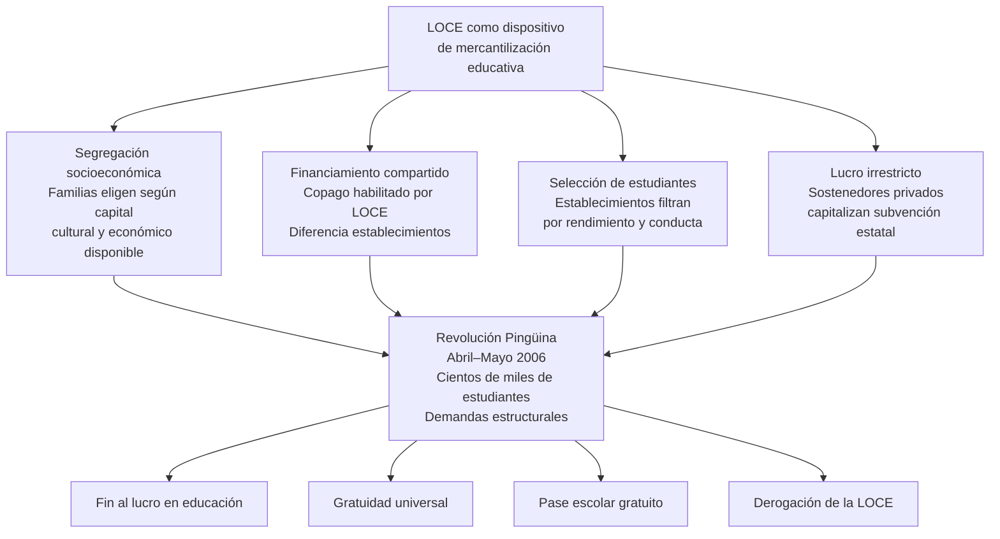
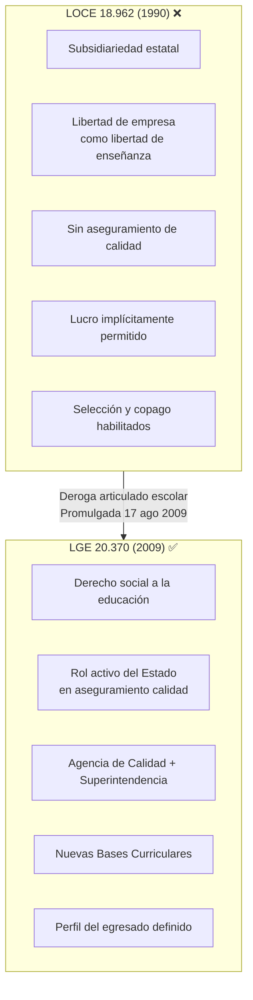
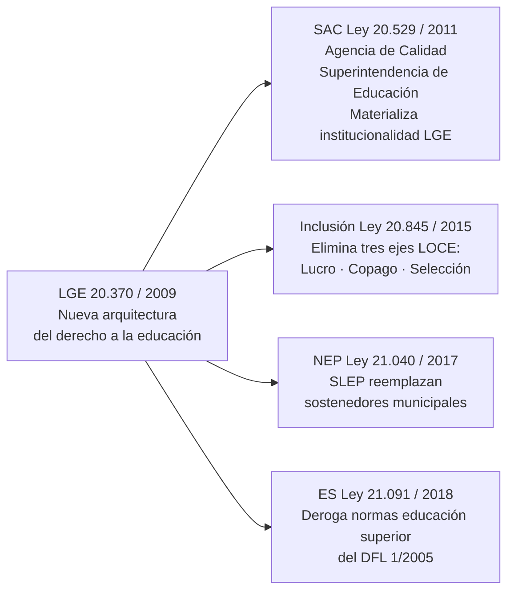

---
name: comparacion_LOCE_LGE
description: "Historia, articulado y análisis comparativo de la LOCE (Ley 18.962/1990) y la LGE (Ley 20.370/2009): génesis dictatorial, estructura normativa, impacto sistémico y transición democrática."
sources: [cowork]
aliases:
  - LOCE Ley 18962
  - Ley Orgánica Constitucional de Enseñanza
  - LGE Ley 20370
  - Ley General de Educación
  - comparativo LOCE LGE Chile
  - historia ley educación Chile 1990 2009
tags: [legal, normativa, reforma, historia, institucional, politica, 2026]
---

# LOCE y LGE: Historia, Articulado y Comparación

## Arquitectura del Cambio Normativo

---

## I. Contexto Histórico: La LOCE como Herencia Dictatorial

La LOCE no fue un hecho aislado sino la culminación de un proceso de transformación estructural iniciado en la década de 1970. Normativamente tradujo los mandatos del artículo 19, N°10 y N°11 de la Constitución de 1980: el Estado asume un rol subsidiario y la libertad de enseñanza —entendida como libertad de empresa educativa— se convierte en principio rector del sistema.

---

## II. Estructura del Articulado de la LOCE (Ley 18.962)

### Principios Doctrinales Clave

| Principio | Expresión normativa LOCE | Consecuencia sistémica |
|-----------|--------------------------|------------------------|
| **Subsidiariedad estatal** | Art.3°: Estado financia acceso universal gratuito; no interviene en oferta | Expansión de sostenedores privados con subvención |
| **Libertad de enseñanza** | Art.19 N°11 Constitución como mandato de la LOCE | Libertad de empresa = libertad pedagógica; sin regulación de lucro |
| **CMO delegados** | MINEDUC propone; Consejo Superior aprueba | Débil control curricular central; planes propios de establecimientos |
| **Reconocimiento oficial** | Requisitos mínimos de infraestructura y personal | Sin mecanismos de evaluación de calidad de aprendizajes |

---

## III. Modificaciones bajo Gobiernos de la Concertación (1990–2006)

Las modificaciones de la Concertación no alteraron la arquitectura de mercado central de la LOCE. El DFL N°1/2005 sistematizó el texto sin reforma sustantiva, evidenciando la dificultad de modificar una ley orgánica constitucional que requería quórum calificado.

---

## IV. Impacto Sistémico y la "Revolución Pingüina" (2006)

La ausencia de mecanismos estatales de aseguramiento de calidad y el rol fiscal mínimo del Estado generaron un sistema educativo altamente segregado. La "Revolución Pingüina" de 2006 —la mayor movilización estudiantil secundaria de la historia chilena— forzó la agenda de reforma que terminaría en la LGE.

---

## V. La Transición: LOCE → LGE

### Cuadro Comparativo LOCE / LGE

| Dimensión | LOCE (18.962/1990) | LGE (20.370/2009) |
|-----------|-------------------|-------------------|
| **Rol del Estado** | Subsidiario: asegura acceso mínimo gratuito | Garante: asegura derecho y calidad |
| **Libertad de enseñanza** | Principio rector sin contrapeso de calidad | Articulada con derecho a educación de calidad |
| **Regulación calidad** | Ausente: solo CMO mínimos | Agencia de Calidad + Superintendencia |
| **Lucro** | Implícitamente permitido sin restricción | No regulado directamente (resuelto por Ley 20.845/2015) |
| **Selección** | Habilitada implícitamente | No prohibida (resuelto por Ley 20.845/2015) |
| **Copago** | Financiamiento compartido habilitado | No prohibido (resuelto por Ley 20.845/2015) |
| **Quórum modificación** | LOC: mayoría absoluta de senadores y diputados | Ley ordinaria: más flexible |
| **Educación superior** | Regulada en Título III (vigente en DFL 1/2005) | No toca educación superior (resuelta por Ley 21.091/2018) |

> **Nota**: La LGE deroga el articulado escolar de la LOCE pero mantiene vigentes transitoriamente las normas de educación superior (DFL 1/2005) hasta la Ley 21.091/2018.

---

## VI. Reformas Post-LGE que Completan la Transición

- **Ley 20.529/2011 (SAC)**: crea Agencia de Calidad de la Educación y Superintendencia de Educación; materializa la institucionalidad de aseguramiento de calidad que la LGE estableció pero no implementó directamente.
- **Ley 20.845/2015 (Inclusión)**: elimina los tres pilares de segregación que la LOCE dejó intactos y la LGE no resolvió: prohíbe el lucro en establecimientos con subvención estatal, elimina el copago (financiamiento compartido) y suprime la selección de estudiantes.
- **Ley 21.040/2017 (NEP/SLEP)**: desmunicipalización; crea los Servicios Locales de Educación Pública que reemplazan a los municipios como sostenedores del sector público.
- **Ley 21.091/2018**: deroga el régimen de educación superior del DFL 1/2005, completando la transición institucional iniciada con la LGE.

---

## VII. Conclusiones: La LOCE como Campo de Disputa

La LOCE representó la piedra angular de la estructuración del sistema socioeducativo chileno de finales del siglo XX. Su promulgación en las postrimerías del régimen militar fijó un modelo de subsidiariedad estatal y libertad de mercado que condicionó todas las políticas educacionales durante casi dos décadas.

El análisis de su articulado demuestra que la LOCE subordinó la garantía del derecho a la educación al resguardo de la libertad de enseñanza entendida como libertad de empresa, relegando al Estado a un rol de sostenedor de último recurso y árbitro mínimo. La ausencia de mecanismos de aseguramiento de calidad y la permisividad implícita del lucro, el copago y la selección generaron el sistema escolar más segregado de la OCDE.

La "Revolución Pingüina" de 2006 demostró que la legitimidad de la LOCE había sido erosionada más allá de su blindaje institucional. La LGE de 2009, junto con las reformas posteriores de inclusión (2015), nueva educación pública (2017) y educación superior (2018), configuraron el nuevo marco normativo democrático del sistema educacional chileno.

---

## VIII. Interpretación Teórica: Collins y Hopper

| Función | Manifestación en la LOCE/LGE |
|---------|------------------------------|
| **F1 Socialización** | LOCE: socialización delegada a sostenedores privados sin control estatal de valores compartidos. LGE: perfil del egresado como dispositivo de socialización nacional con ciudadanía crítica |
| **F2 Selección meritocrática** | LOCE: selección por rendimiento y conducta naturaliza desigualdad como mérito. LGE/20.845: intento de desarticular la selección como mecanismo de reproducción |
| **F3 Formación para mercado** | LOCE: el cuasimercado educativo como entrenamiento implícito para el mercado laboral segmentado |
| **F4 Democratización** | LGE: ampliación del derecho como mandato democrático post-Pingüina; inclusión como política pública |
| **F5 Reproducción de élites** | LOCE: la estratificación de establecimientos por copago y selección reproduce posiciones de clase; el sector pagado se blinda de toda regulación de mercado |

> **Lectura crítica (Bourdieu)**: La LOCE institucionalizó un campo educativo donde el capital económico de las familias se convierte directamente en capital cultural institucionalizado (título, credencial de establecimiento de élite). La lucha por derogarla fue una lucha por redefinir las reglas del campo: quién puede "jugar" y con qué recursos. La LGE amplió el acceso al juego, pero las distancias entre posiciones se mantienen mientras la lógica de mercado subsiste en el financiamiento vía voucher.

---

## IX. Preguntas de Investigación

1. ¿En qué medida la LGE representó una ruptura paradigmática con la LOCE o una continuidad reformada del mismo modelo de cuasimercado?
2. ¿La eliminación del lucro, el copago y la selección (Ley 20.845) ha reducido efectivamente la segregación socioeconómica del sistema escolar chileno o solo ha desplazado sus mecanismos?
3. ¿Cómo influyó el quórum orgánico constitucional de la LOCE en los itinerarios de reforma educativa de los gobiernos de la Concertación (1990–2010)?
4. ¿La "Revolución Pingüina" de 2006 constituyó un momento de quiebre en el consenso transicional chileno sobre el rol del Estado en educación?
5. ¿Qué elementos de la arquitectura LOCE persisten en el sistema educacional chileno actual pese a las reformas acumuladas desde 2009?

---

## X. Referencias y Vínculos

- [[linea_tiempo_politica_educacional_chile]]
- [[compendio_normativa_educacional_chile]]
- [[estatuto_docente_chile]]
- [[actores_sociales_educacion_chile]]
- [[demandas_actores_sociales_educacion]]
- [[opinion_publica_educacion_chile]]
- [[sistema_financiamiento_escolar_chile]]
- [[modelos_gobernanza_educacional]]
- [[MOC_Politica_Educacional]]

**Fuentes primarias**: Ley 18.962 (DO 10/03/1990); DFL N°1/2005 (DO 21/02/2006); Ley 20.370 (DO 12/09/2009); Ley 20.529 (DO 27/08/2011); Ley 20.845 (DO 08/06/2015); Ley 21.040 (DO 24/11/2017); Ley 21.091 (DO 29/05/2018); BCN Historia de la Ley 18.962; Wikipedia — Movilización estudiantil Chile 2006.
