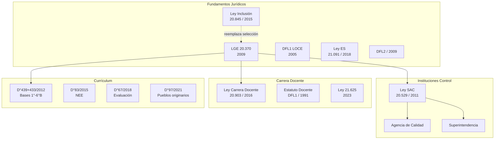
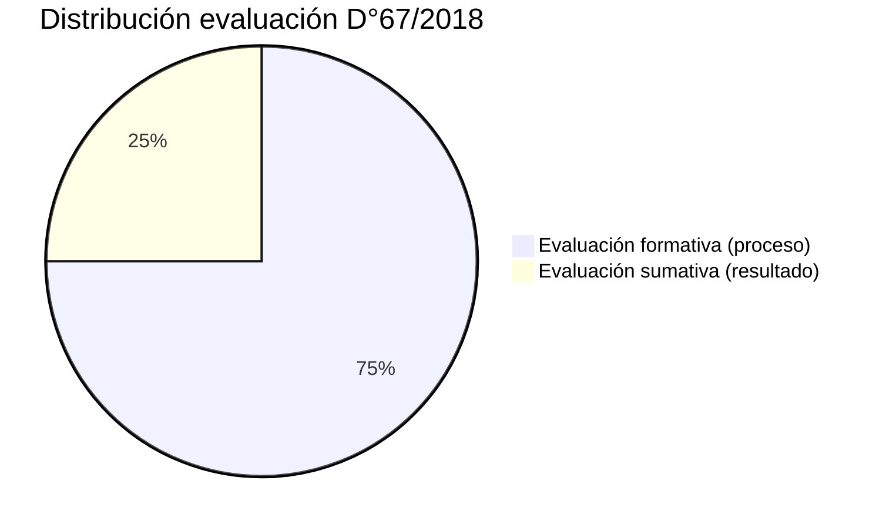
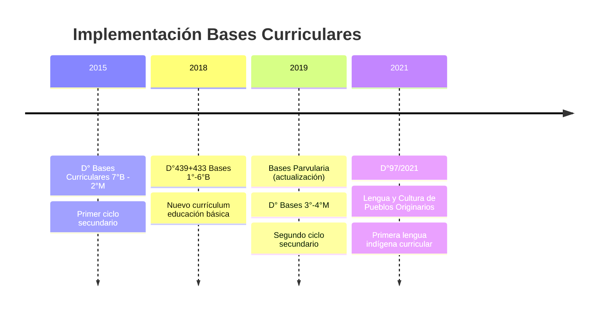
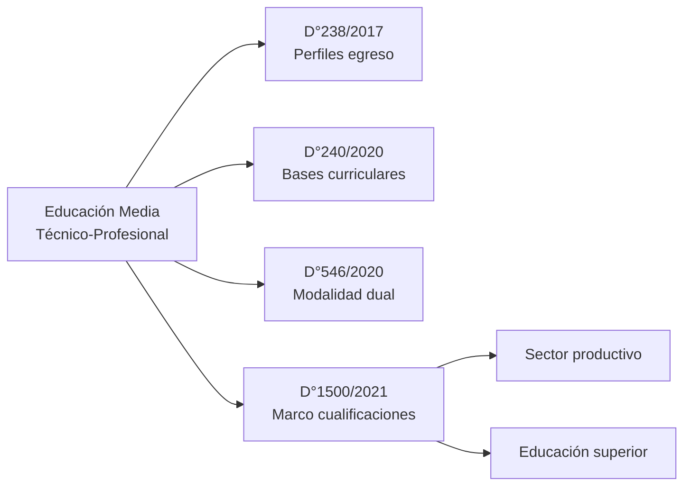
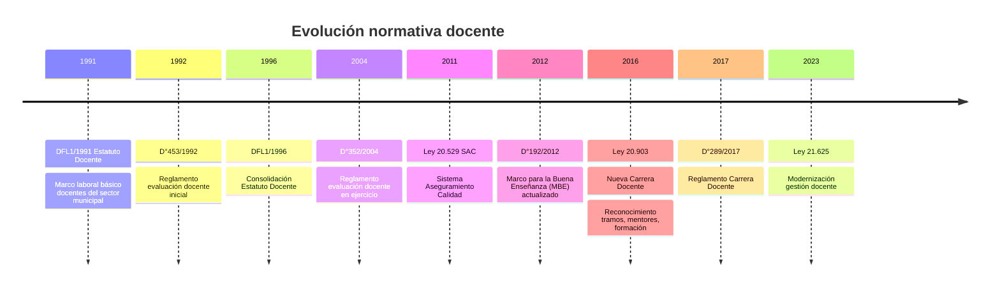
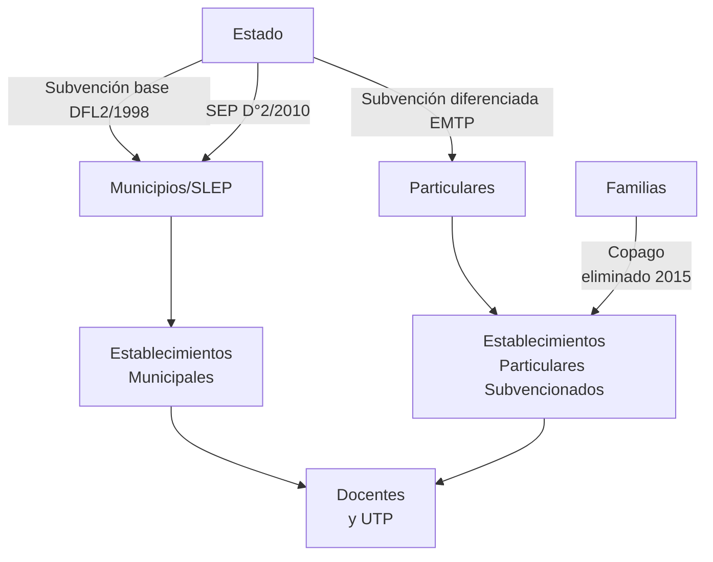
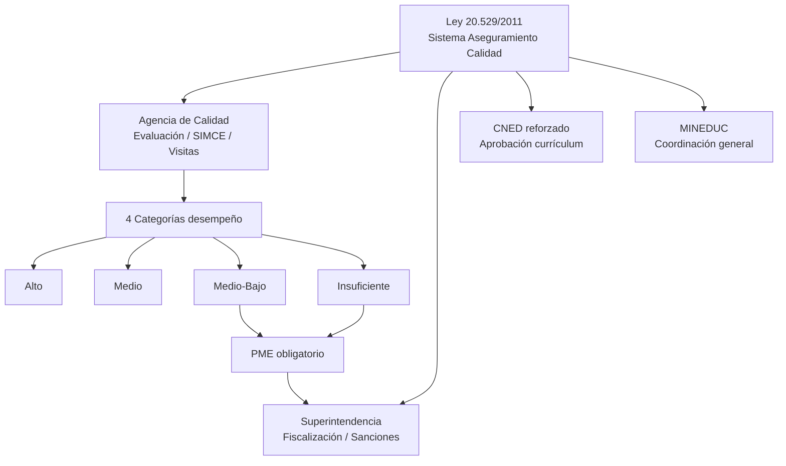

---
name: compendio_normativa_educacional_chile
description: "Compendio de ~45 normativas educacionales chilenas 1990-2023, organizadas por categoría temática y por década. Incluye leyes, decretos y DFL con descripción de alcance y vigencia."
sources: [cowork]
aliases:
  - normativa educacional Chile
  - leyes educación Chile
  - decretos educacionales Chile
  - marco legal educativo chileno
  - legislación educacional 1990-2023
tags: [institucional, politica, reforma, historia, gobernanza, 2026]
---

# Compendio de Normativa Educacional Chilena (1990–2023)

## Mapa del Ecosistema Normativo

---

## I. Normativas Fundamentales

| Norma | Año | Contenido Principal |
|-------|-----|---------------------|
| **Ley 20.370 (LGE)** | 2009 | Marco general del sistema educativo; 10 principios; niveles; sostenedores; Agencia + Superintendencia |
| **Ley 21.091** | 2018 | Marco del sistema de educación superior; autonomía, transparencia, CNED reforzado |
| **Ley 20.845 (Inclusión)** | 2015 | Elimina lucro, copago y selección en establecimientos subvencionados |
| **DFL 2/2009** | 2009 | Refunde normas de subvenciones; financiamiento base del sistema |
| **DFL 1/2005 (LOCE refundida)** | 2005 | Versión codificada de la LOCE; base hasta LGE para ES |

> **Nota**: La LGE derogó la LOCE en materia de educación escolar (Títulos I-II), pero mantuvo intactos los Títulos III-IV sobre Educación Superior hasta la promulgación de la Ley 21.091/2018.

---

## II. Decretos de Evaluación y Currículum

### Decreto 67/2018 — Reforma de la Evaluación Escolar

El D°67 transformó el paradigma evaluativo chileno:

- **Elimina**: notas como único instrumento; repitencia automática por calificación
- **Incorpora**: heteroevaluación, coevaluación, autoevaluación
- **Establece**: concepto, procedimiento y propósito como dimensiones de la evaluación
- **Deroga**: D°511/1997 (básica) y D°112/1999 (media) — sistema de notas 1-7

### Decreto 83/2015 — Diversificación de la Enseñanza (NEE)

- Implementa **Diseño Universal para el Aprendizaje (DUA)**
- Obligatorio para estudiantes con Necesidades Educativas Especiales (NEE)
- Complementa D°170/2009 (diagnóstico NEE) y D°332/2011 (escuelas especiales)
- Vinculado a Ley de Inclusión 20.845

### Bases Curriculares — Cronología

### Decreto 48/2021 — SIMCE 2021–2026

- Plan SIMCE para el quinquenio; incorpora ajustes post-pandemia
- Refuerza rol orientador sobre rol ranking
- Vinculado a Agencia de Calidad y categorías de desempeño

---

## III. Normativa Técnico-Profesional (EMTP)

| Norma | Año | Alcance |
|-------|-----|---------|
| D°238/2017 | 2017 | Planes y programas EMTP; perfiles de egreso |
| D°240/2020 | 2020 | Bases curriculares EMTP actualización |
| D°546/2020 | 2020 | Modalidad dual en EMTP |
| D°1500/2021 | 2021 | Marco de cualificaciones para EMTP |
| D°220/1998 | 1998 | Objetivos Fundamentales EMTP (OF-CMO técnico) |
| D°452/2013 | 2013 | Actualización especialidades EMTP |
| DFL 2/2009 | 2009 | Financiamiento EMTP (subvención diferenciada) |

---

## IV. Convivencia Escolar

| Norma | Año | Contenido |
|-------|-----|-----------|
| **Ley 20.536** | 2011 | Ley de Violencia Escolar (bullying); rol del Encargado de Convivencia |
| **Ley 21.430** | 2022 | Garantías y protección integral de derechos de la niñez |
| D°565/1990 | 1990 | Reglamento de Centros de Padres y Apoderados |
| D°327/2020 | 2020 | Actualización Reglamento de Convivencia Escolar |
| D°524/1990 | 1990 | Reglamento General de Centros de Alumnos |

---

## V. Carrera y Estatuto Docente

### Ley 20.903/2016 — Nueva Carrera Docente

La reforma más significativa en la profesión docente desde el Estatuto de 1991:

- **Tramos de desarrollo**: Inicial → Temprano → Avanzado → Experto I → Experto II
- **Reconocimiento**: incremento salarial asociado a tramo de desarrollo
- **Mentores**: docentes expertos que apoyan a docentes iniciales
- **Formación continua**: obligatoria y financiada por el Estado
- **Evaluación**: basada en portafolio y grabación de clase (Marco para la Buena Enseñanza)

---

## VI. Financiamiento Educacional

| Norma | Año | Contenido |
|-------|-----|-----------|
| **DFL 2/1998** | 1998 | Ley de Subvenciones; monto, tipos, condiciones (base del sistema voucher) |
| D°1830/2023 | 2023 | Actualización montos subvención; SEP complementaria |
| **Ley 20.027/2005** | 2005 | Crédito con Aval del Estado (CAE) para educación superior |
| D°2/2010 | 2010 | Reglamento SEP (Subvención Escolar Preferencial) |
| DFL 1/1990 | 1990 | Primera ley de subvenciones post-dictadura |

**Arquitectura del financiamiento escolar**:

---

## VII. Educación Parvularia

| Norma | Año | Contenido |
|-------|-----|-----------|
| D°481/2018 | 2018 | Bases Curriculares Educación Parvularia (actualización completa) |
| D°215/2009 | 2009 | Reglamento de establecimientos de educación parvularia |
| D°128/2017 | 2017 | Estándares orientadores para carreras de Educador de Párvulos |
| Orientaciones 2021 | 2021 | Orientaciones curriculares educación parvularia post-pandemia |

La educación parvularia fue incorporada con financiamiento estatal recién por la LGE (2009), aunque JUNJI e INTEGRA existían previamente.

---

## VIII. Educación Especial / NEE

| Norma | Año | Contenido |
|-------|-----|-----------|
| D°83/2015 | 2015 | DUA — Diversificación de la Enseñanza (NEE en escuela regular) |
| D°170/2009 | 2009 | Diagnóstico y evaluación de NEE; requisitos para PIE |
| D°332/2011 | 2011 | Establecimientos de Educación Especial (escuelas especiales) |
| D°1/1998 | 1998 | Marco general educación especial (pre-LGE) |
| D°363/1994 | 1994 | Primera normativa sobre integración escolar |

---

## IX. Normativas Adicionales Relevantes

| Norma | Año | Contenido |
|-------|-----|-----------|
| Ley 20.129/2006 | 2006 | Sistema Nacional de Aseguramiento de Calidad de la ES (SINACES) |
| D°87/2020 | 2020 | Protocolo COVID: continuidad educativa; adaptaciones curriculares emergencia |
| D°737/2017 | 2017 | Reglamento de evaluación y promoción escolar (DFL2 articulado) |
| **Ley 20.911/2019** | 2019 | Plan de Formación Ciudadana obligatorio para todos los establecimientos |

---

## X. Sistema de Aseguramiento de Calidad (Ley 20.529/2011)

La Ley 20.529 creó la arquitectura institucional que opera el sistema de calidad bajo la LGE:

---

## Panorama por Décadas

### Década 1990: Instalación del Marco Post-Dictadura

| Año | Norma | Hito |
|-----|-------|------|
| 1990 | DFL1/LOCE | Marco jurídico heredado de dictadura |
| 1990 | D°565 | Centros de Padres regulados |
| 1990 | D°524 | Centros de Alumnos regulados |
| 1991 | DFL1 Estatuto Docente | Primer marco laboral docente democrático |
| 1994 | D°363 | Primera normativa integración escolar |
| 1996 | DFL1 (Estatuto actualizado) | Consolidación carrera |
| 1998 | DFL2 Subvenciones | Base del sistema voucher |
| 1998 | D°1 Educación Especial | Marco general NEE |

### Década 2000: Reforma y Crisis

| Año | Norma | Hito |
|-----|-------|------|
| 2004 | D°352 | Evaluación docente en ejercicio |
| 2005 | DFL1 LOCE codificada | Actualización texto refundido |
| 2005 | Ley 20.027 CAE | Financiamiento ES vía crédito |
| 2006 | Ley 20.129 | SINACES para educación superior |
| 2009 | Ley 20.370 LGE | Nueva ley marco; deroga LOCE escolar |
| 2009 | DFL2 | Refunde subvenciones |
| 2009 | D°170 | Diagnóstico NEE; Programa Integración |

### Década 2010: Profundización Reforma

| Año | Norma | Hito |
|-----|-------|------|
| 2010 | D°2 SEP | Subvención Escolar Preferencial consolidada |
| 2011 | Ley 20.529 | Sistema Aseguramiento Calidad (SAC) |
| 2011 | Ley 20.536 | Violencia escolar (bullying) |
| 2012 | D°439+433 | Bases Curriculares 1°-6°B |
| 2013 | D°452 | Actualización especialidades EMTP |
| 2015 | Ley 20.845 | Inclusión: elimina lucro+copago+selección |
| 2015 | D°83 | DUA — Diversificación Enseñanza NEE |
| 2015 | Bases 7°B-2°M | Nuevo currículum secundario inicial |
| 2016 | Ley 20.903 | Nueva Carrera Docente |
| 2017 | D°238 | Planes EMTP actualizados |
| 2017 | D°128 | Estándares Párvulos |
| 2018 | D°67 | Reforma evaluación formativa/sumativa |
| 2018 | D°481 | Bases Curriculares Parvularia |
| 2018 | Ley 21.091 | Marco Educación Superior |
| 2019 | D Bases 3°-4°M | Nuevo currículum secundario avanzado |
| 2019 | Ley 20.911 | Formación ciudadana obligatoria |

### Década 2020: Ajustes Post-Pandemia

| Año | Norma | Hito |
|-----|-------|------|
| 2020 | D°87 | Protocolo COVID continuidad educativa |
| 2020 | D°240 | Bases EMTP actualización |
| 2020 | D°546 | Modalidad dual EMTP |
| 2021 | D°1500 | Marco cualificaciones EMTP |
| 2021 | D°97 | Lengua y Cultura Pueblos Originarios |
| 2021 | Orientaciones Parvularia | Ajustes post-pandemia |
| 2021 | D°48 | Plan SIMCE 2021-2026 |
| 2022 | Ley 21.430 | Garantías y derechos niñez |
| 2023 | D°1830 | Actualización subvención |
| 2023 | Ley 21.625 | Modernización gestión docente |

---

## Interpretación Teórica: Collins y Hopper en el Marco Normativo

| Función | Normativas que la expresan | Tensión |
|---------|---------------------------|---------|
| **F1 Socialización** | LGE (10 principios), Ley 20.911 (ciudadanía), D°97 (pueblos originarios), Ley 21.430 (derechos niñez) | Universalismo vs. diversidad cultural |
| **F2 Selección meritocrática** | D°67/2018 (evaluación), SIMCE D°48, D°352 (eval. docente) | Evaluación formativa vs. selección por rendimiento |
| **F3 Formación para mercado** | DFL2/1998 (subvenciones-voucher), Ley ES 21.091, CAE 20.027, EMTP D°238+1500 | Eficiencia vs. equidad |
| **F4 Democratización** | Ley Inclusión 20.845, D°83 NEE, Ley 20.536, D°524 (centros alumnos), D°565 (centros padres) | Participación real vs. formal |
| **F5 Reproducción élites** | CAE 20.027 (deuda estudiantes), Financiamiento diferenciado ES, segregación persistente | Acceso vs. calidad diferencial |

---

## Vínculos y Referencias

- [[comparacion_LOCE_LGE]]
- [[linea_tiempo_politica_educacional_chile]]
- [[actores_sociales_educacion_chile]]
- [[sistema_financiamiento_escolar_chile]]
- [[modelos_gobernanza_educacional]]
- [[cifras_matricula_sistema_educacional]]
- [[MOC_Politica_Educacional]]

**Fuentes**: Biblioteca del Congreso Nacional (BCN); MINEDUC — normativa educacional; Ley Chile — banco de textos legales actualizados.
