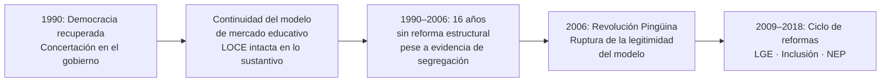
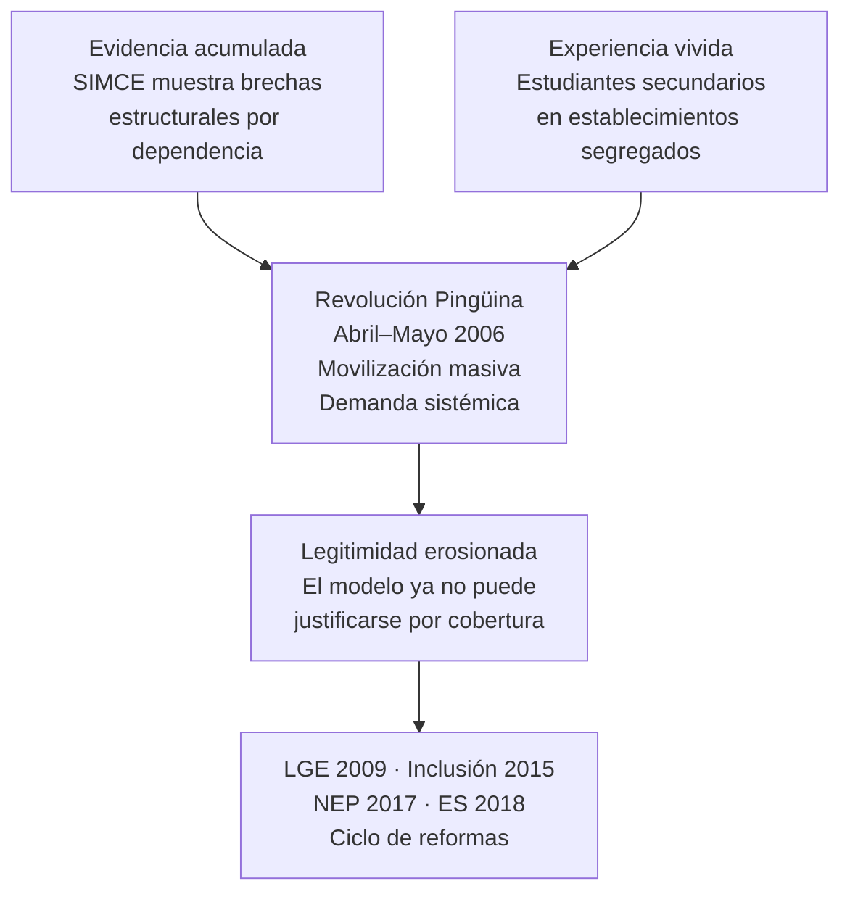

---
name: cuasimercado_educativo_persistencia
description: "Nota de síntesis. Por qué el modelo de mercado educativo chileno sobrevivió cuatro gobiernos de la Concertación pese a sus contradicciones internas."
sources: [cowork]
aliases:
  - persistencia cuasimercado educativo Chile
  - por qué no se reformó la LOCE
  - inercia política educacional concertación
tags: [politica, reforma, financiamiento, gobernanza, teoria, historia]
---

# ¿Por qué el cuasimercado educativo sobrevivió a la democratización?

El sistema educacional chileno post-dictadura preservó durante casi veinte años los pilares del modelo instalado por la LOCE: subvención portable, financiamiento compartido (copago), selección de estudiantes y ausencia de regulación del lucro. Cuatro gobiernos de la Concertación gobernaron sobre esa arquitectura sin desmantelarla. Este nodo busca explicar por qué.

---

## I. El problema

La pregunta no es por qué el modelo de mercado fue instalado — eso lo explica la dictadura y la LOCE. La pregunta es por qué gobiernos democráticos con diagnóstico crítico del modelo lo mantuvieron durante casi dos décadas.

---

## II. Tres hipótesis en tensión

### H1. La restricción institucional

La LOCE era una ley orgánica constitucional que requería quórum calificado para ser modificada: mayoría absoluta de senadores y diputados en ejercicio. Ningún gobierno de la Concertación tuvo esa mayoría de manera autónoma durante los años 90. La reforma era legalmente costosa antes de ser políticamente costosa.

A esto se sumó el sistema de senadores designados vigente hasta 2005, que aseguraba una minoría de bloqueo conservadora en el Senado. Reformar la LOCE requería negociar con la derecha los términos de su propio desmantelamiento.

> Conclusión parcial: la arquitectura constitucional de la transición no solo protegió la estabilidad democrática — también protegió el modelo de mercado educativo heredado.

→ Ver [[comparacion_LOCE_LGE]]

### H2. El consenso transicional y el costo político de la confrontación

Los gobiernos de los 90 priorizaron la estabilidad democrática sobre la reforma estructural. En ese marco, alterar el modelo educativo heredado se leía como ruptura del acuerdo tácito con los sectores económicos que habían respaldado la transición negociada.

La estrategia elegida fue la inversión compensatoria: P-900, MECE, JEC, Red Enlaces. Se mejoró el sistema sin confrontar su arquitectura. Esta lógica tenía coherencia interna: si el modelo genera desigualdad, la respuesta es inyectar recursos diferenciados a los más vulnerables — SEP mediante — sin tocar las reglas del juego.

> Conclusión parcial: la Concertación reformó los efectos del cuasimercado sin reformar el cuasimercado. Fue una decisión política, no solo una restricción técnica.

→ Ver [[linea_tiempo_politica_educacional_chile]]

### H3. La captura por indicadores de cobertura

La expansión de matrícula y el aumento sostenido del gasto público en educación generaron indicadores positivos que legitimaron el modelo durante los 90. Chile pasó de menos del 2,5% del PIB en gasto educativo a casi el 4% hacia 2000. La cobertura en básica y media se universalizó.

La discusión sobre calidad y segregación llegó más tarde, cuando el SIMCE comenzó a mostrar sistemáticamente que las brechas socioeconómicas en resultados de aprendizaje eran estructurales e independientes del aumento del gasto. Mientras los indicadores de acceso subían, el modelo parecía funcionar.

> Conclusión parcial: el cuasimercado fue evaluado durante años con los indicadores equivocados. La cobertura ocultó la segregación hasta que la evidencia de aprendizajes la hizo visible.

→ Ver [[cifras_matricula_sistema_educacional]]

---

## III. La ruptura de 2006

La Revolución Pingüina no fue un evento inesperado — fue la expresión pública de una contradicción que los indicadores de cobertura habían ocultado durante quince años. Lo que no pudo la restricción jurídica ni el debate técnico lo logró la movilización social: forzó la agenda de reforma y abrió el ciclo legislativo que terminó en la LGE (2009), la Ley de Inclusión (2015), la NEP (2017) y la Ley de ES (2018).

→ Ver [[demandas_actores_sociales_educacion]]

---

## IV. Lectura propia

Las tres hipótesis no son excluyentes — se articulan en niveles distintos de explicación.

La **restricción institucional** (H1) explica la forma que tomó la inercia: había un candado jurídico que hacía costoso reformar. Pero ese candado no era insalvable — la Concertación negoció con la derecha cuando lo necesitó en otros ámbitos.

El **consenso transicional** (H2) explica la voluntad política de no forzar ese quórum: reformar la arquitectura educativa implicaba un costo político que los gobiernos de los 90 no estaban dispuestos a pagar. La estrategia compensatoria fue funcional a ese cálculo.

Los **indicadores de cobertura** (H3) explican por qué la ciudadanía no presionó antes: el modelo parecía producir resultados. La segregación era real, pero sus costos recaían sobre quienes tienen menos capacidad de hacerlos visibles políticamente.

El sistema se sostuvo porque los costos de la desigualdad eran invisibles para quienes tomaban decisiones y tolerables para quienes no las tomaban. La Revolución Pingüina rompió esa invisibilidad.

---

## V. Preguntas que quedan abiertas

1. ¿La Ley de Inclusión (2015) desmanteló el cuasimercado o solo reguló sus efectos más visibles, dejando intacta la lógica de competencia entre establecimientos?
2. ¿El financiamiento vía subvención portable (voucher) sigue siendo la tecnología central del sistema después de eliminar el copago y la selección?
3. ¿La desmunicipalización (SLEP) modifica la lógica de mercado o solo cambia el tipo de sostenedor que opera dentro de ella?
4. ¿Qué rol jugaron los sostenedores del sector particular subvencionado como actores de veto a lo largo de este período?

---

## VI. Referencias y vínculos

- [[comparacion_LOCE_LGE]]
- [[linea_tiempo_politica_educacional_chile]]
- [[estatuto_docente_chile]]
- [[demandas_actores_sociales_educacion]]
- [[opinion_publica_educacion_chile]]
- [[cifras_matricula_sistema_educacional]]
- [[sistema_financiamiento_escolar_chile]]
- [[modelos_gobernanza_educacional]]
- [[MOC_Politica_Educacional]]
