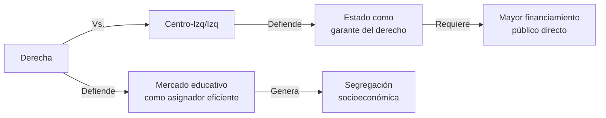
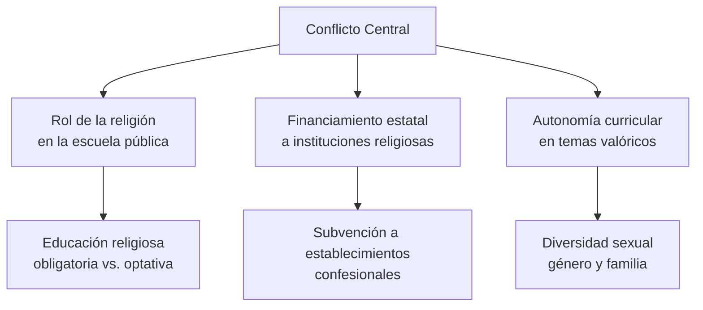
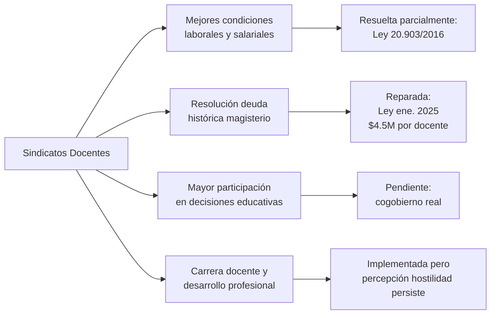
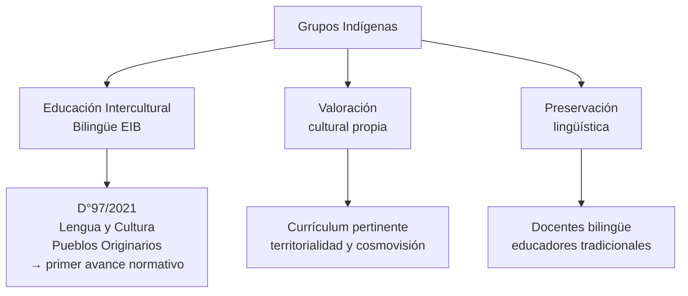
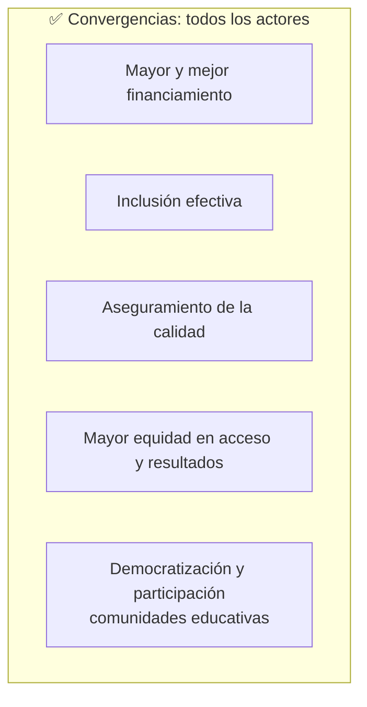
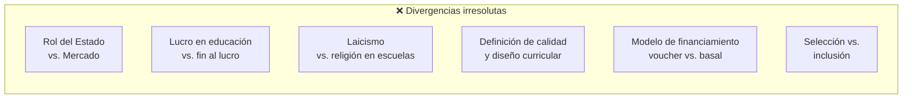
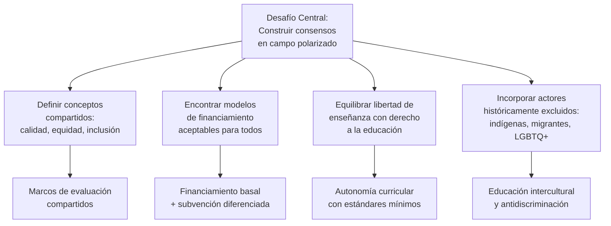

---
name: demandas_actores_sociales_educacion
description: "Demandas educacionales de actores sociales en Chile por grupo: partidos políticos, organizaciones religiosas, sindicatos docentes, movimientos estudiantiles, sostenedores, municipios, grupos indígenas y organizaciones de derechos. Convergencias, divergencias y nodos de interacción."
sources: [cowork]
aliases:
  - demandas educación Chile
  - actores sociales educación demandas
  - conflictos educativos Chile
  - convergencias divergencias educación
  - nodos interacción educativa
tags: [institucional, politica, sociologia, gobernanza, 2026]
---

# Demandas de Actores Sociales en Educación Chilena

## Mapa de Nodos: Actores y Demandas

```mermaid
graph TB
    subgraph ACTORES["Actores (12)"]
        PP_D[Partidos Derecha]
        PP_CI[Partidos Centro-Izq/Izq]
        IC[Iglesia Católica]
        IE[Iglesias Evangélicas]
        MAS[Masonería]
        OE[Org. Empresariales]
        SD[Sindicatos Docentes]
        ME[Mov. Estudiantiles]
        CON[Sostenedores CONACEP]
        MUN[Asoc. Municipalidades]
        GI[Grupos Indígenas]
        OD[Org. Derechos]
    end
    
    subgraph DEMANDAS["Demandas / Temas (13)"]
        EST[Rol Estado vs. Sector Privado]
        FIN[Financiamiento]
        CAL[Calidad y Equidad Educativa]
        DEM[Democratización y Participación]
        REL[Rol Religión vs. Laicismo]
        LUC[Lucro en Educación]
        DOC[Condiciones Laborales Docentes]
        INT[Ed. Intercultural Bilingüe]
        INC[Inclusión y No Discriminación]
        AUT[Autonomía]
        MER[Alineación Mercado Laboral/EMTP]
        INF[Infraestructura]
        DES[Desafíos del Sistema]
    end

    PP_D --> EST
    PP_D --> FIN
    PP_D --> CAL
    PP_CI --> EST
    PP_CI --> FIN
    PP_CI --> CAL
    PP_CI --> LUC
    PP_CI --> DEM
    IC --> REL
    IC --> AUT
    IC --> FIN
    IE --> REL
    MAS --> REL
    MAS --> DOC
    OE --> MER
    SD --> DOC
    SD --> DEM
    SD --> EST
    ME --> FIN
    ME --> LUC
    ME --> DEM
    CON --> FIN
    CON --> AUT
    CON --> EST
    MUN --> FIN
    MUN --> INF
    GI --> INT
    GI --> INC
    OD --> INC
```

---

## I. Partidos Políticos

### Derecha (UDI, RN, Evópoli, Republicanos)

| Demanda | Posición |
|---------|----------|
| Libertad de enseñanza | Principio irrenunciable |
| Rol del sector privado | Mayor presencia y autonomía |
| Financiamiento a escuelas privadas y religiosas | A favor |
| Intervención estatal | Mínima (subsidiariedad) |
| Lucro en educación | Defendido (eficiencia de mercado) |
| Selección por mérito | Apoyada |

### Centro-Izquierda e Izquierda (DC, PS, PPD, PC, FA)

| Demanda | Posición |
|---------|----------|
| Educación pública gratuita y de calidad | Central |
| Eliminación del lucro | Lograda (2015), pero demandan control efectivo |
| Rol del Estado | Garantizador activo, no subsidiario |
| Democratización de la gobernanza | Consejos escolares, cogobierno |
| Equidad e inclusión | Principios estructurantes |

### Principales Puntos de Conflicto Político

**Tres ejes de conflicto**: 1) Rol Estado vs. Mercado; 2) Financiamiento Público vs. Privado; 3) Modelo de gestión educativa.

---

## II. Organizaciones Religiosas

### Iglesia Católica e Iglesias Evangélicas

| Demanda | Alcance |
|---------|---------|
| Educación en valores cristianos | Currículum y cultura escolar |
| Autonomía escolar religiosa | Selección por proyecto valórico |
| Financiación estatal | Subvención para establecimientos confesionales |
| Derecho a impartir educación religiosa | Obligatoria, no optativa |

Las Iglesias Católica y Evangélica administran juntas una parte relevante del sistema de educación particular subvencionado, lo que les da un poder estructural en el campo educativo más allá de sus demandas discursivas.

### Masonería

| Demanda | Alcance |
|---------|---------|
| Educación laica y secular | Separación religión/escuela pública |
| Pensamiento crítico | Eje del currículum |
| Valores universales | Base ética sin anclaje confesional |
| Condiciones laborales docentes | Apoyo a la profesión como vocación laica |

### Áreas de Conflicto Religioso-Laico

---

## III. Organizaciones del Sector Educativo

### Organizaciones Empresariales (CPC, SOFOFA, gremios sectoriales)

- Alineación del currículum con **necesidades del mercado laboral**
- Fortalecimiento de la **formación técnico-profesional** (EMTP)
- Habilidades prácticas y empleabilidad
- **Colaboración empresa-escuela**: modalidad dual, visitas, orientación vocacional

> Tensión: las demandas empresariales por pertinencia laboral pueden contradecir la demanda ciudadana por pensamiento crítico y formación integral.

### Sindicatos Docentes (Colegio de Profesores, SUTE, sindicatos SLEP)

### Movimientos Estudiantiles (Pingüinazos, CONFECH, ACES, CONES)

| Demanda | Estado |
|---------|--------|
| Educación pública, gratuita y de calidad | Parcialmente: gratuidad ES >70% (2017+) |
| Fin al lucro en educación | Lograda en educación escolar (2015) |
| Democratización de gobernanza escolar y universitaria | Avances mínimos |
| Condiciones dignas de estudio | Pendiente |

**Hito**: La Revolución Pingüina (2006) fue el catalizador directo de la LGE (2009). El movimiento universitario 2011 impulsó la gratuidad (2016+) y la Ley 21.091/2018.

---

## IV. Otros Grupos y Organizaciones

### Sostenedores Particulares Subvencionados (CONACEP)

- Sostenibilidad financiera del modelo de educación subvencionada
- Autonomía de gestión (resistencia a intervención estatal)
- Defensa del giro único (post-Ley Inclusión) pero con márgenes operativos amplios

### Asociación Chilena de Municipalidades (AChM)

- Mayor financiamiento estatal para educación municipal (pre-SLEP)
- Apoyo a la transición hacia SLEP (con garantías laborales y financieras)
- Mejora de infraestructura escolar

### Grupos Indígenas (organizaciones mapuche, aymara, rapa nui, etc.)

### Organizaciones de Defensa de Derechos (MOVILH, OTD, colectivos feministas, INDH)

| Demanda | Expresión normativa |
|---------|---------------------|
| No discriminación (LGBTQ+, género, migración) | Ley 21.430/2022, Estrategia LGBTIQA+ MINEDUC |
| Educación no sexista | Plan de Formación Ciudadana (Ley 20.911/2019) |
| Igualdad de género | Comisión Técnica por Educación sin Brechas (2025) |
| Inclusión migrante | Protocolos MINEDUC; SAE con cupos diferenciados |

---

## V. Convergencias y Divergencias Estructurales

### Demandas Transversales (puntos de convergencia)

### Divergencias Estructurales Irresolutas

---

## VI. Matriz de Posiciones por Demanda Clave

| Actor | Rol Estado | Fin Lucro | Laicismo | Selección | EIB | Inclusión LGBTQ+ |
|-------|-----------|-----------|----------|-----------|-----|-----------------|
| Derecha | Subsidiario | En contra | Parcial | Pro | Neutral | En contra |
| Centro-Izq/Izq | Garantizador | A favor | A favor | En contra | A favor | A favor |
| Iglesia Católica | Subsidiario | Neutral | En contra | Pro (valórica) | Neutral | En contra |
| Igl. Evangélicas | Subsidiario | Neutral | En contra | Pro (valórica) | Neutral | En contra |
| Masonería | Garantizador | A favor | A favor | En contra | Neutral | A favor |
| Org. Empresariales | Subsidiario | Neutro | Neutral | Pro (mérito) | Neutral | Neutral |
| Sindicatos Docentes | Garantizador | A favor | A favor | En contra | A favor | A favor |
| Mov. Estudiantiles | Garantizador | A favor | A favor | En contra | A favor | A favor |
| CONACEP | Subsidiario | Neutro | Neutral | Pro | Neutral | Neutral |
| Municipalidades | Garantizador | Neutral | Neutral | Neutral | Neutral | Neutral |
| Grupos Indígenas | Garantizador | Neutral | Pro EIB | Neutral | A favor | A favor |
| Org. Derechos | Garantizador | A favor | A favor | En contra | A favor | A favor |

---

## VII. Demandas Comunes Transversales

A pesar de sus diferencias, todos los actores convergen en cuatro grandes demandas:

1. **Financiamiento suficiente y estable**: ningún actor pide menos recursos, pero difieren en quién los administra y cómo se distribuyen
2. **Inclusión efectiva**: consenso normativo, divergencia en implementación (quién define inclusión)
3. **Aseguramiento de la calidad**: acuerdo en que existe un problema de calidad, desacuerdo en los instrumentos (SIMCE, estándares, evaluación docente)
4. **Mayor equidad en acceso y resultados**: diagnóstico compartido, soluciones radicalmente diferentes

---

## VIII. Interpretación Teórica: Collins y Hopper en el Campo de Demandas

| Función | Actores que la priorizan | Actores que la cuestionan |
|---------|------------------------|--------------------------|
| **F1 Socialización** (valores, ciudadanía) | Iglesias, Masonería, Org. Derechos | — |
| **F2 Selección meritocrática** | Derecha, Org. Empresariales, CONACEP | Sindicatos, Mov. Estudiantiles, Centro-Izq |
| **F3 Formación para mercado** | Org. Empresariales, Derecha | Sindicatos Docentes, Mov. Estudiantiles |
| **F4 Democratización** | Centro-Izq/Izq, Sindicatos, Mov. Estudiantiles, Org. Derechos | Derecha, Iglesias |
| **F5 Reproducción élites** | (no explícita, pero expresada en defensa de selección y autonomía) | Mov. Estudiantiles, Grupos Indígenas |

> **Lectura de Bourdieu**: El campo de demandas educativas es un espacio de lucha por la definición legítima de lo que cuenta como "buena educación". La Derecha y las Iglesias defienden el **capital cultural institucionalizado** privado; la izquierda y los movimientos sociales desafían las reglas del campo exigiendo su redefinición. Los actores débiles (indígenas, LGBTQ+, migrantes) luchan por ser reconocidos como participantes legítimos del campo mismo.

---

## IX. Desafíos para la Construcción de Consensos

---

## Preguntas de Investigación

1. ¿En qué medida las demandas de los movimientos estudiantiles de 2006 y 2011 han sido efectivamente recogidas por el sistema político o han sido desplazadas/cooptadas?
2. ¿Cómo se explica que actores con intereses opuestos (Derecha + Iglesias; Movimientos + Sindicatos) hayan podido coexistir dentro del mismo sistema de subvenciones durante décadas?
3. ¿El proceso de desmunicipalización (SLEP) ha alterado las posiciones y demandas de las asociaciones de municipalidades?
4. ¿Qué rol juegan las organizaciones de pueblos originarios en el diseño del D°97/2021 y cómo evalúan su implementación?
5. ¿Las organizaciones de derechos LGBTQ+ han logrado posicionarse como actores educativos legítimos o siguen operando en los márgenes del campo?

---

## Referencias y Vínculos

- [[actores_sociales_educacion_chile]]
- [[opinion_publica_educacion_chile]]
- [[comparacion_LOCE_LGE]]
- [[compendio_normativa_educacional_chile]]
- [[cifras_matricula_sistema_educacional]]
- [[modelos_gobernanza_educacional]]
- [[linea_tiempo_politica_educacional_chile]]
- [[MOC_Politica_Educacional]]

**Fuentes**: HTML "Demandas Educacionales de Grupos Sociales"; HTML "Nodos de Interacción Grupos Sociales Educación"; análisis integrado de encuestas de opinión pública 2024–2025.
