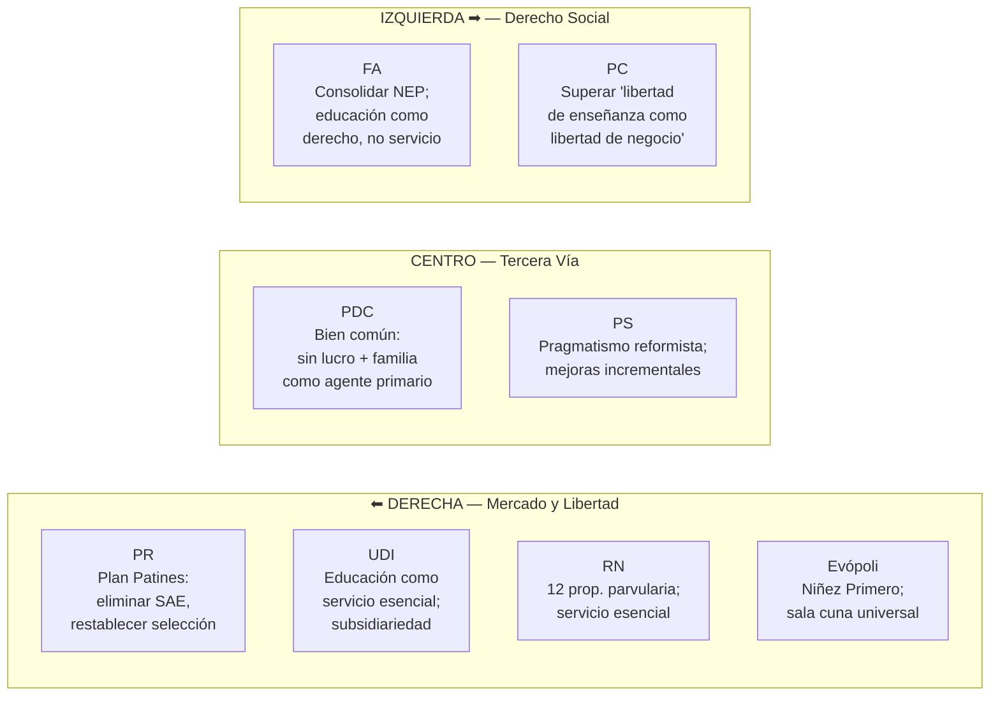

---
name: educacion_politica_chile
description: "Educación y política en Chile — debate ideológico, percepción ciudadana, dinámicas electorales 2017-2021 y polarización del campo educativo"
sources: [cowork]
aliases:
  - educación política Chile
  - campo de batalla educativo
  - opinión pública educación Chile
  - elecciones educación Chile
  - Boric Kast educación
tags:
  - actores
  - politica
  - ciudadania
---

# Educación y Política en Chile: El Campo de Batalla Ideológico

> Fuente: *Educación y Política en Chile* (docx, análisis de propuestas partidistas, percepción ciudadana y dinámicas electorales 2017-2021).

El sistema educativo chileno no es solo un conjunto de escuelas y recursos: es **el terreno donde se dirimen las visiones fundamentales sobre el Estado, el mercado y los derechos**. El "terremoto educacional" exacerbado por la pandemia COVID-19 aceleró la polarización de un campo que ya era ideológicamente fragmentado. La opinión pública está insatisfecha pero "desestructurada progresivamente" — las alineaciones partidarias son menos rígidas, pero los valores subyacentes (individualismo vs. colectivismo) siguen siendo los ejes de fractura.

---

## 1. El Espectro Ideológico en Educación

### Diferencia estructural entre bloques

| Eje | Derecha/Centroderecha | Centro | Izquierda |
|-----|----------------------|--------|-----------|
| Rol del Estado | Subsidiario | Complementario | Proveedor principal |
| Naturaleza educación | Servicio | Bien común | Derecho social |
| SAE | Eliminar o reformar | Mantener y mejorar | Consolidar y extender |
| Sector PS | Defender (libertad enseñanza) | Sin lucro con fondos públicos | Sin lucro, sin selección |
| Primera infancia | Sala cuna universal (mercado) | Media prioridad | Sala cuna universal (derecho) |

**Convergencia inesperada:** Evópoli (derecha liberal) y el FA (izquierda amplia) coinciden en la sala cuna universal — desde fundamentos opuestos: inversión en capital humano (TCH) vs. derecho social. Esta convergencia abre la única ventana de reforma consensuada en el corto plazo.

---

## 2. Percepción Ciudadana: Una Evaluación Demoledora

### 2.1 Evaluación de la Calidad

Los datos de encuesta muestran una de las percepciones más negativas del mundo respecto a la propia educación:

| Evaluación | % de chilenos |
|------------|:-------------:|
| Calidad "buena" | **15%** |
| Calidad "mala" | **49%** (Ipsos) / **37% "muy mala"** (Cadem) |
| "La educación actual es peor que cuando asistí" | **48%** |
| "La educación empeoró en la última década" | **46%** |

**Excepción:** la educación superior universitaria tiene percepción mucho más positiva (61%), a pesar de ser el nivel más costoso para las familias.

### 2.2 Problemas Identificados por la Ciudadanía

| Problema | % que lo menciona |
|----------|:-----------------:|
| Acceso desigual a la educación | **44%** |
| Violencia entre estudiantes / desgaste docente | Alta mención |
| Inasistencia grave y deserción | Alta mención |
| Delincuencia y narcotráfico | **32%** |
| Falta de preocupación de padres | **31%** |
| Desvalorización de educación por jóvenes | **28%** |
| Mala calidad de planes de estudio | **26%** |
| Administración municipal de colegios | **20%** |

**El dato revelador:** el 32% menciona la delincuencia y el narcotráfico como preocupación directa para la educación. Esto expresa que la escuela ya no es percibida como espacio protegido — es una institución porosa a los problemas del territorio.

### 2.3 La División Central: ¿Derecho o Servicio?

El documento identifica esta como la **"principal división ideológica en la educación chilena"**:

- **Educación como inversión (F3):** el sistema ha promovido una "matriz cultural individualista" donde cada familia es responsable de su trayectoria educativa
- **Educación como derecho social (F4):** el movimiento estudiantil de 2011 instaló la demanda de gratuidad, eliminación del lucro y rol estatal fuerte como agenda política central

**Evidencia de la tensión:** el 95% apoya fortalecer la educación pública (encuesta 2011), pero el 63% está de acuerdo con que los colegios seleccionen por méritos académicos. La misma ciudadanía que demanda igualdad acepta la selección — expresión de la tensión irresuelta entre F2 y F4.

### 2.4 Preferencias sobre Administración Escolar

| Administrador preferido | % |
|------------------------|:--:|
| Ministerio de Educación | **73%** |
| Municipios | **8%** |

La preferencia por administración centralizada (73% MINEDUC vs. 8% municipios) anticipa el apoyo potencial a los SLEP si logran diferenciarse de la gestión municipal. Es la legitimidad política que la NEP necesita pero todavía no ha ganado.

---

## 3. Dinámicas Electorales: La Educación como Clivaje

### 3.1 El Sistema Electoral y la Participación

Chile abandonó el voto obligatorio en 2009, produciendo una "caída vertiginosa" de la participación. El efecto fue la **sobrerrepresentación de electores de mayor NSE y escolaridad** en las urnas — sesgando el electorado hacia posiciones más conservadoras y consolidadas.

La reintroducción del voto obligatorio para gobernadores regionales (2024) señala una tendencia hacia mayor participación, lo que potencialmente favorece a los sectores más jóvenes y de menor NSE.

### 3.2 Elecciones Presidenciales 2017

| Candidato | Primera vuelta | Segunda vuelta |
|-----------|:--------------:|:--------------:|
| Sebastián Piñera (derecha) | 36,64% | **54,58%** ✓ |
| Alejandro Guillier (centroizquierda) | 22,70% | 45,42% |
| Beatriz Sánchez (FA, izquierda nueva) | **20,27%** | — |
| José Antonio Kast (extrema derecha) | **7,93%** | — |
| Participación | 46,7% | 49,02% |

**Señales estructurales de 2017:**
- El 20,27% de Sánchez (FA) reveló la emergencia de una izquierda post-concertación con base propia
- El 7,93% de Kast mostró el nacimiento visible de una corriente de extrema derecha
- El sistema de bloques tradicionales (Concertación/Chile Vamos) ya no capturaba el 100% de las preferencias

### 3.3 Elecciones Presidenciales 2021: La Ruptura

| Candidato | Primera vuelta | Segunda vuelta |
|-----------|:--------------:|:--------------:|
| José Antonio Kast (Republicanos) | **27,91%** | 44,13% |
| Gabriel Boric (FA+PC) | 25,83% | **55,87%** ✓ |
| Franco Parisi (Partido de la Gente) | **12,8%** | — |
| Participación | 47,33% | **55,64%** (pico histórico) |

**La educación como motor de la segunda vuelta:**
- La participación saltó del 47,33% al 55,64% — un pico histórico bajo voto voluntario
- Boric obtuvo la **mayor cantidad de votos en la historia del país**
- El movimiento estudiantil de 2011 se transformó en bloque electoral en 2021

**Análisis generacional:**
- Boric lideró significativamente en menores de 30 años (34%)
- Kast dominó en mayores de 50 años
- La brecha generacional en preferencias educativas se tradujo directamente en resultado electoral

**Análisis urbano/rural:**
- En primera vuelta 2021 y 2017: Kast lideró en comunas rurales y mixtas
- En segunda vuelta 2021: "cambio drástico" — Boric ganó en el 45% de las comunas rurales (vs. 14% en primera vuelta)
- Las zonas rurales **no son bastiones conservadores estáticos**: son "campos de disputa electoral que pueden ser movilizados por apelos nacionales"

**Fragmentación del electorado:** el 12,8% de Franco Parisi (Partido de la Gente, campaña desde EE.UU.) evidenció el deseo por "alternativas fuera de las coaliciones establecidas" — un votante que rechaza tanto la izquierda como la derecha tradicional.

---

## 4. Implicancias para la Política Educacional

### El Empate Estructural y sus Consecuencias

La fragmentación parlamentaria (~40 diputados independientes) y el empate ideológico entre bloques producen un escenario donde:

1. **Las reformas estructurales profundas son improbables** en el corto-mediano plazo
2. **Los cambios incrementales son el territorio de lo posible:** ajustes al SAE, ampliación SEP, mejoras de gestión SLEP
3. **La polarización es funcional para la movilización** pero disfuncional para la gobernanza educativa

### Lo que la Ciudadanía Quiere (pero No Obtiene)

La insatisfacción ciudadana no es ideológica: es pragmática. Los datos de percepción muestran que la ciudadanía quiere **calidad + equidad**, pero el sistema político le ofrece una elección entre **mercado** (derecha) y **Estado** (izquierda), sin que ninguna opción haya demostrado ser capaz de entregar ambas simultáneamente.

---

## 5. Lectura Teórica (Collins/Hopper)

**La politización de las funciones:** el debate político no es sobre pedagogía sino sobre qué función debe priorizar el sistema:
- **Derecha:** F3 (formación para el mercado) + F1 (socialización en valores de libertad y mérito)
- **Centro:** equilibrio F3 + F4, con regulación del cuasimercado
- **Izquierda:** F4 (democratización) + desmantelamiento de F5 (reproducción de élites)

**La elección de 2021 como expresión de F4:** el pico de participación en la segunda vuelta 2021 y la victoria de Boric representan la irrupción electoral de los sectores que el sistema había excluido del cuasimercado educacional (los que van a escuelas públicas, los de NSE bajo, los jóvenes sin capital cultural heredado). El "terremoto educacional" no era solo pedagógico: era político.

**La paradoja del 63%:** el 63% que apoya la selección académica simultáneamente con el 95% que apoya fortalecer la educación pública expresa la tensión F2 vs F4 a nivel de opinión pública. La ciudadanía quiere mérito y equidad — la tensión central del sistema — [[fundamentos_politica_educacional]].

---

## 6. Conexiones

- [[propuestas_partidos_politicos_educacion]] — análisis detallado de propuestas por partido
- [[arbol_problemas_politica_educacional]] — diagnóstico que el debate político pretende resolver
- [[analisis_ocde_simce_chile]] — evidencia que interpela a todos los actores
- [[mercado_creacion_establecimientos]] — estructura de mercado que cada bloque quiere transformar o conservar
- [[fundamentos_politica_educacional]] — marcos teóricos detrás de las posiciones
- [[SLEP]] — disputa política central sobre la nueva institucionalidad pública
- [[presupuesto_educacional_chile]] — recursos que el debate político asigna
- [[cifras_sistema_educacional_chile]] — datos base del sistema que se debate
- [[MOC_Politica_Educacional]] — mapa central de la investigación
