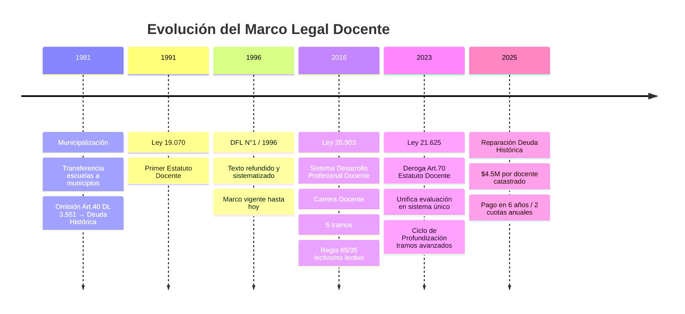
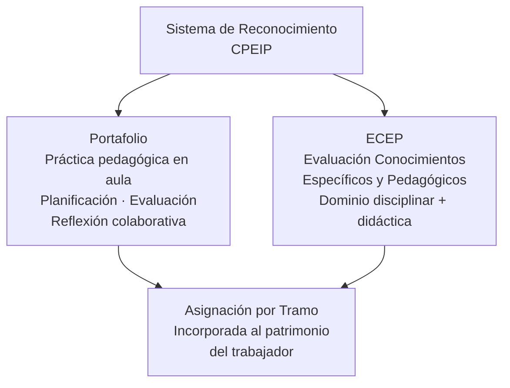
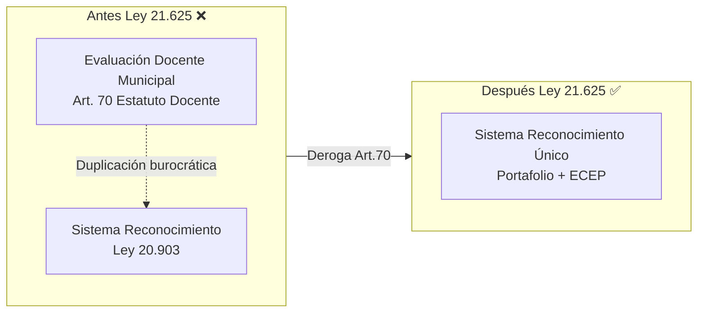
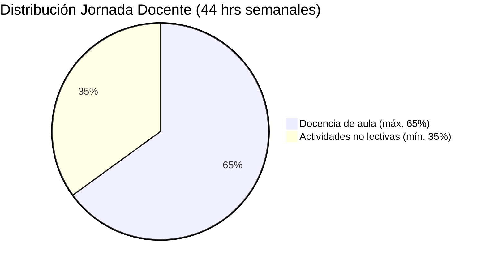
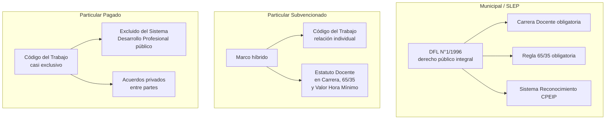
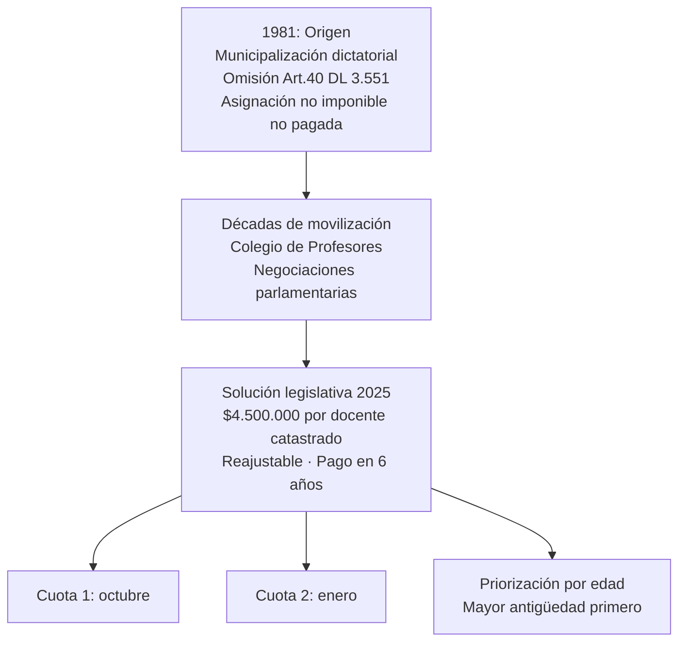

---
name: estatuto_docente_chile
description: "Estatuto Docente (DFL N°1/1996), Carrera Docente (Ley 20.903/2016) y Ley 21.625/2023. Régimen laboral, regla 65/35, tramos de desarrollo, deuda histórica y análisis comparativo por sector."
sources: [cowork]
aliases:
  - Estatuto Docente
  - DFL 1 1996 educación
  - Ley 19.070
  - Ley 20.903 carrera docente
  - Ley 21.625 evaluación docente
  - régimen laboral docentes Chile
tags: [docentes, institucional, legal, reforma, historia, gobernanza, 2026]
---

# Estatuto Docente y Carrera Profesional Docente en Chile

## Arquitectura Normativa: Tres Leyes Clave

---

## I. Fundamentos del Estatuto Docente (DFL N°1/1996)

### Ámbito de Aplicación

El DFL N°1 de 1996 regula a los profesionales que ejercen en:
- Educación parvularia con fondos públicos
- Educación básica y media
- Establecimientos municipales, SLEP y particular subvencionado

### Definiciones Jurídicas Clave

| Concepto | Definición legal |
|----------|-----------------|
| **Docencia de aula** | Acción personal directa, continua y sistemática en el proceso de enseñanza; máx. 45 min/hora pedagógica |
| **Actividades no lectivas** | Labores educativas complementarias: preparación, evaluación, desarrollo profesional, coordinación técnica |
| **Año laboral docente** | Primer día hábil del mes de inicio del año escolar → último día del mes anterior al siguiente ciclo |

### Principios Rectores

- Protección de integridad física, psicológica y moral del profesorado
- Fuero gremial para dirigentes de asociaciones docentes
- Participación técnica mediante Consejos de Profesores
- Requisitos habilitantes: ciudadanía, idoneidad de salud, no inhabilidad para funciones públicas, sin condenas penales relevantes

---

## II. Carrera Docente: Sistema de Desarrollo Profesional (Ley 20.903/2016)

### Los Cinco Tramos de Desarrollo

La progresión **no depende solo de años de servicio** (bienios tradicionales), sino de la combinación de:
- Años de trayectoria profesional
- Resultados en el Sistema de Reconocimiento (CPEIP)

### Instrumentos de Evaluación

### Inducción para Docentes Principiantes

- Acompañamiento por docente mentor (preferentemente tramos Avanzado, Experto I o II)
- Dedicación: 4–6 horas semanales dentro de la jornada contratada
- Asignación de inducción: **$81.054 mensual** por máximo 10 meses (financiado por MINEDUC)

---

## III. Ley 21.625/2023: Unificación del Sistema Evaluativo

### El Problema que Resolvió

### Ciclo de Profundización (tramos avanzados)

Para docentes en tramos **Avanzado, Experto I y Experto II**:
- Mantienen sus tramos consolidados
- Reevaluación cada **4 años** solo si desean renovar el componente fijo de la asignación o escalar al siguiente tramo
- La reevaluación es **voluntaria** para niveles avanzados

---

## IV. Regla 65/35: Distribución de la Jornada Laboral

### Principios de la Regla

- Aplica a municipales, SLEP y particular subvencionado
- Para contratos inferiores a 44 hrs: se aplica proporcionalmente
- Las horas de recreo y colación **no se contabilizan** en la proporción
- Límite **irrenunciable**: el empleador no puede asignar más del 65% lectivo, ni con consentimiento del docente (CGR Dictamen N°34.833/2013)
- Tope multiempleador: la suma de contratos con distintos sostenedores no puede superar **44 hrs cronológicas semanales**

### Uso del 35% No Lectivo

Las horas no lectivas deben reservarse para planificación individual, evaluación de aprendizajes y reflexión colaborativa entre pares, dentro del marco del PEI y PME. Deben cumplirse preferentemente en el establecimiento (CGR Dictamen N°27.854/2016).

---

## V. Régimen Legal por Sector de Dependencia

> **Consecuencia**: La coexistencia de tres estatutos laborales genera asimetrías que impactan la equidad del sistema escolar.

---

## VI. Deuda Histórica: Origen, Conflicto y Reparación

---

## VII. Desafíos Sistémicos

| Problema | Descripción | Estado |
|----------|-------------|--------|
| **Agobio laboral** | Sobrecarga burocrática: portafolios, gestión clima escolar, interferencias al 35% no lectivo | Parcialmente mitigado por Ley 21.625 |
| **Matrícula pedagogía a la baja** | Déficit proyectado de docentes idóneos; alto n° estudiantes/profesor vs. OCDE | Sin solución estructural |
| **Duplicidad evaluativa** | Evaluación Docente municipal + Sistema Reconocimiento = doble carga | Resuelto por Ley 21.625 (deroga Art.70) |
| **Deuda Histórica** | Remuneraciones y jubilaciones menoscabadas desde 1981 | Reparación legislativa en curso (2025+) |
| **Asimetría sectorial** | Tres regímenes laborales distintos según sostenedor | Persistente; sin reforma integral |

---

## VIII. Interpretación Teórica: Collins y Hopper

| Función | Manifestación en el Estatuto Docente |
|---------|-------------------------------------|
| **F1 Socialización** | El docente como agente central de transmisión de valores; el Estatuto protege su integridad y autonomía técnica |
| **F2 Selección meritocrática** | Carrera Docente por tramos basada en mérito y evaluación; ECEP como filtro disciplinar |
| **F3 Formación para mercado** | El 35% no lectivo como espacio para planificación técnica; la EMTP requiere docentes especializados en áreas laborales |
| **F4 Democratización** | Consejos de Profesores, fuero gremial, inducción como mecanismos de participación y acceso a la profesión |
| **F5 Reproducción de élites** | La asimetría entre sector pagado (Código del Trabajo libre) y público (Estatuto regulado) reproduce diferencias de condición laboral que se trasladan a calidad de enseñanza |

> **Lectura crítica (Bourdieu)**: El Estatuto Docente es un campo de luchas por la definición del "buen docente". La Carrera por tramos introduce lógica de capital cultural institucionalizado (certificaciones, portafolios), mientras el agobio laboral revela que el campo escolar distribuye desigualmente las condiciones para que los docentes acumulen ese capital.

---

## IX. Preguntas de Investigación

1. ¿En qué medida la Ley 21.625 redujo efectivamente el agobio laboral docente o solo desplazó la carga burocrática hacia otros instrumentos?
2. ¿El Sistema de Desarrollo Profesional Docente (tramos) ha generado trayectorias diferenciadas por tipo de establecimiento (municipal vs. particular subvencionado)?
3. ¿Cómo afecta la exclusión del sector particular pagado del Sistema de Reconocimiento a la calidad docente comparada entre dependencias?
4. ¿La reparación de la Deuda Histórica ($4.5M por docente) es percibida por el magisterio como suficiente o como un reconocimiento simbólico insuficiente?
5. ¿Qué impacto ha tenido la caída de matrícula en pedagogías sobre la distribución territorial del déficit docente (zonas rurales, regiones extremas)?

---

## Referencias y Vínculos

- [[compendio_normativa_educacional_chile]]
- [[demandas_actores_sociales_educacion]]
- [[opinion_publica_educacion_chile]]
- [[modelos_gobernanza_educacional]]
- [[linea_tiempo_politica_educacional_chile]]
- [[MOC_Politica_Educacional]]

**Fuentes primarias**: DFL N°1/1996 (texto refundido Ley 19.070); Ley 20.903 (DO 01/04/2016); Ley 21.625 (DO 2023); CGR Dictámenes N°27.854/2016 y N°34.833/2013; CPEIP orientaciones Carrera Docente; MINEDUC Solución Deuda Histórica.
