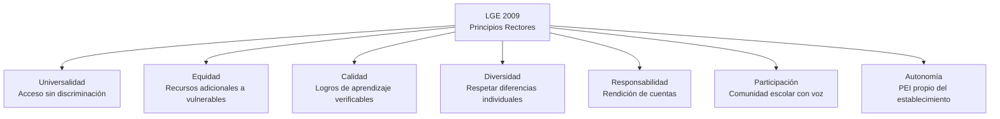
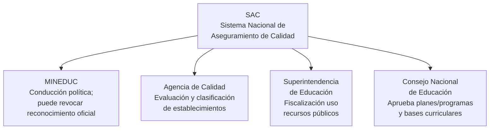
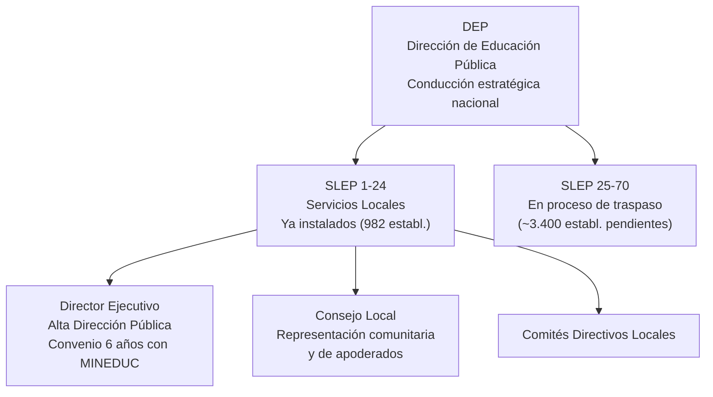

---
name: estructura_legal_sistema_educacional
description: "Marco legal e institucional del sistema educacional chileno — LGE, Ley Inclusión, SAC, SEP, NEP/SLEP, Carrera Docente, Ley ES — análisis crítico de tensiones normativas"
sources: [cowork]
aliases:
  - estructura legal educación Chile
  - marco normativo educacional
  - LGE LOCE Chile
  - Ley Inclusión Escolar
  - SAC aseguramiento calidad
  - Carrera Docente ley
  - Ley 21091 educación superior
tags:
  - institucional
  - legal
  - normativa
---

# Estructura Legal e Institucional del Sistema Educacional Chileno

> Fuente: *Estructura Legal, Normativa e Institucional del Sistema Educacional Chileno* (docx, análisis crítico de leyes y reformas).

La arquitectura jurídica del sistema educativo chileno ha migrado en las últimas dos décadas de un **modelo de mercado descentralizado** (consolidado en la LOCE de 1990) hacia un **esquema de provisión pública regulada, inclusiva y con aseguramiento de calidad**. Este andamiaje es el resultado de cuatro grandes reformas legislativas superpuestas: LGE (2009), SAC (2011), Ley de Inclusión (2015), NEP (2017) y Carrera Docente (2016). Cada reforma ataca una dimensión del problema, pero su superposición crea tensiones operativas que el sistema todavía no ha resuelto.

---

## 1. El Marco General: LGE 2009

**Ley N° 20.370 (2009):** derogó la LOCE en lo escolar y redefinió los derechos, deberes y obligaciones de todos los actores.

### Sostenedores bajo la LGE

| Tipo de sostenedor | Regulación |
|-------------------|-----------|
| **Estatal** | Solo SLEP y JUNJI reconocidos como sostenedores públicos |
| **Privado** | Persona jurídica con **objeto social único**: la educación |
| **Traspaso de calidad** | Requiere nueva solicitud de reconocimiento oficial |

La exigencia de "objeto social único" eliminó a los sostenedores privados con actividades múltiples (empresas con colegios). En conjunto con la Ley de Inclusión, forzó la transformación del sector PS.

### Principios Rectores del Sistema Escolar

Los principios normativos de cumplimiento obligatorio consagrados en la LGE definen el horizonte axiológico del sistema:

---

## 2. Ley de Inclusión 2015: La Desmercantilización del Aula

**Ley N° 20.845 (2015):** atacó los tres pilares del modelo de mercado educativo mediante **tres mandatos prohibitivos**:

| Mandato | Mecanismo prohibido | Efecto |
|---------|--------------------|----|
| **Fin del copago** | Financiamiento Compartido (FICOM) | Gratuidad para todas las familias en PS |
| **Prohibición del lucro** | Excedentes en establecimientos con fondos públicos | PS deben ser corporaciones sin fines de lucro |
| **Fin de la selección** | Admisión directa familia-establecimiento | SAE reemplaza con algoritmo centralizado |

### El SAE: Un Algoritmo contra la Segregación

El **Sistema de Admisión Escolar** usa el algoritmo de Gale-Shapley (aceptación diferida) para asignar estudiantes sin que los establecimientos puedan seleccionar directamente. Excepción regulada: establecimientos de "especial o alta exigencia académica" pueden seleccionar si demuestran trayectoria de excelencia y certifican continuamente ante MINEDUC.

**Tensión:** el SAE elimina la selección directa, pero las familias con mayor capital cultural (información, tiempo, redes) usan el SAE de forma más sofisticada, reproduciendo parte de la segregación por vías indirectas — [[arbol_problemas_politica_educacional]].

### Consecuencias Estructurales

- PS obligados a transformarse en corporaciones sin fines de lucro
- Sanciones severas por desvíos de recursos o uso del cargo para ventajas indebidas
- Inhabilidades absolutas y perpetuas para personas condenadas por delitos con menores
- Requiere acreditar "demanda insatisfecha" para abrir nuevos PS → el **78% de las comunas no cumple** este requisito — [[mercado_creacion_establecimientos]]

---

## 3. El SAC: Sistema Nacional de Aseguramiento de la Calidad

**Ley N° 20.529 (2011):** creó el andamiaje institucional para evaluar, orientar y fiscalizar la calidad del sistema escolar.

### Los Cuatro Organismos del SAC

### La Clasificación de Establecimientos

La Agencia clasifica establecimientos según:
- Gestión pedagógica
- Liderazgo técnico
- Convivencia escolar
- Resultados académicos (SIMCE, tasas de egreso)

**Categoría "Desempeño Insuficiente":** si un establecimiento se mantiene en esta categoría de forma reiterada y no mejora, el MINEDUC está **facultado para revocar el reconocimiento oficial** → cierre del establecimiento y reubicación de estudiantes.

**Tensión crítica:** el sistema sanciona con cierre a las comunidades que no logran absorber la ayuda técnica en los plazos fijados por ley. En territorios vulnerables con escasa oferta alternativa, el cierre de la única escuela disponible vulnera el derecho a la educación que la ley pretende garantizar.

---

## 4. La SEP: Subvención Escolar Preferencial como Discriminación Positiva

**Ley N° 20.248 (2008):** reconoce que educar en vulnerabilidad cuesta más mediante un esquema contractual:

### Tipos de Beneficiarios SEP

| Tipo | Definición | Monto |
|------|-----------|-------|
| **Alumno prioritario** | Hogares con dificultades socioeconómicas; Chile Solidario; tercio más vulnerable; NNA sujetos de SENAME → automático por ley | 100% valor SEP |
| **Alumno preferente** | 60% menores ingresos que no califican como prioritarios | **50%** del valor SEP |
| **Subvención por concentración** | Establecimientos con alta densidad de alumnos prioritarios | Monto adicional por proporción |

### Obligaciones del Convenio SEP

El sostenedor firma el **Convenio de Igualdad de Oportunidades y Excelencia Educativa** y asume:
- Exención de cobro a alumnos prioritarios
- Limitación de repitencia (máximo 1 vez por curso en básica)
- **100% de recursos SEP → Plan de Mejoramiento Educativo (PME)**

### El PME y las ATE

El PME debe estructurar acciones en 4 áreas:
1. Gestión del Currículum
2. Liderazgo Escolar
3. Convivencia Escolar
4. Gestión de Recursos

Las escuelas pueden contratar **Asistencias Técnicas Educativas (ATE)** del registro MINEDUC para diseñar e implementar PME. Las ATE deben trabajar presencialmente en la comunidad escolar para transferir capacidades sostenibles.

---

## 5. La Tensión Curricular: El Ciclo 6+6 Postergado

La LGE 2009 ordenó reducir básica a 6 años y ampliar media a 6 años (4 formación general + 2 diferenciada). Vigencia original: 2018. Postergada hasta **2027** por dos brechas estructurales:

### Déficit de Especialización Docente

- El cambio exige que 7° y 8° básico sean impartidos por profesores de educación media (especialistas)
- Diagnóstico MINEDUC: **~40% de los docentes activos** en esos niveles (~25.160 profesionales) carecía de la especialización requerida
- Requirió programas estatales de nivelación antes de implementar

### Brecha de Infraestructura Física

- Los establecimientos estaban diseñados para ciclos de 8 básicos o 4 medios
- El cambio exige ampliar liceos (reciben 2 cohortes nuevas) y reducir escuelas básicas (pierden 2 cohortes)
- **Más de 4.210 establecimientos** requieren intervención física y arquitectónica en todo el país

**Lección:** las reformas curriculares de papel suponen capacidades instaladas que el sistema no tiene. La postergación de 9 años (2018→2027) es la medida del gap entre diseño legislativo y capacidad operativa real.

---

## 6. La Nueva Educación Pública: Ley 21.040 (2017)

**Ley N° 21.040:** reemplaza municipios por 70 SLEP como administradores de la educación pública.

### Arquitectura Institucional

### Las Fallas del Proceso de Traspaso

| Falla | Descripción | Consecuencia |
|-------|------------|--------------|
| **Traspaso de pasivos** | Municipios transfirieron deudas previsionales + deudas con proveedores + infraestructura abandonada | SLEP heredaron problemas de financiamiento que limitaron capacidad inicial |
| **Rigidez de la gestión estatal** | La centralización del gasto ralentizó decisiones cotidianas (adquisiciones, reemplazos docentes) | Cuellos de botella que afectaron continuidad del año escolar |
| **Estándares evaluativos centralizados** | Carrera Docente exige desvinculación por bajo desempeño, pero SLEP en zonas remotas no pueden atraer reemplazos | Riesgo de desabastecimiento docente en comunas extremas |

---

## 7. Carrera Docente: Ley N° 20.903 (2016)

**Ley N° 20.903:** vincula el ejercicio docente en establecimientos con fondos públicos a una **carrera estructurada en tramos** evaluada externamente.

### Los 5 Tramos + Tramo Transitorio

| Tramo | Requisito de ingreso | Monto adicional aproximado |
|-------|---------------------|---------------------------|
| Transitorio | Ingreso al sistema sin evaluación previa | Base |
| **Inicial** | ≤4 años experiencia | Base + incremento |
| **Temprano** | >4 años + portafolio + ECEP | Significativo |
| **Avanzado** | Portafolio A o ECEP A + experiencia | Mayor |
| **Experto I** | Portafolio A + ECEP A + trayectoria | Alto |
| **Experto II** | Máximo reconocimiento | Máximo |

### Instrumentos de Evaluación

| Instrumento | Qué mide | Calificación |
|-------------|---------|:------------:|
| **Portafolio** | Desempeño pedagógico en aula, planificación, evaluación de aprendizajes, práctica reflexiva | A (máx) → E (mín) |
| **ECEP** | Dominio conceptual de la disciplina y didáctica asociada | A (máx) → D (mín) |

La **combinación cruzada** de ambos instrumentos determina el tramo máximo alcanzable.

### Consecuencias de No Progresar

- **Tramo Inicial:** docente obligado a participar en reconocimiento; si no avanza en **2 procesos consecutivos** → **desvinculación del sistema público**
- **Tramo Temprano (desde 2025):** 2 procesos para avanzar al Avanzado; si fracasa → **exclusión 2 años**, reingreso en Inicial, plazo perentorio de 2 años para ascender

**Tensión con NEP/SLEP:** en comunas rurales y zonas extremas, la desvinculación obligatoria de docentes de bajos tramos vacía establecimientos que los SLEP en régimen de instalación no pueden reponer.

---

## 8. Educación Superior: Ley N° 21.091 (2018)

**Ley N° 21.091:** define la ES como "derecho de provisión mixta orientado al bien público", acceso por mérito sin discriminación arbitraria.

### Sistema de Aseguramiento de Calidad ES

| Organismo | Función |
|-----------|---------|
| Subsecretaría de Educación Superior | Supervisión y fiscalización |
| Superintendencia de ES | Control financiero |
| **CNA (Comisión Nacional de Acreditación)** | Control de calidad; evaluación institucional obligatoria |

### Acreditación Obligatoria

La acreditación pasó de **voluntaria → obligatoria** para todas las IES autónomas. Dimensiones evaluadas: procesos, recursos, resultados, mecanismos internos de aseguramiento.

**Exclusividad en pedagogías:** los programas de formación docente solo pueden ser dictados por universidades autónomas **acreditadas**. Plazo fatal de 2 años para acreditar tras lograr autonomía.

**Obligación de publicidad:** las IES deben informar en toda publicidad su estado, nivel y años de acreditación, y si cuentan con certificación en investigación.

### Gratuidad Universitaria: El Hito Político

El **60% de menores ingresos** queda exento de arancel y matrícula en carreras presenciales dentro de la duración nominal. Condiciones para que las IES se adscriban:

| Tipo de institución | Requisito principal |
|--------------------|--------------------|
| Universidades del CRUCH | Cumplir requisitos base + acreditación |
| IP y CFT estatales | Cumplir requisitos base |
| IES privadas | Ser personas jurídicas sin fines de lucro + otros requisitos |

**Control de precios:** las IES adscritas no pueden fijar aranceles libremente → **Aranceles Regulados** fijados por Subsecretaría (revisados por Comisión de Expertos). La Subsecretaría también limita el número de vacantes por institución.

---

## 9. Las Tensiones de la Superposición Normativa

La coexistencia de reformas sucesivas genera tres tensiones sistémicas de alta complejidad:

### Tensión 1: Calidad vs. Control de Aranceles (ES)

- La acreditación de excelencia exige aumentar investigación, innovación y doctorados → requiere inversión creciente
- La gratuidad fija los aranceles regulados → limita flexibilidad de financiamiento
- **Riesgo:** desincentivo a la inversión en investigación avanzada en universidades privadas sin aportes directos → estratificación de calidad universitaria

### Tensión 2: Ecosistema Sancionatorio Escolar (SEP + SAC)

- Escuelas en "Desempeño Insuficiente" reciben SEP con obligación de PME + ATE
- Si fracasan 4 años consecutivos → SAC revoca reconocimiento oficial → **cierre**
- **Paradoja:** el sistema castiga con desaparición administrativa a comunidades que no logran absorber la ayuda en los plazos legales, en territorios vulnerables con escasa oferta alternativa

### Tensión 3: NEP + Carrera Docente (SLEP + Ley 20.903)

- Los SLEP en zonas extremas tienen dificultad estructural para atraer docentes calificados
- La Carrera Docente exige desvinculación de docentes que no progresan en tramos
- **Riesgo:** desvinculaciones obligatorias en escuelas periféricas que el SLEP no puede reponer → cierre de facto de establecimientos por desabastecimiento de personal

---

## 10. Lectura Teórica (Collins/Hopper)

**La ley como F4 con límites estructurales:** las reformas 2009-2018 constituyen el mayor intento legislativo de F4 (democratización) desde la Reforma Educacional de 1965. La prohibición del lucro, la eliminación del copago, el SAE, la gratuidad universitaria y el SAC son todos mecanismos que intentan reorientar el sistema desde F5 (reproducción de élites) hacia F4.

**El SAC como F2 institucionalizado:** el sistema de clasificación y sanción de establecimientos opera bajo la lógica de F2 (selección meritocrática): los establecimientos que no demuestran resultados son eliminados. Pero F2 aplicado a instituciones en contextos de alta vulnerabilidad produce clausura de F4: cuando los "perdedores" del sistema son escuelas que atienden a los más excluidos, el mecanismo meritocrático profundiza la desigualdad.

**La Carrera Docente como F1+F3:** la evaluación docente externa y la carrera por tramos expresan simultáneamente F1 (fortalecer la calidad de la transmisión cultural) y F3 (hacer al docente más profesional y productivo). La tensión con el territorio (zonas extremas sin reemplazos disponibles) muestra que F3 aplicado en contextos de escasez produce exclusión de servicio.

**La pregunta sin respuesta:** ¿puede un andamiaje legal sofisticado (alto control estatal, sanciones fuertes, evaluación rigurosa) producir equidad en un sistema cuya segregación tiene raíces en el mercado de vivienda, el capital cultural familiar y la geografía? Las tensiones normativas identificadas sugieren que **la ley sola no reemplaza las condiciones materiales** que el derecho a la educación requiere — [[arbol_problemas_politica_educacional]].

---

## 11. Conexiones

- [[arbol_problemas_politica_educacional]] — las causas estructurales que este marco legal intenta corregir
- [[mercado_creacion_establecimientos]] — impacto de Ley Inclusión en el mercado de establecimientos
- [[SLEP]] — la nueva institucionalidad bajo Ley 21.040
- [[sistema_voucher_financiamiento]] — el mecanismo de subvención que estas leyes regulan
- [[analisis_ocde_simce_chile]] — resultados del sistema que el SAC evalúa
- [[propuestas_partidos_politicos_educacion]] — debate político sobre si estas leyes deben reformarse
- [[fundamentos_politica_educacional]] — historia jurídico-política que precede este marco
- [[cifras_sistema_educacional_chile]] — el sistema en cifras que estas leyes gobiernan
- [[MOC_Politica_Educacional]] — mapa central de la investigación
