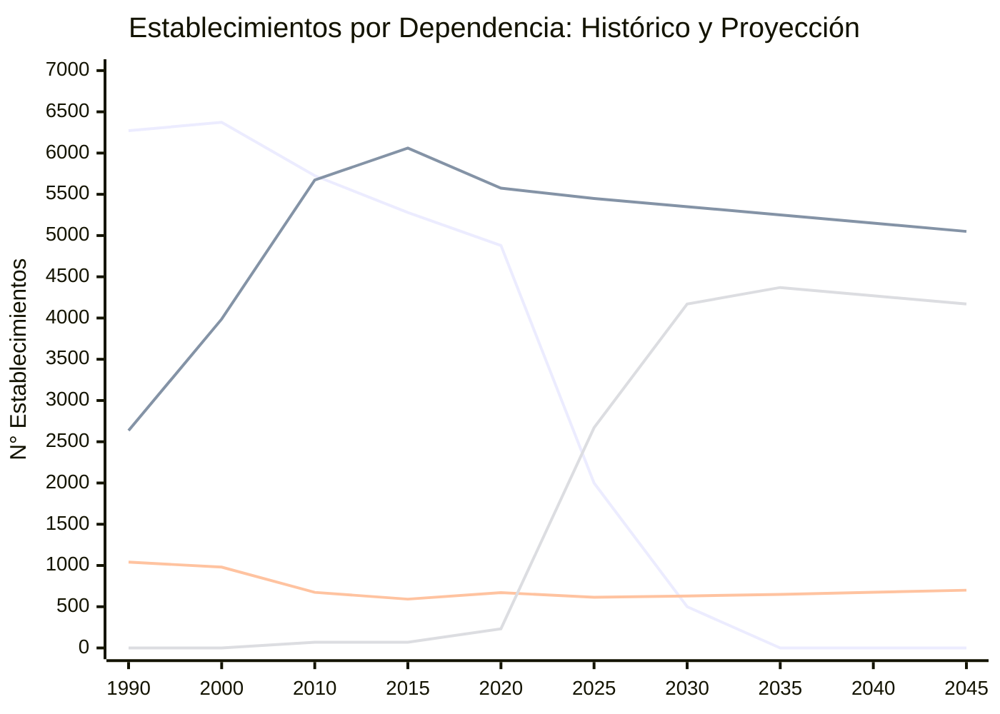
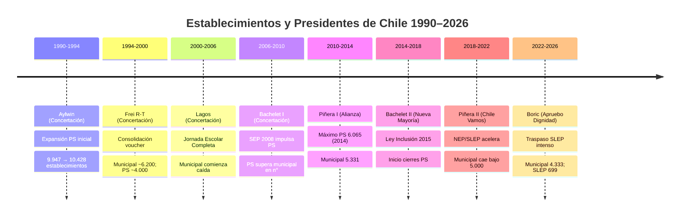

---
name: evolucion_establecimientos_educacionales
description: "Evolución histórica y proyección 2025-2045 del número de establecimientos educacionales en Chile por dependencia (municipal, PS, PP, SLEP/CAD)"
sources: [cowork]
aliases:
  - establecimientos educacionales Chile
  - evolución establecimientos
  - mercado escolar establecimientos
  - cierre establecimientos
tags:
  - evidencia
  - establecimientos
  - historia
---

# Evolución de Establecimientos Educacionales en Chile (1990–2045)

## 1. Serie Histórica por Dependencia (1990–2023)

Los datos más confiables disponibles (Mineduc/CNED) muestran la siguiente trayectoria:

| Año  | Municipal | Part. Subv. | Part. Pagado | SLEP/CAD | Total   |
|------|-----------|-------------|--------------|----------|---------|
| 1990 | 6.271     | 2.635       | 1.041        | —        | 9.947   |
| 1995 | 6.274     | 3.142       | 1.012        | —        | 10.428  |
| 2000 | 6.373     | 3.987       | 980          | —        | 11.340  |
| 2004 | 6.095     | 4.269       | 860          | 65       | 11.289  |
| 2005 | 6.098     | 4.630       | 763          | 70       | 11.561  |
| 2010 | 5.726     | 5.674       | 674          | 70       | 12.144  |
| 2013 | 5.425     | 6.017       | 602          | 70       | 12.114  |
| 2015 | 5.279     | 6.060       | 592          | 70       | 12.001  |
| 2018 | 5.196     | 5.866       | 617          | 70       | 11.749  |
| 2019 | 4.925     | 5.599       | 678          | 236      | 11.451  |
| 2020 | 4.879     | 5.575       | 670          | 233      | 11.342  |
| 2022 | 4.670     | 5.480       | 626          | 401      | 11.123  |
| 2023 | 4.333     | 5.480       | 611          | 699      | 11.123  |

> Nota: A partir de 2018 los establecimientos municipales se transfieren gradualmente a [[SLEP]] (Servicios Locales de Educación Pública). Los 699 establecimientos SLEP/CAD de 2023 incluyen 629 SLEP + 70 CAD (DL 3166).

**Tendencias de largo plazo:**
- Municipal: 6.271 (1990) → 4.333 (2023), caída del **31%**
- Part. Subvencionado: 2.635 (1990) → 5.480 (2023), crecimiento del **108%**
- Part. Pagado: 1.041 (1990) → 961 (2023), caída del **8%**

En términos de participación:
- Municipal pasó del **63%** al **39%** del total
- Particular Subvencionado pasó del **26%** al **49%** del total
- Particular Pagado se mantuvo estable en torno al **9%**

---

## 2. Datos Detallados 2004–2023 (por año)

Serie completa extraída del análisis de mercado (Análisis mercado proyección creación colegios Chile):

| Año  | Municipal | Part. Subv. | Part. Pagado | SLEP/CAD | Total   |
|------|-----------|-------------|--------------|----------|---------|
| 2004 | 6.095     | 4.269       | 860          | 65       | 11.289  |
| 2005 | 6.098     | 4.630       | 763          | 70       | 11.561  |
| 2006 | 5.971     | 4.891       | 733          | 70       | 11.665  |
| 2007 | 5.908     | 5.044       | 728          | 70       | 11.750  |
| 2008 | 5.845     | 5.252       | 727          | 70       | 11.894  |
| 2009 | 5.811     | 5.545       | 671          | 70       | 12.097  |
| 2010 | 5.726     | 5.674       | 674          | 70       | 12.144  |
| 2011 | 5.580     | 5.756       | 657          | 70       | 12.063  |
| 2012 | 5.514     | 5.965       | 625          | 70       | 12.174  |
| 2013 | 5.425     | 6.017       | 602          | 70       | 12.114  |
| 2014 | 5.331     | 6.065       | 595          | 70       | 12.061  |
| 2015 | 5.279     | 6.060       | 592          | 70       | 12.001  |
| 2016 | 5.234     | 5.950       | 604          | 70       | 11.858  |
| 2017 | 5.196     | 5.866       | 617          | 70       | 11.749  |
| 2018 | 5.196     | 5.866       | 617          | 70       | 11.749  |
| 2019 | 4.925     | 5.599       | 678          | 236      | 11.451  |
| 2020 | 4.879     | 5.575       | 670          | 233      | 11.342  |
| 2022 | 4.670     | 5.480       | 626          | 401      | 11.123  |
| 2023 | 4.333     | 5.480       | 611          | 699      | 11.123  |

---

## 3. Hitos de Política y sus Efectos sobre los Establecimientos

### 3.1 SEP 2008 (Subvención Escolar Preferencial)

La [[SEP]] entró en vigencia en 2008 e impulsó el crecimiento del sector [[educacion_particular_subvencionada|Particular Subvencionado]]:

- Introdujo financiamiento diferenciado para alumnos prioritarios
- Incentivó a sostenedores PS a absorber matrícula vulnerable previamente concentrada en el sector municipal
- El PS creció de 5.252 establecimientos (2008) a 6.017 (2013), ganando 765 establecimientos en 5 años

### 3.2 Ley de Inclusión 2015 (Ley 20.845)

La [[Ley_20845|Ley de Inclusión]] produjo el quiebre estructural más significativo del período:

- Eliminó el lucro, la selección escolar y el copago en establecimientos subvencionados
- **64% de los cierres de establecimientos entre 2016 y 2023 correspondieron al sector PS**
- El PS pasó de su máximo histórico (6.065 establecimientos en 2014) a 5.480 en 2023, perdiendo 585 establecimientos (-10%)
- Los establecimientos PP que tenían copago y buscaban subvención estatal debieron reorientarse
- **78% de las comunas del país no pueden recibir nuevos establecimientos PS** por no tener "demanda insatisfecha" según el criterio legal vigente

### 3.3 NEP/SLEP 2017 (Ley 21.040 — Nueva Educación Pública)

La [[Ley_21040|Ley de Nueva Educación Pública]] inició la transferencia gradual de establecimientos municipales a [[SLEP]]:

- Al año 2024: 24 SLEP administran **982 establecimientos** (de los ~70 planificados originalmente se expandió)
- El traspaso es gradual: en 2019 ya había 236 establecimientos bajo SLEP/CAD vs. 70 anteriores
- La caída de municipales de 5.196 (2018) a 4.333 (2023) refleja principalmente el traspaso a SLEP, no cierres netos

---

## 4. Proyecciones 2025–2045

### 4.1 Tabla de Proyección

| Año  | Municipal | SLEP/CAD | Part. Subv. | Part. Pagado | Total    |
|------|-----------|----------|-------------|--------------|----------|
| 2025 | 2.000     | 2.670    | 5.450       | 615          | 10.735   |
| 2030 | 500       | 4.170    | 5.350       | 630          | 10.650   |
| 2035 | 0         | 4.370    | 5.250       | 650          | 10.270   |
| 2040 | 0         | 4.270    | 5.150       | 675          | 10.095   |
| 2045 | 0         | 4.170    | 5.050       | 700          | 9.920    |

> Proyección base extraída del análisis de mercado (rango optimista 10.500–10.800, rango pesimista ~9.500)

### 4.2 Supuestos clave de la proyección

1. **Desaparición del sector Municipal**: Para 2035 la transferencia a SLEP se completará; los municipales desaparecen como categoría
2. **SLEP consolida el sector público**: Con 4.100–4.400 establecimientos, se mantiene como el segundo sector
3. **PS se estabiliza a la baja**: Presión demográfica reduce la matrícula disponible; algunos establecimientos PS pequeños no sobrevivirán
4. **PP crece marginalmente**: Recuperación de 611 a ~700 establecimientos, vinculada a demanda de familias de altos ingresos

### 4.3 Diagrama de tendencias proyectadas

*(líneas: Municipal / PS / PP / SLEP-CAD)*

---

## 5. Períodos Presidenciales y Política de Establecimientos

La siguiente periodización muestra el contexto político de cada hito:

---

## 6. Análisis de Mercado: Demanda Concentrada y Restricciones de Entrada

### 6.1 Concentración de la demanda

El análisis de mercado identifica un fenómeno de alta concentración:

- **El 10% de los establecimientos en el SAE concentra el 90% de la demanda neta** (familias que prefieren activamente esos colegios)
- Ese 10% está formado en su mayoría por PS (90%) y colegios que antes cobraban copago (60%)
- Esto crea un mercado dual: colegios "de alta demanda" con listas de espera, y colegios "de baja demanda" con riesgo de cierre

### 6.2 Restricciones para nuevas aperturas

- **78% de las comunas** no pueden recibir nuevos establecimientos PS bajo los criterios de la Ley de Inclusión (falta de "demanda insatisfecha")
- Las comunas donde sí es posible abrir son principalmente periféricas, rurales o de alta inmigración reciente
- Los nichos identificados con posibilidad real de apertura:
  - **STEAM** (ciencias, tecnología, ingeniería, matemáticas)
  - **Bilingüe/IB** (International Baccalaureate)
  - **NEE especializado** (Necesidades Educativas Especiales)
  - **TP pertinente** (Técnico-Profesional con vinculación laboral local)
  - **Intercultural/Indígena** (especialmente mapuche)

### 6.3 Factor demográfico

La caída del [[TGF|Tasa Global de Fecundidad]] a **1,16 en 2023** (mínimo histórico) presiona la matrícula:

- Población 0-14 años: 3,73 millones (2020) → proyectada 3,24 millones (2050)
- La contracción demográfica reducirá la demanda escolar total, especialmente desde 2030

La inmigración compensa parcialmente:
- **7,4% de la matrícula total** en 2023 corresponde a estudiantes inmigrantes
- Crecimiento del **20,6% anual**
- **60% concentrado en enseñanza básica**
- Concentrado en el sector público y PS de menores ingresos

---

## 7. Lectura Teórica (Collins/Hopper)

Desde el marco de [[Collins_Hopper_Framework|Collins y Hopper]], la evolución de establecimientos en Chile ilustra:

**Función F2 (Selección meritocrática con estratificación):** La proliferación del PS hasta 2014 expresó la demanda de familias de clase media y alta por diferenciación escolar, creando una jerarquía informal de establecimientos que el [[SAE]] intenta regular pero no elimina. La concentración del 90% de la demanda en el 10% de los colegios es evidencia de **clausura social** operando dentro del sistema formalmente abierto.

**Función F3 (Credencial como bien posicional):** El crecimiento del PP desde 2018 (611 → proyectado 700 en 2045) refleja la demanda de las fracciones altas por **exclusividad credencial**: colegios que el SAE no alcanza y que mantienen sus redes de selección propias.

**Función F4 (Democratización e inclusión):** La Ley de Inclusión y la NEP representan el intento más ambicioso en décadas de reformar la lógica de mercado. Sus efectos son mixtos: los cierres de PS pequeños y la transferencia municipal a SLEP no han garantizado mejor calidad; la movilidad patrocinada del sector público sigue siendo limitada.

**Tensión F4 vs F5:** La concentración de la demanda en colegios "de marca" sugiere que la élite económica ha internalizado la educación privada (F5, reproducción social de élites) como condición estructural, haciendo de la reforma inclusiva un proyecto incompleto frente a la fuerza del mercado diferenciador.

---

## 8. Conexiones

- [[educacion_particular_subvencionada]] — sector que más ha crecido
- [[SLEP]] — institución que reemplaza al sector municipal
- [[Ley_20845]] — Ley de Inclusión, clave en los cierres 2016-2023
- [[Ley_21040]] — Nueva Educación Pública, crea los SLEP
- [[SAE]] — sistema de admisión que regula la demanda
- [[proyeccion_matricula_escolar]] — nota complementaria sobre evolución de matrícula
- [[TGF]] — factor demográfico que presiona la demanda futura
- [[SEP]] — política que impulsó el crecimiento PS 2008-2014
- [[Collins_Hopper_Framework]] — marco teórico interpretativo
