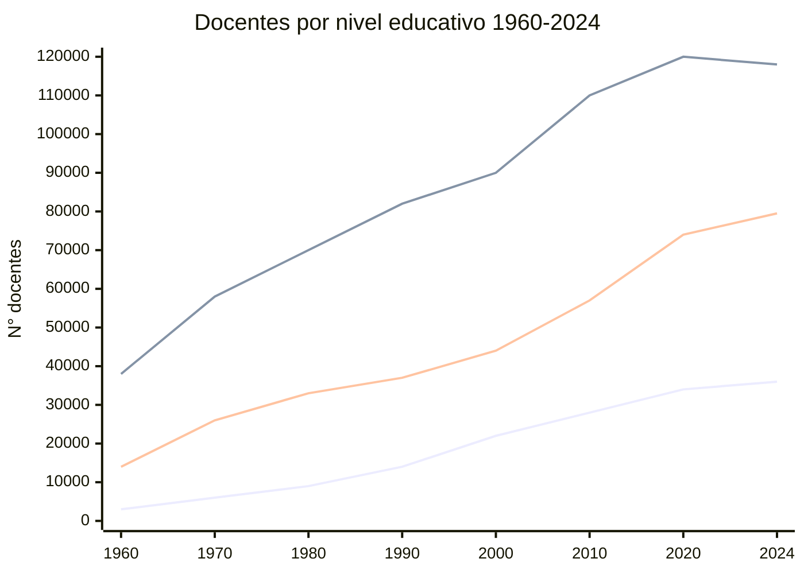

---
name: Evolución Número de Profesores Chile
description: "Serie histórica 1900-2024 de docentes por dependencia, nivel y área curricular"
sources: [cowork]
aliases: [historia docentes, evolución docentes, número profesores]
tags: [evidencia, docentes, historia]
---

# 📊 Evolución del Número de Profesores en Chile (1900–2024)

> Conecta con: [[MOC_Politica_Educacional]] · [[panorama_cuerpo_docente]] · [[banco_de_datos_educacion_chile]] · [[historia_curriculum_escolar_chile]]

---

## Total de docentes 1900–2024

| Año | Total | Sector Público | Subvencionado | Particular Pagado |
|-----|-------|---------------|---------------|-------------------|
| 1900 | 2.100 | 1.950 | — | 150 |
| 1910 | 4.500 | 4.100 | — | 400 |
| 1920 | 8.200 | 7.300 | — | 900 |
| 1930 | 14.500 | 12.500 | — | 2.000 |
| 1940 | 23.000 | 19.000 | — | 4.000 |
| 1950 | 36.000 | 29.000 | — | 7.000 |
| 1960 | 55.000 | 43.000 | — | 12.000 |
| 1970 | 90.000 | 74.000 | — | 16.000 |
| 1980 | 112.000 | 90.000 | 14.000 | 8.000 |
| 1990 | 133.000 | 78.000 | 40.000 | 15.000 |
| 2000 | 156.000 | 80.000 | 60.000 | 16.000 |
| 2010 | 195.000 | 88.000 | 87.000 | 20.000 |
| 2020 | 228.000 | 93.000 | 111.000 | 24.000 |
| 2024 | 233.500 | 95.000 | 113.000 | 25.500 |

> **Tendencia clave**: El sector público pasó de ser el 93% del total (1900) al 41% (2024). El sector subvencionado creció desde 0 (pre-1973) hasta representar el 48% del total en 2024 — reflejo directo de la [[Quiebre 1981|reforma de 1981]] (municipalización + voucher).

---

## Crecimiento por nivel educativo (1960–2024)

*Líneas: Parvularia · Básica · Media*

| Año | Parvularia | Básica | Media |
|-----|-----------|--------|-------|
| 1960 | 3.000 | 38.000 | 14.000 |
| 1970 | 6.000 | 58.000 | 26.000 |
| 1980 | 9.000 | 70.000 | 33.000 |
| 1990 | 14.000 | 82.000 | 37.000 |
| 2000 | 22.000 | 90.000 | 44.000 |
| 2010 | 28.000 | 110.000 | 57.000 |
| 2020 | 34.000 | 120.000 | 74.000 |
| 2024 | 36.000 | 118.000 | 79.500 |

---

## Educación Media: HC vs. Técnico-Profesional (1980–2024)

| Año | HC | TP | Ratio HC/TP |
|-----|----|----|-------------|
| 1980 | 24.500 | 7.000 | 3,5 : 1 |
| 1990 | 27.000 | 11.000 | 2,5 : 1 |
| 2000 | 33.000 | 15.000 | 2,2 : 1 |
| 2010 | 39.000 | 21.000 | 1,9 : 1 |
| 2020 | 42.000 | 24.000 | 1,8 : 1 |
| 2024 | 43.000 | 24.000 | 1,8 : 1 |

> La proporción HC/TP se estabilizó en ~2:1 desde los 2000. Ver [[Tensión F4 vs F5]] — la devaluación relativa del TP sigue siendo un nudo estructural.

---

## Docentes por área curricular (2024)

| Área | Docentes |
|------|---------|
| Lenguaje y Comunicación | 34.000 |
| Matemática | 32.000 |
| Técnico-Profesional | 28.000 |
| Ciencias Naturales | 27.500 |
| Historia y Ciencias Sociales | 25.000 |
| Inglés | 22.000 |
| Educación Física | 18.000 |
| Artes (Visual + Música) | 16.000 |
| Tecnología | 14.000 |
| Otras | 17.000 |
| **Total** | **233.500** |

> Las especialidades técnicas (28.000) superan a áreas como Historia (25.000) o Inglés (22.000), lo que contrasta con el déficit proyectado al 2030 en Tecnológica. Ver [[panorama_cuerpo_docente]].

---

## Lectura desde el marco teórico

- **1981**: la municipalización detiene el crecimiento del sector público mientras el subvencionado explota → [[Clausura_social]] al interior del mercado educativo
- **El aumento de 2.100 (1900) a 233.500 (2024)** (×111 en 124 años) refleja la expansión del sistema educativo chileno, pero la distribución sectorial reproduce [[Empate estructural]]
- **Déficit proyectado 2030** en especialidades clave (Tecnológica 80%, Filosofía 62%) es un cuello de botella para la [[Movilidad_patrocinada]]

---

## Vínculos

- [[MOC_Politica_Educacional]]
- [[panorama_cuerpo_docente]] — perfil actual 2020-2023
- [[banco_de_datos_educacion_chile]]
- [[historia_curriculum_escolar_chile]]
- [[Empate estructural]] · [[Clausura_social]] · [[Tensión F4 vs F5]]
- [[Movilidad_patrocinada]]
