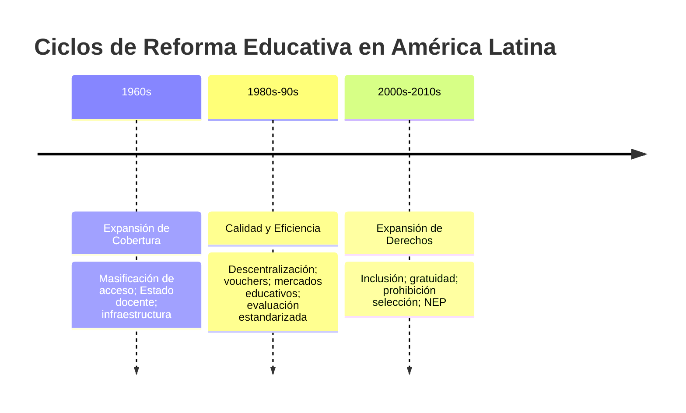
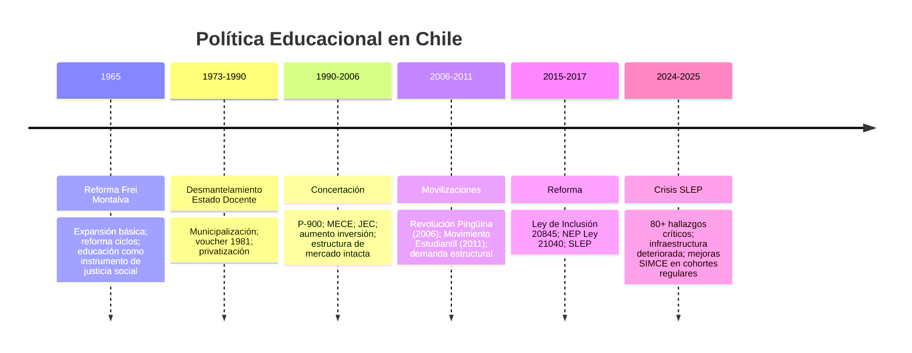

---
name: fundamentos_politica_educacional
description: "Fundamentos conceptuales, teóricos y actores de la política educacional; dualidad policy/politics, marcos sociológicos/económicos/pedagógicos, derecho vs libertad de enseñanza, ciclos de reforma en AL y Chile"
sources: [cowork]
aliases:
  - política educativa
  - fundamentos política educacional
  - principios educación
  - actores política educacional
  - derecho a la educación
  - libertad de enseñanza
tags:
  - conceptual
  - fundamentos
  - teoria
---

# Fundamentos de la Política Educacional

> Fuentes: *Fundamentos de la Política Educacional* (HTML x2), *Fundamentos de la Política Educacional creado con IA* (docx, 163K chars), *Fundamentos de política educacional* (docx, 84K chars), *Fundamentos Teóricos de Política Educacional* (docx, 26K chars).

---

## 1. Conceptualización: Policy vs. Politics

La política educacional presenta una **dualidad inherente** que es clave para su comprensión:

| Dimensión | Concepto | Expresión concreta |
|-----------|----------|--------------------|
| **Policy** | Conjunto de programas de acción | Legislación educativa, decretos, planes |
| **Politics** | Conocimiento político aplicado a la educación | Aspiraciones ético-sociales, visión pedagógica, disputa de poder |

La política es el proceso mediante el cual las comunidades **persiguen objetivos colectivos y resuelven conflictos** dentro de un marco de reglas e instituciones, buscando decisiones aplicables por la autoridad estatal al conjunto de la sociedad.

> **Riesgo del reduccionismo técnico:** si la política educativa se concibe únicamente como instrumento técnico o conjunto de leyes, se desvincula de los valores sociales y objetivos humanísticos que le dan sentido. Si se mantiene solo en el ámbito de las aspiraciones, pierde concreción transformadora.

**Alcance de la política educacional:** incluye aspectos curriculares, pedagógicos, formación docente, infraestructura y financiamiento. La educación absorbe entre el 15% y 20% de los presupuestos nacionales, siendo uno de los sectores públicos de mayor envergadura.

---

## 2. Principios Fundamentales

Los cinco principios estructurantes de la política educacional contemporánea:

| Principio | Peso relativo (infografía) | Contenido |
|-----------|---------------------------|-----------|
| **Derecho a la Educación** | 50% | Garantía universal de acceso; obligación del Estado de respetar, proteger y cumplir |
| **Rectoría del Estado** | 30% | Responsabilidad pública del sistema; regulación, financiamiento y supervisión |
| **Calidad** | 40% | Logros de aprendizaje; procesos pedagógicos efectivos; formación docente |
| **Equidad** | 35% | Distribución justa de oportunidades; compensación de desventajas |
| **Inclusión / Diversidad** | 45%/35%/20% | Integración de toda la diversidad social; eliminación de barreras |
| **Justicia Educativa** | 25% | Redistribución estructural; no solo acceso sino resultados igualitarios |

**Principio eje de la política contemporánea:** la síntesis "calidad equitativa" — superando la dicotomía entre cobertura (ciclo 1960s) y calidad-eficiencia (ciclo 1980s-90s) hacia una agenda de derechos (ciclo 2000s-2010s).

---

## 3. Objetivos de la Política Educacional

Seis objetivos articulados en la literatura:

1. **Socialización** — transmitir valores, normas y la cultura de la sociedad
2. **Formación ciudadana** — preparar para la participación democrática
3. **Desarrollo económico** — formación de capital humano y productividad
4. **Equidad social** — compensar desigualdades de origen
5. **Desarrollo personal** — pleno desenvolvimiento de la personalidad
6. **Transmisión cultural** — preservar y renovar el patrimonio cultural

---

## 4. Tipologías de Reformas Educativas (AL)

Los ciclos de reforma en América Latina siguen un patrón histórico identificable:

**Tensión estructural de cada ciclo:**
- Expansión vs. calidad: ampliar cobertura tiende a diluir estándares si no se acompaña de inversión docente y pedagógica
- Eficiencia vs. equidad: los mecanismos de mercado mejoran eficiencia agregada pero intensifican la segregación
- Derechos vs. sostenibilidad: el reconocimiento de derechos sociales exige presupuesto permanente y capacidades institucionales

---

## 5. Actores de la Política Educacional

### 5.1 Actores Gubernamentales

Tres poderes con roles diferenciados en la cadena de política educativa:

| Actor | Función principal |
|-------|------------------|
| **Poder Ejecutivo** (MinEduc) | Formula, coordina e implementa políticas; dicta reglamentos; asigna presupuesto |
| **Poder Legislativo** | Aprueba leyes marco; establece derechos y obligaciones; fiscaliza |
| **Poder Judicial** | Garantiza derechos educativos; resuelve conflictos entre policy y libertades individuales |

**Desafío de coordinación:** la fragmentación entre niveles (central, regional, local) genera brechas de implementación. La brecha entre la formulación central y la ejecución local es una constante en los sistemas descentralizados.

### 5.2 Actores No Gubernamentales

| Actor | Posición en el sistema |
|-------|----------------------|
| **Docentes** | Implementadores directos; sindicatos con poder de veto efectivo |
| **Sindicatos** (Colegio de Profesores, CONFECH) | Negociación colectiva; movilización política; veto a reformas |
| **Familias** | Ejercen "elección" dentro del cuasimercado; demandantes de calidad |
| **Empresa privada** | Empleadora de graduados; demanda perfiles técnicos; financia PP |
| **OSC / Fundaciones** | Incidencia en agenda; financiamiento de innovaciones; advocacy |

### 5.3 Organismos Internacionales

| Organismo | Enfoque | Instrumento clave |
|-----------|---------|------------------|
| **Banco Mundial** | Capital humano; eficiencia; rendición de cuentas | Financiamiento condicionado; estrategia "Aprendizaje para todos" |
| **UNESCO** | Derecho a la educación; perspectiva de género; bienestar | Agenda global; "Educación para Todos"; ODS 4 |
| **OCDE** | Calidad medible; benchmarking internacional | Pruebas PISA; reportes comparados; autonomía escolar + RdC |
| **BID** | Desarrollo regional; innovación educativa | Préstamos para reforma; evaluaciones de impacto |

**Crítica a la OCDE/PISA:** actúa como mecanismo de gobernanza global que fomenta **dinámicas de competición internacional** e identifica desafíos de política pública, pero puede omitir la relación entre educación y pobreza y promover modelos de cuasimercado que no son los más adecuados para lograr aprendizaje inclusivo en países en desarrollo.

---

## 6. Marcos Teóricos de la Política Educacional

### 6.1 Marcos Sociológicos

| Corriente | Exponentes | Función de la escuela | Lectura política |
|-----------|-----------|----------------------|-----------------|
| **Funcionalismo** | Durkheim, Parsons | Socialización; transmisión de valores; preparación para roles laborales | Meritocracia; integración social |
| **Teoría Crítica / Reproducción** | Bourdieu, Bowles & Gintis, Althusser | Reproducción de desigualdades; aparato ideológico del Estado | Legitimación del orden capitalista |
| **Pedagogía Crítica** | Giroux, Freire | Resistencia; emancipación; "concepción bancaria" vs. educación dialógica | Liberación; concienciación |

**Parsons y la meritocracia:** la escuela facilita el tránsito de las normas particularistas de la familia hacia las normas universalistas de la sociedad moderna, donde el estatus se alcanza por capacidad, mérito y talento. Esta visión sustenta los exámenes estandarizados como mecanismo de asignación "justo".

**Freire y la pedagogía latinoamericana:** denunció la "concepción bancaria" de la educación (el educador deposita contenidos en educandos pasivos) y propuso una pedagogía liberadora basada en el diálogo y la concienciación. La educación es una práctica política que "nunca es neutral; o sirve para la domesticación o para la liberación".

### 6.2 Marcos Económicos

**Teoría del Capital Humano (TCH)** — Schultz, Becker:
- La educación es una **inversión productiva en el ser humano**, no un gasto de consumo
- Mayor escolarización → mayores ingresos individuales → crecimiento económico nacional
- Desde 1990: vinculación con globalización; reformas en AL orientadas a competencias de mercado
- **Críticas:** individualismo metodológico que ignora el contexto social; Thurow demostró que la educación funciona como mecanismo de filtrado en "colas de empleo"; omite la relación entre origen social y éxito académico

**Análisis Costo-Beneficio:** evalúa las políticas según la relación entre costos de implementación y beneficios medibles (retornos salariales, reducción de deserción, etc.). Predominante en los marcos del BM/BID.

### 6.3 Marcos Pedagógicos

| Paradigma | Base epistemológica | Rol del docente | Rol del estudiante |
|-----------|--------------------|-----------------|--------------------|
| **Conductismo** | Aprendizaje como respuesta a estímulos | Instructor que refuerza | Receptor pasivo |
| **Constructivismo** | Piaget, Vygotsky, Ausubel | Acompañante, asesor | Constructor activo del conocimiento |
| **Pragmatismo** | Dewey | Facilitador de experiencias | Aprendiz por acción |
| **Posmodernismo** | Sociedad tecnológica | Gestor de información | Usuario de redes y datos |

**Constructivismo como paradigma dominante:** el conocimiento es una construcción propia del sujeto a partir de sus esquemas previos. Fomenta creatividad, cooperación e intercambio. El rol docente exige empatía, acompañamiento y evaluación formativa.

### 6.4 Marcos Complementarios

- **Teoría de la Elección Racional:** los actores (familias, directivos, docentes) maximizan su utilidad dentro de las reglas del sistema; base teórica de los cuasimercados educativos
- **Teoría de Sistemas:** la educación como sistema con entradas (insumos), procesos y salidas (resultados); evaluación por outputs; base del accountability gerencialista

---

## 7. La Tensión Central: Derecho a la Educación vs. Libertad de Enseñanza

Esta es la **tensión constitucional fundante** de la mayoría de los sistemas escolares democráticos:

**Derecho a la Educación:**
- Reconocido desde la Declaración Universal de DDHH (1948); raíces en el humanismo renacentista
- Implica: gratuidad de la enseñanza obligatoria, calidad garantizada, no discriminación
- Obliga al Estado a respetar, proteger y cumplir el acceso a enseñanza de calidad para todos
- Se concibe como pleno desarrollo de la personalidad en el respeto a los principios democráticos

**Libertad de Enseñanza:**
- Incluye: abrir, organizar y mantener establecimientos; derecho preferente de los padres a escoger el tipo de educación para sus hijos conforme a sus convicciones religiosas/filosóficas
- Actúa como resguardo contra el monopolio ideológico del Estado
- Permite la existencia de proyectos educativos institucionales (PEI) diversos

**El conflicto aparente:** las regulaciones estatales para garantizar calidad y equidad (derecho a la educación) pueden chocar con la autonomía de los centros privados (libertad de enseñanza). La jurisprudencia establece que la libertad de enseñanza solo puede ser regulada por ley, y que dicha regulación debe promover los derechos fundamentales en lugar de subordinarlos.

> En Chile, esta tensión se expresa institucionalmente en el debate entre el **Estado Docente** (garantía pública del derecho) y el **cuasimercado educacional** (libertad de elección y provisión privada). La [[Ley_20845]] intentó reequilibrar la balanza eliminando el copago y la selección, pero sin tocar la estructura dual del sistema.

---

## 8. Evolución Histórica: De la Política Educacional en Chile

**El caso chileno como paradigma:** la reforma de 1981 introdujo la municipalización y el voucher, transformando el sistema en un **cuasimercado** donde proveedores públicos y privados compiten por estudiantes. Los gobiernos de la Concertación intentaron mitigar sus efectos (P-900, MECE), pero la estructura de mercado generó segregación e inequidad que detonó masivas movilizaciones en 2006 y 2011.

**Crisis SLEP 2024-2025:** la implementación de los 70 Servicios Locales de Educación Pública enfrenta desafíos críticos — más de 80 hallazgos en administración e infraestructura, financiamiento a la demanda que genera ingresos variables frente a costos fijos, municipios que dejaron de invertir previo al traspaso. A pesar de ello, el SIMCE 2023-2024 muestra mejoras sostenidas en cohortes SLEP en régimen.

---

## 9. Desafíos Actuales de la Política Educacional

### 9.1 Cuatro grandes desafíos estructurales

1. **Cobertura insuficiente** — especialmente en educación técnico-profesional y parvularia en zonas rurales
2. **Baja calidad** — brechas de aprendizaje persistentes; correlación resultado/origen socioeconómico
3. **Gestión** — debilidades institucionales en los nuevos modelos (SLEP); capacidades locales desiguales
4. **Brecha digital** — inequidad en acceso a tecnología; pandemia aceleró y visibilizó la brecha

### 9.2 Siete recomendaciones estratégicas (síntesis bibliográfica)

1. Fortalecer la formación docente inicial y continua (salida del ciclo de baja calidad)
2. Articular los tres poderes del Estado para coherencia legislativa-ejecutiva
3. Diversificar la oferta educativa respetando la pertinencia territorial y cultural
4. Evaluar el impacto real de las políticas antes de escalarlas
5. Integrar las TIC con criterios pedagógicos, no solo tecnológicos
6. Diseñar financiamiento equitativo que compense las desigualdades de origen
7. Construir consensos amplios antes de implementar reformas estructurales

---

## 10. Lectura Teórica (Collins/Hopper)

Desde el [[Collins_Hopper_Framework|marco de Collins y Hopper]], los fundamentos de la política educacional operan como el terreno de disputa entre las cinco funciones del sistema:

**F1 (Socialización básica):** la dimensión funcionalista de Durkheim/Parsons describe la función latente más básica de la escuela. La política educacional que solo opera en F1 produce integración social sin movilidad.

**F2 (Selección meritocrática):** el constructivismo y las pruebas estandarizadas (SIMCE/PISA) son los dispositivos técnico-pedagógicos de F2. La TCH legitima F2 como distribución justa de recompensas según mérito.

**F3 (Formación técnica para el mercado):** la TP y las competencias laborales son el territorio de F3. La VET chilena oscila entre su función de movilidad y su función de destinación de clase.

**F4 (Democratización):** los principios de equidad, inclusión y derecho a la educación son el vocabulario de F4. El ciclo de reformas 2000s-2010s (Ley de Inclusión, SEP, gratuidad) expresa la F4 como proyecto político.

**F5 (Reproducción de élites):** la libertad de enseñanza, el sector PP sin regulación y el cuasimercado operan como mecanismos de **clausura social** (Collins). Las familias de élite usan su capital cultural (Bourdieu) para convertir ventajas económicas en ventajas educativas, reproduciendo la posición de clase.

**Tensión F4 vs F5 como motor de la política educacional chilena:** cada reforma desde 1990 ha intentado avanzar F4 sin eliminar F5. El límite estructural es el cuasimercado mismo: mientras exista una oferta diferenciada por capacidad de pago (PP) y la demanda pueda "votar con los pies", la reproducción de élites coexiste con la democratización del acceso.

> **Concepto propio:** el [[sistema_voucher_financiamiento|cuasimercado educacional]] (Almonacid, 2008) nombra precisamente este híbrido: financiamiento público + lógica de mercado privada + regulación estatal incompleta. La política educacional como campo de estudio es, en última instancia, el análisis de cómo este híbrido se constituye, se reforma y reproduce sus contradicciones.

---

## 11. Conexiones

- [[Collins_Hopper_Framework]] — marco teórico integrador (F1-F5)
- [[sistema_voucher_financiamiento]] — mecanismo central del cuasimercado chileno
- [[presupuesto_educacional_chile]] — expresión presupuestaria de la política educacional
- [[educacion_particular_subvencionada]] — sector que opera en la tensión derecho/libertad
- [[Ley_20845]] — reforma que reequilibra la tensión derecho/libertad de enseñanza
- [[Ley_21040]] — Nueva Educación Pública; intento de reconstruir el Estado Docente
- [[SLEP]] — nueva institucionalidad pública post-NEP
- [[sistemas_educativos_descentralizados]] — comparada internacional de modelos de gobernanza
- [[impacto_educacion_evidencia_empirica]] — evidencia empírica sobre los efectos del sistema
- [[MOC_Politica_Educacional]] — mapa central de la investigación
