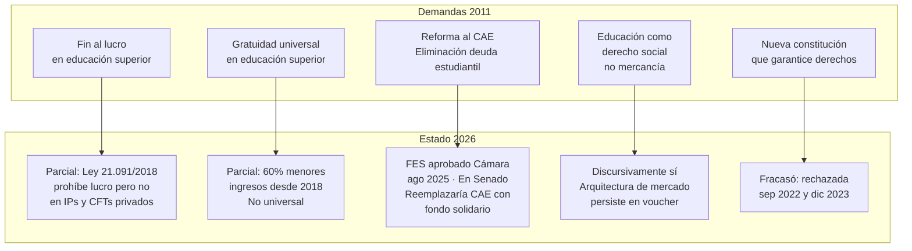
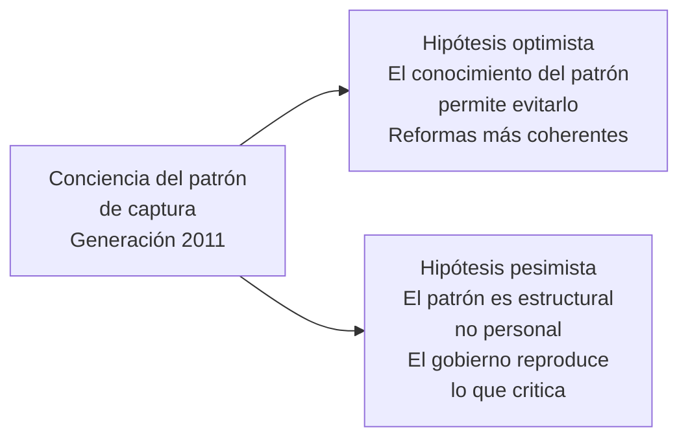
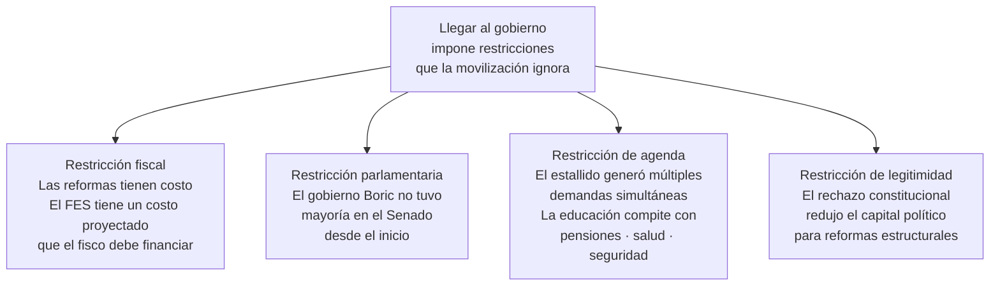

---
name: generacion_2011_boric_reformas
description: "Nota de síntesis. La generación del movimiento estudiantil de 2011 en el poder con Boric: produce reformas coherentes con las demandas originales o reproduce el patrón de captura política de sus predecesores."
sources: [cowork]
aliases:
  - generación 2011 gobierno Boric
  - movimiento estudiantil 2011 al poder
  - Boric reformas educativas coherencia
  - Frente Amplio educación Chile
tags: [actores, politica, reforma, historia, gobernanza, tension, 2026]
---

# ¿La generación de 2011 en el poder produjo reformas distintas o reprodujo el patrón de captura?

En 2011, Gabriel Boric, Camila Vallejo, Giorgio Jackson, Karol Cariola y otros líderes estudiantiles encabezaron la movilización más masiva de la historia universitaria chilena. Sus demandas eran claras: fin al lucro en educación, gratuidad universal y reforma estructural del sistema heredado de la dictadura. Once años después, esa misma generación llegó al gobierno. La pregunta que este nodo intenta responder es si gobernar desde adentro produce algo cualitativamente distinto a lo que produjo la Concertación cuando gobernó sobre las mismas demandas.

---

## I. Las demandas de 2011 y su estado en 2026

Quince años después, el balance es parcial. Lo que en 2011 se planteó como demanda de transformación estructural se ha traducido en reformas incrementales dentro de la misma arquitectura que se quería cambiar.

---

## II. El patrón de captura que la generación de 2011 conocía

La generación de 2011 tenía ventaja respecto a sus predecesores: había protagonizado el ciclo de movilización y conocía el patrón de captura desde adentro. Sabía que las demandas callejeras se negocian en comisiones técnicas, que los plazos se extienden, que los contenidos más radicales se moderan. Esa conciencia era parte de su capital político.

La pregunta es si esa conciencia fue suficiente para producir un resultado diferente.

---

## III. La evidencia del gobierno Boric (2022–2026)

### Lo que avanzó de manera coherente con 2011

**FES (Financiamiento de la Educación Superior)**: el proyecto que reemplaza el CAE por un fondo solidario sin deuda bancaria es directamente coherente con la demanda de 2011. Fue aprobado en la Cámara de Diputadas en agosto de 2025 y está en el Senado. Si se aprueba, es la reforma más directamente ligada a las demandas originales que cualquier gobierno anterior haya producido.

**Deuda Histórica docente (Ley 21.728/2025)**: aunque no es demanda de 2011, responde a una deuda de legitimidad del Estado con el magisterio que tiene relación directa con la crítica al modelo heredado de la dictadura.

**Plan de Reactivación Educativa**: respuesta post-pandemia con énfasis en bienestar socioemocional — lenguaje más cercano a una concepción de derecho social que a gestión de indicadores.

### Lo que reproduce el patrón anterior

**La nueva constitución**: fue la demanda política más ambiciosa de 2019-2022 y fracasó dos veces. El gobierno apostó fuerte por el proceso constituyente y perdió. El resultado fue una derrota que redujo el espacio político para reformas estructurales posteriores.

**El voucher sigue intacto**: el financiamiento escolar por subvención portable no fue reformado. El gobierno Boric no presentó un proyecto de modificación del mecanismo central de financiamiento que la generación de 2011 criticaba.

**Los SLEP sin revisión estructural**: el gobierno mantuvo la NEP con ajustes de gestión pero sin cuestionar el modelo. Ver [[slep_reproduccion_problemas]].

**La gratuidad sigue siendo parcial**: no se presentó proyecto para universalizar la gratuidad en educación superior durante el período.

→ Ver [[linea_tiempo_politica_educacional_chile]]

---

## IV. Por qué gobernar cambia la posición

La generación de 2011 llegó al gobierno en 2022 en condiciones más adversas que cualquier gobierno de la Concertación: sin mayoría parlamentaria propia, con el proceso constituyente fracasado como primer gran derrota, con una agenda de seguridad pública que desplazó a la educación del centro del debate público y con un contexto macroeconómico de inflación y desaceleración.

---

## V. Lectura propia

La generación de 2011 no reproduce exactamente el patrón de captura de la Concertación, pero tampoco lo rompe. Produce un patrón distinto con el mismo resultado estructural: reformas parciales dentro de la misma arquitectura.

La diferencia es de contenido, no de lógica. La Concertación capturaba las demandas y las moderaba para no alterar el acuerdo transicional con la derecha. La generación de 2011 intenta reformas más coherentes con sus demandas originales — el FES es el ejemplo más claro — pero choca con restricciones estructurales que no son menores al hecho de haber protagonizado la movilización.

Hay algo que la movilización no puede enseñar: que gobernar implica administrar coaliciones, no solo enunciar principios. El Senado no vota según la coherencia histórica de las demandas — vota según correlaciones de fuerza. En ese sentido, la conciencia del patrón de captura es condición necesaria pero no suficiente para producir un resultado diferente.

El FES será la prueba más clara. Si se aprueba en el Senado y se implementa, será la primera reforma que rompe genuinamente con la lógica del endeudamiento estudiantil instalada por el CAE en 2005. Si no se aprueba o se aprueba en versión muy moderada, el patrón se habrá reproducido también con quienes lo criticaron con más autoridad histórica.

---

## VI. Una hipótesis de largo plazo

Puede que la pregunta esté mal formulada. El patrón de captura no depende de quién gobierna sino de la estructura del sistema político en que se gobierna: multipartidismo fragmentado, Senado sin mayoría, restricción fiscal, agenda de seguridad que compite con agenda de derechos. Esas condiciones existían con la Concertación y existen con Boric.

Si eso es correcto, la pregunta relevante no es si esta generación produce reformas más coherentes — sino qué cambio estructural del sistema político haría posible que cualquier generación lo hiciera.

---

## VII. Preguntas abiertas

1. Si el FES se aprueba en el Senado, ¿establece un precedente de reforma estructural o es la excepción que confirma la regla de la captura incremental?
2. ¿El fracaso constitucional fue una derrota táctica del gobierno o reveló que el apoyo ciudadano a reformas estructurales era más limitado de lo que la movilización sugería?
3. ¿La generación de 2011 tendrá una segunda oportunidad de gobierno o este es su único ciclo en el poder antes de que el péndulo político gire?
4. ¿Qué aprendizajes sobre gobernabilidad produce esta generación que puedan ser útiles para la siguiente?

---

## VIII. Referencias y vínculos

- [[movilizacion_estudiantil_reformas]]
- [[linea_tiempo_politica_educacional_chile]]
- [[cuasimercado_educativo_persistencia]]
- [[voucher_equidad_educativa]]
- [[slep_reproduccion_problemas]]
- [[demandas_actores_sociales_educacion]]
- [[opinion_publica_educacion_chile]]
- [[sistema_financiamiento_escolar_chile]]
- [[MOC_Politica_Educacional]]
