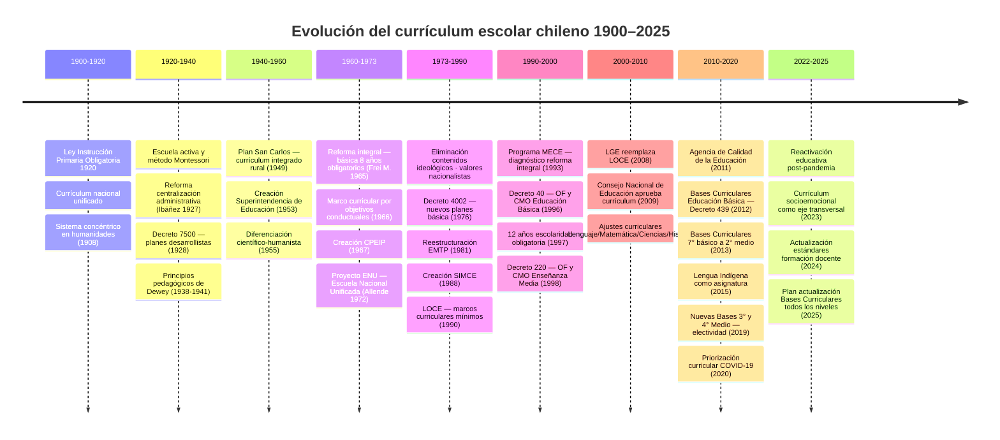

---
name: Historia del Currículum Escolar Chileno
description: "Línea de tiempo 1900–2025 con 50+ hitos curriculares por período y gobierno"
sources:
  - cowork
aliases:
  - historia curricular
  - línea de tiempo curricular
  - evolución curricular
tags:
  - curriculo
  - historia
---

# 📅 Historia del Currículum Escolar Chileno (1900–2025)

> Conecta con: [[MOC_Politica_Educacional]] · [[curriculum_escolar_chileno]] · [[03_Arquitectura_Legal_Institucional_Financiera]] · [[INFOGRAFIA_01_Actores_Mermaid]]

---

## Línea de tiempo — grandes períodos

---

## Hitos detallados por período

### 🕰️ 1900–1920: Inicios del siglo XX

| Año | Hito | Gobierno |
|---|---|---|
| 1904 | Reforma Instituto Pedagógico — formación profesores secundarios | Germán Riesco |
| 1908 | Debate Ley Instrucción Primaria Obligatoria | Pedro Montt |
| 1908 | Reforma plan humanidades — sistema concéntrico | Pedro Montt |
| 1920 | **Ley N° 3.654** — 4 años escolaridad obligatoria, currículum nacional unificado | Juan Luis Sanfuentes |

### 🕰️ 1920–1940: Primeras reformas importantes

| Año | Hito | Gobierno |
|---|---|---|
| 1920-1925 | Currículum basado en escuela activa y método Montessori | Arturo Alessandri Palma |
| 1927-1928 | Reforma integral — centralización administrativa | Carlos Ibáñez del Campo |
| 1928 | **Decreto N° 7.500** — nuevos programas de estudio, orientación desarrollista | Carlos Ibáñez del Campo |
| 1929 | Reestructuración curricular — principios "escuela nueva" | Carlos Ibáñez del Campo |
| 1934 | Reforma programas primaria — enfoques funcionalistas | Arturo Alessandri Palma |
| 1938-1941 | Principios pedagógicos de John Dewey | Pedro Aguirre Cerda |
| 1940 | Creación escuelas experimentales con currículos innovadores | Pedro Aguirre Cerda |

### 🕰️ 1940–1960: Experimentación educativa

| Año | Hito | Gobierno |
|---|---|---|
| 1945 | Plan Renovación Gradual Enseñanza Secundaria — desarrollo productivo | Juan Antonio Ríos |
| 1949 | **Plan San Carlos** — primera experiencia de currículum integrado rural | Gabriel González Videla |
| 1950 | Escuelas experimentales con libertad curricular | Gabriel González Videla |
| 1953 | **Creación Superintendencia de Educación** — aprueba planes y programas | Carlos Ibáñez del Campo |
| 1955 | Reforma Plan Enseñanza Secundaria — diferenciación científico-humanista | Carlos Ibáñez del Campo |

### 🕰️ 1960–1973: Reformas estructurales

| Año | Hito | Gobierno |
|---|---|---|
| 1961 | Contenidos científico-tecnológicos en planes y programas | Jorge Alessandri Rodríguez |
| 1963 | **Plan Arica** — prueba piloto reforma curricular integral | Jorge Alessandri Rodríguez |
| 1965 | **Reforma educacional integral** — básica extendida a 8 años obligatorios | Eduardo Frei Montalva |
| 1966 | Nuevo marco curricular — objetivos conductuales | Eduardo Frei Montalva |
| 1967 | **Creación CPEIP** — apoyo a implementación curricular | Eduardo Frei Montalva |
| 1969 | Plan con 5 áreas de aprendizaje integradas en básica | Eduardo Frei Montalva |
| 1971 | Congreso Nacional de Educación — nuevas bases curriculares propuestas | Salvador Allende |
| 1972 | **Proyecto ENU** — Escuela Nacional Unificada, currículum integrado y politécnico | Salvador Allende |
| 1973 | Decreto de evaluación continua y formativa (interrumpido por golpe) | Salvador Allende |

### 🕰️ 1973–1990: Régimen militar → ver [[Quiebre 1981]]

| Año | Hito | Gobierno |
|---|---|---|
| 1974-1975 | Eliminación contenidos "ideológicos" · refuerzo valores nacionalistas | Augusto Pinochet |
| 1976 | **Decreto 4002** — nuevos planes y programas educación básica | Augusto Pinochet |
| 1980 | **Decreto 300** — planes y programas Educación Media HC | Augusto Pinochet |
| 1981 | Reestructuración curricular EMTP | Augusto Pinochet |
| 1982 | Flexibilización curricular — reducción contenidos mínimos obligatorios | Augusto Pinochet |
| 1985 | Decreto 146 — mayor autonomía curricular a establecimientos | Augusto Pinochet |
| 1988 | **Creación SIMCE** | Augusto Pinochet |
| 1990 | **LOCE** — marcos curriculares mínimos (reemplazada por [[LGE 2009]]) | Augusto Pinochet |

### 🕰️ 1990–2000: Transición democrática

| Año | Hito | Gobierno |
|---|---|---|
| 1992 | Directrices nuevos planes y programas | Patricio Aylwin |
| 1993 | **Programa MECE** — diagnóstico para reforma curricular integral | Patricio Aylwin |
| 1996 | **Decreto 40** — OF y CMO Educación Básica | Eduardo Frei Ruiz-Tagle |
| 1997 | Reforma constitucional — 12 años escolaridad obligatoria | Eduardo Frei Ruiz-Tagle |
| 1998 | **Decreto 220** — OF y CMO Enseñanza Media | Eduardo Frei Ruiz-Tagle |
| 1999-2000 | Implementación nuevos programas Media HC y EMTP | Eduardo Frei Ruiz-Tagle |

### 🕰️ 2000–2010: Consolidación de la reforma

| Año | Hito | Gobierno |
|---|---|---|
| 2001 | Bases Curriculares educación parvularia | Ricardo Lagos |
| 2005 | Ajuste planes Historia y Ciencias Sociales | Ricardo Lagos |
| 2008 | **LGE** — reemplaza LOCE (ver [[03_Arquitectura_Legal_Institucional_Financiera]]) | Michelle Bachelet I |
| 2009 | **Ley 20.370** — Consejo Nacional de Educación aprueba currículum | Michelle Bachelet I |
| 2009 | Ajuste curricular Lenguaje · Matemática · Ciencias · Historia | Michelle Bachelet I |

### 🕰️ 2010–2020: Reformas recientes → ver [[Bachelet_II]]

| Año | Hito | Gobierno |
|---|---|---|
| 2011 | **Creación Agencia de Calidad** — evalúa logros de aprendizaje | Sebastián Piñera I |
| 2012 | **Bases Curriculares Educación Básica** — Decreto 439 | Sebastián Piñera I |
| 2013 | Bases Curriculares 7° básico a 2° medio | Sebastián Piñera I |
| 2015 | Bases Curriculares Lengua Indígena | Michelle Bachelet II |
| 2016 | Plan Nacional de Evaluaciones — articula SIMCE con otras evaluaciones | Michelle Bachelet II |
| 2017 | Actualización Bases Curriculares Educación Parvularia | Michelle Bachelet II |
| 2019 | **Nuevas Bases Curriculares 3° y 4° medio** — electividad (Decreto 193) | Sebastián Piñera II |
| 2020 | Priorización curricular — pandemia COVID-19 | Sebastián Piñera II |

### 🕰️ 2022–2025: Actualidad

| Año | Hito | Gobierno |
|---|---|---|
| 2022 | Reactivación educativa post-pandemia, flexibilización transitoria | Gabriel Boric |
| 2023 | Currículum socioemocional como eje transversal | Gabriel Boric |
| 2024 | Actualización estándares curriculares formación docente | Gabriel Boric |
| 2025 | Plan actualización Bases Curriculares todos los niveles (en desarrollo) | [[Gobierno Kast 2026]] |

---

## Lectura desde el marco teórico

El currículum no es neutro. Desde [[Collins]] y [[Hopper]]:

- **1974-1975**: el régimen militar usó el currículum como dispositivo de [[Clausura_social|clausura social]] — eliminó contenidos que amenazaban la estructura de poder
- **1965** (Frei Montalva) y **1972** (Allende ENU): intentos de usar el currículum para avanzar [[Tensión F4 vs F5|F4]] (igualdad de origen) → resistidos por actores [[Tensión F4 vs F5|F5]]
- **SIMCE 1988**: nace como dispositivo de normalización (Foucault/Popkewitz) — mide rendimiento acumulado que reproduce origen social
- **2019** (electividad 3°-4° Medio): más libertad curricular → fortalece lógica de [[Movilidad_patrocinada|movilidad patrocinada]] (las familias con capital cultural eligen mejor)

---

## Vínculos

- [[MOC_Politica_Educacional]]
- [[curriculum_escolar_chileno]] — estructura actual
- [[03_Arquitectura_Legal_Institucional_Financiera]]
- [[banco_de_datos_educacion_chile]]
- [[Collins]] · [[Hopper]]
- [[Clausura_social]] · [[Movilidad_patrocinada]]
- [[Empate estructural]] · [[Tensión F4 vs F5]]
- [[Bachelet_II]] · [[Gobierno_Kast_2026]]
- [[INFOGRAFIA_01_Actores_Mermaid]]
