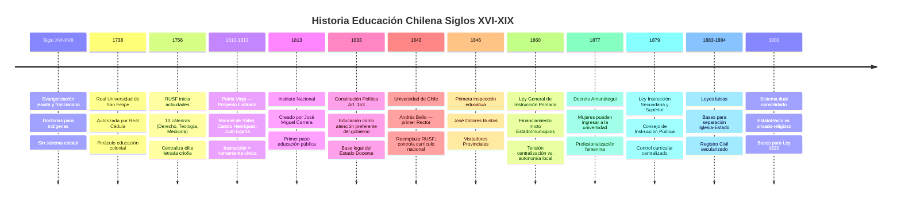
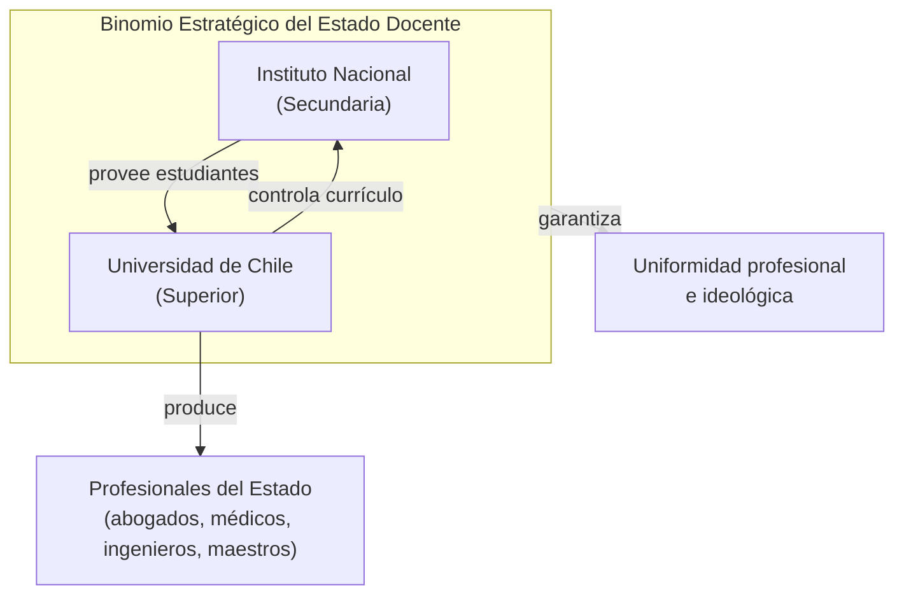
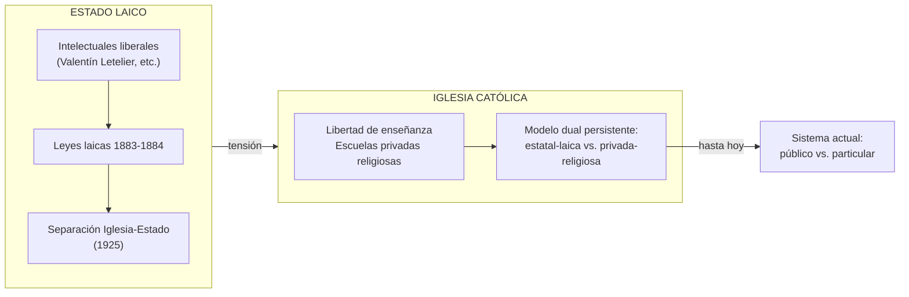

---
name: historia_educacion_chilena_colonial_sigloXIX
description: "Historia de la educación chilena desde el modelo teocéntrico colonial (siglos XVI-XVIII) hasta la consolidación del Estado Docente liberal (1900) — Iglesia, jesuitas, Instituto Nacional, Universidad de Chile, laicismo y hegemonismo pedagógico"
sources: [cowork]
aliases:
  - historia educación Chile colonial
  - Estado Docente Chile
  - educación siglo XIX Chile
  - Instituto Nacional 1813
  - Universidad de Chile 1843
  - laicismo educación Chile
  - Decreto Amunátegui 1877
tags:
  - historia
  - institucional
  - colonial
---

# Historia de la Educación Chilena: Del Patrocinio Colonial a la Consolidación del Estado Docente (Siglos XVI-XIX)

> Fuente: *Historia de la Educación Chilena: Colonia y Siglo XIX* (html + docx, análisis de la transformación del sistema educativo desde el modelo teocéntrico hasta la consolidación del Estado Docente liberal).

La historia de la educación chilena entre la Colonia y el fin del siglo XIX es una narrativa de **transformación institucional y lucha ideológica**: del mandato evangelizador de la Corona y la Iglesia hacia un sistema republicano centralizado orientado a la formación cívica y la consolidación del Estado-nación. El principio de centralización, sin embargo, no cambió — solo cambió quién centralizaba.

---

## 1. Línea de Tiempo: Del Modelo Teocéntrico al Estado Docente

---

## 2. Período Colonial: El Modelo Teocéntrico (Siglos XVI-XVIII)

### La Función Dual: Iglesia y Cabildo

Durante el Reino de Chile, la educación no existió como sistema estatal unificado sino como **función dual**:
- **Iglesia**: evangelización de indígenas y formación superior de criollos
- **Cabildos**: instrucción de "primeras letras" para población no-élite

El objetivo principal: mantenimiento de la jerarquía social y la lealtad a la Corona a través de la doctrina cristiana.

### Los Jesuitas: Modelo de Misión Productiva

Los jesuitas fueron los agentes educativos más sistemáticos del período colonial:
- Misiones organizadas como **haciendas agrícolas de alta productividad**
- Operaban en zonas alejadas de centros urbanos
- Integraban enseñanza del español + trabajo práctico + doctrina cristiana
- **Estratificación**: educación diferenciada para hijos de caciques e "indios principales" — crear intermediarios culturales y políticos leales a la Corona

### Los Cabildos y las Primeras Letras

El Cabildo de Santiago tenía obligaciones específicas: fiscalizar escuelas, regular la disciplina de los estudiantes, designar maestros. Pero la **brecha entre mandato legal y práctica real** era amplia: "la práctica fue bastante diversa a lo que la ley disponía." Esta debilidad institucional en la provisión de educación municipal prefigura una tensión que se repetirá en el siglo XX con la municipalización de 1981.

### La Real Universidad de San Felipe (RUSF, 1738-1843)

| Hito | Año | Detalle |
|------|-----|---------|
| Autorización | 1738 | Real Cédula de la Corona española |
| Inicio actividades | 1756 | 10 cátedras: Derecho, Teología, Medicina |
| Funciones | — | Centralizar élite letrada criolla (abogados, teólogos, burócratas) |
| Control borbónico | — | Registro estricto asistencia; índice detallado de matrícula |
| Reemplazada por | 1843 | Universidad de Chile |

**Lectura F5**: La RUSF es un mecanismo puro de reproducción de élites (Función 5 de Collins/Hopper). No accede cualquiera con talento; accede el hijo de quien pertenece a la élite criolla. La "centralización académica" que la RUSF producía no era neutra: producía el tipo exacto de sujeto que la Corona necesitaba para gobernar el territorio.

---

## 3. La Ruptura de la Independencia (1810-1822)

### El Giro Ilustrado: De la Evangelización a la Formación Cívica

Los líderes de la Independencia transformaron la educación de mandato evangelizador a **herramienta de construcción cívica y legitimación republicana**.

Figuras clave: Manuel de Salas, Camilo Henríquez y Juan Egaña concibieron la instrucción como indispensable para romper con el Imperio español e implementar el nuevo orden. Su concepción era que la educación debía dirigirse hacia las necesidades de **toda la sociedad**.

**La situación de las mujeres**: la capital (más de 50.000 habitantes) no tenía una escuela formal para mujeres. La solución provisional: cada monasterio de monjas debía destinar una sala como escuela de primeras letras para niñas pobres, financiando a las maestras con fondos municipales. Una política de emergencia que revela la magnitud del abandono.

### El Instituto Nacional (1813): El Hito Fundacional

| Dimensión | Contenido |
|-----------|-----------|
| Fecha | 10 de agosto de 1813 |
| Creador | Director Supremo José Miguel Carrera |
| Función | Primer paso hacia educación pública sólida |
| Estructura | Consolidó funciones de varios colegios coloniales |
| Rol | Ente rector de educación secundaria y superior |
| Sucesor de | Real Universidad de San Felipe |
| Significado | Inicio de la centralización y **secularización** de la educación |

El Instituto Nacional marcó el momento en que el Estado republicano tomó el control formal de lo que la Iglesia y la Corona habían administrado. No es solo un edificio: es la materialización del Estado Docente.

---

## 4. Consolidación Republicana (1830-1860)

### La Constitución de 1833: Base Legal del Estado Docente

El artículo 153 de la Constitución Política declaró que la educación era una **"atención preferente del gobierno"** — otorgando el marco legal para el Estado Docente. No es retórica: es el fundamento constitucional que justifica todo el aparato educativo posterior.

### La Universidad de Chile (1843): El Binomio Estratégico

| Dimensión | Detalle |
|-----------|---------|
| Creación | 1843 |
| Primer Rector | Andrés Bello López (1843-1865) |
| Sustituyó a | Real Universidad de San Felipe |
| Control | Currículo de instrucción secundaria + superior |
| Función | Cúspide intelectual de la República |

**La continuidad de la centralización**: el poder pasó de la Iglesia a la Universidad de Chile, pero la estructura jerárquica permaneció intacta. Como observa Foucault, el cambio de institución no cambia la lógica del poder disciplinario.

### Profesionalización del Magisterio e Inspección

- **Escuelas Normales**: formación de maestros normalistas (Primera Escuela Normal para hombres, futura José Abelardo Núñez)
- **Sistema de inspección**: Visitadores Provinciales de Instrucción Primaria; José Dolores Bustos fue el primero, designado en 1846
- **Influencia francesa** (1840-1880): el modelo francés configuró la estructura de los liceos y las políticas educativas iniciales — el primer préstamo pedagógico exógeno del Chile republicano

---

## 5. Era Liberal: Legislación, Laicismo y Modernización (1860-1900)

### Ley General de Instrucción Primaria (1860)

Primer intento de formalizar la educación de masas. Su estructura financiera era **mixta**:
- Fondos del Tesoro Nacional
- Aportes de rentas municipales
- Donaciones, multas y contribución especial

**La tensión estructural que creó**: la ley otorgaba a los municipios la responsabilidad de costear y vigilar escuelas, pero les **impedía alterar las reglas prescritas** por la inspección estatal. Centralización con descentralización financiera — la misma contradicción que explotará en la municipalización de 1981 y en la crisis de los SLEP actuales.

### Ley de Instrucción Secundaria y Superior (1879)

Formalizó la educación secundaria y superior. El **Consejo de Instrucción Pública** (dependiente de la Universidad de Chile) tenía poder para dictar reglamentos y nombrar comisiones para los exámenes de bachiller — control curricular centralizado desde arriba.

### La Batalla Ideológica: Laicismo vs. Iglesia

El resultado de esta batalla fue el **modelo dual** que persiste hasta hoy: estatal-laico versus privado-religioso. La "libertad de enseñanza" que defendía la Iglesia en el siglo XIX es el antecedente directo del debate sobre libertad de enseñanza en la Ley Inclusión de 2015.

### El Giro Pedagógico: De Francia a Alemania

| Período | Modelo dominante | Referente | Énfasis |
|---------|-----------------|-----------|---------|
| 1840-1880 | Francés | Francia post-napoleónica | Orden administrativo, estructura liceos |
| 1880-1910 | Alemán | Post-Guerra Franco-Prusiana | Rigor científico, pedagogía herbartiana |

Tras la **Guerra Franco-Prusiana (1870-1871)**, Chile voltea su modelo pedagógico de Francia hacia Alemania. Figuras clave: Valentín Letelier, Claudio Matte y José Abelardo Núñez viajaron a Alemania e importaron el **pensamiento herbartiano** (Johann Friedrich Herbart): pedagogía científica, metódica, basada en pasos formales de instrucción.

**Lectura teórica**: Chile como "activo importador de modelos pedagógicos" — la dependencia exógena es una constante histórica. El país no generó un modelo pedagógico propio en el siglo XIX; adoptó el dominante de turno. Esta dinámica se repetirá con el modelo neoliberal en 1981 (Chicago Boys) y con los estándares OCDE en el siglo XXI.

### Inclusión Condicionada: Mujer y Pueblos Originarios

**El Decreto Amunátegui (1877) — apertura femenina:**
- Permitió a las mujeres rendir exámenes de ingreso a la universidad
- Lógica del Estado: las mujeres como **agentes de socialización** pueden transmitir el ethos nacional y ordenar la comunidad cívica según los objetivos republicanos
- Interés instrumental, no reconocimiento de igualdad de derechos

**La marginación de los pueblos originarios:**
- Contraste radical con la apertura femenina
- La política educativa estuvo marcada por la **asimilación cultural** y la "invisibilización del mapun-kimun" (conocimiento mapuche)
- El proyecto de uniformidad nacional operó en La Araucanía como **política de aculturación y negación identitaria**
- Las escuelas misionales persistieron pero bajo lógica asimilacionista, no intercultural

**Lectura F1 y F5**: el Decreto Amunátegui amplía F1 (socialización) a las mujeres — pero con una condición: deben socializar en los valores del Estado. La exclusión mapuche es F5 en negativo: el sistema reproduce la exclusión de quienes no pertenecen a la nación imaginada.

---

## 6. Síntesis: Evolución Institucional de la Educación Superior

| Período | Institución principal | Ente regulador | Énfasis educativo |
|---------|----------------------|----------------|-------------------|
| Colonia tardía (1756-1813) | Real Universidad de San Felipe | Corona Española | Derecho, Teología, Medicina, burocracia colonial |
| Patria Vieja (1813-1843) | Instituto Nacional | Junta de Gobierno / Estado | Formación cívica y nueva clase dirigente |
| República consolidada (post-1843) | Universidad de Chile | Estado chileno (Andrés Bello) | Ciencias, Humanidades, control curricular nacional |

---

## 7. Hitos Legislativos del Siglo XIX

| Año | Instrumento | Nivel | Impacto principal |
|-----|-------------|-------|-------------------|
| 1833 | Constitución Política (Art. 153) | General | Base legal Estado Docente |
| 1860 | Ley General de Instrucción Primaria | Primaria | Regulación + financiamiento mixto + tensión centralización/municipios |
| 1877 | Decreto Amunátegui | Superior | Apertura de género, profesionalización femenina |
| 1879 | Ley de Instrucción Secundaria y Superior | Secundaria/Superior | Estandarización y control curricular centralizado |
| 1883-84 | Leyes laicas | General | Bases separación Iglesia-Estado (consumada 1925) |

---

## 8. Conclusiones y Legado

### Los Tres Rasgos Estructurales del Siglo XIX

**1. Centralización inmutable**: el poder de control pasó de la Iglesia y la Corona a la Universidad de Chile y el Ministerio de Justicia e Instrucción Pública, pero la **estructura jerárquica colonial se conservó**. No hubo ruptura en la lógica del control; solo cambió el titular.

**2. Triunfo del Estado Docente**: las leyes de 1860 y 1879 consolidaron al Estado como ente exclusivo, garante y rector del sistema, despojando a la Iglesia de su monopolio. La secularización fue el proyecto político central de la élite liberal.

**3. Dependencia exógena de la modernidad**: Chile importó modelos pedagógicos (francés → alemán) sin generar una pedagogía propia. Esta dinámica de transferencia cultural condicionó el desarrollo educativo hasta el siglo XX — y puede rastrearse hasta los estándares OCDE/PISA actuales.

### El Modelo Dual Persistente

La secularización generó el **modelo de enseñanza dual** (estatal-laica versus privada-religiosa) que ha persistido en Chile hasta la actualidad. El debate sobre libertad de enseñanza en la Ley Inclusión de 2015 tiene raíces directas en la batalla ideológica del siglo XIX entre liberales laicos y la Iglesia Católica.

### El Puente al Siglo XX

Los cimientos del siglo XIX — magisterio normalista, Universidad de Chile, liceos, Decreto Amunátegui — permitieron la promulgación de la **Ley de Instrucción Primaria Obligatoria de 1920** y las reformas democratizadoras del siglo XX. Sin el Estado Docente del XIX, no hay expansión masiva del XX.

---

## 9. Lectura Teórica: Collins/Hopper

| Función | Expresión histórica |
|---------|---------------------|
| F1 (Socialización) | Evangelización colonial → formación cívica republicana: ambas son F1, con diferente contenido ideológico |
| F2 (Selección meritocrática) | RUSF y Universidad de Chile: acceso formalmente meritocrático, prácticamente elitista |
| F3 (Mercado/empleabilidad) | Formación de abogados, médicos, ingenieros para el Estado y el mercado profesional |
| F4 (Democratización) | Ley 1860 (masificación primaria) + Decreto Amunátegui (mujeres) = expansión parcial del acceso |
| F5 (Reproducción élites) | RUSF → Universidad de Chile: continuidad de la reproducción de la élite letrada criolla |

**La paradoja histórica**: el Estado Docente se presentó a sí mismo como democratizador (F4), pero su principal efecto fue consolidar una élite letrada republicana (F5) que simplemente reemplazó a la élite colonial. La democratización fue real pero limitada — excluyó a mujeres (parcialmente), a indígenas (totalmente) y a los sectores populares (acceso a primeras letras, pero no a la élite).

---

## 10. Conexiones

- [[presupuesto_educacional_chile]] — evolución del gasto educativo desde los orígenes históricos
- [[estructura_legal_sistema_educacional]] — el andamiaje legal del siglo XXI que hereda estas tensiones
- [[sistema_financiamiento_escolar_chile]] — la tensión centralización/municipios de 1860 se repite en 1981 y 2017
- [[marco_teorico_sociologico_educacion]] — Durkheim (socialización), Weber (credencialismo), Foucault (disciplina escolar)
- [[modelos_gobernanza_educacional]] — el modelo centralizado como primer paradigma
- [[fundamentos_politica_educacional]] — F1-F5 que el sistema del siglo XIX priorizó
- [[educacion_politica_chile]] — el modelo dual estatal/privado como legado histórico
- [[arbol_problemas_politica_educacional]] — diagnósticos actuales con raíces en estas tensiones
- [[MOC_Politica_Educacional]] — mapa central de la investigación
