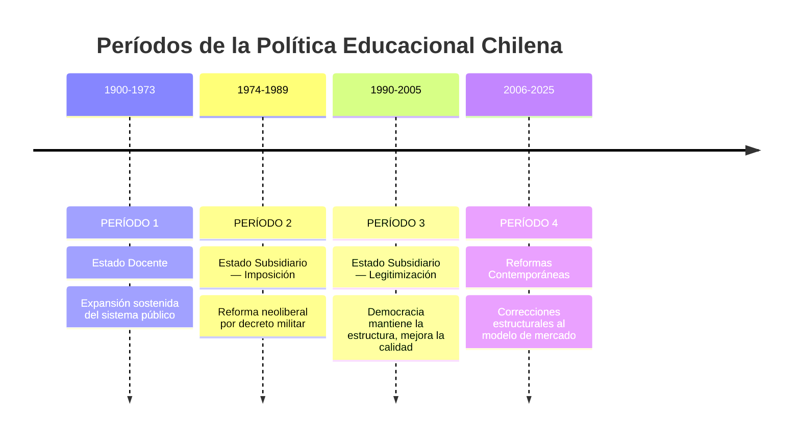
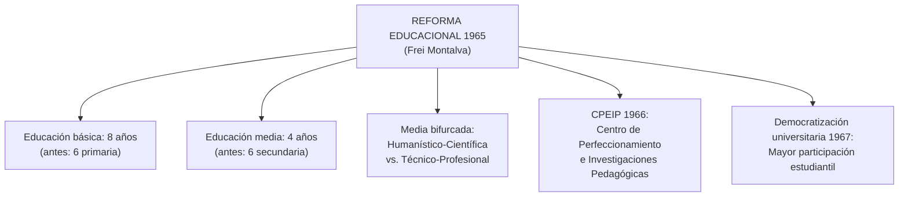
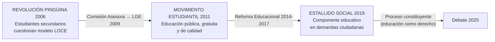

---
name: linea_tiempo_politica_educacional_chile
description: "Línea de tiempo de la política educacional chilena 1900-2025 organizada en cuatro períodos — Estado Docente, Estado Subsidiario imposición, Estado Subsidiario legitimización, y reformas contemporáneas"
sources: [cowork]
aliases:
  - línea de tiempo educación Chile
  - historia política educacional Chile siglo XX
  - Estado Docente 1900-1973
  - municipalización educación Chile
  - reformas educacionales Chile 2006-2025
tags:
  - historia
  - institucional
  - politica
  - reforma
---

# Línea de Tiempo: Política Educacional en Chile (1900–2025)

> Fuente: *Línea de Tiempo: Política Educacional en Chile (1900-2025)* (html, aplicación interactiva con 4 períodos y ~60 hitos cronológicos).

La política educacional chilena del siglo XX–XXI puede leerse como la historia de **tres modelos en tensión**: el Estado Docente (que asume la educación como función pública central), el Estado Subsidiario (que la delega al mercado y las municipalidades), y las Reformas Contemporáneas (que intentan corregir las fallas del modelo subsidiario sin abandonarlo del todo).

---

## 1. Los Cuatro Períodos

---

## 2. Período 1: Estado Docente (1900–1973)

El Estado asume la educación como responsabilidad directa. Expansión sostenida de cobertura, infraestructura, obligatoriedad y profesionalización docente.

### Hitos fundacionales (1900-1930)

| Año | Hito | Gobierno | Significado |
|-----|------|----------|-------------|
| 1903 | Escuelas Normales de Preceptores | Germán Riesco | Profesionalización docente sistemática |
| 1904 | Ley de Educación Primaria | Pedro Montt | Primer intento de obligatoriedad (sin implementación efectiva) |
| 1908 | Instituto Pedagógico Técnico | Pedro Montt | Formación de profesores técnicos |
| 1911 | Escuelas experimentales | Ramón Barros Luco | Innovación pedagógica institucional |
| 1919 | Ley Educación Primaria Obligatoria | Juan Luis Sanfuentes | Promulgación (implementación gobierno siguiente) |
| **1920** | **Ley 3.654 — Primaria Obligatoria** | **Arturo Alessandri** | **4 años de escolaridad obligatoria — hito fundacional** |
| 1924 | Decreto Amunátegui | A. Alessandri | Mujeres acceden a la universidad |
| **1927** | **Ministerio de Educación Pública** | **C. Ibáñez del Campo** | **Centralización total + creación del MINEDUC** |

### Expansión social y reforma integral (1930-1965)

| Año | Hito | Gobierno | Significado |
|-----|------|----------|-------------|
| 1938 | "Gobernar es educar" | Pedro Aguirre Cerda | Educación como motor del desarrollo nacional |
| 1939 | Plan San Carlos | P. Aguirre Cerda | Alfabetización rural masiva |
| 1941 | Escuela Normal Superior | P. Aguirre Cerda | Perfeccionamiento de normalistas |
| 1948 | Plan de Alfabetización Nacional | G. González Videla | Reducción analfabetismo adulto |
| 1950 | Primaria obligatoria → 6 años | C. Ibáñez | Ampliación cobertura obligatoria |
| 1953 | Superintendencia de Educación | C. Ibáñez | Supervisión técnica del sistema |
| 1962 | Promoción automática | J. Alessandri | Reducción deserción temprana |
| 1963 | Reforma educacional | J. Alessandri | Ciclos general + vocacional |

### Reforma Integral de 1965 (Frei Montalva) — Punto de inflexión

### Allende y el proyecto ENU (1970–1973)

| Año | Hito | Significado |
|-----|------|-------------|
| 1971 | Escuela Nacional Unificada (ENU) + textos gratuitos | Integración trabajo productivo + educación; nacionalización textos |
| 1971 | "Desayuno y Almuerzo Escolar" nacional | Política de bienestar escolar |
| 1972 | Ampliación acceso educación superior | Sedes regionales universitarias |
| 1973 | Intento implementación ENU | Suspendida antes del golpe — la propuesta más radical del período |

---

## 3. Período 2: Estado Subsidiario — Imposición (1974–1989)

El régimen militar transforma radicalmente el sistema educativo aplicando el modelo neoliberal de Chicago. La educación deja de ser un derecho garantizado por el Estado para convertirse en un bien de mercado.

```mermaid
graph LR
    subgraph ANTES["ANTES 1973"]
        A1["Estado como<br/>proveedor directo"]
        A2["Escuelas bajo<br/>MINEDUC"]
        A3["Financiamiento<br/>estatal directo"]
        A4["Profesores:<br/>funcionarios públicos"]
        A5["Universidades:<br/>gratuitas + estatales"]
    end
    subgraph DESPUES["DESPUÉS 1989"]
        D1["Estado como<br/>subsidiario/regulador"]
        D2["Escuelas bajo<br/>municipios"]
        D3["Voucher/subvención<br/>por asistencia"]
        D4["Profesores:<br/>empleados municipales"]
        D5["Universidades:<br/>privadas + aranceladas"]
    end
    ANTES -->|"Reforma 1980-1981"| DESPUES
```

| Año | Hito | Significado estructural |
|-----|------|------------------------|
| 1974 | Intervención militar universidades | Designación rectores delegados; depuración ideológica docente |
| 1975 | Eliminación gremios → Colegio de Profesores c/directiva designada | Control corporativo estatal del magisterio |
| 1976 | SEREMIS + PAA | Descentralización administrativa; estandarización acceso universitario |
| 1978 | Directiva Presidencial + Ley Universidades | Fragmentación sedes regionales universitarias |
| **1980** | **Municipalización + Sistema Voucher** | **Traspaso escuelas MINEDUC → municipios; subvención por asistencia** |
| **1981** | **Nueva Ley Universidades** | **Creación universidades privadas; reducción financiamiento público ES** |
| 1982 | Financiamiento compartido (copago) | Familias co-financian educación subvencionada |
| 1983 | PER (Programa Evaluación Rendimiento) | Antecedente del SIMCE |
| 1984 | CFT e IP | Nuevos proveedores de educación técnica privada |
| 1988 | **SIMCE** | Sistema de Medición Calidad — evaluación estandarizada nacional |
| **1990** | **LOCE** | Ley Orgánica Constitucional de Enseñanza — 10/03/1990 (último día del régimen) |

---

## 4. Período 3: Estado Subsidiario — Legitimización (1990–2005)

La democracia recuperada **no desmonta** el modelo de mercado sino que intenta mejorarlo desde adentro: más recursos, más calidad, más equidad — dentro de la misma arquitectura neoliberal.

| Año | Hito | Gobierno | Significado |
|-----|------|----------|-------------|
| 1990 | P-900 + MECE (Banco Mundial) | Aylwin | Focalización en escuelas vulnerables + primera gran reforma calidad |
| **1991** | **Estatuto Docente (Ley 19.070)** | **Aylwin** | **Régimen laboral especial sector municipal; inicio programa Énlaces** |
| 1993 | Financiamiento compartido → ley | Aylwin | Copago institucionalizado para escuelas subvencionadas |
| 1994 | Comisión Brunner | Frei R-T | Diagnóstico sistémico del sistema educativo |
| **1997** | **Jornada Escolar Completa (JEC) — Ley 19.532** | **Frei R-T** | **Extensión horaria universal; reforma curricular** |
| 1998 | Reforma Curricular — OF y CMO | Frei R-T | Objetivos Fundamentales y Contenidos Mínimos Obligatorios |
| 1999 | Consolidación reforma curricular | Frei R-T | Programas de estudio renovados |
| 2000 | Liceos para Todos | Lagos | Prevención deserción escolar media |
| **2002** | **12 años escolaridad obligatoria** | **Lagos** | **Reforma constitucional: básica + media obligatorias** |
| 2003 | SACGE | Lagos | Sistema aseguramiento calidad gestión escolar |
| **2005** | **CAE (Ley 20.027)** | **Lagos** | **Crédito con Aval del Estado para educación superior** |

---

## 5. Período 4: Reformas Contemporáneas (2006–2025)

La movilización estudiantil abre una era de reformas estructurales que buscan corregir las fallas del modelo de mercado: segregación, lucro, deuda estudiantil, precarización docente, gestión municipal deficiente.

### Detonantes: Las Movilizaciones Estudiantiles

### Reforma Educacional de la Segunda Bachelet (2014–2017)

| Año | Hito | Ley | Significado |
|-----|------|-----|-------------|
| **2008** | **SEP — Subvención Escolar Preferencial** | **Ley 20.248** | Recursos adicionales para escuelas con alumnos vulnerables |
| **2009** | **LGE — Ley General de Educación** | **Ley 20.370** | Reemplaza la LOCE; mayor regulación del sistema escolar |
| 2012 | SAC — Sistema Aseguramiento Calidad | Ley 20.529 | Agencia de Calidad + Superintendencia de Educación |
| 2014 | Inicio Reforma Educacional + PACE | — | Gratuidad ES + fin lucro como ejes; acceso inclusivo ES |
| **2015** | **Ley de Inclusión Escolar** | **Ley 20.845** | Elimina copago + lucro; prohíbe selección escolar; inicia SAE |
| **2016** | **Carrera Docente** | **Ley 20.903** | Sistema Desarrollo Profesional Docente: 5 tramos + evaluación |
| **2017** | **Desmunicipalización (SLEP)** | **Ley 21.040** | 36 Servicios Locales de Educación Pública reemplazan municipios |
| **2018** | **Ley de Educación Superior** | **Ley 21.091** | Marco legal para gratuidad; nueva institucionalidad ES |
| 2019 | Estallido Social | — | Demandas educativas como parte del malestar estructural |
| 2020 | COVID-19 — Educación remota de emergencia | — | "Aprendo en Línea"; pérdida aprendizajes masiva |
| 2021 | Retorno gradual + Plan Recuperación | — | Sistema híbrido; acumulación brecha COVID |
| 2022 | Plan Reactivación Educativa + "Seamos Comunidad" | — | Bienestar socioemocional + condonación parcial CAE |
| 2023 | Ley 21.533 — Modificación SLEP | — | Ajusta plazos implementación; respuesta a crisis déficit |
| 2025 | Estrategia Nacional de Educación Pública 2025-2030 | — | Hoja de ruta del sistema público |

---

## 6. Síntesis: Los Tres Quiebres Estructurales

| Quiebre | Año | Qué cambió | Qué NO cambió |
|---------|-----|------------|---------------|
| **1° Quiebre** | 1980-1981 | Estado Docente → Estado Subsidiario; centralización → descentralización municipal + mercado | La obligatoriedad escolar; el SIMCE como evaluación |
| **2° Quiebre** | 2009-2015 | LOCE → LGE; lucro y copago → Ley Inclusión; selección → SAE | Voucher como mecanismo de financiamiento; coexistencia pública/privada |
| **3° Quiebre (en curso)** | 2017-2025 | Municipios → SLEP; financiamiento universitario → gratuidad + FES | Fragmentación sostenedores; déficits de gestión; segregación residencial |

---

## 7. Interpretación Collins/Hopper — Evolución por Período

| Función | P1 Estado Docente | P2 Imposición | P3 Legitimización | P4 Reformas |
|---------|------------------|---------------|-------------------|-------------|
| **F1 Socialización** | Ciudadano republicano laico; identidad nacional | Ciudadano obediente al orden; anticomunismo | Ciudadano productivo para la democracia de mercado | Ciudadano con derechos; identidad intercultural |
| **F2 Selección** | Meritocracia estatal (PAA antecedente) | PAA → selección en ES; competencia entre escuelas | SIMCE como selector de calidad; segmentación de mercado | SAE = selección por azar + vulnerabilidad; Kast propone retorno a selección |
| **F3 Mercado** | Secundario (Estado provee, empresa consume egresados) | Central: voucher, copago, universidades privadas | Consolidación: CAE, financiamiento compartido | Corrección parcial: SEP, gratuidad, FES (en tramitación) |
| **F4 Democratización** | Expansión cobertura; 4→6→8→12 años obligatorios | Regresión: depuración, control gremial | Restauración formal; P-900, JEC | Pingüinos → LGE → Inclusión → SLEP |
| **F5 Reproducción élites** | Instituto Nacional + universidades públicas selectivas | Universidades privadas élite + privatización | Liceos Bicentenario + persistencia brecha SIMCE | SAE vs. selección; GSE brecha 55 pts SIMCE |

---

## 8. Conexiones

- [[historia_educacion_chilena_colonial_sigloXIX]] — antecedente colonial y republicano del Estado Docente
- [[ohiggins_educacion_republicana]] — fundamento republicano del Estado Docente (1817)
- [[portales_educacion_estado_docente]] — consolidación conservadora del Estado Docente (1833)
- [[politicas_educacionales_sistema_chileno]] — políticas actuales (2020-2026) en detalle
- [[sistema_financiamiento_escolar_chile]] — voucher, SEP, SLEP, CAE/FES
- [[modelos_gobernanza_educacional]] — los cuatro modelos como marco analítico de los períodos
- [[propuestas_educacionales_candidatos_2025]] — debate electoral sobre el legado de estas reformas
- [[MOC_Politica_Educacional]] — mapa central de la investigación
