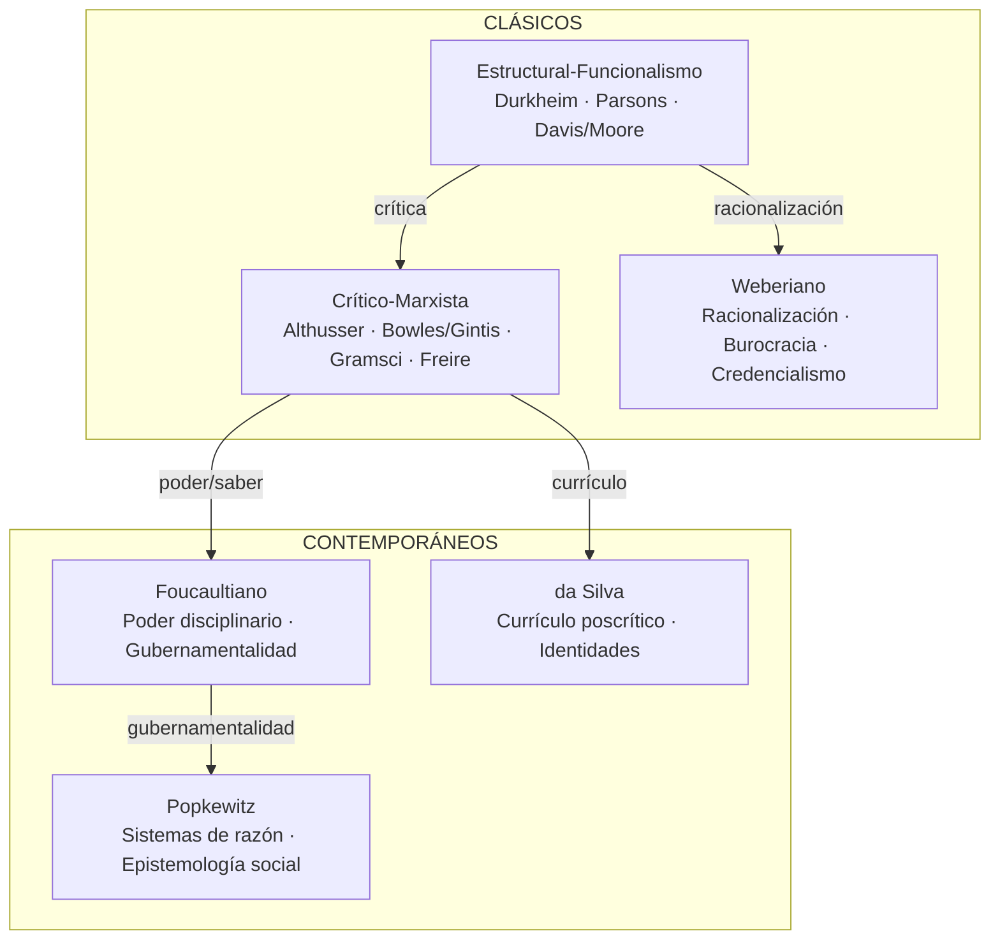
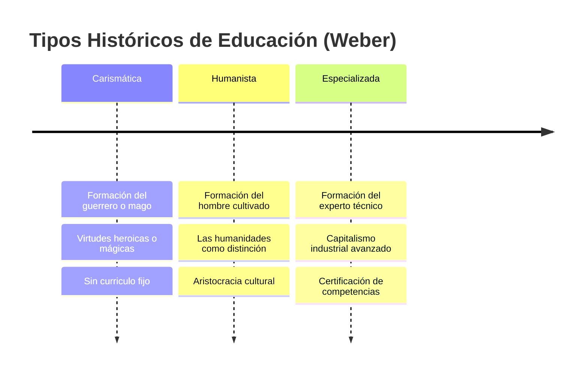
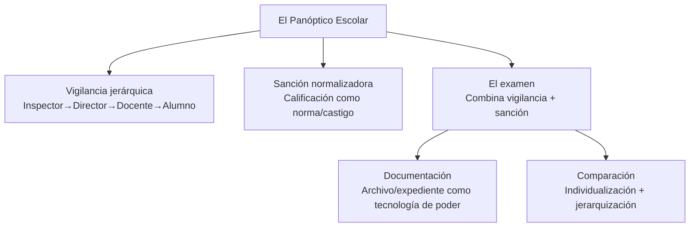

---
name: marco_teorico_sociologico_educacion
description: "Seis paradigmas sociológicos para analizar los sistemas educativos — funcionalismo, marxismo crítico, Weber, Foucault, Popkewitz y da Silva"
sources: [cowork]
aliases:
  - teoría sociológica educación
  - paradigmas educación
  - sociología de la educación
  - Durkheim educación
  - Bourdieu educación
  - Foucault escuela
tags:
  - teoria
  - sociologia
  - paradigmas
---

# Marco Teórico Sociológico de los Sistemas Educativos

> Fuente: *Marco Teórico Sociológico de los Sistemas Educativos* (docx, revisión de 6 paradigmas sociológicos aplicados al análisis de sistemas educativos).

Los sistemas educativos no pueden comprenderse sin teoría sociológica. Cada paradigma revela dimensiones que los otros ocultan: el funcionalismo explica la integración, el marxismo la reproducción, Weber la racionalización burocrática, Foucault el poder disciplinario, Popkewitz los sistemas de razón que gobiernan la reforma, y da Silva la construcción de identidades a través del currículo.

---

## 1. Mapa de Paradigmas

---

## 2. Paradigma 1: Estructural-Funcionalismo

### Durkheim: La Educación como Hecho Social

Durkheim define la educación como **"acción ejercida por las generaciones adultas sobre las que aún no están maduras para la vida social"**. Su función es la transmisión de la cultura y la integración moral.

Conceptos clave:
- **Socialización metódica**: inculcación sistemática de valores, normas y formas de pensar colectivas
- **Anomia**: ruptura del lazo entre individuo y sociedad cuando la educación falla en su función integradora
- **Solidaridad orgánica** (sociedades industriales): la educación produce diferenciación complementaria, no homogeneidad

**Lectura F1+F5:** La socialización metódica de Durkheim es exactamente la Función 1 (reproducción cultural). Pero su énfasis en la "moral laica" también revela la dimensión F5: la escuela define qué cultura merece transmitirse, legitimando jerarquías simbólicas.

### Parsons: El Aula como Microcosmos Social

Parsons analiza el aula escolar como sistema social con cuatro funciones (AGIL): adaptación, consecución de metas, integración y mantenimiento de patrones.

- El sistema educativo funciona como **filtro universalista**: selecciona individuos según criterios de rendimiento (achievement), no adscripción (familia, origen)
- La escuela es la "agencia de socialización" que media entre familia (particularismo) y sociedad adulta (universalismo)

### Davis y Moore: La Meritocracia Funcional

La desigualdad educativa es **funcionalmente necesaria**: los roles más importantes requieren mayor talento y formación, justificando mayor recompensa. La educación asigna individuos a posiciones según mérito.

**Tensión con F4:** Esta racionalización funcionalista de la desigualdad es exactamente lo que las teorías críticas rechazan — naturaliza como "mérito" lo que en realidad es reproducción de privilegio.

---

## 3. Paradigma 2: Crítico-Marxista

### Althusser: El Aparato Ideológico del Estado

Althusser distingue:
- **AIR** (Aparato Ideológico Represivo): Estado, ejército, policía — opera por la fuerza
- **AIE** (Aparato Ideológico del Estado): iglesia, familia, **escuela** — opera por la ideología

La escuela es el **AIE dominante** en las sociedades capitalistas modernas. Reproduce las relaciones de producción inculcando la ideología de la clase dominante, disfrazando la dominación como conocimiento neutro y universal.

### Bowles y Gintis: El Principio de Correspondencia

En *Schooling in Capitalist America* (1976), Bowles y Gintis postulan que la escuela **corresponde estructuralmente** a las relaciones de producción capitalista:

| Relaciones escolares | Relaciones laborales |
|---------------------|---------------------|
| Obediencia al maestro | Obediencia al supervisor |
| Evaluación externa | Control externo del trabajo |
| Fragmentación del conocimiento | División del trabajo |
| Recompensa extrínseca (notas) | Motivación salarial |

No es el contenido curricular lo que reproduce el capitalismo: es la **forma** de la experiencia escolar.

### Gramsci, Giroux y Freire: La Resistencia

La hegemonía no es determinismo: puede ser contestada.

- **Gramsci**: los intelectuales orgánicos de las clases subalternas pueden usar la escuela como espacio de contra-hegemonía
- **Giroux**: los maestros como "intelectuales transformadores" con agencia política
- **Freire**: la pedagogía crítica supera la "educación bancaria" (depósito de conocimiento) mediante la **praxis** (reflexión + acción)

**Lectura F4:** La perspectiva crítica-marxista es la base teórica de la Función 4 (democratización). La NEP chilena bebe de esta tradición cuando postula que la escuela debe romper la reproducción de la desigualdad.

---

## 4. Paradigma 3: Weberiano

### Racionalización y Burocracia

Weber identifica la **racionalización** como el proceso central de la modernidad: sustitución de la acción tradicional/carismática por la acción racional-instrumental. La burocracia es su expresión organizacional.

**Los tres tipos históricos de educación:**

### Clausura Social y Credencialismo

- **Clausura social**: grupos establecidos usan credenciales educativas para restringir el acceso a posiciones ventajosas (análogo a los gremios medievales)
- **Credencialismo**: proliferación de títulos como mecanismo de cierre de mercados profesionales
- **Inflación de títulos**: cuando más personas obtienen credenciales, se requieren títulos más altos para las mismas posiciones — carrera armamentista simbólica

**Lectura F2+F5:** El credencialismo weberiano explica cómo la F2 (selección meritocrática) puede funcionar como F5 (reproducción de élites) cuando el acceso a credenciales no es universal. En Chile, el "mérito" SIMCE/PSU opera como cierre social para quienes asistieron a escuelas de menor calidad.

---

## 5. Paradigma 4: Foucaultiano

### Microfísica del Poder

Foucault rechaza la teoría jurídica del poder (poder como represión, como propiedad de una clase o institución). El poder es:
- **Relacional**: existe en las relaciones, no en los sujetos
- **Productivo**: no solo reprime sino que produce sujetos, conocimientos, normas
- **Microfísico**: opera en prácticas cotidianas, no solo en macroestructuras

### El Panóptico y la Escuela Disciplinaria

El panóptico de Bentham (torre central de vigilancia + celdas individuales visibles) es la arquitectura del poder moderno. La escuela es un espacio disciplinario que implementa los mismos mecanismos:

El **examen** es el dispositivo central: no solo mide conocimientos, sino que **fabrica** al estudiante como objeto de saber y lo ubica en una jerarquía de normalidad.

### Biopolítica y Gubernamentalidad

- **Biopolítica**: el poder moderno ya no solo disciplina cuerpos individuales sino que gestiona **poblaciones** (tasas, promedios, riesgos). El SIMCE, el PISA, las estadísticas educativas son tecnologías biopolíticas
- **Gubernamentalidad**: la escuela no solo disciplina, sino que forma **sujetos que se gobiernan a sí mismos** — produce la autonomía responsable del neoliberalismo

**Lectura crítica:** La perspectiva foucaultiana revela que la "autonomía escolar" de los SLEP y la "rendición de cuentas" del SAC no son solo políticas técnicas: son tecnologías de gubernamentalidad que producen cierto tipo de sujeto escolar.

---

## 6. Paradigma 5: Popkewitz y la Epistemología Social

### Sistemas de Razón

Thomas Popkewitz desarrolla una **epistemología social de la educación**: el conocimiento no es neutro sino un **sistema de razón** que ordena lo pensable y lo impensable en la reforma educativa.

Conceptos clave:
- **Sistemas de razón**: conjuntos de principios que organizan cómo se "ve", clasifica y actúa sobre la escuela — invisibles porque son los supuestos del propio pensamiento
- **Tecnologías de gobierno**: los programas curriculares, la formación docente y la evaluación no describen la realidad sino que la **construyen**
- **Alquimia de la escuela**: el conocimiento disciplinar se transforma ("alquimiza") al ser traducido a currículo escolar, perdiendo su naturaleza original

### La Paradoja de la Inclusión

El hallazgo más perturbador de Popkewitz: los programas de inclusión y equidad pueden **producir nuevas exclusiones**. Al definir quién es el "niño en riesgo" o el "estudiante rezagado" que necesita ser incluido, se construye una nueva categoría de diferencia que estigmatiza y separa.

**Aplicación al caso chileno:** Los sistemas SEP (prioritarios/preferentes), el SAE y los indicadores SIMCE definen categorías de "vulnerabilidad" que organizan el campo educativo. Popkewitz preguntaría: ¿qué tipo de sujeto escolar produce esta clasificación? ¿Qué queda afuera del "sistema de razón" de la NEP?

---

## 7. Paradigma 6: Tomaz Tadeu da Silva y el Currículo Poscrítico

### El Currículo como Documento de Identidad

Da Silva propone que el currículo no transmite conocimientos: **fabrica identidades**. "El currículo es aquello que nos hace lo que somos."

### Tres Generaciones de Teorías Curriculares

| Tipo | Pregunta central | Representantes | Posición |
|------|-----------------|----------------|----------|
| **Tradicionales** | ¿Cómo organizar eficientemente el conocimiento? | Bobbitt, Tyler | Técnica, neutral |
| **Críticas** | ¿Qué conocimiento sirve al poder? | Apple, Giroux, Freire | Política, desnaturalizadora |
| **Poscríticas** | ¿Cómo el currículo fabrica diferencia, género, raza? | da Silva, Butler, Bhabha | Post-identitaria, decolonial |

Las teorías poscríticas incorporan:
- **Género y sexualidad**: el currículo construye la heteronormatividad como norma
- **Raza y etnicidad**: el eurocentrismo curricular produce invisibilidad de saberes otros
- **Colonialidad**: la escuela moderna como proyecto colonial de civilización

**Conexión con la discusión chilena:** El debate sobre las "Bases Curriculares" en Chile (Congreso Pedagógico 2023, Consulta Pública 2024) es, desde da Silva, una disputa sobre qué identidades se fabricarán — no solo qué contenidos se enseñarán.

---

## 8. Síntesis: Los Paradigmas ante las Funciones Collins/Hopper

| Paradigma | F1 Socialización | F2 Selección | F3 Mercado | F4 Democratización | F5 Reproducción |
|-----------|:---------------:|:------------:|:----------:|:-----------------:|:---------------:|
| Funcionalismo | ✓ (central) | ✓ (mérito) | parcial | — | — |
| Marx crítico | parcial | crítica | crítica | ✓ (objetivo) | ✓ (denuncia) |
| Weber | parcial | ✓ (credencial) | ✓ (burocracia) | — | ✓ (clausura) |
| Foucault | ✓ (disciplina) | — | — | — | ✓ (gubernamentalidad) |
| Popkewitz | ✓ (razón) | — | — | paradoja | ✓ (sistemas razón) |
| da Silva | ✓ (identidad) | — | — | decolonial | ✓ (currículo) |

**La complementariedad no es opcional**: cada paradigma es un lente que ilumina algo. El funcionalismo explica por qué la escuela integra; el marxismo por qué reproduce; Weber por qué burocratiza; Foucault cómo disciplina; Popkewitz qué hace impensable; da Silva qué identidades fabrica. Ninguno, solo, basta.

---

## 9. Conexiones

- [[fundamentos_politica_educacional]] — los F1-F5 de Collins/Hopper que estos paradigmas sustentan teóricamente
- [[modelos_gobernanza_educacional]] — cómo estos paradigmas se expresan en modelos de gestión
- [[politicas_educacionales_sistema_chileno]] — aplicación al caso chileno
- [[arbol_problemas_politica_educacional]] — diagnóstico que estos marcos ayudan a interpretar
- [[educacion_politica_chile]] — el debate político leído desde estos paradigmas
- [[SLEP]] — la NEP como expresión de qué paradigma domina la reforma
- [[MOC_Politica_Educacional]] — mapa central de la investigación
