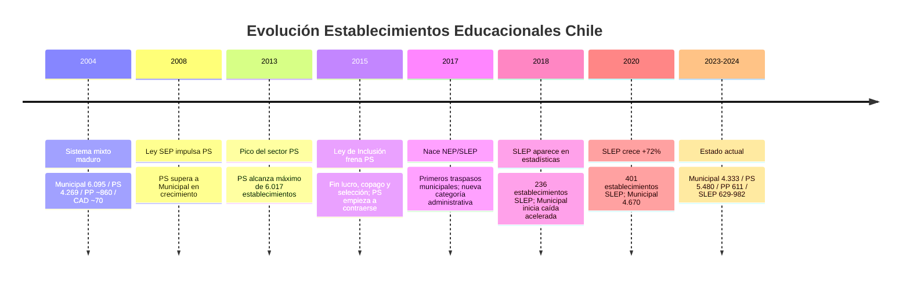

---
name: mercado_creacion_establecimientos
description: "Evolución del mercado de establecimientos educacionales Chile 2004-2024, análisis de oportunidades y proyecciones 2025-2045 por dependencia administrativa"
sources: [cowork]
aliases:
  - mercado educacional Chile
  - establecimientos educacionales
  - proyección colegios Chile
  - SLEP evolución
  - particulares subvencionados
tags:
  - evidencia
  - mercado
  - proyeccion
---

# Mercado de Establecimientos Educacionales: Evolución y Proyecciones

> Fuente: *Proyección de la Evolución del Número de Establecimientos Educacionales Chilenos a 20 Años y Análisis de Mercado* (docx, 74.372 chars; análisis histórico 2004-2024 y proyecciones 2025-2045).

El número y tipo de establecimientos educacionales es el mapa físico del cuasimercado educacional chileno. Su evolución durante 20 años documenta el impacto de cuatro grandes reformas legislativas, la transición demográfica y la tensión permanente entre lógicas de mercado y de derecho social. Las proyecciones a 2045 revelan un sistema en **reconfiguraciónc estructural**: la desaparición de la dependencia municipal y la emergencia de los SLEP como columna vertebral de la educación pública.

---

## 1. Evolución Histórica 2004-2024: Cuatro Actos

### 1.1 Tabla Histórica por Dependencia

| Año | Municipal | PS | PP | CAD | SLEP | **Total aprox.** |
|-----|:---------:|:--:|:--:|:---:|:----:|:----------------:|
| 2004 | 6.095 | 4.269 | ~860 | ~70 | — | ~11.300 |
| 2013 | ~5.300 | **6.017** | ~595 | ~70 | — | ~12.000 |
| 2018 | 4.925 | 5.665 | 678 | ~70 | 236 | ~11.574 |
| 2019 | 4.879 | 5.599 | 626 | ~70 | 233 | ~11.407 |
| 2020 | 4.670 | 5.575 | 626 | ~70 | **401** | ~11.342 |
| 2023 | 4.333 | 5.480 | 611 | ~70 | 629 | ~11.123 |
| 2024 | ~3.800↓ | ~5.400 | ~620 | ~70 | **982** | ~10.870 |

*El crecimiento SLEP es exactamente el correlato de la caída Municipal: no son cierres, son traspasos administrativos.*

---

## 2. Las Cuatro Fuerzas que Configuraron el Sistema

### Fuerza 1 — Demografía: La Presión Silenciosa

La tasa de natalidad ha caído sostenidamente. La **TGF de 1,16 en 2023** (muy por debajo del nivel de reemplazo de 2,1) anticipa que la población escolar seguirá contrayéndose. Entre 1990-2010 el sistema crecía impulsado por expansión de cobertura; desde 2010 la demanda total disminuye.

La **inmigración** es la contra-tendencia: +20,6% anual de matrícula extranjera en los últimos 7 años (hasta 2023), llegando al 7,4% de la matrícula total. Se concentra en regiones del norte y RM, y en educación básica (60,8%). Los migrantes se matriculan preferentemente en establecimientos públicos → presiona capacidad SLEP en comunas específicas.

### Fuerza 2 — Ley SEP 2008: El Boom PS

Al entregar recursos adicionales por alumno prioritario, la SEP hizo atractivo para los PS atender a estudiantes vulnerables. Resultado: los PS **atrajeron matrícula desde el sector municipal**, pasando de 4.269 a 6.017 establecimientos en 2004-2013. Este boom fue impulsado también por la lógica de lucro que aún era permitida → las familias "votaban con los pies" hacia los PS más atractivos.

**Efecto secundario perverso:** la SEP aceleró el vaciamiento del sector municipal al facilitar la migración de matrícula, profundizando la espiral de desfinanciamiento de las escuelas públicas.

### Fuerza 3 — Ley de Inclusión 2015: El Frenazo del Mercado

Al prohibir lucro, copago y selección, la Ley de Inclusión cambió radicalmente las reglas del juego para los PS:
- Eliminó la fuente de ingresos del copago
- Exigió transformación a entidades sin fines de lucro
- Requirió ser propietario del inmueble
- Implementó el SAE (algoritmo Gale-Shapley) que reemplazó la selección directa

**Resultado directo:** el 64% de los cierres de establecimientos entre 2016 y 2023 correspondió al sector PS. Los que no podían o no querían adaptarse cerraron. El sector PS pasó de 6.017 (2013) a 5.480 (2023) → pérdida neta de 537 establecimientos en 10 años.

**Nueva restricción a la apertura:** la Ley exige acreditar "demanda insatisfecha" para abrir nuevos PS subvencionados. Un análisis estima que el **78% de las comunas no cumple este requisito**, cerrando la puerta a nuevos PS en la mayoría del territorio nacional.

### Fuerza 4 — NEP/SLEP 2017: La Reestructuración Pública

La Ley 21.040 creó 70 nuevas entidades estatales descentralizadas (SLEP) para reemplazar a los municipios como administradores de la educación pública. No es un cierre de escuelas sino un **traspaso de propiedad administrativa** con implicancias profundas:
- Los SLEP tienen gestión técnica especializada (vs. municipios con múltiples funciones)
- Presupuesto público directo (vs. dependencia del erario municipal)
- Visión sistémica de red escolar territorial (vs. atomización municipal)

**Estado actual (2024):** 24 SLEP administran 982 establecimientos. El traspaso completo aún está en curso — quedan ~3.400 establecimientos municipales por transferir.

---

## 3. Análisis de Mercado: Oportunidades y Restricciones

### 3.1 Dónde hay Demanda

La concentración de la demanda en el SAE revela la estructura real del mercado:
- El **10% de los colegios** concentra el 90% de las postulaciones
- El 90% de los establecimientos con alta demanda son PS
- El 60% de los establecimientos con alta demanda tenían históricamente copago

Esto configura un mercado con **polos de atracción fuertemente establecidos**. Entrar a competir con los PS más demandados requiere diferenciación radical.

### 3.2 Nichos con Potencial

| Nicho | Sector principal | Potencial | Barreras |
|-------|:----------------:|:---------:|---------|
| STEAM y tecnología educativa | PS/PP | Alto | Inversión en equipamiento |
| Bilingüismo e inglés intensivo | PS/PP | Alto | Planta docente bilingüe |
| Enfoque socioemocional | PS/PP | Medio | Diferenciación perceptible |
| Necesidades Educativas Especiales (NEE) | PS/PP | Medio-Alto | Especialización docente |
| TP pertinente (sectores productivos locales) | PS | Medio | Vinculación empresarial |
| Altas capacidades | PP | Bajo-Medio | Nicho pequeño en Chile |
| Intercultural/migrante | SLEP/PS | Medio | Financiamiento incierto |

### 3.3 La Restricción Regulatoria del 78%

El análisis más significativo del documento: el 78% de las comunas no cumplen el requisito de "demanda insatisfecha" para abrir nuevos PS subvencionados. Esto significa que:
- El crecimiento numérico del sector PS está estructuralmente limitado
- Los nuevos PS solo pueden abrirse en zonas de crecimiento demográfico (norte, RM periferia) o con proyectos "significativamente distintos"
- El sector PP tiene **mayor libertad** para abrir porque no depende de subvención estatal

---

## 4. Proyecciones 2025-2045: El Sistema Reconfigurará

### 4.1 Tabla de Proyección

| Año | Municipal | PS | PP | CAD | SLEP | **Total** |
|-----|:---------:|:--:|:--:|:---:|:----:|:---------:|
| 2025 | ~2.500 | ~5.400 | ~625 | ~70 | ~1.500 | ~10.095 |
| 2030 | ~500 | ~5.300 | ~640 | ~70 | ~3.500 | ~10.010 |
| 2035 | **→ 0** | ~5.200 | ~655 | ~70 | **~4.200** | ~10.125 |
| 2040 | 0 | ~5.100 | ~670 | ~70 | ~4.200 | ~10.040 |
| 2045 | 0 | **~5.000-5.400** | **~650-700** | ~70 | **~4.000-4.400** | **~10.500-10.800** |

*Proyecciones del informe. Las cifras son rangos; incertidumbre principal: evolución política y reformas de financiamiento.*

### 4.2 Cinco Tendencias Estructurales a 2045

**T1 — Desaparición de la dependencia Municipal (2030-2033):** el traspaso completo a SLEP eliminará esta categoría administrativa. No desaparece la educación pública; cambia quién la gestiona.

**T2 — SLEP como columna vertebral pública (4.000-4.400 establecimientos):** absorberá toda la ex-municipal más los ajustes por eficiencia (fusiones en zonas despobladas). El éxito o fracaso de los SLEP definirá la calidad de la educación pública para toda una generación.

**T3 — PS en equilibrio relativo (5.000-5.400):** la restricción del 78% + presión demográfica + condiciones sin lucro estabilizan el sector. No habrá expansión, pero tampoco colapso si se mantiene el financiamiento vía subvención.

**T4 — PP en crecimiento de nicho (650-700):** el único sector con libertad regulatoria plena crece modestamente, concentrado en áreas urbanas de altos ingresos con propuestas diferenciadas.

**T5 — CAD estable (~70):** sin cambios esperados en el DL 3.166 que rige a los liceos TP de administración delegada.

### 4.3 El Escenario Alternativo: ¿Qué Pasaría si se Reformara el Financiamiento?

El modelo actual de subvención por asistencia genera inestabilidad estructural: cuando baja la matrícula, cae el financiamiento, baja la calidad, cae más la matrícula → espiral negativa. La alternativa discutida es un **financiamiento basal** (costo fijo por operación, independiente de la asistencia).

Si se aprueba el financiamiento basal:
- Los SLEP ganarían estabilidad financiera → posible mejora de resultados
- Los PS gratuitos tendrían más certeza → menor incentivo al cierre
- Pero se eliminaría el incentivo de mercado para captar matrícula → debate sobre eficiencia

---

## 5. Interpretación por Actor

| Actor | Situación 2025 | Estrategia sugerida | Riesgo principal |
|-------|---------------|---------------------|-----------------|
| **MINEDUC/DEP** | Responsable del traspaso SLEP | Financiamiento basal + capacitación técnica SLEP | Fracaso NEP = crisis pública sin alternativa |
| **SLEP** | 982 establec., creciendo | Priorizar gestión pedagógica sobre administrativa | Burocratización sin mejora de aprendizajes |
| **Sostenedores PS** | 5.480 establec., sector estabilizado | Diferenciación cualitativa + eficiencia sin lucro | Competencia de SLEP mejorado + presión demográfica |
| **Sostenedores PP** | 611 establec., crecimiento moderado | Nichos STEAM, bilingüe, alto nivel | Escrutinio público sobre equidad y segregación |
| **Nuevos proyectos** | Alta barrera regulatoria PS | Solo PP viable en zonas sin restricción, o PS con demanda acreditada | Marco regulatorio cambiante |

---

## 6. El Cuasimercado en 2045: ¿Qué Sistema Habrá?

La proyección muestra que el sistema chileno de 2045 será estructuralmente diferente al de 2004 pero reconociblemente continuador de la misma tensión fundante:

- Un **sector público fuerte y unificado** bajo SLEP (4.000-4.400 establecimientos, ~40% del sistema): más profesional que la municipalización, pero sometido a la misma presión de demostrar resultados
- Un **sector PS consolidado** (5.000-5.400 establecimientos, ~50% del sistema): sin lucro, sin copago, sin selección → un cuasimercado regulado donde la competencia opera sobre calidad pedagógica y proyecto educativo
- Un **sector PP de nicho** (650-700 establecimientos, ~6% del sistema): el único espacio donde el mercado opera sin restricciones, sirviendo al segmento de mayor capital económico y cultural

La pregunta que este mapa no responde es si este diseño produce **movilidad social** o **reproducción de élites**. Los datos SIMCE sugieren que la arquitectura institucional (SLEP + PS regulado + PP libre) todavía no ha roto el mecanismo central del árbol de problemas: la segregación socioeconómica que convierte el origen en destino — [[arbol_problemas_politica_educacional]].

---

## 7. Lectura Teórica (Collins/Hopper)

**El cuasimercado como F5 institucionalizado:** el mercado de establecimientos es el mecanismo físico a través del cual opera la reproducción de élites (F5). La concentración de demanda en el 10% de los colegios más atractivos no es irracionalidad de las familias: es la expresión racional de un sistema donde el establecimiento al que se asiste predice fuertemente las trayectorias educativas y laborales posteriores.

**Ley de Inclusión como F4:** la eliminación del copago y la selección fue el mayor intento legislativo de F4 (democratización). Su resultado a 10 años (2015-2025) es ambivalente: los PS más demandados siguen atrayendo a las familias con mayor capital cultural (que ahora usan el SAE de manera más sofisticada), mientras que los PS de menor demanda siguen siendo la opción residual.

**SLEP como apuesta por F1+F4:** la NEP apuesta a que un sistema público profesionalizado puede cumplir simultáneamente la función de socialización (F1) y democratización (F4). Los resultados de los SLEP pioneros (2018-2025) son insuficientes para confirmar o refutar esta apuesta — el tiempo de implementación es demasiado corto para juzgar una reforma estructural de esta magnitud.

**La tensión irresuelta:** el mercado de PP (650-700 establecimientos, minoritario pero creciente) es la expresión más pura de F5. Mientras exista un sector que concentra recursos, redes y capital cultural diferenciado, la "igualdad de oportunidades" que F2 promete seguirá siendo una promesa incompleta — [[impacto_educacion_evidencia_empirica]].

---

## 8. Conexiones

- [[arbol_problemas_politica_educacional]] — las causas estructurales que este mercado materializa (C1: segregación; C2: financiamiento)
- [[analisis_ocde_simce_chile]] — resultados de aprendizaje diferenciados por dependencia
- [[propuestas_partidos_politicos_educacion]] — debate sobre el futuro de este mercado
- [[fundamentos_politica_educacional]] — historia del cuasimercado y el Estado Docente
- [[impacto_educacion_evidencia_empirica]] — evidencia sobre cómo la estructura de establecimientos afecta la movilidad social
- [[sistema_voucher_financiamiento]] — el mecanismo de USE que financia este mercado
- [[educacion_particular_subvencionada]] — el sector dominante del sistema
- [[SLEP]] — la nueva institucionalidad que reemplaza a la municipal
- [[proyeccion_matricula_escolar]] — la demanda que estas proyecciones deben satisfacer
- [[MOC_Politica_Educacional]] — mapa central de la investigación
