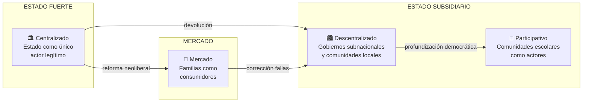
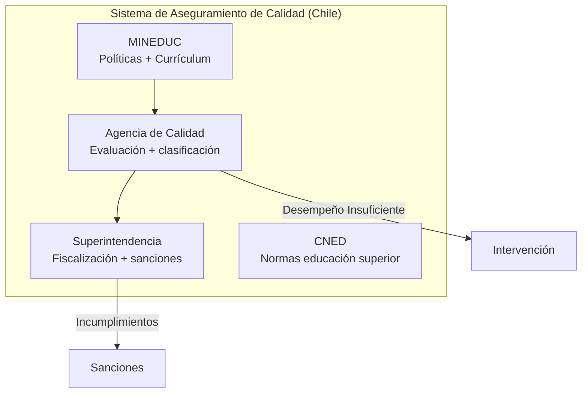

---
name: modelos_gobernanza_educacional
description: "Cuatro modelos de gobernanza educacional comparados — centralizado, descentralizado, participativo y de mercado — con sus dimensiones administrativa, financiera, curricular y de rendición de cuentas"
sources: [cowork]
aliases:
  - gobernanza educacional
  - modelos gestión educativa
  - centralización descentralización educación
  - educación de mercado
  - gobernanza participativa escuela
tags:
  - institucional
  - gobernanza
  - comparado
---

# Modelos de Gobernanza Educacional Comparados

> Fuente: *Modelos de Gobernanza Educacional Comparados* (html + docx, análisis comparativo de 4 modelos según 4 dimensiones; influencias OCDE y UNESCO; recomendaciones de política).

La gobernanza educacional es un **"concepto estelar"**: transita del Estado-nación hacia redes de actores que incluyen gobiernos subnacionales, comunidades, familias, sector privado y organismos internacionales. No existe un modelo óptimo universal — cada uno presenta ventajas y limitaciones según el contexto sociopolítico y las prioridades de política.

---

## 1. Los Cuatro Modelos: Vista General

---

## 2. Dimensión Administrativa

| Modelo | Estructura | Toma de decisiones | Rol del Estado | Actores clave |
|--------|-----------|-------------------|----------------|---------------|
| **Centralizado** | Jerarquía vertical única | Ministerio → escuelas | Proveedor y controlador | Burocracia ministerial |
| **Descentralizado** | Multi-nivel (regional/local) | Delegada a unidades subnacionales | Subsidiario, normativo | Municipios, regiones |
| **Participativo** | Redes horizontales | Consejos escolares, comunidad | Facilitador | Directivos, docentes, familias, estudiantes |
| **Mercado** | Competencia entre proveedores | Familias como consumidores | Regulador mínimo | Sostenedores, familias |

**El caso chileno como laboratorio**: Chile experimentó con todos los modelos en secuencia — centralización extrema pre-1980 → mercado radical post-1981 → descentralización municipal parcial → NEP 2017 (SLEP como mezcla descentralización + mayor presencia estatal). La insatisfacción sucesiva con cada modelo revela que ninguno resuelve por sí solo el problema de gobernanza.

---

## 3. Dimensión Financiera

| Modelo | Mecanismo de financiamiento | Criterio de asignación | Equidad |
|--------|----------------------------|------------------------|---------|
| **Centralizado** | Presupuesto estatal directo | Necesidad/política nacional | Alta (potencial) |
| **Descentralizado** | Transferencias + capacidad local | Mixto (necesidad + capacidad fiscal) | Variable (dependiente de riqueza local) |
| **Participativo** | Fondos comunitarios + estatales | Prioridades locales | Alta si hay mecanismos correctivos |
| **Mercado** | Voucher/subsidio a la demanda | Elección de familias | Baja (sin correcciones) |

**El voucher chileno y sus efectos**: el subsidio por asistencia (implementado 1981) es la expresión más pura del modelo de mercado. Los datos del sistema chileno muestran sus límites: segregación socioeconómica alta (Duncan index 0.657 pre-SAE), brecha de calidad de 55 puntos SIMCE entre GSE bajo y alto, y un mercado de establecimientos con alta mortalidad en zonas rurales.

---

## 4. Dimensión Curricular

| Modelo | Control curricular | Diversificación | Coherencia nacional |
|--------|-------------------|-----------------|---------------------|
| **Centralizado** | Ministerio define todo | Baja | Alta |
| **Descentralizado** | Marco nacional + adaptación local | Media | Media |
| **Participativo** | Comunidades definen énfasis | Alta | Baja (riesgo fragmentación) |
| **Mercado** | Cada institución define | Alta | Baja (riesgo homogeneización hacia lo "empleable") |

**Paradoja del mercado curricular**: la competencia entre establecimientos debería producir diversidad curricular. En la práctica, la presión por métricas estandarizadas (SIMCE, PSU/PAES) produce **isomorfismo**: todos los establecimientos enseñan para la prueba, eliminando la diversidad.

---

## 5. Dimensión de Rendición de Cuentas (Accountability)

| Modelo | Accountability a quién | Mecanismo principal | Consecuencia de bajo desempeño |
|--------|----------------------|--------------------|---------------------------------|
| **Centralizado** | Autoridad superior | Informes + inspección | Intervención jerárquica |
| **Descentralizado** | Autoridad local + comunidad | Evaluación territorial | Renegociación de mandatos |
| **Participativo** | Comunidad escolar | Autoevaluación + pares | Deliberación colectiva |
| **Mercado** | Familias-consumidoras | Elección + abandono | Cierre por falta de matrícula |

---

## 6. Influencias Internacionales: OCDE vs. UNESCO

La gobernanza educacional global está tensionada entre dos paradigmas en disputa:

| Dimensión | OCDE | UNESCO |
|-----------|------|--------|
| Propósito educación | Formación capital humano | Derecho humano universal |
| Criterio éxito | Resultados en pruebas + empleabilidad | Inclusión + dignidad + ciudadanía |
| Rol del Estado | Regulador de mercado | Garante de derechos |
| Diversidad | Obstáculo para estándares | Riqueza a preservar |
| Evaluación | Rankings + comparaciones | Diagnóstico para mejora |

**Chile en la tensión**: el diseño del SAC (evaluación externa, clasificación, intervención) sigue la lógica OCDE. La NEP (fin de selección, fin de lucro, SAE, SLEP) incorpora más elementos UNESCO. La tensión está inscrita en la arquitectura del sistema post-LGE.

---

## 7. Análisis Comparativo: Eficiencia, Equidad y Calidad

### Eficiencia

| Modelo | Eficiencia administrativa | Eficiencia en uso de recursos | Limitación |
|--------|--------------------------|------------------------------|------------|
| Centralizado | Alta (economías de escala) | Media (rigidez burocrática) | Lentitud adaptativa |
| Descentralizado | Media | Media-alta (adecuación local) | Heterogeneidad de capacidades |
| Participativo | Baja (alta transacción) | Alta (pertinencia) | Escala limitada |
| Mercado | Alta (disciplina competitiva) | Variable | Externalidades negativas |

### Equidad

| Modelo | Distribución recursos | Inclusión | Segregación |
|--------|----------------------|-----------|-------------|
| Centralizado | Igualitaria (potencial) | Alta | Baja |
| Descentralizado | Heterogénea | Media | Media |
| Participativo | Comunitaria | Alta | Baja (intra-comunidad) |
| Mercado | Regresiva (sin correcciones) | Baja | Alta |

### Calidad

No existe evidencia de superioridad sistemática de ningún modelo en calidad de aprendizajes. Los sistemas de mayor rendimiento PISA (Finlandia, Singapur, Corea) presentan características mixtas: alta inversión estatal + autonomía docente + coherencia curricular + bajo peso de la competencia de mercado.

---

## 8. Recomendaciones de Política Comparada

Las cuatro recomendaciones que emergen del análisis comparado:

1. **Hibridación institucional**: los mejores sistemas combinan fortaleza estatal en financiamiento y estándares con autonomía escolar en pedagogía y gestión. El modelo "puro" (centralizado total o mercado total) falla en equidad o en adaptación.

2. **Capacidad subnacional**: la descentralización solo mejora resultados cuando las unidades subnacionales tienen capacidad técnica y financiamiento suficiente. La devolución sin recursos produce desigualdad territorial.

3. **Participación real, no simbólica**: los modelos participativos requieren mecanismos formales con poder real (no solo consultivos), docentes formados para la gestión democrática, y tiempo protegido para la deliberación.

4. **Accountability diferenciado**: los sistemas de rendición de cuentas deben ajustarse al contexto escolar (vulnerabilidad, trayectoria), no solo medir puntos absolutos. La clasificación de escuelas sin apoyo diferenciado produce estigma sin mejora.

---

## 9. Conclusiones

1. **No existe modelo óptimo universal**: la gobernanza debe ajustarse al contexto histórico, institucional y sociopolítico.
2. **La gobernanza es más que estructura formal**: incluye cultura organizacional, capacidades técnicas, relaciones de confianza entre actores.
3. **La tensión OCDE-UNESCO es irreducible**: refleja visiones diferentes sobre el propósito de la educación que no pueden "sintetizarse" técnicamente — son opciones políticas.
4. **El cambio de modelo no garantiza mejora**: Chile cambió radicalmente de modelo dos veces (1981 y 2015-2017) sin que la calidad de aprendizajes mejorara sustantivamente.
5. **La legitimidad importa**: los actores escolares (docentes, familias, comunidades) deben reconocer el modelo como legítimo para que funcione. Sin adhesión, cualquier estructura produce cumplimiento formal sin compromiso real.

---

## 10. Conexiones

- [[marco_teorico_sociologico_educacion]] — bases teóricas (Weber: burocracia; Foucault: gubernamentalidad; Popkewitz: sistemas de razón)
- [[estructura_legal_sistema_educacional]] — expresión jurídica de los modelos en Chile (LGE, NEP/SLEP, SAC)
- [[SLEP]] — la apuesta chilena por un modelo híbrido descentralizado-estatal
- [[cifras_sistema_educacional_chile]] — evidencia empírica de los efectos de los modelos
- [[arbol_problemas_politica_educacional]] — diagnóstico que los modelos pretenden resolver
- [[fundamentos_politica_educacional]] — marcos teóricos (F1-F5) que cada modelo prioriza
- [[politicas_educacionales_sistema_chileno]] — implementación concreta en el sistema chileno
- [[MOC_Politica_Educacional]] — mapa central de la investigación
