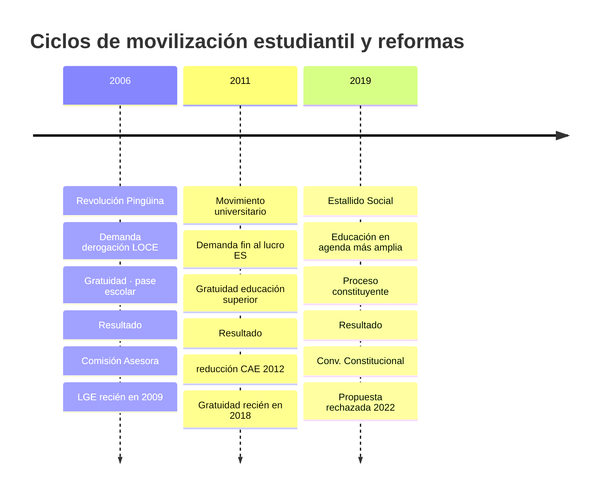
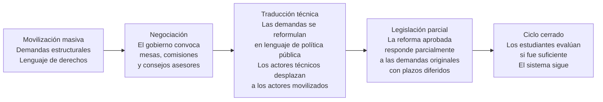

---
name: movilizacion_estudiantil_reformas
description: "Nota de síntesis. La movilización estudiantil chilena como motor de política educativa: qué produce, quién captura sus resultados y cuáles son sus límites."
sources: [cowork]
aliases:
  - Revolución Pingüina análisis
  - movimiento estudiantil 2011 Chile
  - protesta estudiantil y reforma educativa
  - movilización social y política educacional
tags: [actores, historia, politica, reforma, sociologia, tension]
---

# ¿La movilización estudiantil produce reformas o solo abre ciclos que otros cierran?

Chile tiene tres episodios mayores de movilización estudiantil desde la recuperación de la democracia: la Revolución Pingüina (2006), el movimiento estudiantil universitario (2011) y la participación estudiantil en el estallido social (2019). Los tres generaron demandas de transformación estructural del sistema educativo. Los tres produjeron cambios legislativos posteriores. La pregunta es si esos cambios respondieron a lo que los estudiantes pedían o si fueron capturados y reformulados por otros actores.

---

## I. Los tres ciclos de movilización

---

## II. El patrón de captura

En los tres casos se observa el mismo patrón:

---

## III. Análisis por episodio

### Revolución Pingüina (2006)

**Demanda central**: derogación de la LOCE, gratuidad universal, pase escolar gratuito.

**Lo que ocurrió**: el gobierno de Bachelet I convocó el Consejo Asesor Presidencial para la Calidad de la Educación. La LGE se promulgó tres años después, en 2009, con el gobierno siguiente ya en transición. La LOCE fue derogada, pero las normas sobre lucro, copago y selección — que eran el núcleo de la demanda — no fueron tocadas. Eso requirió la Ley de Inclusión de 2015, nueve años después de la movilización.

**Quién capturó el resultado**: los técnicos de política educativa y los partidos de la Concertación, que negociaron con la derecha una reforma posible dentro del quórum disponible.

### Movimiento 2011

**Demanda central**: fin al lucro en educación superior, gratuidad universal, reforma al CAE.

**Lo que ocurrió**: el gobierno de Piñera I redujo la tasa del CAE en 2012. La gratuidad en educación superior llegó recién con Bachelet II en 2018, siete años después, y solo para el 60% de menores ingresos. El fin al lucro en universidades no fue abordado con la misma fuerza que en el sistema escolar.

**Quién capturó el resultado**: los partidos que después formaron la Nueva Mayoría, que convirtieron las demandas del movimiento en programa de gobierno 2014-2018.

### Estallido Social (2019)

**Demanda central**: la educación fue parte de una demanda más amplia de cambio estructural del modelo neoliberal, canalizada en el proceso constituyente.

**Lo que ocurrió**: la Convención Constitucional redactó una propuesta con derechos educativos ampliados. Fue rechazada en el plebiscito de septiembre de 2022 con el 62% de los votos. El proceso constituyente de 2023 también concluyó sin nueva constitución.

**Quién capturó el resultado**: nadie, en este caso. La demanda se diluyó en el proceso constituyente fallido.

→ Ver [[demandas_actores_sociales_educacion]]

---

## IV. Lectura propia

Las movilizaciones estudiantiles chilenas producen reformas, pero no las reformas que piden. Generan tres efectos concretos: instalan temas en la agenda que antes eran impensables, erosionan la legitimidad del modelo vigente y crean presión para que los partidos adopten las demandas como programa electoral. Pero entre la demanda callejera y la reforma legislativa hay una zona de traducción donde los contenidos se negocian, se postergan y se moderan.

El patrón no es de fracaso sino de captura diferida: los estudiantes de 2006 obtuvieron la derogación de la LOCE en 2009 y la Ley de Inclusión en 2015. Los de 2011 obtuvieron la gratuidad en 2018. La demanda llega al sistema político, circula, y sale convertida en algo diferente — generalmente más acotado, más gradual y sin los componentes más radicales.

Esto no invalida la movilización como mecanismo de cambio. La alternativa — el cambio sin presión social — produjo en Chile cuatro gobiernos de la Concertación que no tocaron la arquitectura de la LOCE. La movilización es lenta e imperfecta como palanca de reforma, pero parece ser necesaria.

---

## V. Preguntas abiertas

1. ¿La generación que se movilizó en 2011 — que llegó al Congreso y al Ejecutivo con Boric — produce reformas más coherentes con las demandas originales o reproduce el mismo patrón de captura?
2. ¿El rechazo del proceso constituyente cerró el ciclo abierto por el estallido o dejó demandas latentes que buscarán otro canal?
3. ¿Existe un tipo de demanda educativa que los movimientos estudiantiles chilenos no han podido instalar en la agenda y por qué?
4. ¿Qué rol juegan los docentes organizados en el Colegio de Profesores como aliados o competidores del movimiento estudiantil en la disputa por la agenda educativa?

---

## VI. Referencias y vínculos

- [[demandas_actores_sociales_educacion]]
- [[opinion_publica_educacion_chile]]
- [[comparacion_LOCE_LGE]]
- [[linea_tiempo_politica_educacional_chile]]
- [[cuasimercado_educativo_persistencia]]
- [[actores_sociales_educacion_chile]]
- [[MOC_Politica_Educacional]]
