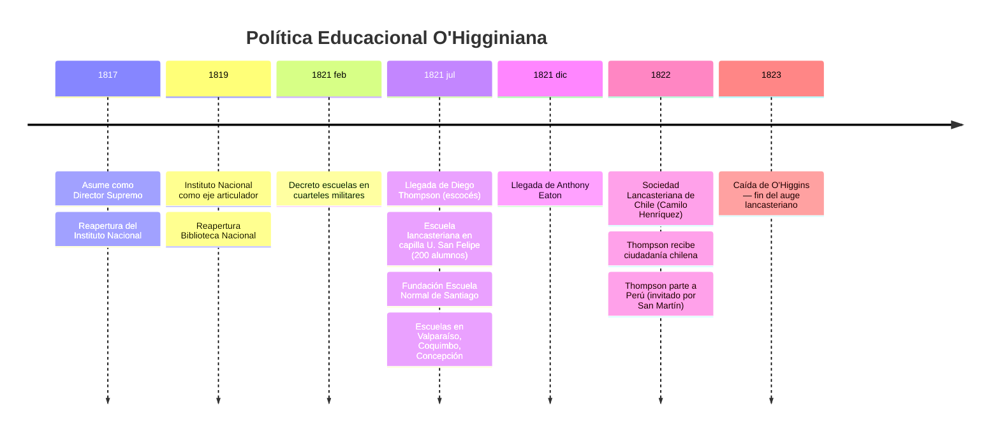
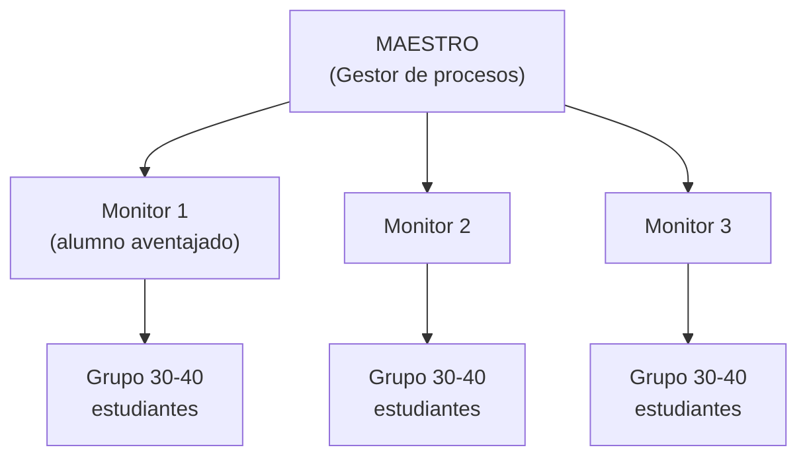
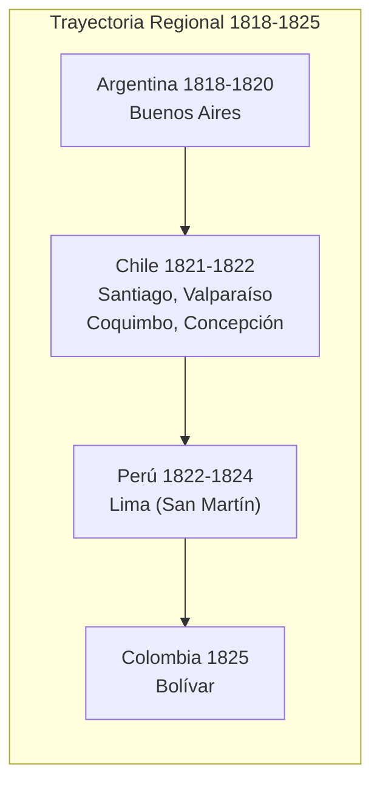

---
name: ohiggins_educacion_republicana
description: "Política educacional de O'Higgins (1817-1823) — sistema lancasteriano, Diego Thompson, Instituto Nacional, educación femenina y militar; antecedente del Estado Docente"
sources: [cowork]
aliases:
  - O'Higgins educación
  - sistema lancasteriano Chile
  - Diego Thompson Chile
  - enseñanza mutua Chile
  - educación republicana 1817
tags:
  - historia
  - institucional
  - colonial
---

# O'Higgins y la Educación Republicana (1817–1823)

> Fuente: *La Reingeniería de las Luces: La Política Educacional de Bernardo O'Higgins y la Implantación del Modelo Lancasteriano en el Chile Republicano* (docx, análisis histórico con fuentes primarias y secundarias).

La consolidación de la independencia tras Chacabuco (1817) no fue solo un cambio en el poder político: fue el inicio de una reestructuración de la sociedad civil basada en el liberalismo ilustrado. O'Higgins concebía que la libertad política era insostenible sin una ciudadanía ilustrada — la educación se convirtió en la **herramienta estratégica** de su administración.

---

## 1. Contexto: El Desafío Educativo de la Post-Independencia

Al asumir en 1817, O'Higgins encontró:
- Infraestructura educativa mínima heredada del período colonial
- Analfabetismo casi absoluto en los sectores populares
- Tesoro nacional agotado por las guerras de emancipación

La solución: adoptar el **sistema lancasteriano** (enseñanza mutua) como respuesta técnica y económica para masificar la instrucción a bajo costo.

---

## 2. Fundamento Filosófico: Educación como Soporte de la Libertad

O'Higgins sostenía que el progreso de la **ilustración y la opinión pública** era un fenómeno irresistible tras siglos de opresión colonial. Su convicción:

- La ignorancia era terreno fértil para el **caudillismo y la anarquía**
- La "felicidad pública" (utilitarismo de la época) dependía de que los habitantes fueran **laboriosos y letrados**
- La educación debía ser **uniforme, estandarizada y supervisada** directamente por el gobierno

| Paradigma Colonial | Paradigma O'Higginiano |
|--------------------|------------------------|
| Educación para élite nobiliaria y clero | Educación para todos, "sin excepción de calidad, fortuna, sexo o edad" |
| Escolástica y disputas abstractas | Ciencias prácticas, artes mecánicas, humanidades |
| Control de la Iglesia | Control del Estado, con Iglesia subordinada |
| Analfabetismo como orden natural | Analfabetismo como "abuso del gobierno feudal" |
| Educación como privilegio | Instrucción primaria como "primer cuidado" del Estado |

---

## 3. La Revolución Lancasteriana: Técnica y Mecánica

El **sistema monitorial de Joseph Lancaster y Andrew Bell** (Inglaterra, Revolución Industrial) permitía que un solo preceptor dirigiera cientos de estudiantes a través de **alumnos-monitores**.

### Organización del Aula

- Sala rectangular con bancos en hileras simétricas
- Grupos de 30-40 alumnos por monitor
- Carteles en paredes para lectura simultánea (ahorra libros)
- **Cajas de arena** para escritura inicial (sin costo de papel)
- Pizarras individuales → papel (progresión por mérito)

### Sistema de Monitores

- **Premios morales**: medallas e insignias de mérito
- **Castigos simbólicos**: pérdida de privilegios (no violencia física)
- Principio: *"debe tener algo que hacer a cada momento y una razón para hacerlo"*
- La escuela como *"nación o república en miniatura"*: ciudadanos que cumplen deberes para gozar derechos

---

## 4. Los Agentes del Cambio: Thompson y Eaton

### Diego Thompson (James Burnet Thompson, 1778-1850)

Educador escocés, misionero bautista, agente de la Sociedad Bíblica Británica y Extranjera. Llegó a Chile en **julio de 1821** tras exitosa labor en el Río de la Plata.

**Logros en Chile (1821-1822):**
- Fundó la **Escuela Normal de Santiago** (primera formación profesional docente)
- Escuelas en Valparaíso, Coquimbo, Concepción
- Promovió la **Sociedad Lancasteriana de Chile** (1822, dir. Camilo Henríquez)
- Ciudadanía chilena otorgada por O'Higgins el 31/05/1822

### Anthony Eaton

Llegó a fines de 1821 para asegurar la **continuidad técnica** de las escuelas mientras Thompson se expandía regionalmente.

---

## 5. Instituciones de Élite: Instituto Nacional y Biblioteca Nacional

### Instituto Nacional (reabierto 1819)

Había sido clausurado durante la Reconquista española. O'Higgins lo concibió como:
- **Eje articulador** de la educación pública del país
- Currículum integrador: humanidades + artes mecánicas + ciencias prácticas
- Ruptura con la escolástica colonial ("voces e imaginaciones abstractas")
- *"Foco de las luces"* desde donde irradiar cultura a las provincias

### Biblioteca Nacional (reabierta)

Componente estratégico de la educación superior:
- Acceso gratuito a información nacional e internacional
- Repositorio para que los ciudadanos *"se corrijan"* y perfeccionen autónomamente
- El gobierno debía remover todos los obstáculos para adquirir libros y periódicos

---

## 6. Inclusión y Extensión Educativa

O'Higgins extendió la educación a sectores históricamente excluidos. No era solo filantropía: era **necesidad utilitaria** de erradicar la indigencia y crear elementos productivos.

| Sector | Medida | Fundamento |
|--------|--------|------------|
| **Mujeres** | Decreto: cada monasterio debía habilitar escuela de primeras letras para niñas pobres; Estado paga sueldos de maestras | "Madre ilustrada → mejores ciudadanos futuros" |
| **Soldados** | Decreto 23/02/1821: escuelas en cuarteles militares para tropas, hijos y niños aledaños | Profesionalizar tropa + centros culturales en provincias |
| **Pobres** | Gratuidad absoluta; órdenes religiosas debían proveer útiles gratuitos a alumnos pobres | Erradicar ocio y "tinieblas" coloniales |
| **Artesanos** | Educación primaria + fomento de industria y artes mecánicas | "Borrar de los oficios todo deshonor" |

---

## 7. La Cuestión Religiosa: Tensión con el Clero

La mayor fricción: Thompson usaba el **Nuevo Testamento** como texto de lectura (versiones bíblicas protestantes).

```mermaid
graph LR
    subgraph CLER["Posición del Clero"]
        C1["3 siglos de censura inquisitorial"]
        C2["Monopolio educativo eclesiástico"]
        C3["Constitución 1822: catolicismo exclusivo"]
        C4["Thompson = hereje e intruso"]
    end
    subgraph OHIG["Posición O'Higgins"]
        O1["Apertura a educadores protestantes"]
        O2["Cementerio disidentes (tolerancia)"]
        O3["Educación como función del Estado"]
        O4["Clero como aliado subordinado"]
    end
    CLER -->|"tensión"| OHIG
    OHIG -->|"mediación"| CAM["Camilo Henríquez<br/>(clérigo liberal,<br/>dir. Sociedad Lancasteriana)"]
```

La resistencia eclesiástica respondía a una lucha por el **control de la conciencia ciudadana**:
- Iglesia: educación como "aprender a rezar" y someterse a la autoridad
- O'Higgins: formar sujetos racionales y críticos

Thompson sorteó la hostilidad con conducta prudente y alianzas con clérigos liberales.

---

## 8. Pedagogía Lancasteriana: La Escuela como Laboratorio de Ciudadanía

El sistema no era solo técnica de lectoescritura: era una **filosofía del comportamiento social** aplicada al aula.

| Principio | Práctica en el aula | Transferencia republicana |
|-----------|---------------------|--------------------------|
| Democracia del conocimiento | Alumnos como monitores-instructores | Ciudadanos como agentes políticos |
| Regularidad y orden | Movimientos reglamentados, registros de progreso | Hábitos para vida industrial y democrática |
| Obediencia a la norma | Reglas comunes aplicadas con imparcialidad | Ciudadanos que cumplen la ley |
| Meritocracia | Ascenso de clase por desempeño académico | Movilidad social por virtud y trabajo |
| Autonomía estudiantil | *"Facultad inherente de transmitir y recibir instrucción mutua"* | Liderazgo temprano, reducción de dependencia |

---

## 9. Legado e Impacto a Largo Plazo

Aunque el sistema lancasteriano decayó tras la caída de O'Higgins (1823) por inestabilidad política y oposición clerical, las **semillas de la política o'higginiana** definieron la trayectoria educativa del siglo XIX:

| Iniciativa O'Higginiana | Continuación posterior |
|------------------------|----------------------|
| Escuela Normal de Santiago (Thompson, 1821) | Escuela Normal de Preceptores (Sarmiento, 1842) |
| Instituto Nacional (reabierto 1819) | Universidad de Chile (1843) — eje del sistema |
| Biblioteca Nacional (reabierta) | Pilar del sistema de instrucción pública |
| Educación como función del Estado | Constitución 1833, Art. 153 (Portales) |
| Gratuidad e inclusión popular | Ley de Instrucción Primaria 1860 |
| Escuelas militares (1821) | Extensión territorial del sistema público |

> *"La democracia es, ante todo, un proyecto pedagógico que requiere de la ilustración constante de todos sus miembros."* — síntesis del legado o'higginiano

---

## 10. Interpretación Collins/Hopper

| Función | Expresión en política o'higginiana |
|---------|-----------------------------------|
| **F1 Socialización** | La escuela lancasteriana inculca hábitos republicanos: orden, regularidad, obediencia a la norma, patriotismo |
| **F2 Selección meritocrática** | Sistema de monitores: ascenso por mérito académico, no por cuna; "igualdad de trato a todos los discípulos" |
| **F3 Formación mercado** | Educación de artesanos/labradores para la industria; "borrar deshonor de los oficios"; ciudadanos productivos |
| **F4 Democratización** | Inclusión radical: mujeres, soldados, pobres, sectores rurales; ruptura con exclusividad aristocrática colonial |
| **F5 Reproducción élites** | Instituto Nacional mantiene formación diferenciada para élite intelectual y burocrática ("ciencias sólidas") |

---

## 11. Conexiones

- [[historia_educacion_chilena_colonial_sigloXIX]] — antecedente colonial directo; contexto inmediato del que O'Higgins parte
- [[portales_educacion_estado_docente]] — continuación y consolidación conservadora del Estado Docente (1830-1837)
- [[marco_teorico_sociologico_educacion]] — Weber (racionalización), Parsons (universalismo), Foucault (panóptico escolar)
- [[modelos_gobernanza_educacional]] — modelo centralizado en formación; el Estado asume educación como función propia
- [[politicas_educacionales_sistema_chileno]] — trazabilidad histórica del Estado Docente hasta el presente
- [[MOC_Politica_Educacional]] — mapa central de la investigación
