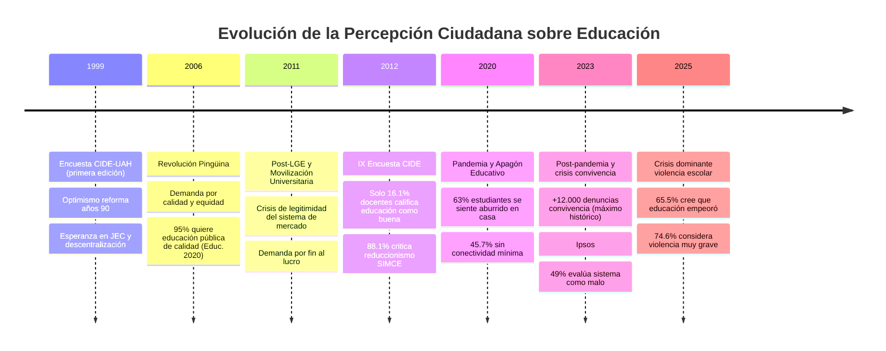
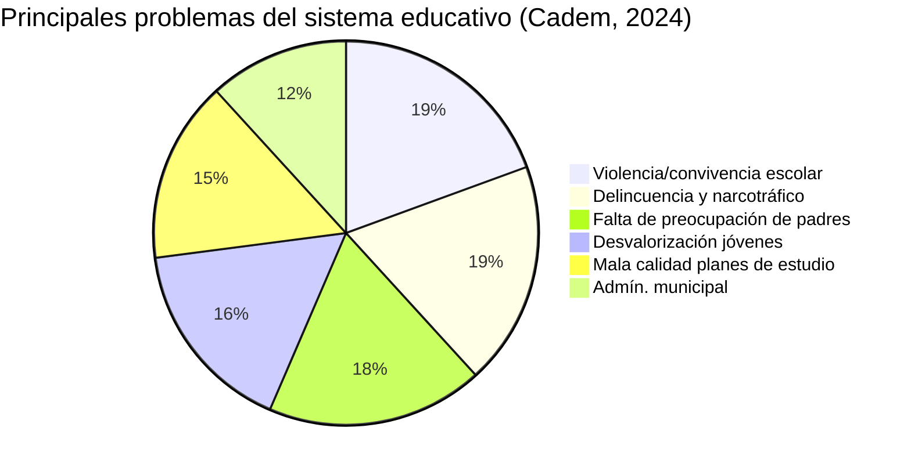
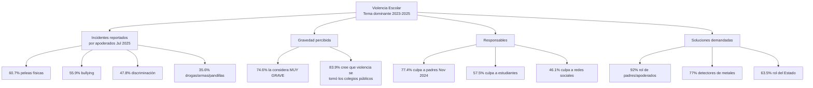
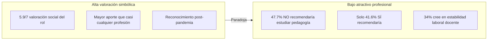
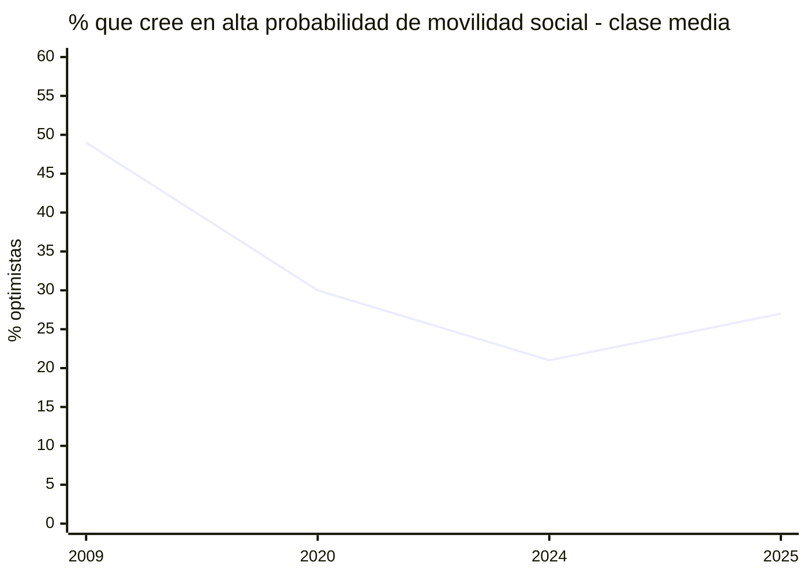
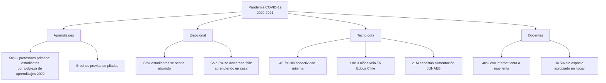
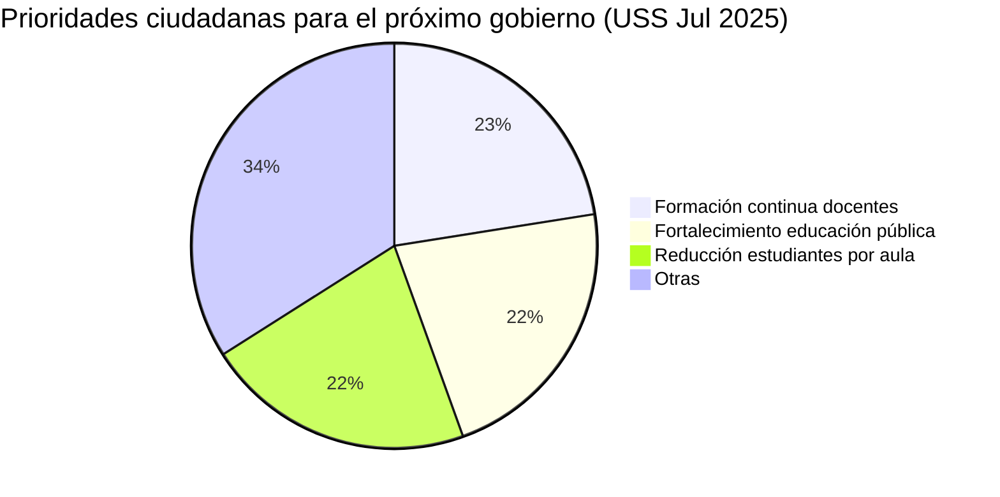
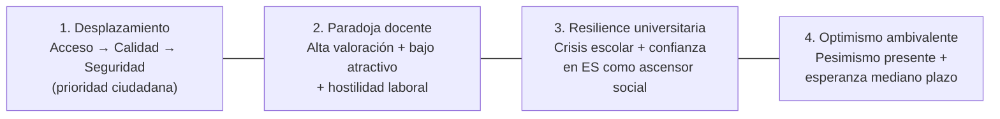

---
name: opinion_publica_educacion_chile
description: "Análisis de encuestas de opinión pública sobre educación en Chile (1999-2025): percepción de calidad, violencia escolar, rol docente, movilidad social y demandas ciudadanas. Fuentes CEP, Cadem, Ipsos, CIDE-UAH, Bicentenario UC, USS."
sources: [cowork]
aliases:
  - encuestas educación Chile
  - opinión pública educación
  - percepción ciudadana sistema escolar
  - Chile Nos Habla educación
  - Bicentenario UC educación
  - CIDE UAH encuesta actores
tags: [institucional, politica, sociologia, historia, 2026]
---

# Opinión Pública sobre Educación en Chile (1999–2025)

## Panorama General: Un Sistema en Crisis de Confianza

---

## Fuentes del Análisis

| Instrumento | Institución | Alcance |
|-------------|-------------|---------|
| **Encuesta Nacional Actores Sistema Educativo (CIDE)** | U. Alberto Hurtado | 1999–2023; docentes, directivos, estudiantes, apoderados |
| **Encuesta Bicentenario UC** | P. Universidad Católica | Anual; ciudadanía general; 2004–2025 |
| **Monitor Global Educación** | Ipsos | Internacional; 30 países; 2023–2024 |
| **Encuesta Chile Nos Habla** | U. San Sebastián | 2024–2025; Nov y Jul; n=1.965 |
| **Encuesta CEP** | Centro de Estudios Públicos | Semestral; prioridades nacionales |
| **Cadem / Plaza Pública** | Cadem | Semanal; percepción calidad educativa |
| **Encuesta Educación 2020** | Fundación Educ. 2020 | 2011–2022; temas específicos |

---

## I. Percepción de Calidad Educativa

### Evaluación por Dependencia (Escala 1–7, 2024–2025)

```mermaid
xychart-beta
    title "Evaluación calidad educativa por dependencia (1-7)"
    x-axis ["Privada", "Part. Subvenc.", "Pública"]
    y-axis "Nota promedio" 1 --> 7
    bar [5.65, 4.73, 3.48]
    bar [5.70, 4.70, 3.20]
```

*Barras: Nov 2024 / Jul 2025 — La educación pública cayó de 3.48 a 3.20 en 7 meses.*

### Percepción Internacional Comparada

- **Ipsos 2024**: Chile ocupa el puesto **26 de 30 países** en valoración positiva del sistema educativo
- Solo un **15% califica el sistema como "bueno"** (promedio global: 33%)
- **49%** lo considera "malo" (uno de los niveles más altos del mundo)
- **48%** cree que la educación actual es **peor** que la que ellos recibieron

**Paradoja chilena**: A pesar de resultados educativos comparativamente mejores en AL, la percepción ciudadana es más negativa que el promedio mundial.

### Educación Superior: Excepción a la Regla

| Indicador | Dato |
|-----------|------|
| Evaluación positiva educación universitaria | 61% (Chile) vs. 53% (global) |
| Confianza en universidades (Bicentenario UC) | 52–56% |
| Impacto positivo para graduados | 82% |
| Impacto negativo para desertores | 55% (carga financiera + estigma) |

---

## II. Principales Preocupaciones Ciudadanas

### Ranking de Urgencias (Encuesta Chile Nos Habla, Jul 2025)

1. **38.7%**: Violencia escolar (problema más urgente)
2. **Desigualdad de acceso**: 44% la considera el mayor desafío (Ipsos, sep 2024)
3. **Déficit docente**: proyección de 26.000 profesores idóneos faltantes para 2025
4. **Asistencia y deserción**: desde 2019 el alumno promedio presenta inasistencia grave
5. **Brecha digital**: 45.7% sin conectividad mínima en pandemia

---

## III. Crisis de Convivencia y Violencia Escolar

La violencia escolar emerge como **el fenómeno dominante** en la percepción ciudadana 2023–2025:

**Tendencia**: La percepción de gravedad bajó levemente de 77.8% (Nov 2024) a 74.6% (Jul 2025) pero sigue siendo la preocupación número 1.

> **Nota crítica**: El apoyo al 77% a detectores de metales expresa una respuesta de pánico ante la fractura del tejido social escolar, pero expertos advierten que erosiona el clima de confianza necesario para el aprendizaje sin atacar causas raíz.

---

## IV. Rol Docente: Paradoja de Alta Valoración y Bajo Atractivo

### Dificultades Principales del Ejercicio Docente (Jul 2025)

| Dificultad | % Ciudadanos que la señalan |
|-----------|---------------------------|
| Violencia/convivencia escolar en aula | 52.8% |
| Sobrecarga/agobio laboral | 39.6% |
| Bajos sueldos | 32.2% |
| Burnout/agotamiento emocional | 31.3% |

### Apoyos para Fortalecer la Calidad Docente

1. **55.1%**: Mejores condiciones laborales (sueldo, estabilidad)
2. **50.4%**: Menor cantidad de estudiantes por sala
3. **40.7%**: Mayor respeto y valoración social

### Crisis de Dotación

- **Déficit proyectado**: 26.000 profesores idóneos para 2025 (Elige Educar + MINEDUC)
- **44%** de establecimientos tiene al menos 1 hora sin profesor idóneo
- Regiones críticas: Tarapacá, Antofagasta, Coquimbo (déficit 26–30%)
- Ley Carrera Docente mejora remuneraciones pero no resuelve la percepción de hostilidad laboral

---

## V. Rol de Padres y Apoderados

El dato más contundente de las encuestas 2024–2025:

> **73.1%** considera que lograr un rol más activo de padres y apoderados es la medida **más importante** para mejorar la calidad educativa (Chile Nos Habla, Jul 2025).

| Aspecto | Dato |
|---------|------|
| Principal preocupación de apoderados | Que conocimientos sean útiles para el futuro (34.8%) |
| Segunda preocupación | Violencia escolar (17.8%) |
| Se siente bien informado | 47.7% |
| A veces informado | 34.6% |
| No informado | 17.6% |

**Rol que deberían tener los padres** (según ciudadanía):
- 27.9%: Apoyar aprendizaje en casa
- 19.3%: Comunicación fluida con docentes
- 18.6%: Apoyar a la autoridad escolar

---

## VI. Movilidad Social y Expectativas de Futuro

*Fuente: Encuesta Bicentenario UC. Caída histórica de 49% → 21% en 15 años, con leve repunte 2025.*

### Contradicciones de la Percepción

- **57%**: "En Chile solo se tiene éxito si se viene de familia con dinero o conexiones"
- **41%**: "El esfuerzo personal puede conducir al éxito"
- **76%**: "Es mejor tener pocos hijos pero asegurarles educación de alta calidad"
- **50% (2025)**: Chile resolverá el problema de calidad educativa en 10 años (vs. 31% en 2024)

Este "**optimismo resiliente**" coexiste con el pesimismo sobre el presente.

---

## VII. Habilidades del Siglo XXI: Déficit Percibido

Ciudadanía que cree que el currículum tiene **muy poco espacio** para (Ipsos 2024):

| Habilidad | % insatisfechos |
|-----------|----------------|
| Fomento de la curiosidad | 64% |
| Pensamiento crítico | 63% |
| Bienestar del estudiante | 62% |
| Nuevas tecnologías | 59% |
| Colaboración | 56% |

**50%** considera que la infraestructura es adecuada y **51%** cree que el currículum prepara para futuras carreras — lo que sugiere que el malestar no es con los "recursos" sino con los **resultados y el clima** escolar.

---

## VIII. Pandemia y "Apagón Educativo" (2020–2023)

**Respuesta del Estado**: Aprendo en Línea, TV Educa Chile, 21M canastas JUNAEB — pero no pudieron evitar la pérdida masiva de aprendizajes básicos.

---

## IX. Prioridades para el Próximo Gobierno (Jul 2025)

**Focalización de recursos fiscales** (Nov 2024):
- 82.5%: Educación Básica (prioridad 1)
- 66.9%: Educación Preescolar
- 37.6%: Educación Media

**Preferencia de gestión**: 73% prefiere que el Estado (MINEDUC) administre escuelas; solo 8% prefiere administración municipal.

---

## X. Temas Específicos con Tensión Valórica

| Tema | Dato | Tensión |
|------|------|---------|
| Selección por mérito académico | 63% a favor; 67% para liceos emblemáticos | Meritocracia vs. inclusión |
| IA en educación | 29% propone prohibirla en escuelas | Innovación vs. integridad académica |
| Liceos emblemáticos | 54% ve imagen empeorada | Excelencia vs. deterioro |
| Administración escolar | 73% MINEDUC vs. 8% municipal | Centralización vs. autonomía |

---

## XI. Posición en la Agenda Nacional

**Encuesta CEP, sep–oct 2024 — Tres problemas prioritarios del país:**

1. **58%**: Delincuencia, asaltos y robos
2. **40%**: Salud
3. **27%**: Educación

La educación cedió el segundo lugar ante la seguridad pública, pero recupera protagonismo ante la crisis de los SLEP y los problemas del Sistema de Admisión Escolar (SAE).

---

## XII. Interpretación Teórica: Collins y Hopper

| Función | Expresión en la Opinión Pública | Tensión |
|---------|--------------------------------|---------|
| **F1 Socialización** | Demanda por convivencia, valores, ciudadanía; rol de padres en formación | Familia vs. Estado como agente socializador |
| **F2 Selección meritocrática** | 63% pro-selección por mérito; confianza en liceos de alta exigencia | Meritocracia vs. igualdad de oportunidades |
| **F3 Formación para mercado** | Currículum visto como insuficiente en habilidades S.XXI; empleabilidad valorada | Pertinencia laboral vs. formación integral |
| **F4 Democratización** | 95% quiere educación pública de calidad; demanda por participación | Ideal universalista vs. realidad segregada |
| **F5 Reproducción de élites** | 57% cree en ventaja de origen familiar; demanda de selección = legitimación segregación | Meritocracia como ideología legitimadora |

> **Lectura de Bourdieu**: La ciudadanía simultaneamente condena la desigualdad del sistema (F4) y apoya los mecanismos que la reproducen (F2/F5). Esto expresa la *doxa* del campo educativo: el sistema es injusto, pero la meritocracia individual es la solución correcta.

---

## Síntesis: Cuatro Tendencias Estructurales (1999–2025)

---

## Preguntas de Investigación

1. ¿Por qué la ciudadanía chilena tiene una percepción más negativa que el promedio global de países con peores resultados educativos medidos (PISA)?
2. ¿En qué medida la demanda por "selección meritocrática" (63%) contradice o complementa la demanda simultánea por equidad e inclusión?
3. ¿Cómo se articula la percepción de violencia escolar con la crisis general de seguridad pública en Chile post-2019?
4. ¿Qué rol jugó el "apagón educativo" en el desplazamiento de la prioridad ciudadana desde el financiamiento hacia la convivencia?
5. ¿La confianza en la educación superior como ascensor social compensa políticamente la desconfianza en el sistema escolar?

---

## Referencias y Vínculos

- [[actores_sociales_educacion_chile]]
- [[demandas_actores_sociales_educacion]]
- [[comparacion_LOCE_LGE]]
- [[cifras_matricula_sistema_educacional]]
- [[modelos_gobernanza_educacional]]
- [[sistema_financiamiento_escolar_chile]]
- [[linea_tiempo_politica_educacional_chile]]
- [[MOC_Politica_Educacional]]

**Fuentes primarias**: Encuesta CIDE-UAH (1999–2023); Ipsos Monitor Global Educación 2024; USS "Chile Nos Habla" Nov 2024 / Jul 2025 (n=1.965); Encuesta Bicentenario UC (2009–2025); CEP Sep–Oct 2024; Cadem / Plaza Pública 2024; Fundación Educación 2020.
