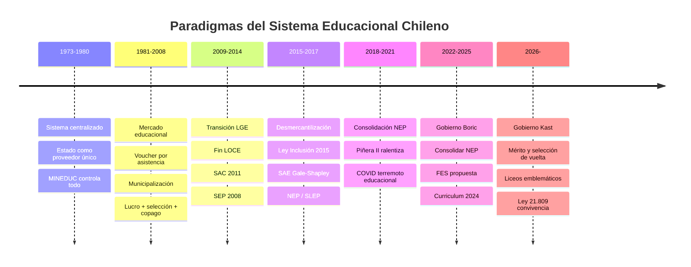
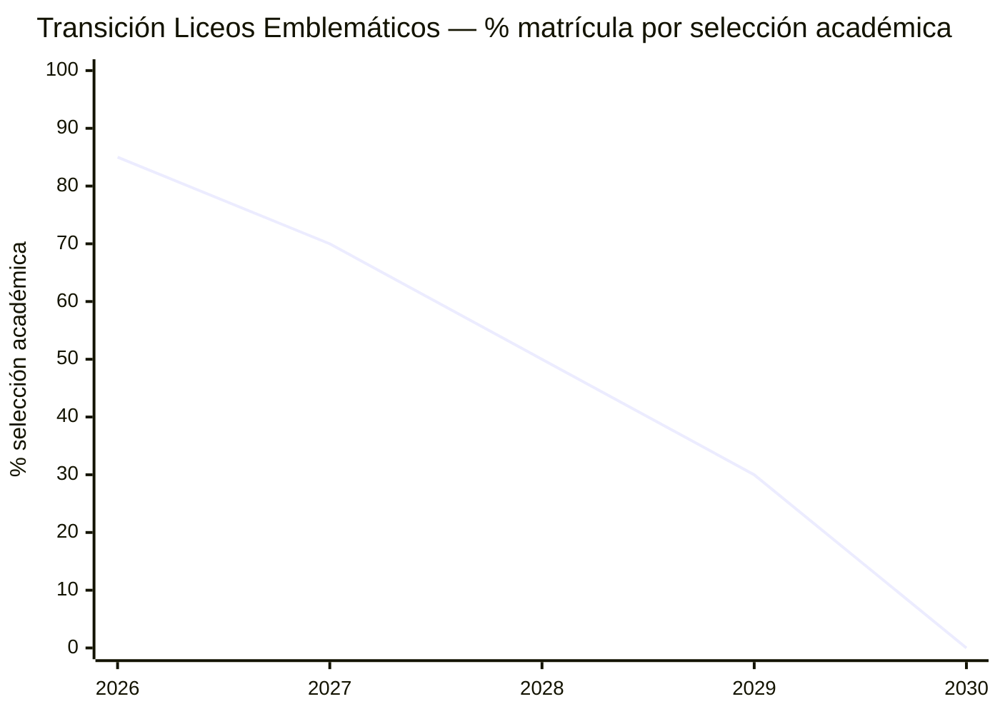
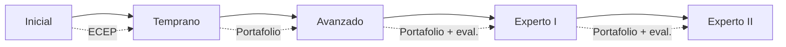

---
name: politicas_educacionales_sistema_chileno
description: "Políticas educacionales del sistema chileno 2015-2026 — SAE, NEP/SLEP, Carrera Docente, Ley 21.809, currículo y financiamiento ES (FES vs CAE); datos actualizados al gobierno Kast 2026"
sources: [cowork]
aliases:
  - políticas educacionales Chile
  - reformas educativas Chile
  - NEP Chile 2026
  - SAE Chile
  - FES CAE gratuidad
  - Ley 21.809 convivencia
tags:
  - institucional
  - politica
  - reforma
  - 2026
---

# Políticas Educacionales del Sistema Educativo Chileno

> Fuente: *Políticas Educacionales y Sistema Educativo Chileno* (docx, análisis actualizado al año 2026 incluyendo gobierno Kast, SAE, NEP/SLEP, Carrera Docente, Ley 21.809, curriculum y financiamiento ES).

El sistema educativo chileno atravesó un cambio de paradigma entre 1981 y 2017: del **mercado como principio organizador** (voucher, selección, lucro) al **derecho social como fundamento** (LGE 2009, Ley Inclusión 2015, NEP 2017). El gobierno Kast (2026-) plantea una contrarreforma parcial que reintroduce el mérito y la selección, sin desmantelar la arquitectura institucional creada.

---

## 1. El Gran Cambio de Paradigma

---

## 2. Sistema de Admisión Escolar (SAE)

### El Algoritmo Gale-Shapley

El SAE (implementado 2016-2019 por regiones) usa el algoritmo de **Gale-Shapley** (Premio Nobel Economía 2012 — Roth/Shapley) para emparejar postulantes con establecimientos:

- **Principio**: ningún par (estudiante-establecimiento) tiene incentivos para deshacer su asignación → solución estable
- **Prioridades**: hermanos en el establecimiento → cercanía domiciliaria → lotería (aleatorio)
- **Eliminó**: selección socioeconómica, rendimiento académico, entrevistas discriminatorias

### Rollout por Región

| Año | Regiones |
|-----|---------|
| 2016 | Piloto O'Higgins (4 comunas) |
| 2017 | Magallanes, Aysén, Los Ríos, Arica y Parinacota |
| 2018 | Atacama, Coquimbo, La Araucanía, Los Lagos, Tarapacá |
| 2019 | Valparaíso, Biobío, Maule, Metropolitana, Antofagasta, O'Higgins total |

### Resultados e Impacto

- **Satisfacción**: 46% positiva / 32% media / 22% negativa
- **Segregación**: Duncan Index cayó de **0.657 → 0.511** (reducción de 15 puntos porcentuales)
- **Cobertura**: 78% de comunas sin demanda insatisfecha (oferta suficiente)
- **Demanda insatisfecha**: concentrada en comunas densas metropolitanas y establecimientos emblemáticos

### La Contrarreforma Kast 2026

El gobierno Kast (Ministra María Paz Arzola) plantea reintroducir la selección académica en establecimientos de alta demanda:

*Nota: la tabla de transición muestra la reducción progresiva de la selección, no su aumento — el gobierno Kast planea mantener o aumentar la selección en liceos emblemáticos, reversando la tendencia hacia 0%.*

**Argumento del gobierno**: la "tómbola" (asignación aleatoria) no respeta el mérito ni el esfuerzo de los estudiantes que se preparan para establecimientos de excelencia. Los "liceos emblemáticos" como el Instituto Nacional, el Liceo 1 de Niñas y el Liceo de Aplicación deben mantener su carácter selectivo.

**Tensión de política**: la reintroducción de selección en establecimientos con financiamiento público contradice el principio de la Ley Inclusión 2015. Requiere reforma legal o excepciones reglamentarias.

---

## 3. Nueva Educación Pública (NEP) y SLEP

### Estado Actual (2026)

- **36 SLEP activos** (de 70 proyectados al 2030)
- **Déficit heredado**: $112.454 billones acumulados en infraestructura y deudas de los municipios
- **Consejo de Evaluación**: informe de marzo 2026 señala problemas de gestión, déficit y falta de capacidad técnica en varios SLEP

### Los Problemas de la Transición

| Dimensión | Problema identificado |
|-----------|----------------------|
| Financiero | Déficit estructural heredado de municipios; subvención insuficiente |
| Técnico | SLEP sin capacidad de RR.HH. para gestionar sistemas complejos |
| Legal | Superposición de normativas (Estatuto Docente + Ley NEP + SLEP) |
| Pedagógico | Foco en gestión administrativa descuida apoyo pedagógico |
| Político | Resistencia de municipios que no quieren soltar establecimientos rentables |

**Lectura F4:** La NEP es la apuesta más ambiciosa de política educacional desde 1981 para revertir la privatización. Su crisis de implementación no invalida el objetivo sino que revela la complejidad de desmantelar 35 años de mercado educacional. El déficit heredado es parte del costo de la transición, no un fallo del diseño.

---

## 4. Carrera Docente

### El Diagnóstico que Generó la Reforma

| Indicador | Dato pre-reforma |
|-----------|-----------------|
| Deserción año 1 de carrera | 9-12% (2005-2008) → subió a 18-22% post-reforma inicial |
| Horas anuales de trabajo | 1.103 hrs/año vs OCDE: 782 hrs/año |
| Ingreso relativo | Solo 77% del ingreso de profesionales equivalentes |
| Estatus social | Percepción social negativa consistente en encuestas |

### Los 5 Tramos de la Carrera

| Tramo | Requisito principal | Aumento salarial |
|-------|--------------------|-----------------:|
| Inicial | Título + ECEP (Evaluación de Conocimientos) | Base |
| Temprano | 3 años + portafolio | +20% aprox. |
| Avanzado | 7 años + portafolio favorable | +40% aprox. |
| Experto I | 10 años + evaluación destacada | +60% aprox. |
| Experto II | 15 años + evaluación excelente | +80% aprox. |

### Tensiones en la Implementación

- **Deserción post-reforma**: paradójicamente, la exigencia del ECEP aumentó la deserción a 18-22% en los primeros años — jóvenes que no aprueban la evaluación de conocimientos abandonan antes de entrar
- **Carga del portafolio**: el portafolio docente (evidencias de práctica) es percibido como burocráticamente pesado, especialmente para docentes rurales sin apoyo técnico
- **Mentorías**: el sistema de mentores (docentes expertos que acompañan a nóveles) tiene brechas de cobertura en zonas rurales y establecimientos pequeños
- **RMM tensions**: docentes que ejercen como Representantes de Mejoramiento de la Calidad (RMM) reportan tensiones al reportar sobre sus propios establecimientos

**Efecto positivo**: la reforma redujo la deserción docente al finalizar el proceso de implementación en un **15,7%** — la estabilidad en la carrera mejoró cuando los tramos y los aumentos salariales se hicieron efectivos.

---

## 5. Convivencia Escolar: Ley 21.809 y Escuelas Protegidas

### Ley 21.809 (Marzo 2026 — vigencia julio 2026)

La Ley 21.809 es la respuesta del gobierno Kast al deterioro de la convivencia escolar. Sus medidas principales:

| Medida | Descripción |
|--------|-------------|
| Revisión de mochila | Autoriza a directivos a revisar pertenencias ante sospecha fundada |
| Cara descubierta | Prohíbe cubrir el rostro en el interior de establecimientos |
| Sanciones por tomas | Tipifica y sanciona las "tomas" de establecimientos |
| Inhabilidad gratuidad ES | Conductas graves en ES pueden derivar en suspensión de gratuidad |
| Protección de apoderados | Medidas contra acoso o amenazas a apoderados que denuncian |
| Suspensión de apoderados | Permite suspender la presencia de apoderados que perturben la convivencia |

### Proyecto "Escuelas Protegidas" (Aprobado Senado mayo 2026)

El proyecto — aprobado por el Senado en mayo de 2026 pero aún en trámite a la fecha del análisis — complementa la Ley 21.809 con medidas adicionales de seguridad:
- Protocolos de seguridad perimetral obligatorios
- Coordinación con Carabineros y PDI
- Sanciones penales específicas para delitos cometidos en establecimientos

**Lectura sociológica (Foucault)**: ambas medidas intensifican los mecanismos de vigilancia y sanción normalizadora en la escuela — el panóptico se amplía. La pregunta de política pública es si la disciplina externa resuelve problemas que tienen raíces en el territorio (delincuencia, narcotráfico) o solo los desplaza.

---

## 6. Actualización Curricular

### Congreso Pedagógico Nacional 2023

- **800.000 participantes** (docentes, directivos, apoderados, estudiantes)
- Convocado por el Ministerio de Educación con apoyo de UNESCO
- Objetivo: revisar las Bases Curriculares vigentes (2012-2019)
- Resultado: consenso sobre necesidad de actualización, énfasis en habilidades del siglo XXI, ciudadanía digital, formación ciudadana

### Consulta Pública 2024

- **115.000 docentes consultados** = **37% del total** de docentes del sistema
- **87,6% apoya** la actualización curricular propuesta
- **88,6% considera** que la propuesta supera las bases curriculares anteriores
- Incluye nuevas Bases para Lenguaje y Matemáticas en básica + actualización para media

### WorldSkills Americas Santiago 2025

Chile fue sede de la competencia de habilidades técnico-profesionales (2025), vinculando la formación para el trabajo con el currículo de educación media técnico-profesional (EMTP). Señal de política del gobierno Kast: revalorizar la formación para el trabajo y las habilidades técnicas.

---

## 7. Financiamiento de la Educación Superior: FES vs CAE

### El Diagnóstico del Financiamiento Actual

| Indicador | Dato |
|-----------|------|
| Sobreduración estudiantil | 10,1 semestres reales vs 7,6 semestres nominales |
| Participación regional (pre-gratuidad) | 20,4% en regiones |
| Participación regional (con gratuidad) | 25,3% en regiones |
| Restricción edad 30 años (propuesta) | Excluiría 7.588 estudiantes, 2/3 mujeres |
| Gratuidad beneficiada | Estudiantes de IVE > 30% (40% de matrícula) |
| Aranceles regulados | No cubren costos reales de las instituciones |

### FES vs CAE: La Disputa de Política

| Dimensión | CAE (Sistema actual) | FES (Fondo de Educación Superior — propuesta) |
|-----------|---------------------|-----------------------------------------------|
| Naturaleza | Crédito bancario | Sin banco — deuda con el Estado |
| Tasa de interés | 2% real + renegociación | Condicional al ingreso |
| Inicio de pago | Al egresar + 6 meses | Al superar $500.000/mes |
| Monto mensual | Cuota fija (peso fijo) | Tope 7-8% del ingreso mensual |
| Exención | Por desempleo temporal | Ingreso < $500.000/mes de por vida |
| Condonación | No (acumulación de mora) | Después de plazo máximo |
| Ahorro fiscal proyectado | — | $2,9 billones en 10 años (DIPRES) |
| Equidad de género | Sin diferenciación | Favorable (mujeres ganan menos, pagan menos) |

### Análisis del FES

**Argumentos a favor:**
- Elimina el intermediario bancario (el Estado financia directamente)
- El pago contingente al ingreso protege ante el desempleo y los bajos salarios
- La exención para ingresos < $500.000/mes protege a los más vulnerables
- DIPRES proyecta ahorro neto de $2,9 billones en 10 años respecto al CAE

**Argumentos en contra (gobierno Kast):**
- El FES es un subsidio disfrazado que reduce el incentivo a terminar la carrera en tiempo
- La condonación automática desincentiva el pago voluntario
- El ahorro DIPRES es cuestionable: depende de supuestos de empleo y crecimiento

**La restricción de edad 30**: la propuesta de limitar el acceso a gratuidad/FES para mayores de 30 años afectaría desproporcionadamente a mujeres (2/3 de los 7.588 afectados), muchas de ellas que interrumpieron estudios por maternidad. La restricción expresa una visión F3 (inversión en capital humano joven y productivo) que entra en tensión con F4 (educación como derecho a lo largo de la vida).

---

## 8. Balance: Las Tres Tensiones No Resueltas

### Tensión 1: Derecho vs. Mérito

- **Ley Inclusión 2015**: educación como derecho → fin de selección, fin de lucro, SAE aleatorio
- **Gobierno Kast 2026**: mérito como principio → liceos emblemáticos selectivos, ECEP exigente, revalorización de la excelencia

La tensión es constitutiva: el 63% de los chilenos apoya selección académica Y el 95% apoya fortalecer la educación pública (datos pre-2026). La ciudadanía no ha resuelto la contradicción.

### Tensión 2: Eficiencia vs. Equidad

- **SAC + SIMCE**: producen información sobre desempeño pero generan efectos perversos (enseñar para la prueba, estigma de establecimientos clasificados en desempeño insuficiente)
- **NEP/SLEP**: apuesta por equidad territorial pero con alto costo de transición y déficit acumulado

### Tensión 3: Financiamiento Suficiente vs. Incentivos Correctos

- **Subvención**: el valor de la subvención escolar no ha aumentado en términos reales en décadas
- **CAE**: genera morosidad y sobreendeudamiento pero financia masivamente el acceso a ES
- **FES**: más equitativo pero requiere diseño cuidadoso de incentivos para no prolongar artificialmente los estudios

---

## 9. Lectura Teórica: Collins/Hopper

| Función | Expresión en las políticas 2015-2026 |
|---------|--------------------------------------|
| F1 (Socialización) | Ley 21.809 + Escuelas Protegidas = reforzar F1 ante su erosión |
| F2 (Selección meritocrática) | SAE Gale-Shapley la reemplaza; gobierno Kast la restaura parcialmente |
| F3 (Mercado/empleabilidad) | WorldSkills, EMTP, restricción edad 30 = prioridad F3 bajo Kast |
| F4 (Democratización) | SAE, NEP, gratuidad, FES = agenda F4 de la LGE/NEP |
| F5 (Reproducción élites) | Liceos emblemáticos selectivos = vector de reproducción de élite educada |

**El péndulo**: Chile oscila entre F2+F3 (derecha) y F4 (izquierda/centroizquierda) sin resolver el dilema de fondo. Cada cambio de gobierno rearticula las funciones sin transformar la estructura del cuasimercado subyacente.

---

## 10. Conexiones

- [[estructura_legal_sistema_educacional]] — el marco normativo que da forma a estas políticas (LGE, Ley Inclusión, NEP, SAC, Carrera Docente)
- [[SLEP]] — análisis detallado de la NEP y sus 36 SLEP activos
- [[cifras_sistema_educacional_chile]] — datos del sistema sobre los que operan estas políticas
- [[presupuesto_educacional_chile]] — los recursos que financian estas políticas
- [[educacion_politica_chile]] — el contexto político y electoral que las genera
- [[modelos_gobernanza_educacional]] — los modelos teóricos que subyacen a las opciones de política
- [[marco_teorico_sociologico_educacion]] — los paradigmas que permiten interpretar las políticas
- [[fundamentos_politica_educacional]] — los F1-F5 que cada política prioriza
- [[arbol_problemas_politica_educacional]] — el diagnóstico que estas políticas intentan resolver
- [[analisis_ocde_simce_chile]] — la evidencia de calidad que interpela a todas las políticas
- [[MOC_Politica_Educacional]] — mapa central de la investigación
