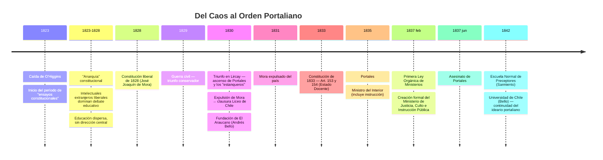
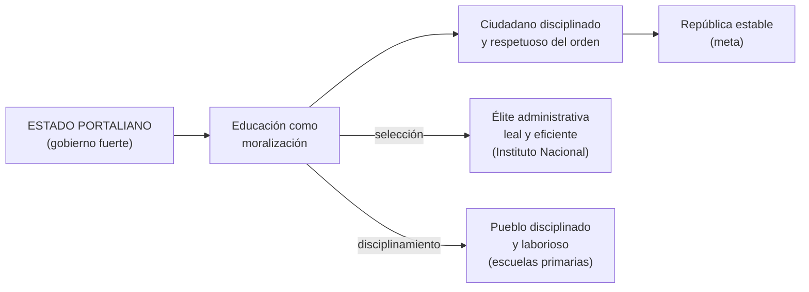
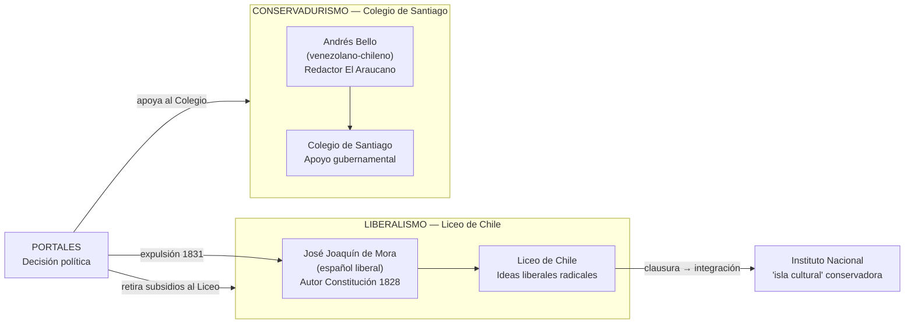
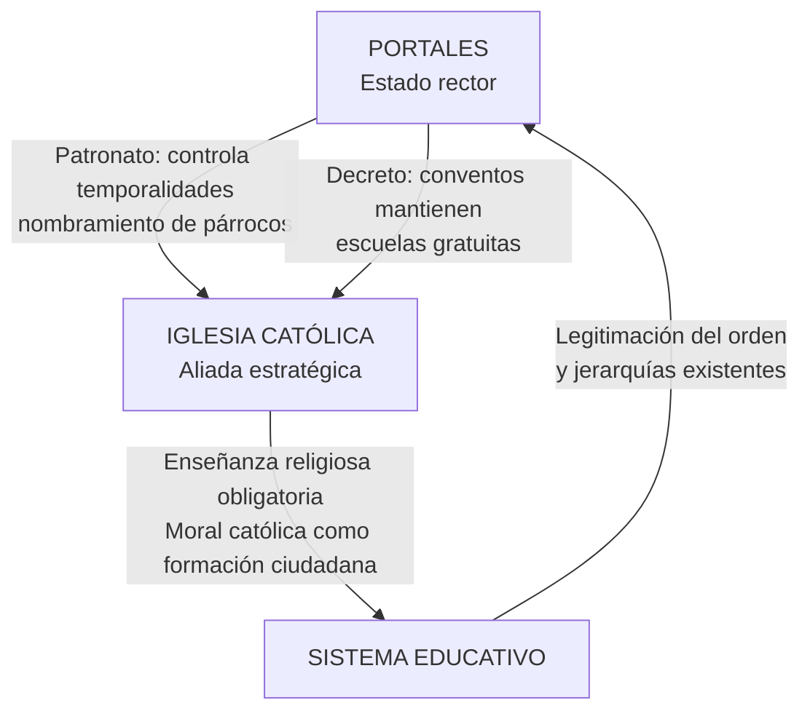

---
name: portales_educacion_estado_docente
description: "Política educacional de Diego Portales (1830-1837) — Constitución 1833, Estado Docente, moralización, perfil docente, alianza Bello-Portales y fundamentos del sistema nacional"
sources: [cowork]
aliases:
  - Portales educación
  - Estado Docente Chile
  - Constitución 1833 educación
  - orden portaliano educación
  - moralización escolar Chile
  - Ministerio Instrucción Pública 1837
tags:
  - historia
  - institucional
  - colonial
---

# Portales y la Educación en Chile: El Estado Docente (1830–1837)

> Fuente: *El Estado Docente y el Orden Portaliano: Análisis Integral de los Planteamientos Político-Educacionales de Diego Portales (1830-1837)* (docx, análisis histórico con fuentes primarias y secundarias, incluyendo Gabriel Salazar).

La figura de Diego Portales Palazuelos es inseparable de la arquitectura educacional chilena del siglo XIX. Aunque usualmente analizado desde la perspectiva política, su influencia en la educación fue el pilar del **Estado Docente** que dominaría la política educativa por más de un siglo.

---

## 1. Contexto: La Crisis de la Post-Independencia (1823-1830)

---

## 2. La Doctrina Portaliana: Moralización antes que Democracia

Portales expresó en carta a Cea (1822): *"la democracia es un absurdo en países llenos de vicios, donde los ciudadanos carecen de la virtud necesaria."*

Su propuesta educativa: el Estado debe **"moralizar"** primero, antes de permitir la participación política plena. Solo una sociedad moralizada puede sostener un gobierno liberal.

La lógica portaliana sobre la conducción de pueblos: *"palo y bizcochuelo"* — disciplina rigurosa + reconocimiento del mérito.

---

## 3. La Constitución de 1833: Bases del Estado Docente

La Carta de 1833, redactada bajo la influencia de Portales (junto a Mariano Egaña y Manuel José de Gandarillas), estableció dos artículos fundacionales:

| Artículo | Disposición | Significado |
|----------|-------------|-------------|
| **Art. 153** | *"La educación pública es una atención preferente del Gobierno"* | El Estado asume responsabilidad de financiar, dirigir y supervisar la instrucción nacional |
| **Art. 154** | Creación de una **Superintendencia de Educación Pública** | Inspección y dirección técnica de la enseñanza bajo autoridad central |
| Art. (rel.) | Municipalidades promueven educación y cuidan escuelas primarias | Nivel local como ejecución, no como decisión |
| Art. (rel.) | Catolicismo como religión oficial exclusiva | Moral católica como eje de la formación ciudadana |

La **Universidad de Chile** (1842) asumió inicialmente las funciones de superintendencia, supervisando exámenes y grados de establecimientos privados y públicos — brazo técnico del Ejecutivo.

---

## 4. Portales como Primer Ministro de Educación de Chile

Aunque más conocido como Ministro del Interior y de Guerra, Portales fue el **primer ministro de educación** en sentido estricto:

- **1835**: Ministerio del Interior (con sección de instrucción)
- **1 feb 1837**: Primera Ley Orgánica de Ministerios → creación formal del **Ministerio de Justicia, Culto e Instrucción Pública**
- Portales gestionó la instrucción con el mismo rigor que la justicia o la defensa nacional

---

## 5. El Perfil del Maestro Portaliano: Disciplina y Virtud

Portales delineó el perfil docente en instrucciones para contratar profesores extranjeros para el Colegio de Santiago. Sus exigencias — taxativas y detalladas — definen la identidad del **preceptor republicano**:

| Requisito | Especificación portaliana |
|-----------|--------------------------|
| **Neutralidad política** | No participar en partidos ni contiendas locales; "circunspección" permanente |
| **Ejemplo de conducta** | Abstenerse de "chismes ridículos"; no desacreditar discípulos ante visitas |
| **Igualdad de trato** | Tratar con igual cariño a todos; "detestable" negar talentos a quienes no tienen fortuna |
| **Conducta personal** | "Honrada subsistencia" como motivación; no "desmesurada ambición" |
| **Sueldos pagados "religiosamente"** | Para que maestros no carezcan de lo necesario |
| **Cláusula de rescisión** | Si el profesor no es apto o su conducta es "ligera", el gobierno rescinde honestamente |

Esta visión del maestro como **funcionario público y modelo moral** creó el "preceptorado" chileno: identidad docente ligada a la estabilidad del Estado, sujeta a inspección de conducta privada y pública.

---

## 6. La Batalla Institucional: Mora vs. Bello

El enfrentamiento más emblemático del período:

---

## 7. La Alianza Bello-Portales: Saber y Poder

A pesar de caracteres opuestos (Portales: imperioso y sarcástico; Bello: reflexivo y académico), ambos coincidieron en la necesidad del **orden centralista**.

### El Araucano (1830) como Aula de la Nación

Periódico oficial concebido por Portales para *"dirigir la opinión"*. Bajo la redacción de Bello:
- Artículos sobre ciencias, artes y filosofía
- Traducción de ensayos europeos para difundir "las luces"
- La prensa como medio de regularidad, no de pasiones
- Dotó al régimen de **profundidad intelectual** que lo distinguió de una simple dictadura

### Universidad de Chile (1842, posmortem)

Resultado directo del marco de 1833 + trabajo conjunto Bello-régimen conservador:
- Asumió el rol de superintendencia
- Supervisa exámenes y grados de establecimientos privados y públicos
- Estándares definidos por el Estado → uniformidad nacional

---

## 8. Religión e Iglesia: Alianza Estratégica Subordinada

**Modelo buscado**: armonía subordinada — la Iglesia educa en la moral; el Estado dirige la política educativa. El prestigio religioso legitima el orden republicano y las jerarquías sociales existentes.

---

## 9. Educación Popular: Disciplinamiento y Utilidad Laboral

Aunque el foco portaliano estuvo en la formación de élite, no ignoró las clases populares — con objetivos distintos:

### Tipos de establecimientos (década 1830)

| Tipo | Financiamiento | Alcance |
|------|----------------|---------|
| Fiscales | Estado central | Ciudades principales |
| Municipales | Fondos locales (Art. 154) | Provincias |
| Conventuales | Órdenes religiosas | Poblaciones con presencia clerical |

**Meta portaliana para la educación popular**: un trabajador que supiera **leer, escribir y acatar órdenes** — "carne de cañón para el progreso económico bajo la dirección de la élite."

---

## 10. Legado del Siglo XIX

| Planteamiento Portaliano (1830-1837) | Materialización posterior |
|--------------------------------------|--------------------------|
| Art. 153: educación como "atención preferente" | Ley General de Instrucción Primaria 1860 (Manuel Montt) — gratuidad + responsabilidad estatal |
| Maestros como modelos de moralidad y técnica | Escuela Normal de Preceptores 1842 (Sarmiento) |
| Superintendencia de Educación | Universidad de Chile 1843 (Bello) → inspección y grados |
| Sistema de visitadores provinciales | Visitadores 1846 — vigilancia constante en aulas remotas |
| Inspección Pública de Educación | Inspección General de Instrucción Primaria 1860 |
| Maestro como funcionario con control de conducta | Identidad docente sujeta al Estado, siglos XIX-XX |

---

## 11. Interpretación Collins/Hopper

| Función | Expresión en la política portaliana |
|---------|-------------------------------------|
| **F1 Socialización** | La escuela como microcosmos del orden nacional; disciplina, patriotismo y obediencia como ejes; moral católica obligatoria |
| **F2 Selección meritocrática** | Sistema de visitadores y evaluación docente; "distinguir al bueno del malo para premiar y castigar"; selección de élite en Instituto Nacional |
| **F3 Formación mercado** | Educación popular como formación de trabajadores disciplinados para el crecimiento económico bajo dirección de la élite |
| **F4 Democratización** | Mínima: la instrucción llega a "todos los rincones" pero con finalidad de control, no de emancipación; Portales antepone moralización a participación política |
| **F5 Reproducción élites** | Central: Instituto Nacional como "isla cultural" conservadora; Constitución 1833 consolida alianza entre Estado, élite propietaria e Iglesia |

---

## 12. Tensiones Estructurales del Modelo Portaliano

El sistema de 1833 dejó **tres tensiones irresueltas** que marcaron el siglo XIX y resonan hasta hoy:

1. **Moralización vs. Emancipación**: ¿Educa el Estado para controlar o para liberar? Portales priorizó el orden; el liberalismo posterior exigió emancipación.

2. **Centralismo vs. Municipalismo**: Art. 153 establece responsabilidad estatal central; Art. 154 asigna a municipios las escuelas primarias → tensión entre unidad nacional y capacidades locales heterogéneas.

3. **Iglesia vs. Estado Laico**: la alianza de 1833 (catolicismo exclusivo) fue disputada por el laicismo liberal desde 1860-1883 (Ley de Instrucción Primaria, secularización de cementerios, Decreto Amunátegui 1877).

---

## 13. Conexiones

- [[ohiggins_educacion_republicana]] — antecedente inmediato; O'Higgins plantó las semillas que Portales consolidó institucionalmente
- [[historia_educacion_chilena_colonial_sigloXIX]] — contexto colonial y período republicano temprano
- [[marco_teorico_sociologico_educacion]] — Weber (racionalización burocrática), Foucault (gubernamentalidad y control de la conciencia), Gramsci (hegemonía y educación como aparato ideológico)
- [[modelos_gobernanza_educacional]] — modelo centralizado en su versión más pura; el Estado Docente como arquetipo
- [[politicas_educacionales_sistema_chileno]] — continuidad y ruptura con el Estado Docente en el presente
- [[sistema_financiamiento_escolar_chile]] — el Art. 153 como fundamento del financiamiento estatal de la educación
- [[MOC_Politica_Educacional]] — mapa central de la investigación
