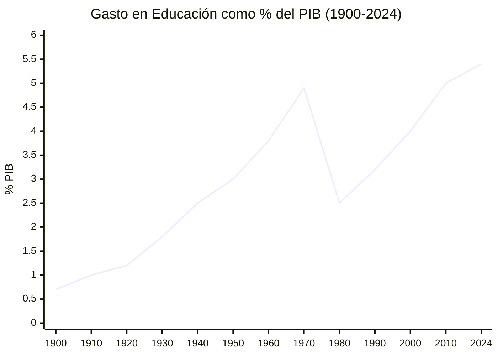
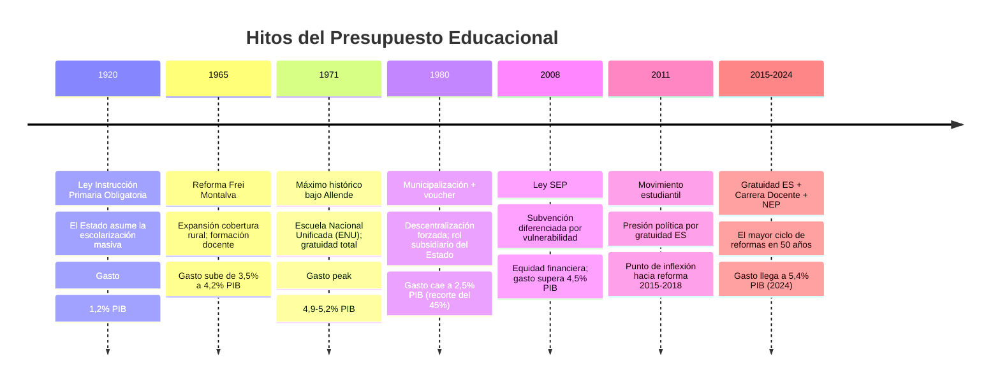
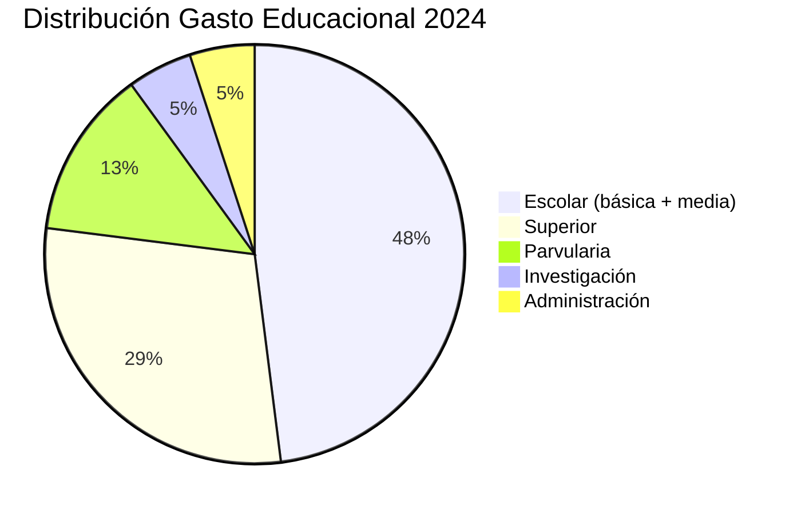

---
name: presupuesto_educacional_chile
description: "Evolución histórica del presupuesto educacional chileno 1900-2024 como porcentaje del PIB, distribución por nivel educativo y análisis de hitos políticos"
sources: [cowork]
aliases:
  - presupuesto educación Chile
  - gasto PIB educación Chile
  - historia financiamiento educacional
  - evolución gasto educativo
tags:
  - evidencia
  - financiamiento
  - historia
---

# Presupuesto Educacional Chileno: Evolución Histórica 1900-2024

> Fuente: *Dashboard: Evolución del Presupuesto Educacional* (HTML interactivo, Chart.js; datos históricos 1900-2024 como % PIB y distribución por nivel).

La historia del gasto educacional en Chile es la historia del Estado chileno en miniatura: expansión modernizadora hasta 1973, colapso bajo la dictadura, recuperación democrática y nuevo salto en el siglo XXI. Leer el presupuesto como porcentaje del PIB es leer las prioridades políticas de cada período — no las declaradas, sino las efectivamente financiadas.

---

## 1. Línea de Tiempo: El PIB que el Estado le Dedica a la Educación

### 1.1 Tabla Histórica por Período

| Período | % PIB promedio | Contexto político |
|---------|:--------------:|-------------------|
| 1900-1920 | **0,8%** | Estado oligárquico, educación de élites |
| 1920-1940 | **1,5%** | Ley Instrucción Primaria Obligatoria 1920 |
| 1940-1960 | **2,8%** | Estado desarrollista; expansión cobertura |
| 1960-1973 | **4,5%** | Reforma Frei Montalva 1965; peak Allende 1971 |
| 1973-1990 | **2,8%** | Municipalización; privatización; recorte 45% |
| 1990-2000 | **3,5%** | Recuperación democrática; MECE; Ley JEC |
| 2000-2010 | **4,4%** | SIMCE; Ley SEP; mov. estudiantil pingüino 2006 |
| 2010-2024 | **5,3%** | Carrera Docente; Gratuidad ES; NEP/SLEP |

**El hito más dramático:** la dictadura (1973-1990) redujo el gasto de **4,9% a 2,5% del PIB** — casi a la mitad en términos relativos. La democracia tardó 30 años en recuperar y superar el nivel de 1973.

---

## 2. Hitos que Explican los Saltos

---

## 3. Distribución del Gasto: ¿A Qué Nivel se Destina?

### 3.1 Distribución Actual (2024)

### 3.2 Transformación de la Distribución 1960-2024

| Nivel | 1960 | 1980 | 2000 | 2024 | Variación |
|-------|:----:|:----:|:----:|:----:|:---------:|
| Escolar | 78% | 72% | 60% | **48%** | −30 pp |
| Superior | 15% | 18% | 25% | **29%** | +14 pp |
| Parvularia | 2% | 3% | 6% | **13%** | +11 pp |
| Investigación | 2% | 3% | 4% | **5%** | +3 pp |
| Administración | 3% | 4% | 5% | **5%** | +2 pp |

**La tendencia más significativa:** el gasto escolar bajó del 78% al 48% de la torta, mientras parvularia y superior crecieron fuertemente. Esto refleja dos presiones simultáneas:
1. **Hacia arriba:** la gratuidad universitaria (2016-2024) elevó el peso de la ES
2. **Hacia abajo:** la evidencia de la teoría del capital humano (Heckman) justificó mayor inversión en primera infancia

---

## 4. El Período Crítico: Dictadura y Municipalización (1973-1990)

El período 1973-1990 no es solo un dato presupuestario: es la **matriz de origen** de las principales patologías del sistema actual.

**El doble movimiento de 1980:**
1. **Transferencia administrativa:** el Estado trasladó los establecimientos a los municipios (municipalización), que recibieron responsabilidades educativas sin recursos ni capacidad técnica equivalente
2. **Cambio de lógica de financiamiento:** se instauró el voucher (subvención por asistencia), transformando la educación de servicio público en cuasimercado

**Las consecuencias financieras:**
- El gasto cayó de 4,9% a 2,5% del PIB: los recursos cortados fueron los que sostenían la infraestructura, la formación docente y el material pedagógico
- Los municipios pobres recibieron escuelas con estudiantes vulnerables pero sin los ingresos tributarios para mantenerlas
- Se creó la **segregación geográfica del financiamiento**: municipios ricos → mejores escuelas; municipios pobres → escuelas deterioradas — [[arbol_problemas_politica_educacional]]

---

## 5. El Nuevo Ciclo de Expansión (2010-2024): ¿Suficiente?

El período 2010-2024 representa el mayor gasto educacional de la historia chilena (5,3% PIB promedio, llegando a 5,4% en 2024). Sin embargo, la brecha con los países OCDE de mejor desempeño es todavía significativa:

| País | Gasto educación % PIB | PISA Matemáticas |
|------|-----------------------|:----------------:|
| Finlandia | 5,8% | 484 pts |
| **Chile** | **5,4%** | **412 pts** |
| OCDE promedio | 5,1% | 472 pts |
| Colombia | 4,5% | 391 pts |

Chile **gasta más que el promedio OCDE** pero obtiene resultados significativamente por debajo. Esto sugiere que el problema no es solo de cantidad de gasto, sino de **distribución** (segregación), **eficiencia** (burocracia municipal y SLEP) y **calidad del gasto** (¿a qué se destina dentro del voucher?) — [[analisis_ocde_simce_chile]].

---

## 6. Lectura Teórica (Collins/Hopper)

**El presupuesto como termómetro del proyecto de F1:** la expansión del gasto 1900-1973 refleja la construcción del **Estado Docente** chileno (F1 + F4): la escuela como mecanismo de integración nacional y ascenso social. El corte de 1973 no fue solo una decisión económica: fue la sustitución del proyecto de F4 (democratización) por uno de F3 (formación para el mercado), donde la educación es un bien privado que cada familia financia con el voucher.

**La recuperación 1990-2024 como proyecto F4:** el retorno progresivo al gasto público en educación expresa el intento de reconstruir la función de democratización. Pero la arquitectura del sistema (PS dominante, voucher, segregación territorial) limita el alcance redistributivo del gasto: el dinero público llega a establecimientos con lógica privada.

**La parvularia como convergencia F3+F4:** el salto de 2% a 13% en educación parvularia es el único punto donde hay consenso transversal. La derecha lo justifica con la TCH (F3: retorno a la inversión temprana); la izquierda, con la equidad de oportunidades (F4). La convergencia es posible porque ambas funciones se satisfacen simultáneamente en la primera infancia — [[propuestas_partidos_politicos_educacion]].

---

## 7. Conexiones

- [[arbol_problemas_politica_educacional]] — la municipalización y el recorte 1980 son causas C2 del árbol
- [[sistema_voucher_financiamiento]] — el mecanismo de financiamiento instaurado en 1980
- [[cifras_sistema_educacional_chile]] — datos actuales que este presupuesto financia
- [[analisis_ocde_simce_chile]] — comparación internacional del gasto y resultados
- [[mercado_creacion_establecimientos]] — cómo el financiamiento configuró el mercado de establecimientos
- [[fundamentos_politica_educacional]] — historia política que explica las decisiones de gasto
- [[propuestas_partidos_politicos_educacion]] — debate actual sobre nivel y distribución del gasto
- [[MOC_Politica_Educacional]] — mapa central de la investigación
