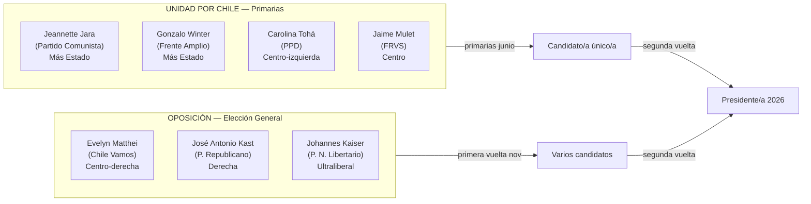
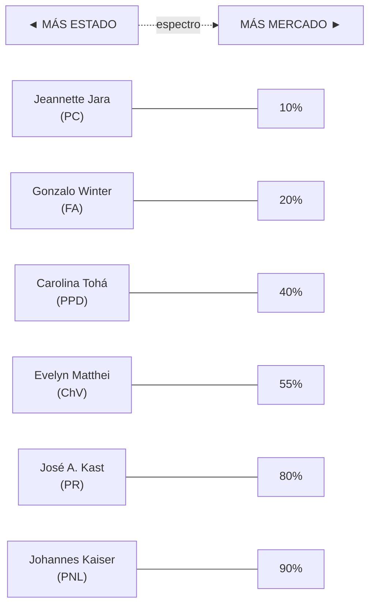
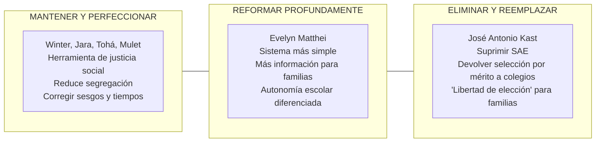

---
name: propuestas_educacionales_candidatos_2025
description: "Propuestas educacionales de los candidatos presidenciales chilenos 2025 — análisis comparativo por eje Estado-mercado, cobertura gratuidad, SLEP, SAE, docentes y deuda estudiantil"
sources: [cowork]
aliases:
  - candidatos presidenciales educación 2025
  - Matthei educación
  - Kast educación 2025
  - Winter Jara Tohá educación
  - Kaiser cooperativas docentes
  - elecciones presidenciales Chile 2025 educación
tags:
  - politica
  - reforma
  - institucional
  - 2026
---

# Propuestas Educacionales: Candidatos Presidenciales Chile 2025

> Fuente: *Radiografía a la Educación en Chile: Análisis de las Propuestas Presidenciales 2025* (html, infografía con análisis comparativo por candidato y eje temático; generada en junio 2025).

La elección presidencial de 2025 pone en juego decisiones estructurales sobre el modelo educativo chileno: el rol del Estado, la gratuidad, el SAE, el futuro de los SLEP y la relación Estado-Iglesia-mercado en educación.

---

## 1. El Campo Político: Dos Vías a La Moneda

---

## 2. El Eje Ideológico: Estado vs. Mercado

La principal divergencia es el **rol del Estado en educación**. Las propuestas van desde un sistema robustamente público hasta un modelo de libertad de elección y competencia total.

---

## 3. Frentes de Debate Clave

### 3.1 Educación Superior: Gratuidad y Deuda Estudiantil (CAE)

La deuda estudiantil es el punto de mayor tensión. El CAE (2005) endeudó a más de 800.000 estudiantes con tasas que llegaron al 6% (rebajadas al 2% en 2012).

| Candidato/a | Postura gratuidad | Postura CAE/deuda |
|-------------|-------------------|-------------------|
| **Jeannette Jara** | Meta: **70%** cobertura gratuidad (vs. ~60% actual) | Condonación amplia; FES como reemplazo definitivo del CAE |
| **Gonzalo Winter** | Ampliación significativa; educación como derecho | Fin del CAE; financiamiento estatal |
| **Carolina Tohá** | Consolidar sistema actual; expansión gradual | Reestructuración de la deuda; FES como solución de largo plazo |
| **Jaime Mulet** | Fortalecer gratuidad existente | Solución negociada para deudores actuales |
| **Evelyn Matthei** | Mantener gratuidad pero con mayor focalización | Mejorar CAE; no condonación general |
| **José A. Kast** | Cuestiona modelo de gratuidad universal | Mantener CAE con reforma; responsabilidad individual |
| **Johannes Kaiser** | Libertad de mercado en ES; reducir regulación | Contra condonación; responsabilidad contractual |

### 3.2 Sistema de Admisión Escolar (SAE)

El SAE (Ley de Inclusión 2015) elimina la selección arbitraria y usa un algoritmo de preferencias (Gale-Shapley). Es el nodo de mayor polarización ideológica.

**El debate de fondo**: ¿Es la selección escolar una herramienta de meritocracia legítima (F2) o un mecanismo de reproducción de élites (F5)?

### 3.3 El Futuro de los SLEP

Los Servicios Locales de Educación Pública (Ley 21.040, 2017) enfrentan una crisis de implementación: déficit de $112.454B, huelgas (82 días en Atacama 2023), problemas de gestión.

| Candidato/a | Postura SLEP |
|-------------|--------------|
| **Jara / Winter** | Fortalecimiento y apoyo; más recursos, mejor gestión; los SLEP son la apuesta correcta |
| **Tohá** | Diagnóstico cauteloso; planificación cuidadosa antes de expansión; ajustar el diseño |
| **Mulet** | Asegurar traspaso eficiente; no acelerar sin condiciones |
| **Matthei** | Reforma estructural del diseño; reducir burocracia; mayor autonomía escolar |
| **Kast** | Intervención drástica o término del modelo; los SLEP son ineficientes por diseño |
| **Kaiser** | Los SLEP expresan el problema del Estado como proveedor; reemplazar por competencia |

### 3.4 El Rol del Docente

Punto de consenso transversal: la profesión docente debe dignificarse. El disenso es sobre el cómo.

| Énfasis | Candidatos | Propuesta |
|---------|------------|-----------|
| **Formación y calidad** | Tohá, Matthei | Mejora formación inicial y continua; mejores condiciones laborales |
| **Autoridad y orden** | Kast | "Nuevo trato" para restablecer autoridad del profesor; sanciones efectivas a violencia escolar |
| **Autonomía y gestión** | Kaiser | **Cooperativas docentes**: profesores administran sus propios establecimientos |
| **Valoración y salario** | Jara, Winter | Aumento remuneraciones; implementación completa Carrera Docente |

---

## 4. Planes de Reforma Estructural

### Plan "Patines para Chile" — José Antonio Kast (6 pilares)

1. **Fin del SAE**: restaurar selección por mérito en colegios
2. **Sala Cuna Universal**: calidad desde los 0 años
3. **Nuevo trato docente**: restaurar autoridad en el aula
4. **Reforma SLEP**: terminar con la burocracia
5. **Recuperar liceos de excelencia**: Bicentenario como nuevos emblemáticos
6. **Continuidad del servicio educativo**: sanciones a paros ilegales

### Propuesta Kaiser — 3 pilares libertarios

1. **Cooperativas Docentes**: profesores administran sus establecimientos
2. **Participación activa de familias**: en decisiones y seguimiento del proceso educativo
3. **Currículum flexible**: personalización + educación inclusiva

---

## 5. Matriz Comparativa General

| Dimensión | Jara/Winter (izq.) | Tohá (centro-izq.) | Matthei (centro-der.) | Kast (der.) | Kaiser (liberal) |
|-----------|-------------------|-------------------|----------------------|-------------|-----------------|
| **Gratuidad ES** | Ampliar a 70%+ | Consolidar actual | Mantener focalizada | Reducir/focalizar | Mercado libre |
| **CAE/deuda** | Condonación amplia + FES | FES largo plazo | Reforma CAE | Mantener + responsabilidad | Contrato privado |
| **SAE** | Mantener + perfeccionar | Mantener + simplificar | Reforma profunda | Eliminar | Eliminar |
| **SLEP** | Fortalecer | Diagnóstico cauteloso | Reforma estructural | Intervención drástica | Reemplazar |
| **Docentes** | Valoración + sueldo | Formación + condiciones | Formación + resultados | Autoridad + sanción | Cooperativas propias |
| **Rol Estado** | Proveedor activo | Regulador activo | Subsidiario mejorado | Subsidiario mínimo | Facilitador mercado |
| **Currículum** | Intercultural + inclusivo | Estándares + pertinencia | Resultados + libertad | Nacional + meritocrático | Flexible + personalizado |

---

## 6. Interpretación Collins/Hopper — Visión por Candidato

| Función | Jara/Winter | Tohá | Matthei | Kast | Kaiser |
|---------|-------------|------|---------|------|--------|
| **F1 Socialización** | Ciudadano con derechos; pluralismo | Ciudadano democrático | Ciudadano productivo | Ciudadano patriota con valores | Individuo autónomo |
| **F2 Selección** | SAE = azar + equidad; anti-mérito por cuna | SAE como criterio justo | Mérito + información | Meritocracia explícita | Mercado como selector |
| **F3 Mercado** | Desmercantilización (FES, gratuidad) | Corrección de fallas de mercado | Mercado regulado + competencia | Mercado con libertad de elección | Mercado como principio organizador |
| **F4 Democratización** | Central: acceso, inclusión, interculturalidad | Importante: equidad + calidad | Instrumental: calidad para todos | Subordinada a mérito y orden | Por vía de la elección individual |
| **F5 Reproducción élites** | Critica explícitamente | Reconoce problema; soluciones graduales | Acepta diferenciación "legítima" | Defiende diferenciación meritocrática | No reconoce como problema |

---

## 7. Los Grandes Nudos Irresueltos

Independientemente del resultado electoral, tres tensiones estructurales seguirán sin resolverse:

1. **Segregación socioeconómica**: el SAE redujo la selección por parte de las escuelas, pero la segregación residencial y el financiamiento compartido persistente la reproducen. El Duncan index pre-SAE era 0.657; post-SAE la mejora es marginal.

2. **Deuda estudiantil**: el CAE endeudó a una generación. El FES resuelve el flujo futuro pero no el stock de deuda existente. Ningún candidato tiene una solución políticamente viable para los ~800.000 deudores.

3. **Crisis SLEP**: el déficit acumulado y los conflictos laborales revelan que la desmunicipalización fue diseñada sin financiamiento suficiente ni capacidad técnica instalada. El debate SLEP en 2025 es, en el fondo, el debate sobre si el Estado puede ser un proveedor eficiente de educación.

---

## 8. Conexiones

- [[linea_tiempo_politica_educacional_chile]] — contexto histórico de las reformas sobre las que debate cada candidato
- [[politicas_educacionales_sistema_chileno]] — estado actual del sistema que cada candidato propone reformar
- [[sistema_financiamiento_escolar_chile]] — CAE, FES, gratuidad, SEP — los instrumentos en disputa
- [[modelos_gobernanza_educacional]] — los cuatro modelos como marco teórico del espectro candidatos
- [[marco_teorico_sociologico_educacion]] — Collins/Hopper, Bourdieu, reproducción — teoría que subyace al debate
- [[MOC_Politica_Educacional]] — mapa central de la investigación
