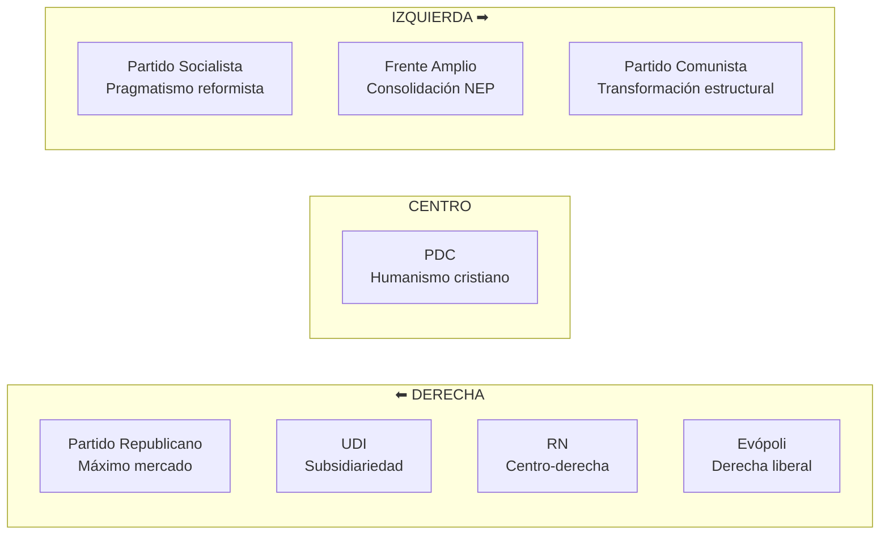

---
name: propuestas_partidos_politicos_educacion
description: "Análisis comparativo de propuestas educativas de partidos políticos chilenos — espectro derecha a izquierda, tensiones ideológicas y escenarios de reforma"
sources: [cowork]
aliases:
  - partidos políticos educación
  - propuestas educativas Chile
  - debate político educacional
  - posiciones ideológicas educación
tags:
  - actores
  - politica
  - partidos
---

# Propuestas Educativas de los Partidos Políticos Chilenos

> Fuente: *Análisis Comparativo de Propuestas Educativas de Partidos Políticos Chilenos* (docx, 11.463 chars; análisis de 8 partidos del espectro político nacional).

Las propuestas educativas de los partidos políticos constituyen el **campo de batalla ideológico** donde se dirimen las concepciones de Estado, mercado, derechos y libertades en el sistema escolar chileno. Este análisis muestra que las diferencias no son meramente técnicas sino filosóficas: reflejan visiones distintas sobre el rol del Estado, la naturaleza de la educación (bien público vs. servicio) y la distribución del poder en el sistema.

---

## El Espectro Político: Mapa de Posiciones

---

## Análisis por Partido

### Partido Republicano (PR) — Máximo Mercado

**Posición central:** el PR propone el **"Plan Patines"**, que consiste en eliminar el SAE (Sistema de Admisión Escolar) y restaurar la libertad de las familias para elegir establecimientos directamente, sin intermediación estatal algorítmica.

**Propuestas clave:**
- Eliminación del SAE → retorno a postulación directa familia-establecimiento
- Declarar la educación como **servicio esencial** para prevenir interrupciones por huelgas docentes
- Liceos de excelencia: defender y expandir los establecimientos de selección académica
- Sanciones a los paros docentes que afecten el derecho a educación de los estudiantes

**Lógica ideológica:** la educación es un servicio donde las familias son consumidores soberanos. El Estado debe garantizar la oferta pero no gestionar la demanda. La huelga docente viola el derecho a educación de los estudiantes, quienes tienen prelación sobre los trabajadores de la educación.

**Tensión con evidencia:** la libre elección sin SAE reproduce la segregación socioeconómica documentada (causa C1 del árbol de problemas — [[arbol_problemas_politica_educacional]]). Los liceos de excelencia concentran capital humano y cultural en establecimientos de élite, ampliando la brecha de aprendizaje.

---

### UDI — Subsidiariedad y Servicio Esencial

**Posición central:** la UDI articula su propuesta educativa en torno a la **subsidiariedad**: el Estado interviene donde la familia y los privados no pueden, pero no desplaza a estos actores.

**Propuestas clave:**
- Declarar la educación como **servicio esencial** (igual que PR, pero desde lógica de continuidad del servicio más que de mercado)
- Defensa de la libertad de enseñanza como principio constitucional irrenunciable
- Oposición a la estatización del sistema: el cuasimercado educacional es el modelo a defender, no a superar

**Lógica ideológica:** la familia es el agente educativo primario; el Estado es subsidiario. La libertad de enseñanza protege no solo a los establecimientos privados sino el derecho de las familias a elegir el proyecto educativo que deseen para sus hijos.

---

### Renovación Nacional (RN) — Centro-Derecha con Énfasis en Primera Infancia

**Posición central:** RN combina la defensa del modelo de mercado con un énfasis particular en la **educación parvularia** como inversión rentable en capital humano temprano.

**Propuestas clave:**
- Declarar la educación como servicio esencial
- **12 propuestas específicas para educación parvularia**: expansión de cobertura, mejora de calidad en salas cuna, formación de educadoras de párvulos
- Énfasis en los primeros años como ventana de oportunidad neurológica y cognitiva

**Lógica ideológica:** RN incorpora parcialmente el lenguaje de la TCH (Teoría del Capital Humano) — [[fundamentos_politica_educacional]] — que justifica la inversión temprana por sus retornos a largo plazo en productividad y reducción de costos sociales (criminalidad, desempleo). Es una derecha más tecnocrática que doctrinaria.

---

### Evópoli — Derecha Liberal y Primera Infancia

**Posición central:** Evópoli propone el programa **"Niñez Primero"**, centrado en la sala cuna universal como derecho de las familias y como inversión en equidad temprana.

**Propuestas clave:**
- Sala cuna universal: derecho garantizado independientemente del empleo de la madre
- Aumento del gasto en primera infancia como prioridad presupuestaria
- Foco en la equidad de acceso a educación parvularia de calidad

**Lógica ideológica:** Evópoli representa una derecha que acepta la intervención estatal en primera infancia porque los retornos son evidentes y la inversión privada no ocurre espontáneamente. Es coherente con la evidencia de Heckman sobre los retornos decrecientes de la inversión educativa según la edad.

**Convergencia inesperada:** Evópoli y el FA coinciden en la importancia de la sala cuna universal, aunque desde fundamentos distintos (inversión en capital humano vs. derecho social).

---

### Partido Demócrata Cristiano (PDC) — La Tercera Vía

**Posición central:** el PDC articula una posición de **"tercera vía"** basada en el humanismo cristiano: ni el Estado omnipresente ni el mercado desregulado, sino una comunidad de actores con principios.

**Propuestas clave:**
- Reconocimiento del rol de los **establecimientos particulares subvencionados** (PS) como parte legítima del sistema, pero con exigencia de ausencia de fines de lucro cuando reciben fondos públicos
- Defensa de la libertad de enseñanza con responsabilidad social: la autonomía del establecimiento implica rendición de cuentas
- Educación como bien común que requiere colaboración Estado-sociedad civil-comunidades

**Lógica ideológica:** el PDC hereda la tradición de los establecimientos educativos de Iglesia que históricamente han combinado provisión privada con misión pública. Su "tercera vía" es coherente con esa tradición pero políticamente incómoda: es atacada por la derecha como estatista y por la izquierda como defensora de privilegios.

---

### Partido Socialista (PS) — Pragmatismo Reformista

**Posición central:** el PS post-concertación ha transitado hacia un **pragmatismo reformista** que reconoce las complejidades del sistema y prioriza reformas efectivas sobre transformaciones ideológicas.

**Propuestas clave:**
- Reforma integral post-concertación: mejora de calidad, equidad y cobertura dentro del marco institucional vigente
- Programa Tohá: énfasis en reactivación educativa post-pandemia, convivencia escolar y habilidades socioemocionales
- Apoyo a SLEP como mecanismo de des-municipalización, pero con evaluación rigurosa de resultados

**Lógica ideológica:** el PS acepta que el sistema mixto (público-privado) es la realidad con la que debe trabajarse. La transformación radical no es factible en el corto plazo; las mejoras incrementales con evidencia son preferibles a las reformas maximalistas que generan parálisis institucional.

**Tensión interna:** el pragmatismo del PS lo aleja de su base más ideológica y lo acerca al PDC, generando un "centro reformista" que choca con las posiciones más radicales del FA y el PC.

---

### Frente Amplio (FA) — Consolidación de la Nueva Educación Pública

**Posición central:** el FA apuesta por la **consolidación de la NEP** (Nueva Educación Pública) vía SLEP como el proyecto transformador central, resistiendo cualquier contrarreforma al modelo de mercado.

**Propuestas clave:**
- Consolidar SLEP: completar la transición de la educación municipal a los Servicios Locales
- Reactivación educativa: respuesta a la crisis de aprendizaje post-pandemia con foco en los más vulnerables
- No a la contrarreforma: oposición explícita a restablecer copago, selección o lucro en el sistema
- Educación como derecho social, no como servicio: el lenguaje de derechos es central en su discurso

**Lógica ideológica:** el FA combina la tradición de la izquierda reformista con el pensamiento de los movimientos estudiantiles de 2006 y 2011. Su proyecto es la reconstrucción del rol del Estado en educación, no su maximización total (se diferencia del PC en que acepta el sector PS sin fines de lucro).

---

### Partido Comunista (PC) — Transformación Estructural

**Posición central:** el PC propone la transformación más radical: superar la arquitectura de subsidiariedad y libertad de enseñanza que configura el sistema desde 1980.

**Propuestas clave:**
- Superar la **libertad de enseñanza** como "libertad de negocio": reinterpretar este principio constitucional para que no ampare la lógica de mercado en educación
- Estado como **proveedor principal** del sistema educativo: la provisión pública debe ser dominante, no marginal
- Fin de la subsidiariedad: el Estado no interviene donde falla el mercado, sino que define el marco de derechos
- Regulación estricta de los establecimientos PS: sin fines de lucro, sin selección, sin copago (extensión de Ley Inclusión)

**Lógica ideológica:** el PC interpreta la "libertad de enseñanza" como un mecanismo de F5 (reproducción de élites — [[fundamentos_politica_educacional]]): un derecho constitucional que en la práctica protege el derecho de las clases privilegiadas a reproducirse educativamente. La solución no es reformar el cuasimercado sino abolirlo.

---

## Tabla Comparativa: Ejes de Diferenciación

| Partido | Rol del Estado | Sector PS | SAE | Servicio esencial | Primera infancia |
|---------|---------------|-----------|-----|-------------------|-----------------|
| **PR** | Subsidiario mínimo | Libre mercado | Eliminar | Sí | No prioritaria |
| **UDI** | Subsidiario | Defender | Mantener con ajustes | Sí | No prioritaria |
| **RN** | Subsidiario activo | Defender | Mantener | Sí | Alta prioridad (12 propuestas) |
| **Evópoli** | Subsidiario liberal | Defender | Mantener | No explícito | Alta prioridad (Niñez Primero) |
| **PDC** | Complementario | Sin lucro con fondos públicos | Mantener | No | Media |
| **PS** | Reformista | Sin lucro | Mantener y mejorar | No | Media-alta |
| **FA** | Proveedor principal | Sin lucro, sin selección | Consolidar | No | Alta |
| **PC** | Proveedor dominante | Regular estrictamente | Consolidar y extender | No | Alta |

---

## Análisis del Escenario Político

### ¿Por qué son probables los cambios incrementales?

El análisis político del documento señala que las **reformas estructurales profundas son improbables** en el corto-mediano plazo por tres razones:

1. **Fragmentación parlamentaria:** la presencia de ~40 diputados independientes sin disciplina partidaria hace imposible construir mayorías estables para reformas que requieren cambios constitucionales o de quórum calificado.

2. **Empate ideológico:** ningún bloque tiene mayoría suficiente para imponer su visión. La derecha puede bloquear las transformaciones del FA/PC; la izquierda puede resistir las contrarreformas del PR/UDI.

3. **Fatiga reformista:** el período 2014-2022 acumuló reformas de alta intensidad (Ley Inclusión, Carrera Docente, Gratuidad, NEP/SLEP). El sistema institucional está en proceso de digestión; nuevas reformas estructurales encuentran resistencia técnica y política incluso entre sus potenciales aliados.

### ¿Qué tipo de cambios son factibles?

- **Ajustes al SAE:** simplificación del proceso, mayor información a familias, reducción de plazos → todos los sectores tienen incentivos para mejoras técnicas
- **Financiamiento focalizado:** ampliación de la SEP, ajuste de la USE → consenso técnico amplio
- **Gestión SLEP:** acuerdos sobre indicadores de resultado y umbrales de intervención → presión desde la evidencia (resultados mixtos 2018-2025 — [[analisis_ocde_simce_chile]])
- **Primera infancia:** sala cuna universal → convergencia Evópoli-FA rompe el empate habitual

---

## Lectura Teórica (Collins/Hopper)

El debate entre partidos puede leerse como la **politización de las funciones del sistema educativo**:

**Derecha (PR/UDI/RN):** defiende F3 (formación para el mercado) y F1 (socialización en valores) desde una perspectiva donde la libertad de enseñanza protege la diversidad de proyectos educativos. La sospecha hacia F4 (democratización) es explícita: la "igualdad de resultados" como objetivo sospechoso de uniformizar la excelencia.

**Centro (PDC/PS):** busca equilibrar F3 + F4 mediante la regulación del cuasimercado: los privados pueden operar si no hay lucro ni selección. Es la visión del "mercado con reglas" que asume que F2 (selección meritocrática) puede funcionar si se corrigen las distorsiones más graves.

**Izquierda (FA/PC):** prioriza F4 (democratización) y sospecha de F5 (reproducción de élites) inscrita en el diseño del sistema. El PC va más lejos: sostiene que sin transformar la arquitectura constitucional (libertad de enseñanza como "libertad de negocio"), ninguna reforma puede eliminar F5.

**El debate no resuelto:** ¿puede coexistir la libertad de enseñanza (valor del humanismo cristiano y del liberalismo) con la garantía del derecho a la educación de calidad (valor socialdemócrata y republicano)? La tensión entre [[fundamentos_politica_educacional|F4 y F5]] es el núcleo político irresuelto del sistema chileno.

---

## Conexiones

- [[arbol_problemas_politica_educacional]] — diagnóstico que las propuestas pretenden resolver
- [[fundamentos_politica_educacional]] — marcos teóricos detrás de las posiciones partidarias
- [[analisis_ocde_simce_chile]] — evidencia que interpela a todos los partidos
- [[mercado_creacion_establecimientos]] — estructura de mercado que el debate pretende transformar o conservar
- [[impacto_educacion_evidencia_empirica]] — retornos de la educación que fundamentan las propuestas
- [[SLEP]] — disputa política sobre la nueva institucionalidad pública
- [[sistema_voucher_financiamiento]] — mecanismo central del debate derecha-izquierda
- [[MOC_Politica_Educacional]] — mapa central de la investigación
