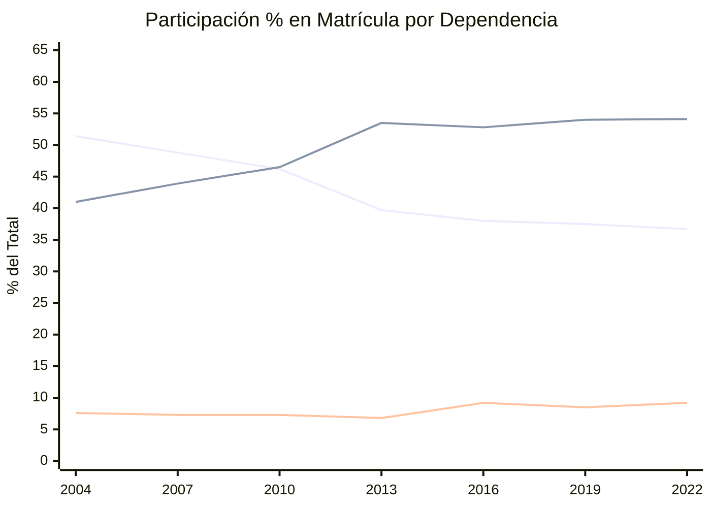
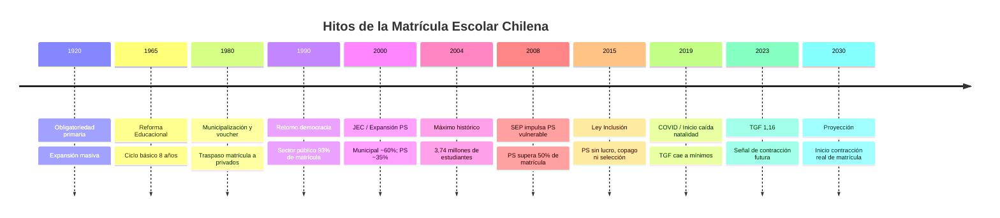

---
name: proyeccion_matricula_escolar
description: "Evolución histórica de la matrícula escolar chilena 1900-2023 y proyecciones 2025-2040, con análisis demográfico y por dependencia"
sources: [cowork]
aliases:
  - matrícula escolar Chile
  - proyección matrícula
  - evolución matrícula
  - cobertura educacional Chile
tags:
  - evidencia
  - matricula
  - proyeccion
---

# Proyección de Matrícula Escolar Chilena (1900–2040)

> Fuente principal: *Matrícula escolar chilena: proyecciones futuras* (Dr. Claudio Almonacid, UMCE) + datos visualizados en *Evolución Matrícula Escolar 1900–2023*

---

## 1. Visión Histórica de Largo Plazo (1900–2023)

La matrícula escolar chilena muestra una expansión extraordinaria a lo largo del siglo XX:

| Período   | Matrícula total aprox. | Hito contextual |
|-----------|------------------------|-----------------|
| 1900      | ~150.000               | Sistema incipiente, élites y sectores urbanos |
| 1920      | ~350.000               | Ley de Instrucción Primaria Obligatoria (1920) |
| 1940      | ~650.000               | Expansión bajo estado desarrollista |
| 1960      | ~1.200.000             | Reforma educacional 1965 |
| 1980      | ~2.500.000             | Municipalización y voucher (Decreto 3.476) |
| 2000      | ~3.300.000             | Jornada Escolar Completa |
| 2004      | 3.740.000              | Máximo histórico conocido |
| 2010      | ~3.620.000             | Estabilización |
| 2022      | ~3.640.000             | Recuperación post-COVID |
| 2023      | ~3.850.000             | Estimación más reciente |

### Cobertura por nivel educativo (evolución aproximada):

| Nivel      | 1950 | 1990 | 2023 |
|------------|------|------|------|
| Primaria   | 32%  | 88%  | 97%  |
| Secundaria | 5%   | 55%  | 91%  |
| Superior   | <2%  | 15%  | ~60% |

La **universalización de la educación básica** se alcanzó en torno a 2000. La secundaria completó su masificación en los años 2000-2010. El sector **público pasó del 93% al 47%** de la matrícula total entre las décadas de 1980 y 2020.

---

## 2. Evolución por Dependencia 2004–2022 (datos precisos)

### 2.1 Serie por dependencia

| Año  | Municipal    | Part. Subv.  | Part. Pagado | SLEP       | Total      |
|------|-------------|-------------|-------------|------------|------------|
| 2004 | 1.921.445 (51,4%) | 1.534.000 (41,0%) | 285.000 (7,6%) | —          | 3.740.445  |
| 2007 | ~1.820.000  | ~1.640.000  | ~270.000    | —          | ~3.730.000 |
| 2010 | ~1.720.000  | ~1.730.000  | ~270.000    | —          | ~3.720.000 |
| 2013 | 1.409.000   | 1.900.000   | 240.000     | —          | 3.549.000  |
| 2018 | ~1.450.000  | ~1.870.000  | ~310.000    | —          | ~3.630.000 |
| 2022 | 1.334.000 (36,7%) | 1.970.000 (54,1%) | 335.000 (9,2%) | ~176.000   | 3.639.000  |

> Nota: Los ~176.000 estudiantes SLEP (2022) se contabilizan dentro del sector público/municipal en algunas series.

### 2.2 Cambios estructurales 2004–2022

- **Municipal**: perdió **587.000 estudiantes** (-30,4%) entre 2004 y 2013; luego se estabilizó en ~1,33M-1,37M
- **Particular Subvencionado**: ganó **~370.000 estudiantes** (+23,7%) entre 2004 y 2013; luego siguió creciendo hasta ~1,97M (2022)
- **Particular Pagado**: estable en ~240-285K hasta 2013; luego sube a **334K (2022)** — fenómeno vinculado al copago y clase alta
- **SLEP**: 176.000 estudiantes (2022), neto de transferencia desde municipal (no es matrícula nueva)
- **Balance neto público 2018-2022**: +8.292 estudiantes (levemente positivo gracias al traspaso SLEP y migrantes)

### 2.3 Participación por dependencia: tendencia secular

*(líneas: Municipal / PS / PP)*

---

## 3. Factores Demográficos: El Gran Determinante

### 3.1 Tasa Global de Fecundidad (TGF)

El factor más determinante para la proyección futura de matrícula es la caída sostenida de la natalidad:

- TGF 2022: **1,25 hijos por mujer**
- TGF 2023: **1,16 hijos por mujer** (mínimo histórico absoluto)
- Tasa de reemplazo: 2,1 hijos por mujer
- Proyección INE 2030-40: 1,7 (probablemente sobreestimada dado el contexto de crisis reproductiva global)

### 3.2 Impacto en la población en edad escolar

| Período | Población 0-14 años | Variación |
|---------|---------------------|-----------|
| 2020    | 3.730.000           | —         |
| 2030    | ~3.500.000 (est.)   | -6,2%     |
| 2040    | ~3.350.000 (est.)   | -10,2%    |
| 2050    | 3.240.000 (INE)     | -13,2%    |

### 3.3 Factor migratorio como compensador parcial

La inmigración ha sido el principal amortiguador de la caída demográfica en el sistema escolar:

- **7,4%** de la matrícula total en 2023 corresponde a estudiantes inmigrantes (~285.000 estudiantes)
- Crecimiento anual de la matrícula inmigrante: **20,6%**
- Distribución: **60% en enseñanza básica**, concentración en sectores urbanos
- Concentración sectorial: mayoritariamente en **sector público y PS de menores ingresos**
- Origen principal: Venezuela, Perú, Haití
- **19% de los nacimientos en 2022** tuvieron madre extranjera — señal de continuidad del aporte migratorio

---

## 4. Impacto COVID-19 y Recuperación

La pandemia produjo un quiebre temporal:

- **2019 → 2020**: pérdida neta de **15.700 estudiantes** en sistema escolar (abandono temporal)
- Los estudiantes vulnerables fueron más afectados; algunos pasaron a homeschooling informal
- **2021-2022**: recuperación parcial de matrícula
- El efecto más duradero fue en **educación parvularia**: familias que no re-matricularon en prekínder/kínder

---

## 5. Proyecciones 2025–2040

### 5.1 Escenarios de proyección

| Período        | Matrícula estimada | Escenario          |
|----------------|--------------------|--------------------|
| 2025–2029      | ~3.600.000–3.650.000 | Estabilidad relativa |
| 2030           | ~3.450.000–3.550.000 | Inicio contracción |
| 2035           | ~3.200.000–3.400.000 | Contracción acelerada |
| 2040           | ~3.000.000–3.200.000 | Contracción sostenida |

La contracción más temprana se observará en:
1. **Educación parvularia** (desde 2025-2027): efecto inmediato de la caída de la TGF
2. **Enseñanza básica** (desde 2030): la cohorte pequeña de 2023-2025 llega a básica
3. **Enseñanza media** (desde 2035): efecto rezagado

### 5.2 Proyección por dependencia (matrícula)

| Año  | Público (Municipal+SLEP) | Part. Subv. | Part. Pagado |
|------|--------------------------|-------------|--------------|
| 2025 | ~1.480.000 (~40%)        | ~1.900.000 (~51%) | ~280.000 (~8%) |
| 2030 | ~1.400.000 (~40%)        | ~1.800.000 (~51%) | ~290.000 (~8%) |
| 2035 | ~1.300.000 (~40%)        | ~1.650.000 (~51%) | ~295.000 (~9%) |
| 2040 | ~1.200.000 (~40%)        | ~1.560.000 (~51%) | ~295.000 (~9%) |

> Supuesto clave: la participación relativa por sector se estabiliza; el sector público retiene ~40%, PS ~51%, PP ~9%.

---

## 6. Línea de Tiempo de Hitos en la Matrícula

---

## 7. Referencia a Investigación Propia

El análisis de la matrícula escolar chilena se apoya en el trabajo académico del Dr. Claudio Almonacid:

> **"Un cuasimercado educacional: La escuela privada subvencionada en Chile"**
> Dr. Claudio Almonacid Carvajal

Esta obra conceptualiza el sistema educativo chileno como un **cuasimercado**: un mecanismo que combina financiamiento estatal con lógica de competencia entre proveedores privados. La evolución de la matrícula confirma empíricamente la tesis: el sector PS absorbió sistemáticamente la matrícula que el sistema municipal fue incapaz de retener, consolidando la lógica cuasimercado a escala nacional.

---

## 8. Lectura Teórica (Collins/Hopper)

Desde el marco de [[Collins_Hopper_Framework|Collins y Hopper]]:

**Función F1 (Socialización y cohesión nacional):** La universalización de la cobertura primaria (97%) y secundaria (91%) refleja el éxito de la función básica de incorporación. Sin embargo, la estratificación por sector (público vs. PS vs. PP) produce socializaciones diferenciadas.

**Función F2 (Selección y estratificación meritocrática):** El trasvase masivo de matrícula desde el sector público al PS y PP refleja la percepción social de que el capital escolar se jerarquiza según el sector. Las familias "votan con los pies" en el cuasimercado, produciendo una selección no declarada por origen socioeconómico.

**Función F3 (Inflación de credenciales):** El crecimiento de la matrícula PP (de ~240K a 334K entre 2013-2022) sugiere que las élites intensifican su inversión en educación exclusiva como bien posicional frente a la masificación del PS. La matrícula PP en establecimientos de alta demanda actúa como mecanismo de **clausura social**.

**Empate estructural:** La contracción demográfica prevista para 2030-2040 puede agravar la diferenciación: los establecimientos PS de menor demanda cerrarán primero, concentrando la matrícula en los "colegios de marca" — reforzando el circuito de privilegio que la Ley de Inclusión intentó desmantelar.

---

## 9. Conexiones

- [[evolucion_establecimientos_educacionales]] — nota complementaria sobre número de establecimientos
- [[educacion_particular_subvencionada]] — sector que absorbe matrícula desde el público
- [[SLEP]] — reemplaza el sector municipal; 176K estudiantes (2022)
- [[Ley_20845]] — Ley de Inclusión; transformó condiciones del PS
- [[SEP]] — política que impulsó absorción PS de matrícula vulnerable
- [[SAE]] — sistema de admisión que regula el flujo de matrícula
- [[TGF]] — factor demográfico central para las proyecciones
- [[Collins_Hopper_Framework]] — marco teórico
- [[MOC_Politica_Educacional]] — mapa central de la investigación
