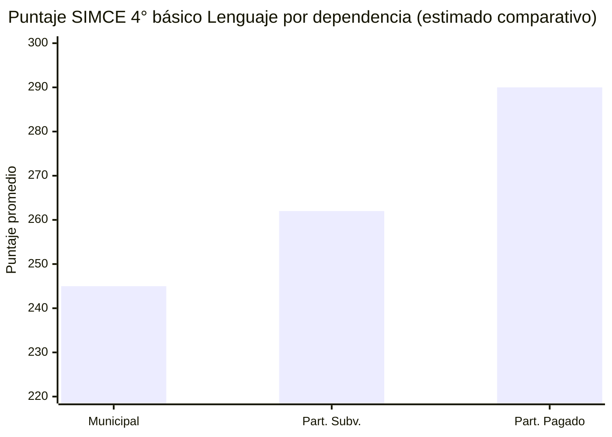
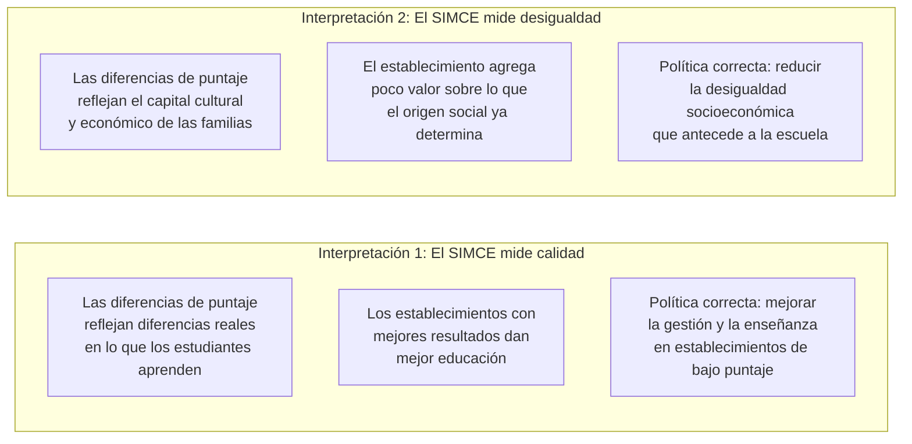
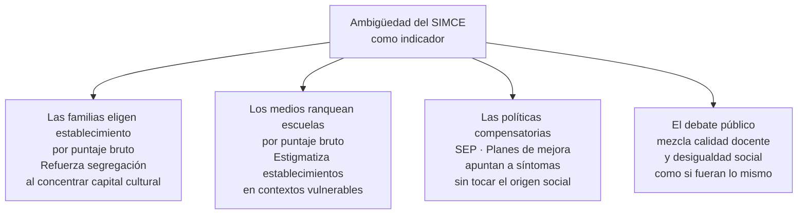

---
name: simce_calidad_o_desigualdad
description: "Nota de síntesis. El SIMCE como instrumento de política educativa: mide calidad de aprendizajes o fotografía la desigualdad socioeconómica del sistema."
sources: [cowork]
aliases:
  - SIMCE crítica
  - evaluación estandarizada Chile debate
  - SIMCE segregación escolar
tags: [evaluacion, calidad, datos, teoria, politica, sistema]
---

# ¿El SIMCE mide calidad educativa o mide desigualdad socioeconómica?

El SIMCE es el instrumento central del sistema de aseguramiento de calidad chileno desde 1988. Sus resultados se usan para clasificar establecimientos, distribuir recursos (SEP), orientar la elección de familias y evaluar políticas públicas. Sin embargo, la correlación entre puntaje SIMCE y nivel socioeconómico del establecimiento es tan alta y tan estable que abre una pregunta incómoda: ¿el SIMCE mide lo que los establecimientos enseñan o mide quiénes asisten a ellos?

---

## I. El patrón que no cambia

Este patrón se replica en todos los niveles evaluados, en todas las áreas y en todos los años desde que el SIMCE existe. La brecha entre dependencias no se ha cerrado significativamente pese a décadas de políticas orientadas a mejorar resultados en establecimientos vulnerables.

---

## II. Dos interpretaciones del mismo dato

---

## III. La evidencia del valor agregado

El debate tiene resolución técnica parcial mediante el concepto de **valor agregado**: en lugar de comparar puntajes brutos, se compara el rendimiento observado de un establecimiento con el rendimiento esperado dado el perfil socioeconómico de sus estudiantes.

Cuando se aplica este ajuste, los resultados cambian significativamente: establecimientos municipales en zonas vulnerables que parecen "malos" por su puntaje bruto aparecen como "efectivos" porque logran más de lo que su contexto predice. Y establecimientos pagados con puntajes altos pueden aparecer como poco efectivos porque obtienen menos de lo que su ventaja social predice.

La Agencia de Calidad comenzó a incorporar el índice de valor agregado en sus clasificaciones de desempeño, pero el SIMCE como indicador público sigue comunicándose en puntajes brutos — que las familias usan para elegir establecimiento y los medios para rankear escuelas.

→ Ver [[cifras_matricula_sistema_educacional]]

---

## IV. Las consecuencias políticas de la ambigüedad

---

## V. La lectura de Collins

Desde la perspectiva de Peña, el SIMCE cumpliría una función de **selección meritocrática** (F2) independientemente de si mide calidad o desigualdad. Lo que importa no es qué mide realmente sino que sus resultados legitiman una jerarquía de establecimientos que reproduce la jerarquía social de origen. El SIMCE convierte una ventaja de clase en un mérito escolar medido, y ese mérito escolar en credencial para el siguiente nivel.

En este sentido, la pregunta de si el SIMCE mide calidad o desigualdad puede ser secundaria: su función social es la misma en cualquier caso — clasificar y legitimar (Hooper).

→ Ver [[modelos_gobernanza_educacional]]

---

## VI. Lectura propia

El SIMCE mide ambas cosas simultáneamente y eso es precisamente el problema. En un sistema sin segregación socioeconómica, el puntaje SIMCE podría interpretarse como indicador razonable de calidad educativa. En el sistema chileno — donde el origen social predice fuertemente el tipo de establecimiento al que se asiste — el puntaje bruto es inseparable del perfil de quienes estudian ahí.

Usar el SIMCE como indicador de calidad sin ajuste por contexto socioeconómico no es un error técnico sino una decisión política: mantiene la ilusión de que la diferencia de resultados refleja diferencia de esfuerzo pedagógico, ocultando que refleja principalmente diferencia de origen social.

La pregunta relevante no es abolir el SIMCE sino qué se comunica públicamente con él y para qué se usa en la política educativa.

---

## VII. Preguntas abiertas

1. ¿El índice de valor agregado de la Agencia de Calidad ha cambiado efectivamente la manera en que los establecimientos son clasificados y percibidos públicamente?
2. ¿La presión por resultados SIMCE ha generado efectos de enseñanza para la prueba que distorsionan el currículum en establecimientos vulnerables?
3. ¿Cómo deberían comunicarse públicamente los resultados del SIMCE para orientar la elección de familias sin reforzar la segregación?
4. ¿Tiene sentido mantener el SIMCE como instrumento único o debería coexistir con mediciones de competencias no cognitivas y bienestar escolar?

---

## VIII. Referencias y vínculos

- [[cifras_matricula_sistema_educacional]]
- [[sistema_financiamiento_escolar_chile]]
- [[modelos_gobernanza_educacional]]
- [[comparacion_LOCE_LGE]]
- [[cuasimercado_educativo_persistencia]]
- [[opinion_publica_educacion_chile]]
- [[MOC_Politica_Educacional]]
