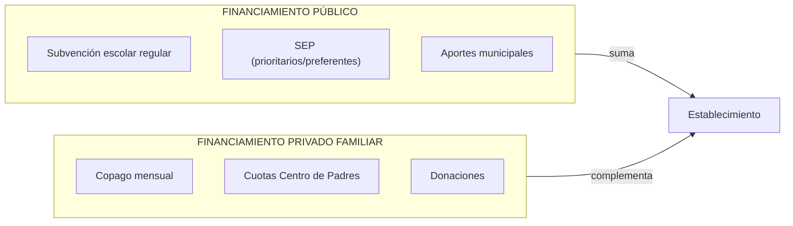
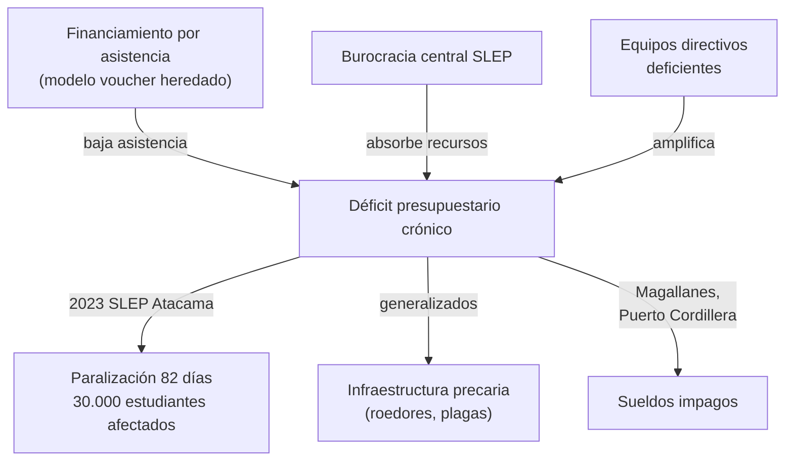
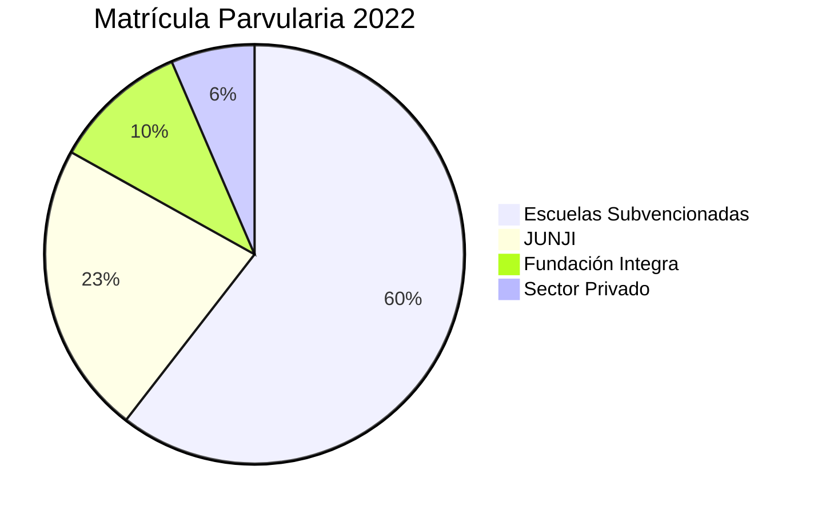
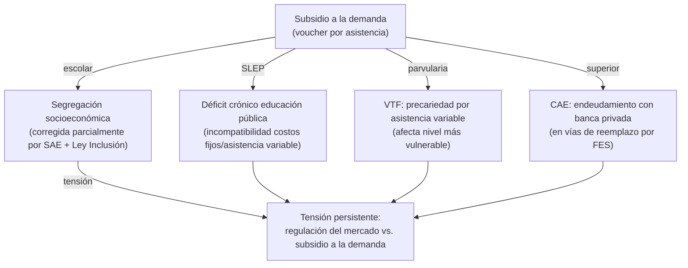

---
name: sistema_financiamiento_escolar_chile
description: "Arquitectura financiera de la educación chilena — voucher, copago/FICOM, SEP, SLEP, parvularia, gratuidad y FES (actualizado agosto 2025)"
sources: [cowork]
aliases:
  - financiamiento educación Chile
  - voucher educacional Chile
  - copago educación Chile
  - SEP subvención preferencial
  - FICOM financiamiento compartido
  - FES financiamiento educación superior
  - gratuidad educación superior Chile
tags:
  - institucional
  - financiamiento
  - estructura
---

# Sistema de Financiamiento Escolar en Chile

> Fuente: *Sistema de Financiamiento de la Educación en Chile* ( análisis exhaustivo de la arquitectura financiera escolar, parvularia y superior; actualizado a agosto 2025).

El sistema de financiamiento educativo chileno se construyó sobre el **subsidio a la demanda** ("voucher") instaurado en 1981, creando un cuasimercado educacional que ha sido objeto de reformas sucesivas para corregir sus efectos de segregación, sin abandonar sus fundamentos estructurales. La tensión entre libertad de enseñanza, equidad social y eficiencia fiscal atraviesa todos los niveles del sistema.

---

## 1. La Arquitectura del Voucher Escolar

### Fundamentos del Modelo (1980-2008)

La reforma de 1981 estableció el **financiamiento por asistencia media mensual**, expresado en la Unidad de Subvención Educacional (USE):

```
Subvención = Asistencia media mensual × Factor nivel × Valor USE vigente
```

**Supuestos teóricos originales:**
- Racionalidad de las familias como agentes de elección
- Maximización de utilidad mediante libre selección de escuelas
- Competencia entre sostenedores como mecanismo de mejora de calidad

**El problema estructural que persiste**: el financiamiento ligado a asistencia es incompatible con los costos fijos (salarios, infraestructura, calefacción) de cualquier servicio educativo territorial. Esto genera déficit presupuestario crónico cuando la asistencia baja — por epidemias, paros, inviernos.

### Tipos de Establecimientos y Participación Privada

| Tipo | % Matrícula | Financiamiento | Gasto familiar mensual |
|------|:-----------:|----------------|:---------------------:|
| Municipal / SLEP | 44% | Subvención pública | ~$10.000 |
| Particular Subvencionado | 50% | Subvención + copago (antes 2015) | ~$48.000 |
| Particular Pagado | 6% | Privado total | ~$280.000 |

**Distribución del gasto privado familiar** (establecimientos subvencionados y pagados):
- Mensualidades: 45%
- Útiles y materiales: 20%
- Matrículas: 15%
- Uniformes: 12%
- Centro de Padres: 8%

**Regresividad del gasto**: el Quintil I (más pobre) destina el **11,2%** de sus ingresos a educación; el Quintil V (más rico) solo el **5,6%** — las familias pobres hacen un esfuerzo relativo mayor, aunque gastan menos en términos absolutos.

---

## 2. El Financiamiento Compartido (FICOM) y su Eliminación

### El FICOM (1993-2015)

La Ley N° 19.247 (1993) reguló formalmente el copago familiar, creando un sistema mixto:



**Efecto principal**: el FICOM exacerbó la segregación socioeconómica — los establecimientos con mayor copago concentraban familias de mayor NSE, creando una estratificación de calidad correlacionada con el pago.

### La Ley de Inclusión (2015): Fin del Copago

La **Ley N° 20.845** estableció tres mandatos:
1. **Fin del lucro**: establecimientos que reciben subvención deben ser personas jurídicas sin fines de lucro
2. **Fin del copago**: eliminación gradual del financiamiento compartido
3. **Fin de la selección**: prohibición de procesar discrecionalmente la admisión

**Compensación por la pérdida del copago — Aporte por Gratuidad:**

| Año | Valor USE/alumno beneficiario |
|-----|:-----------------------------:|
| 2016 | 0,25 USE |
| 2017 | 0,35 USE |
| 2018+ | **0,45 USE** (consolidado) |

**Condición**: el sostenedor debe ser persona jurídica sin fines de lucro con SEP vigente.

**Fondo de transición**: $250.000 millones de pesos anuales (2017-2019) para sostener la transición a gratuidad.

### Dilema de los Sostenedores Privados Subvencionados

La Ley de Inclusión generó una disyuntiva crítica para colegios de alto copago:

1. **Transitar a gratuidad** → recibir Aporte por Gratuidad (0,45 USE), pero renunciar al lucro
2. **Convertirse en particular pagado** → mantener autonomía y copago, pero perder subvención estatal

Un grupo significativo de establecimientos optó por la segunda vía, **reduciendo la oferta subvencionada** y presionando al Estado. Adicionalmente, la restricción de lucro limitó el acceso al crédito bancario comercial, dificultando inversión en infraestructura.

---

## 3. Subvención Escolar Preferencial (SEP)

La **SEP** (Ley N° 20.248) es el mecanismo de financiamiento diferenciado por vulnerabilidad socioeconómica. Su lógica: los estudiantes más vulnerables requieren más recursos, no solo los mismos.

### Las Dos Categorías SEP

| Categoría | Criterio | Monto adicional |
|-----------|---------|:---------------:|
| **Prioritarios** | Situación socioeconómica crítica; calificado anualmente por MINEDUC | Mayor |
| **Preferentes** | No prioritarios, pero en el 80% más vulnerable según RSH | Menor |

### Mecanismo de Pago

```
Pago SEP mensual = 0,45 USE × Nº estudiantes beneficiarios × Promedio asistencia (últimos 3 meses)
```

**Condicionalidad**: el sostenedor debe firmar el **Convenio de Igualdad de Oportunidades** comprometiéndose a destinar los recursos al **Plan de Mejoramiento Educativo (PME)** con metas pedagógicas.

**Vulnerabilidad estructural**: la dependencia de la asistencia introduce volatilidad financiera — un invierno con alta inasistencia puede mermar severamente los recursos del PME en los momentos que más se necesitan (enfermedades estacionales).

### Concentración SEP según Dependencia

- Colegios municipales/SLEP: alta concentración de prioritarios
- Colegios subvencionados: mixto, con incentivo a atraer preferentes (más fácil de gestionar)
- Colegios pagados: no acceden a SEP

---

## 4. Desmunicipalización y Crisis de los SLEP

### El Diseño de la NEP (Ley 21.040, 2017)

La Ley N° 21.040 creó el **Sistema de Educación Pública (SEP)** para desmunicipalizar los colegios públicos y transferirlos a **Servicios Locales de Educación Pública (SLEP)** — órganos descentralizados territoriales.

**El problema central**: la NEP **mantuvo el modelo de financiamiento por asistencia promedio mensual**, incompatible con los gastos fijos de un servicio público territorial.

### Crisis Financiera y Operativa



| Indicador | Dato |
|-----------|------|
| SLEP activos (2026) | 36 (de 70 proyectados) |
| Déficit heredado acumulado | $112.454 billones |
| Paralización más crítica | SLEP Atacama, 82 días (2023), 30.000 estudiantes |
| Meta original SLEP | 70 para 2030 (revisada a la baja) |

**La paradoja del gasto**: los SLEP reciben inyecciones de recursos sustancialmente mayores que los municipios que reemplazaron, pero los rendimientos educativos e infraestructura no muestran mejoras correlativas. El diagnóstico: los recursos se diluyen en burocracia administrativa en lugar de llegar a las aulas.

**Fricción política**: el Consejo Evaluador de los SLEP —creado por ley para asesorar la desmunicipalización— entró en tensión con el Ejecutivo durante el debate sobre pausar el calendario de instalación. La meta de 70 SLEP fue reconocida como "no realista" y revisada.

---

## 5. Financiamiento de la Educación Parvularia

### La Fragmentación Institucional

El nivel parvulario chileno opera bajo una arquitectura institucional fragmentada y opaca:



| Institución | % Matrícula | Nivel | Cobertura notable |
|-------------|:-----------:|-------|-------------------|
| Escuelas Subvencionadas | 60,5% | Convencional (37,5%) + lenguaje (19,9%) + párvulos (2,5%) | Mayoritaria |
| JUNJI | 22,6% | Sala cuna 70,6% · Nivel medio 45,9% | 57% vía VTF |
| Fundación Integra | 10,45% | Salas cuna 28,79% · Nivel medio 23,27% | Vulnerabilidad |
| Privado pagado | 6,46% | Sin subvención estatal | NSE alto |

### La Desigualdad entre JUNJI-AD y VTF

| Tipo | Financiamiento | Estabilidad | Riesgo |
|------|---------------|:-----------:|--------|
| JUNJI Administración Directa (AD) | Aporte fiscal directo (Ley de Presupuestos) | Alta | Bajo |
| JUNJI Vía Transferencia de Fondos (VTF) | Convenios anuales + asistencia | Baja | Alto |
| Fundación Integra | Convenios anuales MINEDUC | Media | Medio |

**La paradoja VTF**: los centros VTF absorben la **mayor parte de la matrícula pública** de educación inicial, pero reciben presupuestos variables significativamente menores que la red de administración directa. En invierno, la inasistencia por enfermedades estacionales puede reducir las transferencias al punto de impedir solventar salarios y calefacción — precisamente cuando los niños más vulnerables más necesitan atención.

### Comparativa Internacional

- **Chile (2020)**: 1,2% del PIB en educación parvularia → **supera** el promedio OCDE (0,9%)
- **Sin embargo**: el gasto acumulado por estudiante es significativamente menor que el promedio OCDE en todas las etapas escolares
- **Paradoja**: mayor gasto relativo en parvularia que la OCDE, pero resultados de equidad por debajo — la fragmentación institucional diluye la inversión

---

## 6. Educación Superior: Gratuidad y FES

### El Régimen de Gratuidad (Ley 21.091)

La gratuidad exime de arancel y matrícula a estudiantes del **60% de menores ingresos** en instituciones adscritas que cumplan criterios de acreditación y transparencia.

**Condiciones y restricciones:**

| Condición | Detalle |
|-----------|---------|
| Modalidad | Solo presencial o vespertino de pregrado; excluye b-learning, e-learning, postgrado |
| Duración | Cubre duración nominal + suspensiones formales aprobadas |
| Pérdida del beneficio | Al superar duración nominal: expira definitivamente |
| Año de retraso | 50% descuento obligatorio sobre arancel real; alumno costea diferencia con crédito |
| Decil 10 | Sin limitaciones de cobro regulado |

**Aranceles regulados**: el financiamiento por gratuidad usa aranceles regulados que en muchos casos no cubren los costos reales de provisión, generando tensión financiera en las instituciones.

**Sobreduración**: 10,1 semestres reales vs. 7,6 semestres nominales → la pérdida del beneficio al superar la duración nominal afecta especialmente a estudiantes que trabajan.

### FES: Aprobado Cámara Agosto 2025

La **Cámara de Diputados aprobó el FES el 20 de agosto de 2025** (80 votos a favor) para reemplazar el CAE y el Fondo Solidario de Crédito Universitario (FSCU).

**Objetivo principal**: eliminar la intermediación de la banca privada, que generaba un desembolso fiscal superior a $10.000 millones en recargas y garantías bancarias.

### Tabla Comparativa CAE vs. FES

| Dimensión | CAE (Sistema actual) | FES (aprobado Cámara 2025) |
|-----------|---------------------|---------------------------|
| Intermediario | Banco privado | Estado directamente |
| Período sin pago | Hasta egreso | Duración nominal + 1 año adicional |
| Inicio de pago | Al egresar | Al superar umbral de ingresos |
| Exención permanente | Solo desempleo temporal | Ingresos < $500.000/mes de por vida |
| Tope de cuota | Cuota fija (independiente del ingreso) | Máximo 7-8% del ingreso mensual |
| Condonación | No (se acumula mora) | Sí, después de plazo máximo |
| Decil 10 | Sin diferenciación | Pueden ser cobrados monto adicional regulado |
| Cobranza judicial | Banco inicia proceso | Tesorería General (mismas facultades actuales del CAE) |
| Modelo solidario | No | Sí: graduados financian generaciones futuras |
| Ahorro fiscal proyectado (DIPRES) | — | $2,9 billones en 10 años |

**El sistema de solidaridad intergeneracional del FES**: los graduados que ingresen al mercado laboral financian, mediante contribuciones porcentuales a sus ingresos, el acceso gratuito de generaciones venideras — similar al modelo australiano de HELP.

**Impacto de género**: dado que las mujeres tienen ingresos promedio menores, el tope del 7-8% del ingreso reduce efectivamente su carga de pago respecto al CAE. La propuesta de restricción de edad (30 años) rechazada afectaría desproporcionadamente a mujeres que interrumpieron estudios por maternidad (2/3 de los 7.588 afectados potenciales).

---

## 7. El Problema Estructural No Resuelto



**El diagnóstico de fondo**: Chile ha reformado *sobre* el modelo de voucher (SEP, Ley Inclusión, SLEP, FES) sin reemplazarlo. La viabilidad a largo plazo del sistema depende de **fórmulas de asignación basal estables** que independicen el servicio educativo de las fluctuaciones de asistencia — lo que implicaría un cambio estructural del modelo de financiamiento que ningún gobierno ha emprendido completamente.

---

## 8. Lectura Teórica: Collins/Hopper

| Función | Expresión en el financiamiento |
|---------|-------------------------------|
| F1 (Socialización) | La subvención universal garantiza acceso mínimo para todos → F1 básica |
| F2 (Selección meritocrática) | FICOM/copago permitía "comprar" acceso a mejores establecimientos → selección por pago |
| F3 (Mercado/empleabilidad) | Voucher como mecanismo de mercado; CAE/FES financia inversión en capital humano |
| F4 (Democratización) | SEP, Ley Inclusión, Gratuidad, FES = políticas F4 para igualar acceso |
| F5 (Reproducción élites) | PP concentran NSE alto; brecha de $270.000 mensuales entre municipal y particular |

**La SEP como mecanismo F4**: financiar *más* a quienes tienen *menos* — a contrapelo de la lógica del voucher puro. Es el intento más sofisticado de usar el propio modelo de mercado para corregir sus efectos de reproducción.

---

## 9. Conexiones

- [[presupuesto_educacional_chile]] — evolución histórica del gasto total en educación
- [[estructura_legal_sistema_educacional]] — marco normativo (Ley Inclusión, SEP, Ley 21.091, Ley NEP)
- [[cifras_sistema_educacional_chile]] — fórmula USE y distribución matrícula por dependencia
- [[SLEP]] — análisis detallado de la crisis de los SLEP
- [[politicas_educacionales_sistema_chileno]] — FES, gratuidad, SAE y sus reformas
- [[modelos_gobernanza_educacional]] — el modelo de mercado como paradigma de gobernanza
- [[arbol_problemas_politica_educacional]] — diagnóstico que el financiamiento pretende resolver
- [[educacion_politica_chile]] — debate político sobre el financiamiento escolar
- [[fundamentos_politica_educacional]] — F1-F5 que el financiamiento prioriza
- [[MOC_Politica_Educacional]] — mapa central de la investigación
