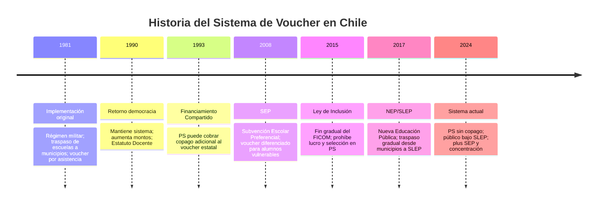

---
name: sistema_voucher_financiamiento
description: "Sistema de voucher escolar chileno (1981-actualidad): mecanismo USE, historia, tipos de subvenciones, comparativa internacional y efectos sobre segregación"
sources: [cowork]
aliases:
  - voucher educacional Chile
  - subvención escolar
  - USE
  - Unidad de Subvención Escolar
  - sistema de subvención
  - financiamiento compartido
  - FICOM
tags:
  - evidencia
  - financiamiento
  - estructura
---

# Sistema de Voucher Escolar en Chile

> Fuente principal: *Sistema de Voucher Escolar en Chile* (HTML interactivo) + *Sistema de Financiamiento Escolar en Chile*.

---

## 1. Concepto: ¿Qué es un Voucher Educacional?

El **voucher escolar** (o subvención escolar) es un mecanismo de financiamiento educativo **basado en la demanda**: el Estado entrega recursos a los establecimientos según la asistencia de los estudiantes, no según sus costos de operación.

En Chile, este sistema presenta características particulares:
- La subvención se paga directamente a los **sostenedores** de los establecimientos (no a las familias)
- Existe desde **1981**, con varias reformas significativas
- Aplica tanto a establecimientos municipales/SLEP como a particular subvencionados
- El monto varía según nivel educativo, jornada escolar y zona geográfica
- **Es universal**: cubre al ~93% de los estudiantes del sistema escolar

---

## 2. Mecanismo de Cálculo: la USE

La **Unidad de Subvención Escolar (USE)** es la unidad de cuenta del sistema:

> **Subvención mensual = (Factor USE × Valor USE) × Asistencia Media × Factor Zona**

Donde:
- **Factor USE**: varía según nivel educativo (parvularia, básica, media) y modalidad (JEC, TP)
- **Valor USE**: determinado por el Ministerio de Educación (se actualiza periódicamente)
- **Asistencia Media**: promedio de asistencia de los últimos tres meses — si un estudiante falta, el establecimiento recibe menos recursos
- **Factor Zona**: ajuste por ubicación geográfica (zonas extremas reciben más)

**Incentivo a la asistencia:** El sistema premia la asistencia real. Los establecimientos realizan tres controles diarios y tienen incentivos activos para mantener alta la concurrencia, lo que ha generado críticas por potencialmente incentivar la asistencia de estudiantes enfermos.

---

## 3. Historia del Sistema (1981–Actualidad)

### 3.1 Hito 1981: Origen neoliberal

La reforma neoliberal de la dictadura operó en tres movimientos simultáneos:
1. Municipalización de las escuelas públicas (desaparece el "Estado docente")
2. Creación del sistema de subvención por asistencia (Decreto 3.476 / DFL 2)
3. Fomento del ingreso de sostenedores privados al sistema subvencionado

El objetivo declarado era promover la competencia entre establecimientos para mejorar la calidad. La evidencia posterior mostró que la competencia no produjo los resultados esperados en calidad pero sí en **segregación socioeconómica**.

### 3.2 Hito 1993: Financiamiento Compartido (FICOM)

El FICOM permitió que los establecimientos PS cobraran un **copago mensual** adicional al voucher estatal. Efectos:
- Permitió a escuelas PS de mayor demanda aumentar sus ingresos
- Creó una jerarquía informal entre PS de alto copago (quasi-PP) y PS de bajo copago
- Reforzó la segregación: familias de mayores ingresos concentradas en PS de alto copago

### 3.3 Hito 2008: SEP (Subvención Escolar Preferencial)

La [[SEP]] introdujo el primer componente explícito de equidad al sistema:
- Voucher diferenciado para **estudiantes prioritarios** (vulnerables)
- Los establecimientos deben elaborar un **Plan de Mejoramiento Educativo (PME)**
- Complemento por **concentración**: establecimientos con alta proporción de alumnos vulnerables reciben plus adicional
- Impulsó el crecimiento del PS al incentivar la absorción de matrícula vulnerable

### 3.4 Hito 2015: Ley de Inclusión ([[Ley_20845]])

Reforma estructural del sistema de subvención:
- **Eliminación gradual del FICOM**: el PS ya no puede cobrar copago
- **Prohibición del lucro**: los sostenedores PS no pueden distribuir utilidades; deben reinvertir
- **Eliminación de la selección**: fin de la selección académica y socioeconómica en establecimientos subvencionados
- Efecto inmediato: cierres de PS que no podían operar sin copago ni lucro (~585 establecimientos 2014-2023)

### 3.5 Hito 2017: Nueva Educación Pública ([[Ley_21040]])

- Crea los [[SLEP|Servicios Locales de Educación Pública]], que reemplazan progresivamente a los municipios
- La subvención sigue fluyendo pero ahora hacia SLEP como sostenedor público
- Modifica parcialmente la lógica del voucher para el sector público: los SLEP no compiten por estudiantes, gestionan un territorio

---

## 4. Tipos de Subvenciones Vigentes

| Tipo                           | Descripción                                                                           | Beneficiarios |
|--------------------------------|---------------------------------------------------------------------------------------|---------------|
| **Subvención Regular**         | Base para todos; varía por nivel y JEC                                                | Todos los estab. |
| **SEP** (Preferencial)         | Plus por alumno prioritario; requiere PME y compromisos de calidad                   | Estab. con alumnos vulnerables |
| **Subvención por Concentración** | Plus adicional por alta concentración de vulnerables                                | Estab. con >60% prioritarios |
| **Subvención Ed. Especial**    | Significativamente mayor; requiere diagnóstico NEE                                    | Alumnos con NEE |
| **Subvención Pro-Retención**   | Pago anual por alumno vulnerable retenido en el sistema                              | Estab. con alumnos en riesgo deserción |
| **Subvención de Refuerzo Educativo** | Financiar programas de refuerzo para bajo rendimiento                           | Alumnos con rezago académico |

**Distribución aproximada de recursos por tipo:**
- Subvención Regular: ~65% del gasto total en subvenciones
- SEP: ~15%
- Ed. Especial: ~10%
- Concentración: ~5%
- Otros: ~5%

---

## 5. Impacto del Sistema de Voucher

### 5.1 Logros documentados

- Aumento significativo de la **cobertura educacional** (básica 32%→97%; media 5%→91%)
- Mayor **diversidad de oferta educativa** y expansión del sector PS
- Incremento en **años de escolaridad promedio**
- Desde la SEP (2008): mejoras documentadas en resultados de escuelas con población vulnerable

### 5.2 Críticas y efectos no deseados

- **Segregación socioeconómica:** el sistema reprodujo y amplificó la estratificación social del sistema educativo (ver SIMCE 2019: PP ~290 puntos, PS ~265, Municipal ~245)
- **Desigualdades de calidad:** la competencia no igualó resultados; la calidad siguió correlacionando con origen socioeconómico
- **Incentivos perversos a la selección:** antes de la Ley de Inclusión, los establecimientos PS seleccionaban a los mejores alumnos para mejorar sus resultados (cream-skimming)
- **Capacidades municipales desiguales:** municipios pobres con menor capacidad de gestión recibían el mismo voucher pero operaban con más dificultades
- **Asistencia como indicador distorsionante:** incentivos a que estudiantes enfermos asistan a clases

### 5.3 Evolución de la matrícula por sector (% del total)

| Año  | Municipal/Público | Part. Subv. | Part. Pagado |
|------|-------------------|-------------|--------------|
| 1981 | ~80%              | ~15%        | ~5%          |
| 1990 | ~58%              | ~32%        | ~10%         |
| 2000 | ~53%              | ~36%        | ~11%         |
| 2010 | ~42%              | ~50%        | ~8%          |
| 2020 | ~35%              | ~55%        | ~10%         |

El trasvase de matrícula desde el sector público hacia el PS es la consecuencia estructural más visible del sistema de voucher durante sus primeras cuatro décadas.

---

## 6. Comparativa Internacional

| País            | Cobertura       | Financiamiento | Copago | Selección | Basado en |
|-----------------|-----------------|----------------|--------|-----------|-----------|
| **Chile**       | Universal (~93%)| Estado central | No (desde 2015) | No (desde 2015) | Asistencia |
| **Suecia**      | Universal       | Municipios     | No     | No        | Matrícula  |
| **EE.UU.**      | Focalizado      | Estado/municipio | Varía | Varía    | Varía      |
| **Holanda**     | Universal       | Central        | No     | No        | Matrícula  |
| **España (conciertos)** | Parcial | Central+regional | No | Limitada | Alumno    |

**Características distintivas del modelo chileno:**
- Extensión universal (todos los estudiantes, no solo los vulnerables)
- Importancia de la asistencia en el cálculo (no la matrícula)
- Incluye tanto establecimientos públicos como privados en igualdad formal
- La evolución hacia equidad (SEP, Ley Inclusión) es comparativamente tardía respecto a otros sistemas

---

## 7. Lectura Teórica (Collins/Hopper)

El sistema de voucher chileno es uno de los casos más estudiados en la literatura comparada de cuasimercados educativos. Desde el marco de [[Collins_Hopper_Framework|Collins y Hopper]]:

**Función F2 (Selección meritocrática con estratificación):** El voucher proveyó la infraestructura material para una **selección encubierta**: formalmente, cualquier familia podía elegir cualquier escuela; en la práctica, las escuelas PS seleccionaban a sus estudiantes por capacidad de pago (FICOM) y mérito académico, produciendo una segmentación tan eficaz como la selección explícita. El SIMCE como instrumento de transparencia (F2) se convirtió en instrumento de jerarquización escolar.

**Función F5 (Reproducción de élites):** El sector PP quedó completamente al margen del sistema de voucher: sin regulación de selección, sin obligación de gratuidad, con alta autonomía curricular. Las familias de élite compraron su exclusión del sistema regulado. La segregación PP/PS/Municipal expresa la función de **clausura social** mediante la credencial diferenciada.

**Tensión F4 vs F5:** La SEP (2008) y la Ley de Inclusión (2015) representan el intento más serio por reorientar el voucher hacia la democratización (F4). Sus límites son reveladores: los establecimientos PS de mayor demanda mantienen listas de espera que el [[SAE]] no puede eliminar, y el 10% de los colegios concentra el 90% de la demanda efectiva. La forma del cuasimercado sobrevive a su contenido normativo.

> El concepto de **cuasimercado educacional** (Almonacid, 2008) denomina precisamente este híbrido: financiamiento público + lógica de mercado privada + regulación estatal incompleta. El voucher es su mecanismo central.

---

## 8. Conexiones

- [[presupuesto_educacional_chile]] — evolución del gasto público y privado
- [[educacion_particular_subvencionada]] — sector que operó bajo el voucher+copago
- [[Ley_20845]] — reforma estructural del sistema de subvención (2015)
- [[Ley_21040]] — NEP; crea SLEP como nuevo sostenedor público
- [[SEP]] — componente de equidad del voucher
- [[SAE]] — sistema de admisión que regula el acceso a los establecimientos
- [[SLEP]] — nuevo modelo de gestión pública post-NEP
- [[evolucion_establecimientos_educacionales]] — número de establecimientos por sector
- [[proyeccion_matricula_escolar]] — evolución de matrícula vinculada al sistema
- [[sistemas_educativos_descentralizados]] — comparada internacional de vouchers y cuasimercados
- [[Collins_Hopper_Framework]] — marco teórico
- [[MOC_Politica_Educacional]] — mapa central de la investigación
