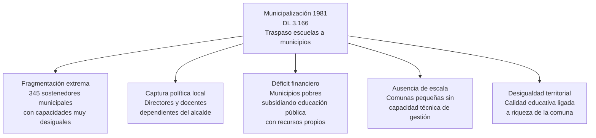
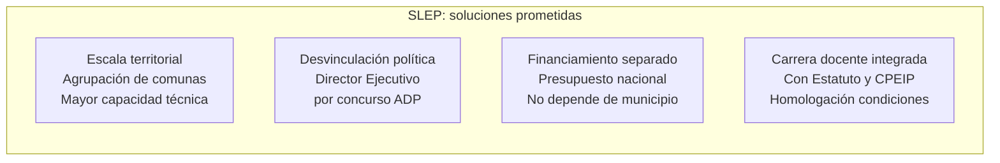
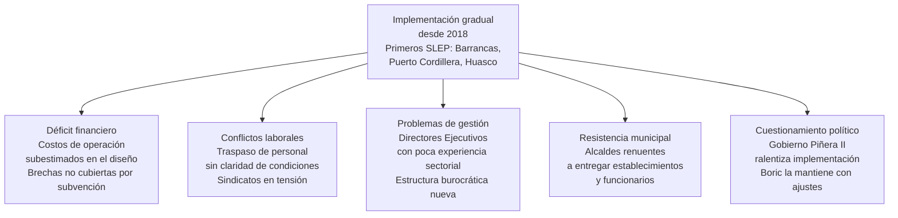

---
name: slep_reproduccion_problemas
description: "Nota de síntesis. Por qué los SLEP reproducen los problemas de la municipalización que vinieron a resolver."
sources: [cowork]
aliases:
  - desmunicipalización SLEP problemas
  - Nueva Educación Pública fracaso
  - SLEP vs municipios comparación
tags: [gobernanza, reforma, institucional, politica, historia]
---

# ¿Por qué los SLEP reproducen los problemas que vinieron a resolver?

La Ley 21.040 de 2017 creó los Servicios Locales de Educación Pública (SLEP) con el diagnóstico explícito de que la municipalización era el problema central de la educación pública chilena: fragmentación, desigualdad de capacidades entre comunas, captura política local y déficit financiero crónico. Los SLEP debían corregir todo eso. Una década después del diseño, los primeros SLEP en operación muestran déficit financiero, problemas de gestión, conflictos laborales y cuestionamientos a su viabilidad. La pregunta es por qué.

---

## I. El diagnóstico original: qué se le reprochaba a la municipalización

→ Ver [[linea_tiempo_politica_educacional_chile]]

---

## II. El diseño SLEP: qué prometía resolver

El diseño era coherente con el diagnóstico: si el problema era la escala, se agrupa; si era la captura política, se profesionaliza la dirección; si era el financiamiento, se centraliza. En teoría, los SLEP debían producir una educación pública con capacidad estatal real.

---

## III. Los problemas observados en la implementación

→ Ver [[modelos_gobernanza_educacional]]

---

## IV. La hipótesis estructural

Los SLEP no resuelven los problemas de la municipalización porque los heredan con distinto nombre. Tres mecanismos explican la reproducción:

**Mecanismo 1. El financiamiento no cambió de lógica.** La subvención portable por matrícula sigue siendo el motor del sistema. Los SLEP reciben más recursos que los municipios pobres, pero operan en un contexto de caída sostenida de matrícula pública — lo que reduce automáticamente sus ingresos. Un SLEP en zona de alta migración a establecimientos particulares subvencionados opera en déficit estructural independiente de su gestión.

**Mecanismo 2. La capacidad técnica no se crea por decreto.** Agrupar comunas bajo un solo sostenedor no produce automáticamente capital humano gestor. Los primeros Directores Ejecutivos enfrentaron estructuras nuevas sin precedentes claros, con sindicatos docentes que desconfiaban del cambio y con municipios que entregaron establecimientos en condiciones heterogéneas.

**Mecanismo 3. La escala reproduce la desigualdad territorial.** Un SLEP que agrupa comunas rurales pobres tiene mayor escala que un municipio aislado, pero sigue concentrando desventaja. La escala no redistribuye — solo administra la desventaja a mayor tamaño.

---

## V. Lectura propia

La desmunicipalización era necesaria como diagnóstico pero insuficiente como solución. El problema de la educación pública chilena no es solo quién administra los establecimientos — es la lógica de competencia entre establecimientos subvencionados que hace que la matrícula pública caiga independientemente de quien la gestione.

Los SLEP son una reforma de la administración dentro de un sistema cuyas reglas de juego no cambiaron. Mientras el financiamiento dependa de la matrícula y la matrícula migre hacia el sector particular subvencionado, cualquier sostenedor público opera en desventaja estructural. Cambiar el municipio por un SLEP no resuelve eso.

La pregunta que el diseño no respondió es: ¿puede existir educación pública robusta en un sistema donde el dinero sigue al estudiante y el estudiante elige?

---

## VI. Preguntas abiertas

1. ¿La caída de matrícula pública es reversible con mejor gestión SLEP o es una tendencia estructural del cuasimercado?
2. ¿El modelo SLEP tiene una escala mínima viable o algunos territorios son inviables como sostenedores públicos?
3. ¿Qué rol juegan los sindicatos docentes en la resistencia o adaptación al modelo SLEP?
4. ¿La evaluación del Gobierno Boric sobre los SLEP apunta a correcciones de diseño o a revisión del modelo?

---

## VII. Referencias y vínculos

- [[linea_tiempo_politica_educacional_chile]]
- [[modelos_gobernanza_educacional]]
- [[sistema_financiamiento_escolar_chile]]
- [[demandas_actores_sociales_educacion]]
- [[estatuto_docente_chile]]
- [[cuasimercado_educativo_persistencia]]
- [[MOC_Politica_Educacional]]
