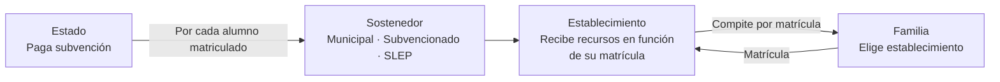
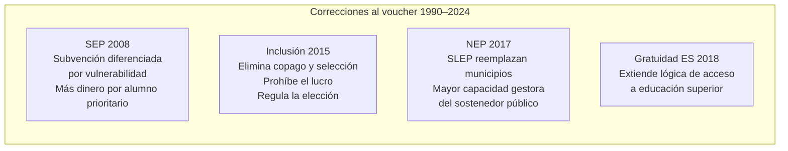

---
name: voucher_equidad_educativa
description: "Nota de síntesis. El voucher o subvención portable como tecnología de financiamiento escolar: puede coexistir con equidad educativa o es estructuralmente incompatible con ella."
sources: [cowork]
aliases:
  - subvención portable Chile
  - financiamiento por matrícula equidad
  - voucher educativo debate
  - cuasimercado y equidad escolar
tags: [financiamiento, sistema, teoria, politica, reforma, mercado]
---

# ¿Puede existir un sistema educativo equitativo con financiamiento vía voucher?

Chile financia su sistema escolar mediante una subvención portable: el Estado paga por cada estudiante matriculado en el establecimiento que la familia elige. Esta tecnología de financiamiento — llamada voucher en la literatura internacional — fue instalada por la dictadura en 1981 y no ha sido reemplazada por ningún gobierno democrático. Todas las reformas desde 1990 han operado dentro de esta lógica, intentando corregir sus efectos sin cambiar su principio. La pregunta es si eso es posible.

---

## I. La lógica del voucher



La lógica es simple: el dinero sigue al estudiante. Los establecimientos que atraen más matrícula reciben más recursos; los que pierden matrícula, menos. Esto genera competencia entre establecimientos por atraer familias.

---

## II. Los problemas que el voucher produce

```mermaid
graph TB
    V[Voucher como tecnología<br/>de financiamiento]
    V --> P1[Segregación<br/>Las familias con más capital cultural<br/>e información eligen "mejor"<br/>Concentración de ventaja en<br/>establecimientos ya aventajados]
    V --> P2[Inestabilidad financiera<br/>La matrícula fluctúa<br/>Los establecimientos en zonas<br/>de migración educativa<br/>operan en déficit estructural]
    V --> P3[Selección inversa<br/>Los establecimientos eligen<br/>estudiantes fáciles de enseñar<br/>antes de que la familia elija<br/>establecimiento]
    V --> P4[Desincentivo a la cooperación<br/>Los establecimientos compiten<br/>entre sí en lugar de<br/>colaborar para mejorar<br/>el sistema en su conjunto]
```

---

## III. Las correcciones que Chile ha intentado



Ninguna de estas correcciones elimina el voucher. Todas operan dentro de él: aumentan el monto diferenciado (SEP), regulan las condiciones de competencia (Inclusión), mejoran al sostenedor público (NEP) o extienden la lógica a otro nivel (gratuidad ES). La tecnología de base no cambia.

→ Ver [[sistema_financiamiento_escolar_chile]]

---

## IV. La experiencia internacional

El debate sobre el voucher no es exclusivo de Chile. La evidencia internacional muestra resultados mixtos:

- **Casos favorables al voucher con equidad**: algunos sistemas nórdicos combinan financiamiento portable con regulación fuerte que impide la selección y el lucro, y con menor desigualdad socioeconómica de base. El voucher en ese contexto produce menos segregación.

- **Casos desfavorables**: sistemas con alta desigualdad socioeconómica de partida (América Latina, partes de EE.UU.) muestran que el voucher amplifica la segregación porque las familias con más recursos son las que ejercen efectivamente la elección.

La conclusión que emerge de la evidencia comparada es que el voucher no es neutral: sus efectos dependen del contexto de desigualdad en que opera y de las regulaciones que lo acompañan. En contextos desiguales y con regulación débil, produce segregación. En contextos más igualitarios y con regulación fuerte, puede ser compatible con cierta equidad.

→ Ver [[modelos_gobernanza_educacional]]

---

## V. El caso chileno: un voucher con regulación creciente

Chile ha ido añadiendo regulaciones al voucher sin reemplazarlo. La trayectoria es de corrección incremental:

| Año | Corrección | Qué mantiene intacto |
|-----|-----------|----------------------|
| 2008 | SEP: diferencia el monto | La portabilidad y la competencia |
| 2015 | Inclusión: prohíbe selección y lucro | El dinero sigue al estudiante |
| 2017 | NEP/SLEP: mejora sostenedor público | El financiamiento por matrícula |
| 2018 | Gratuidad ES | La lógica de elección familiar |

La pregunta que emerge de esta trayectoria es si existe un punto de regulación suficiente en que el voucher deja de producir segregación, o si la segregación es una propiedad emergente del mecanismo mismo que ninguna regulación puede eliminar completamente mientras exista desigualdad socioeconómica de partida.

---

## VI. Lectura propia

El voucher es compatible con equidad solo bajo condiciones que Chile no cumple: baja desigualdad socioeconómica de base, familias con información y capacidad de elección equivalente, y regulación que elimine la selección en todas sus formas.

En el sistema chileno, la elección de establecimiento no es libre en sentido sustantivo — está condicionada por el capital cultural y económico de las familias. Las familias con menos recursos no eligen entre los mismos establecimientos que las familias con más recursos. En ese contexto, el voucher no distribuye la elección: distribuye la capacidad de segregarse.

Las reformas desde 2008 han reducido los efectos más visibles de esa segregación — el copago explícito, la selección formal — pero no han tocado la causa: que la familia decide con recursos desiguales en un mercado que, aunque más regulado, sigue siendo un mercado.

Reemplazar el voucher por financiamiento directo a establecimientos según matrícula zonal — sin portabilidad — es técnicamente posible. No se ha hecho porque implicaría restringir la libertad de elección de las familias, que es un valor profundamente arraigado en el sistema político chileno desde la Constitución de 1980.

---

## VII. Preguntas abiertas

1. ¿Existe evidencia de que la segregación escolar chilena ha disminuido después de la Ley de Inclusión (2015) o solo cambió de mecanismo?
2. ¿Qué nivel de regulación adicional al voucher sería necesario para que produjera resultados equitativos en el contexto chileno?
3. ¿La libertad de elección de establecimiento es percibida por las familias chilenas como un derecho que defender o como un mecanismo que produce desigualdad?
4. ¿El FES (Financiamiento de la Educación Superior) en tramitación en el Senado replica la lógica del voucher en educación superior o la modifica sustantivamente?

---

## VIII. Referencias y vínculos

- [[sistema_financiamiento_escolar_chile]]
- [[comparacion_LOCE_LGE]]
- [[cuasimercado_educativo_persistencia]]
- [[slep_reproduccion_problemas]]
- [[modelos_gobernanza_educacional]]
- [[cifras_matricula_sistema_educacional]]
- [[linea_tiempo_politica_educacional_chile]]
- [[MOC_Politica_Educacional]]
